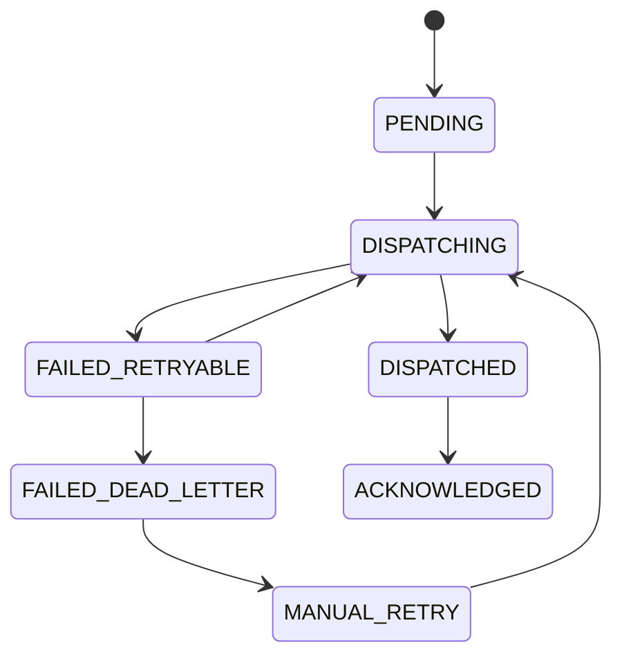

# Event Architecture

> Mục đích: chuẩn hóa event/outbox để integration, trace, dashboard và MISA không coupling trực tiếp vào transaction services.

## 1. Event Principles

- Business transaction commits state first.
- Outbox event is written in the same transaction as the business state where possible.
- External sync consumes outbox after commit.
- Event schema is versioned; breaking changes require new version.
- Event payload must contain references/snapshots needed by integration without exposing private fields unnecessarily.

## 2. Event Envelope

| field | Required | Description |
| --- | --- | --- |
| `event_id` | Yes | Unique event id. |
| `event_type` | Yes | Stable code such as `RAW_LOT_CREATED`. |
| `event_version` | Yes | Integer schema version. |
| `aggregate_type` | Yes | Object type: batch, lot, recall, etc. |
| `aggregate_id` | Yes | Object id. |
| `occurred_at` | Yes | Business event timestamp. |
| `correlation_id` | Yes | Request/workflow correlation. |
| `causation_id` | Optional | Source event/command. |
| `actor_user_id` | Optional | User/system actor. |
| `payload` | Yes | JSON payload. |
| `privacy_class` | Yes | `INTERNAL`, `PUBLIC_SAFE`, `SENSITIVE`. |

## 3. Canonical Event Catalog

| event_type | Producer | Consumer | Payload minimum |
| --- | --- | --- | --- |
| `SOURCE_ORIGIN_VERIFIED` | M05 | M06, M12, M15 | source_origin_id, source_zone_id, public source fields |
| `RAW_LOT_CREATED` | M06 | M09, M12, M15 | raw_material_lot_id, ingredient_id, procurement_type |
| `RAW_LOT_QC_SIGNED` | M09 | M06, M12, M15 | lot_id, qc_status, lot_state_after |
| `RAW_LOT_READY_FOR_PRODUCTION` | M06 | M08, M12, M15 | lot_id, qc_status, readiness_status, readiness_actor, readiness_at |
| `RECIPE_ACTIVATED` | M04 | M07, M15 | recipe_id, sku_id, formula_version |
| `PRODUCTION_ORDER_OPENED` | M07 | M08, M12, M15 | production_order_id, sku_id, recipe snapshot ref, snapshot_formula_version |
| `MATERIAL_ISSUED` | M08 | M07, M12, M14, M15 | issue_id, batch_id, raw lot lines, ledger ids |
| `MATERIAL_RECEIVED_BY_WORKSHOP` | M08 | M07, M12, M15 | receipt_id, issue_id, variance summary |
| `PRODUCTION_PROCESS_COMPLETED` | M07 | M09, M10, M12, M15 | batch_id, process_step |
| `QR_PRINTED` | M10 | M12, M15 | qr_id, packaging_unit_id, batch_id |
| `QR_REPRINTED` | M10 | M12, M15 | qr_id, original_qr_id, original_print_job_id, reprint_job_id, reason |
| `QR_VOIDED` | M10 | M12, M15 | qr_id, reason |
| `QC_INSPECTION_SIGNED` | M09 | M13, M15 | inspection_id, object_type, result |
| `BATCH_QC_HOLD` | M09 | M13, M15 | batch_id, inspection_id, hold_reason |
| `BATCH_QC_REJECTED` | M09 | M13, M15 | batch_id, inspection_id, reject_reason |
| `BATCH_RELEASED` | M09 | M10, M11, M12, M14, M15 | batch_id, release_id |
| `WAREHOUSE_RECEIPT_CONFIRMED` | M11 | M12, M14, M15 | receipt_id, batch_id, ledger ids |
| `TRACE_GAP_DETECTED` | M12 | M13, M15 | object ref, missing link |
| `RECALL_OPENED` | M13 | M11, M12, M14, M15 | recall_case_id, severity |
| `RECALL_HOLD_APPLIED` | M13 | M11, M15 | recall_case_id, affected lots/batches |
| `RECALL_CLOSED` | M13 | M11, M12, M14, M15 | recall_case_id, close_reason, closed_at |
| `RECALL_CLOSED_WITH_RESIDUAL_RISK` | M13 | M11, M12, M14, M15 | recall_case_id, residual_note, approver, closed_at |
| `MISA_SYNC_STATUS_CHANGED` | M14 | M15 | sync_event_id, status |

## 4. Outbox State Machine

## 5. Event Storage

| Table | Purpose |
| --- | --- |
| `event_schema_registry` | Event type/version compatibility and payload schema reference. |
| `outbox_event` | Pending/dispatchable events with retry status. |
| `event_store` | Optional durable event history/read model source. |
| `misa_sync_event` | MISA-specific consumer state derived from outbox. |
| `audit_log` | User/system action evidence, not replacement for outbox. |
