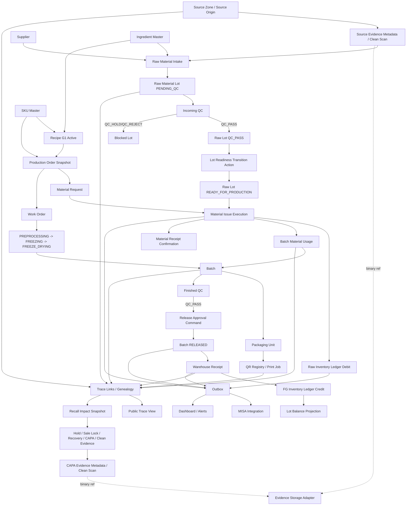

# Data Flow Diagram

> Mục đích: mô tả luồng dữ liệu end-to-end từ nguyên liệu tới trace/recall/MISA.

## 1. Operational Data Flow

## 2. Snapshot Data Flow

| Snapshot | Source | Created at | Immutable because |
| --- | --- | --- | --- |
| Production recipe snapshot | Active recipe + SKU + ingredient lines | PO create/approve | Recipe G2/G3 must not rewrite old production. |
| Print payload snapshot | PO/batch/packaging/QR state + active GTIN/trade item mapping if commercial print | Print job create | Reprint must reproduce/compare original; missing GTIN mapping raises `GTIN_MAPPING_MISSING`, no fallback to SKU code. |
| Recall exposure snapshot | Trace query result | Impact analysis run | Recall evidence must not drift after new shipments/trace changes. |
| Public trace projection | Internal trace + public field policy | QR public-ready/update | Public response must stay whitelist-only. |

## 3. Data Flow Controls

| Control | Applies to | Rule |
| --- | --- | --- |
| Idempotency | Intake, issue, receipt, print, release, recall actions | Same command key cannot create duplicate side effects. |
| Append-only | Audit, state transition, ledger, QR history, recall snapshots, evidence metadata | Correction/reversal creates new record; evidence scan status can only move from `PENDING_SCAN` to a terminal scan result. |
| FK/reference | All transaction tables | No orphan transaction rows. |
| Check enum | State/status fields | Invalid state rejected at DB/app boundary. |
| Public whitelist | Public trace | Internal/private fields excluded by design. |

Note: process execution is simplified in this diagram as `PREPROCESSING -> FREEZING -> FREEZE_DRYING`; detailed per-step states belong in workflow/state-machine specs.
