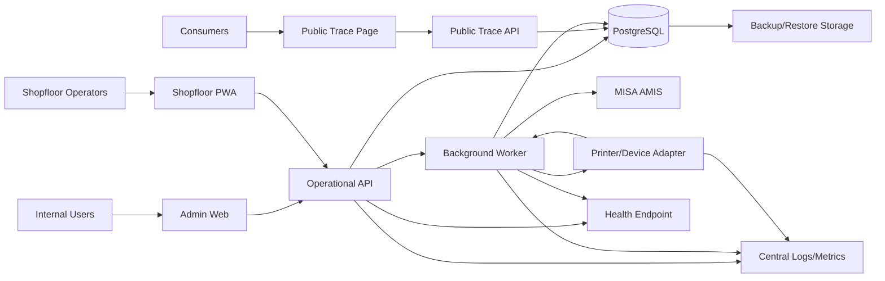

# Deployment View

> Mục đích: deployment target view cho DevOps/Backend/DBA. Đây là architecture-level spec, chưa phải runbook triển khai thật.

## 1. Logical Deployment

## 2. Runtime Components

| Runtime component | Responsibility | Scaling note |
| --- | --- | --- |
| Admin Web | Internal UI workflows | Stateless frontend. |
| Shopfloor PWA | Operator workflow, scan/offline submit | Must handle weak network via idempotency. |
| Public Trace Page/API | Public QR trace | Separate route/DTO/public projection. |
| Operational API | Admin/PWA/public API boundary | Stateless; DB transaction boundary. |
| Background Worker | Outbox dispatch, MISA sync, alerts, projections, printer/device callback consumption | Horizontal worker uses `SELECT FOR UPDATE SKIP LOCKED` or an approved equivalent locking decision before parallel dispatch. |
| PostgreSQL | Source of truth operational DB | Needs indexes, FK/check constraints, backup/restore. |
| Printer/Device Adapter | Local/edge integration to printer/scanner and callback forwarding | Must not direct DB access; all callbacks go through API/worker boundary. |
| Health Endpoint | Runtime health for app, DB, outbox/queue, MISA adapter, printer/device registry | Must be visible to monitoring/dashboard. |
| Observability | Logs, metrics, alerts | Tooling owner decision remains open. |

## 3. Environment Requirements

| environment | Purpose | Data policy |
| --- | --- | --- |
| `local` | Developer docs/migration/unit validation | Fake GTIN/MISA credentials allowed, clearly marked. |
| `dev` | Integration development | Seed baseline + fixtures; no production secrets. |
| `staging` | Smoke and release rehearsal | Production-like schema; masked/safe data. |
| `production` | Factory operation | Real secrets, backup, monitoring, owner-approved retention. |

## 4. Deployment Gates

| gate | Requirement |
| --- | --- |
| Migration gate | Migration applies cleanly from baseline and rollback/restore plan exists. |
| Seed gate | Seed chain idempotent; G1 baseline seeded; G0 not active; GTIN fixtures carry `is_test_fixture=true` and are blocked from production printer. |
| API gate | OpenAPI/API contract updated and smoke-tested. |
| Worker gate | Outbox retry/reconcile and dead-letter visible. |
| Public trace gate | Leakage tests pass. |
| Backup gate | RPO/RTO/restore drill owner decision before final release. |
| Printer gate | Driver/model/protocol owner decision before factory device smoke. |
| Health gate | App/DB/outbox/MISA/printer-device health endpoint available before staging smoke. |

