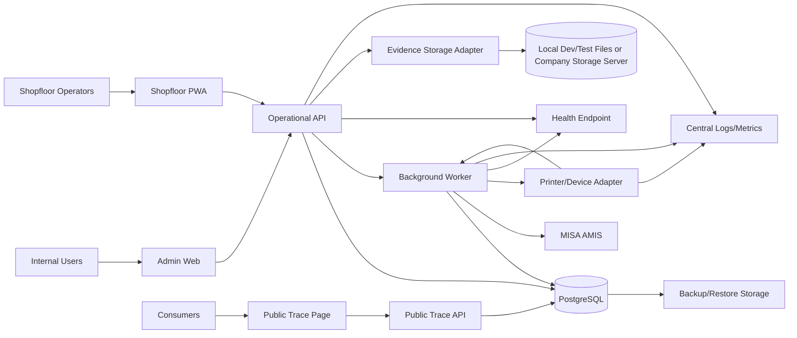

# Deployment View

> Mục đích: deployment target view cho DevOps/Backend/DBA. Đây là architecture-level spec, chưa phải runbook triển khai thật.

## 1. Logical Deployment

## 2. Runtime Components

| Runtime component | Responsibility | Scaling note |
| --- | --- | --- |
| Admin Web (`apps/admin-web`) | Internal UI workflows | Stateless frontend. |
| Shopfloor PWA (`apps/shopfloor-pwa`) | Operator workflow, scan/offline submit | Must handle weak network via idempotency. |
| Public Trace (`apps/public-trace`) | Public QR trace UI + public route shell | Separate route/DTO/public projection; must not share admin permission context. |
| Operational API | Admin/PWA/public API boundary | Stateless; DB transaction boundary. |
| Background Worker | Outbox dispatch, MISA sync, alerts, projections, printer/device callback consumption | Horizontal worker uses `SELECT FOR UPDATE SKIP LOCKED` or an approved equivalent locking decision before parallel dispatch. |
| PostgreSQL | Source of truth operational DB | Needs indexes, FK/check constraints, backup/restore. |
| Printer/Device Adapter | Local/edge integration to printer/scanner and callback forwarding | Must not direct DB access; all callbacks go through API/worker boundary. |
| Evidence Storage Adapter | Store source-origin and CAPA evidence binaries by reference; DB stores metadata only | Dev/test uses local filesystem storage. Production uses company storage server configured by DevOps without changing domain/API contracts. |
| Health Endpoint | Runtime health for app, DB, outbox/queue, MISA adapter, printer/device registry | Must be visible to monitoring/dashboard. |
| Observability | Logs, metrics, alerts | Tooling owner decision remains open. |

## 3. Environment Requirements

| environment | Purpose | Data policy |
| --- | --- | --- |
| `local` | Developer docs/migration/unit validation | `DEV_TEST_ONLY` fixtures allowed; fake GTIN/MISA/device refs allowed; evidence binary storage uses local filesystem path. |
| `dev` | Integration development | Seed baseline + `DEV_TEST_ONLY` fixtures; no production secrets; evidence binary storage can use local/dev server path. |
| `staging` | Smoke and release rehearsal | Production-like schema; masked/safe data; evidence storage points to staging company/server path; MISA/printer can run `DryRun` or sandbox refs. |
| `production` | Factory operation | Real config/secret refs, backup, monitoring, PF-02 retention; evidence storage points to company production storage server configured by DevOps. |

## 4. Deployment Gates

| gate | Requirement |
| --- | --- |
| Migration gate | Migration applies cleanly from baseline and rollback/restore plan exists. |
| Frontend artifact gate | All three frontend apps build from the same API/OpenAPI contract: `apps/admin-web`, `apps/public-trace`, `apps/shopfloor-pwa`. Do not replace `public-trace` with a generic website artifact. |
| Seed gate | Seed chain idempotent; G1 baseline seeded; G0 not active; dev/test fixtures carry `DEV_TEST_ONLY`; GTIN fixtures carry `is_test_fixture=true` and are blocked from production printer. |
| API gate | OpenAPI/API contract updated and smoke-tested. |
| Worker gate | Outbox retry/reconcile and dead-letter visible. |
| Public trace gate | Leakage tests pass. |
| Backup gate | PF-02 RPO/RTO applied; restore drill executed before production readiness; backup artifacts contain no secret literals. |
| Printer gate | Device registry/config has model/endpoint, `PrinterOptions.Protocol=HTTP_ZPL`, HMAC `DeviceSecretRef`, and factory device smoke evidence. |
| Health gate | App/DB/outbox/MISA/printer-device health endpoint available before staging smoke. |

## 5. PF-02 Production Config/Secret Refs

| area | required production refs | owner |
|---|---|---|
| MISA AMIS | `MisaSyncOptions.Mode=Production`, `BaseUrl`, `TenantId`, `ClientId`, `ClientSecretRef`, `WebhookSecretRef` | Finance/Integration + DevOps |
| Printer/device | `PrinterOptions.Protocol`, `CallbackAuth=HMAC_SHA256`, `DeviceSecretRef`, device registry endpoint/model/status | Packaging Ops + DevOps |
| Evidence storage | `EvidenceStorage.Provider=COMPANY_SERVER`, `BasePathOrBucket`, `EncryptionKeyRef`, `AccessLogSinkRef`, backup policy ref | DevOps + Security |
| Notification outbox | External consumer endpoint/queue binding outside Operational; Operational stores `notification_job_id` and emits `NOTIFICATION_REQUESTED` | Recall Owner + Sales/Notification system owner |
| Backup/DR | Backup target refs, encryption key refs, restore drill log location, RPO/RTO monitor | DevOps + DBA |
| Production users/roles | Action permission baseline from seed; user-role assignment/import source per environment | Admin/HR/Ops |

No production secret value is committed to source, Dockerfile, compose file, seed file, fixture or docs. Use environment/platform secret manager injection.

