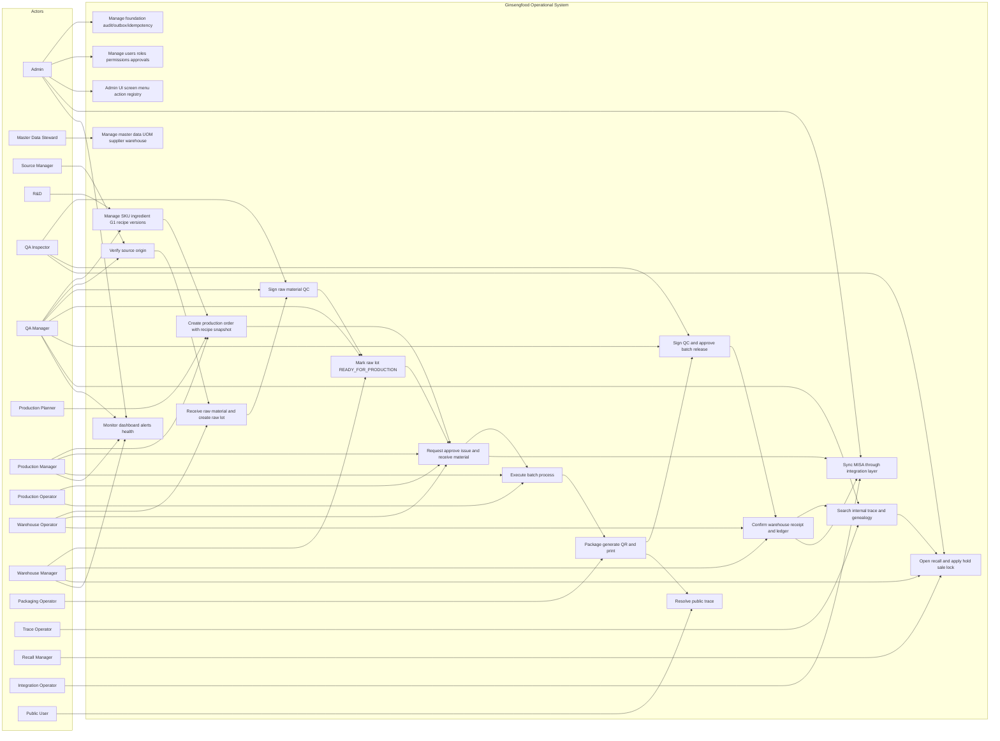

# 01 Use Case Diagram

## 1. Mục tiêu

Diagram này mô tả actor và use case chính của Operational Domain. Đây là use case contract cho 16 module chuẩn, workflow canonical, API/UI và test smoke.

## 2. Mermaid Diagram

## 3. Liên kết triển khai

| Use case | Module | Workflow | API chính | UI chính | Tables chính |
|---|---|---|---|---|---|
| UC01 | M01 Foundation Core | WF-M01-AUDIT, WF-M01-IDEMP, WF-M01-OUTBOX | `/api/admin/audit/logs`, `/api/admin/events/outbox` | SCR-AUDIT-LOG, SCR-EVENT-OUTBOX | `audit_log`, `idempotency_registry`, `outbox_event` |
| UC02 | M02 Auth Permission | WF-M02-LOGIN, WF-M02-APPROVAL | `/api/admin/auth/login`, `/api/admin/roles`, `/api/admin/approvals` | SCR-USERS-ROLES, SCR-APPROVAL-QUEUE | `auth_user`, `auth_role`, `approval_request` |
| UC03 | M03 Master Data | WF-M03-CREATE | `/api/admin/master-data/uoms`, `/api/admin/suppliers`, `/api/admin/warehouses` | SCR-UOM, SCR-SUPPLIERS, SCR-WAREHOUSES | `ref_uom`, `op_supplier`, `op_warehouse` |
| UC04 | M04 SKU Ingredient Recipe | WF-M04-RECIPE, WF-M04-SNAPSHOT | `/api/admin/skus`, `/api/admin/ingredients`, `/api/admin/recipes` | SCR-SKU, SCR-INGREDIENT, SCR-RECIPE | `ref_sku`, `ref_ingredient`, `op_production_recipe`, `op_recipe_ingredient` |
| UC05 | M05 Source Origin | WF-M05-VERIFY | `/api/admin/source-zones`, `/api/admin/source-origins` | SCR-SOURCE-ZONES, SCR-SOURCE-ORIGINS | `op_source_zone`, `op_source_origin`, `op_source_origin_verification` |
| UC06 | M06 Raw Material | WF-M06-INTAKE | `/api/admin/raw-material/intakes` | SCR-RAW-INTAKES | `op_raw_material_receipt`, `op_raw_material_lot` |
| UC07 | M06 Raw Material, M09 QC Release | WF-M06-QC | `/api/admin/raw-material/lots/{lotId}/qc-inspections` | SCR-INCOMING-QC | `op_raw_material_qc_inspection` |
| UC07.5 | M06 Raw Material, M01 Foundation Core | WF-M06-READINESS | `/api/admin/raw-material/lots/{lotId}/readiness` | SCR-RAW-LOTS | `op_raw_material_lot`, `state_transition_log`, `audit_log` |
| UC08-UC10 | M07 Production, M08 Material Issue Receipt | WF-M07-PO, WF-M08-ISSUE, WF-M08-RECEIPT | `/api/admin/production/orders`, `/api/admin/production/material-issues/{id}/execute` | SCR-PROD-ORDERS, SCR-MATERIAL-ISSUES, SCR-PROCESS-EXEC | `op_production_order`, `op_production_order_item`, `op_material_issue`, `op_batch` |
| UC11 | M10 Packaging Printing | WF-M10-PACK, WF-M10-QR | `/api/admin/packaging/jobs`, `/api/admin/qr/generate`, `/api/admin/printing/jobs` | SCR-PACKAGING-JOBS, SCR-QR-REGISTRY, SCR-PRINT-QUEUE | `op_packaging_job`, `op_qr_registry`, `op_print_job` |
| UC12 | M09 QC Release | WF-M09-QC, WF-M09-RELEASE | `/api/admin/qc/inspections`, `/api/admin/qc/releases` | SCR-QC-INSPECTIONS, SCR-BATCH-RELEASE | `op_qc_inspection`, `op_batch_release` |
| UC13 | M11 Warehouse Inventory | WF-M11-WH, WF-M11-LEDGER | `/api/admin/warehouse/receipts`, `/api/admin/inventory/ledger` | SCR-WAREHOUSE-RECEIPTS, SCR-INVENTORY-LEDGER | `op_warehouse_receipt`, `op_inventory_ledger`, `op_inventory_lot_balance` |
| UC14-UC15 | M12 Traceability | WF-M12-INTERNAL, WF-M12-PUBLIC | `/api/admin/trace/search`, `/api/public/trace/{qrCode}` | SCR-TRACE-SEARCH, SCR-GENEALOGY, SCR-PUBLIC-TRACE | `op_trace_link`, `vw_internal_traceability`, `vw_public_traceability` |
| UC16 | M13 Recall | WF-M13-RECALL, WF-M13-HOLD | `/api/admin/incidents`, `/api/admin/recall/cases/*` | SCR-RECALL-* | `op_recall_case`, `op_recall_exposure_snapshot`, `op_batch_hold_registry` |
| UC17 | M14 MISA Integration | WF-M14-SYNC, WF-M14-RETRY, WF-M14-RECON | `/api/admin/integrations/misa/*` | SCR-MISA-* | `misa_mapping`, `misa_sync_event`, `misa_sync_log` |
| UC18 | M15 Reporting Dashboard | WF-M15-METRIC, WF-M15-ALERT | `/api/admin/dashboard/operations`, `/api/admin/alerts` | SCR-DASH-OPS, SCR-ALERTS | `op_dashboard_metric`, `op_alert_event`, `op_health_snapshot` |
| UC19 | M16 Admin UI | WF-M16-MENU, WF-M16-ACTION, WF-M16-PWA | `/api/admin/ui/menu`, `/api/admin/ui/screens`, `/api/mobile/offline-submissions` | SCR-UI-SCREEN-REGISTRY, SCR-SHOPFLOOR-PWA | `ui_screen_registry`, `ui_menu_item`, `ui_action_registry` |

## 4. Done Gate

- Mỗi use case map được tối thiểu một module, workflow, API, UI và table.
- Raw material issue flow includes explicit `READY_FOR_PRODUCTION`; `QC_PASS` alone is not enough to issue material.
- Public trace chỉ xuất hiện như anonymous read-only use case.
- MISA chỉ xuất hiện qua integration layer, không nối trực tiếp từ module nghiệp vụ.
