# 02 Component Diagram

## 1. Mục tiêu

Diagram này mô tả component kiến trúc mục tiêu theo các layer: UI, API boundary, application/domain services, persistence, event/outbox và integration layer.

## 2. Mermaid Diagram

```mermaid
flowchart TB
    subgraph UI["UI Surfaces"]
        AdminWeb["Admin Web"]
        PWA["Shopfloor PWA"]
        PublicTraceUI["Public Trace UI"]
        IntegrationConsole["Integration Console"]
    end

    subgraph API["API Boundary"]
        AuthMW["Auth / Permission Middleware"]
        IdemMW["Idempotency Middleware"]
        ValidationMW["Request / DTO / Domain Guard Middleware"]
        BreakGlassGuard["High-risk Permission / Break-glass Guard"]
        AdminAPI["Admin API"]
        MobileAPI["Mobile Offline API"]
        PublicAPI["Public Trace API"]
        ErrorContract["Error / Pagination / DTO Contract"]
    end

    subgraph Services["Application and Domain Services"]
        CoreSvc["M01 Foundation Core"]
        AuthSvc["M02 Auth Permission"]
        MasterSvc["M03 Master Data"]
        RecipeSvc["M04 SKU Ingredient Recipe"]
        SourceSvc["M05 Source Origin"]
        RawSvc["M06 Raw Material"]
        ProdSvc["M07 Production"]
        MaterialSvc["M08 Material Issue Receipt"]
        QcSvc["M09 QC Release"]
        PackagingSvc["M10 Packaging Printing"]
        InventorySvc["M11 Warehouse Inventory"]
        TraceSvc["M12 Traceability"]
        RecallSvc["M13 Recall"]
        MisaSvc["M14 MISA Integration"]
        DashboardSvc["M15 Reporting Dashboard"]
        UiRegistrySvc["M16 Admin UI"]
    end

    subgraph Persistence["PostgreSQL Persistence"]
        MasterTables["Master Tables"]
        TransactionTables["Transaction Tables"]
        LedgerTables["Ledger / Balance Tables"]
        AuditTables["Audit / History Tables"]
        ProjectionViews["Projection Views"]
        IntegrationTables["Integration Tables"]
    end

    subgraph Events["Event / Outbox"]
        EventRegistry["event_schema_registry"]
        Outbox["outbox_event"]
        Worker["Outbox / Projection Workers"]
    end

    subgraph External["External Boundaries"]
        MISA["MISA"]
        Printer["Printer / Device Adapter"]
        ExternalRefs["External order / customer / shipment refs"]
    end

    AdminWeb --> AuthMW
    PWA --> AuthMW
    IntegrationConsole --> AuthMW
    PublicTraceUI --> PublicAPI
    AuthMW --> BreakGlassGuard
    BreakGlassGuard --> IdemMW
    IdemMW --> ValidationMW
    ValidationMW --> AdminAPI
    ValidationMW --> MobileAPI
    AdminAPI --> ErrorContract
    MobileAPI --> ErrorContract
    PublicAPI --> ErrorContract

    AdminAPI --> CoreSvc
    AdminAPI --> AuthSvc
    AdminAPI --> MasterSvc
    AdminAPI --> RecipeSvc
    AdminAPI --> SourceSvc
    AdminAPI --> RawSvc
    AdminAPI --> ProdSvc
    AdminAPI --> MaterialSvc
    AdminAPI --> QcSvc
    AdminAPI --> PackagingSvc
    AdminAPI --> InventorySvc
    AdminAPI --> TraceSvc
    AdminAPI --> RecallSvc
    AdminAPI --> MisaSvc
    AdminAPI --> DashboardSvc
    AdminAPI --> UiRegistrySvc
    MobileAPI --> MaterialSvc
    MobileAPI --> QcSvc
    MobileAPI --> InventorySvc
    PublicAPI --> TraceSvc

    CoreSvc --> AuditTables
    CoreSvc --> EventRegistry
    CoreSvc --> Outbox
    AuthSvc --> MasterTables
    MasterSvc --> MasterTables
    RecipeSvc --> MasterTables
    SourceSvc --> MasterTables
    RawSvc --> TransactionTables
    ProdSvc --> TransactionTables
    MaterialSvc --> TransactionTables
    QcSvc --> TransactionTables
    PackagingSvc --> TransactionTables
    InventorySvc --> LedgerTables
    TraceSvc --> ProjectionViews
    RecallSvc --> TransactionTables
    MisaSvc --> IntegrationTables
    DashboardSvc --> ProjectionViews
    UiRegistrySvc --> MasterTables

    Services --> Outbox
    Outbox --> Worker
    Worker --> ProjectionViews
    Worker --> MisaSvc
    MisaSvc --> MISA
    PackagingSvc --> Printer
    TraceSvc -. reference only .-> ExternalRefs
    RecallSvc -. reference only .-> ExternalRefs
```

## 3. Liên kết triển khai

| Component | Module | APIs | Tables / storage | Workflow |
|---|---|---|---|---|
| Auth / Permission Middleware | M02 | `/api/admin/auth/login`, `/api/admin/roles`, `/api/admin/approvals` | `auth_user`, `auth_role`, `role_action_permission`, `approval_request` | WF-M02-PERM, WF-M02-APPROVAL |
| Idempotency Middleware | M01 | All critical POST commands | `idempotency_registry` | WF-M01-IDEMP |
| Request / DTO / Domain Guard Middleware | M01/M02/all domain modules | All admin/mobile command APIs | validation/audit/error contract | WF-M01-AUDIT, API convention |
| High-risk Permission / Break-glass Guard | M01/M02 | release, recall, override, MISA retry/reconcile, high-risk integration console commands | `approval_request`, `approval_action`, `audit_log` | WF-M02-APPROVAL |
| Foundation Core | M01 | `/api/admin/audit/logs`, `/api/admin/events/outbox` | `audit_log`, `outbox_event`, `state_transition_log` | WF-M01-AUDIT, WF-M01-OUTBOX |
| Recipe Service | M04 | `/api/admin/recipes/*` | `op_production_recipe`, `op_recipe_ingredient` | WF-M04-RECIPE |
| Production Service | M07 | `/api/admin/production/orders`, `/api/admin/production/process-events` | `op_production_order`, `op_batch`, `op_production_process_event` | WF-M07-PO, WF-M07-WO |
| Material Service | M08 | `/api/admin/production/material-*` | `op_material_request`, `op_material_issue`, `op_material_receipt` | WF-M08-ISSUE, WF-M08-RECEIPT |
| Inventory Service | M11 | `/api/admin/warehouse/receipts`, `/api/admin/inventory/*` | `op_inventory_ledger`, `op_inventory_lot_balance` | WF-M11-WH, WF-M11-LEDGER |
| Trace Service | M12 | `/api/admin/trace/search`, `/api/public/trace/{qrCode}` | `op_trace_link`, `vw_public_traceability` | WF-M12-INTERNAL, WF-M12-PUBLIC |
| MISA Integration Service | M14 | `/api/admin/integrations/misa/*` | `misa_mapping`, `misa_sync_event`, `misa_sync_log` | WF-M14-SYNC |
| Dashboard Service | M15 | `/api/admin/dashboard/operations`, `/api/admin/alerts` | `op_dashboard_metric`, `op_alert_event` | WF-M15-METRIC, WF-M15-ALERT |

## 4. Architecture Rules

- Domain services không gọi MISA trực tiếp; mọi sync qua outbox và M14.
- Admin/PWA command payloads pass auth, high-risk permission, idempotency and validation before domain service execution.
- Integration Console uses the same backend permission/audit guard; break-glass is scoped and time-bound, not a general bypass.
- Public Trace API chỉ dùng projection public-safe, không dùng internal trace DTO.
- Ledger/audit/history append-only; correction dùng record mới.
- UI permission chỉ hỗ trợ UX; API boundary vẫn enforce permission.
