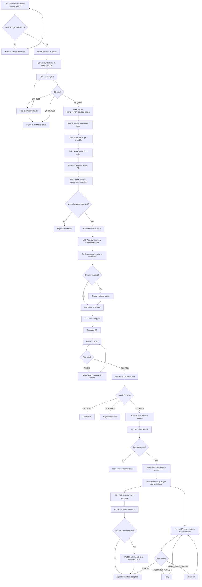

# 03 Activity Diagram

## 1. Mục tiêu

Diagram này mô tả activity chính của chuỗi vận hành canonical từ source origin đến warehouse, trace, recall và MISA sync.

## 2. Mermaid Diagram

## 3. Liên kết triển khai

| Activity | Module | Workflow | API | Tables |
|---|---|---|---|---|
| Create/verify source origin | M05 | WF-M05-VERIFY | `/api/admin/source-origins`, `/api/admin/source-origins/{id}/verify` | `op_source_origin`, `op_source_origin_verification` |
| Raw material intake/QC | M06, M09 | WF-M06-INTAKE, WF-M06-QC | `/api/admin/raw-material/intakes`, `/api/admin/raw-material/lots/{lotId}/qc-inspections` | `op_raw_material_receipt`, `op_raw_material_lot`, `op_raw_material_qc_inspection` |
| Raw lot readiness | M06, M01 | WF-M06-READINESS | `/api/admin/raw-material/lots/{lotId}/readiness` | `op_raw_material_lot`, `state_transition_log`, `audit_log` |
| Recipe active snapshot | M04, M07 | WF-M04-SNAPSHOT, WF-M07-PO | `/api/admin/recipes`, `/api/admin/production/orders` | `op_production_recipe`, `op_recipe_ingredient`, `op_production_order_item` |
| Material issue/receipt | M08, M11 | WF-M08-ISSUE, WF-M08-RECEIPT | `/api/admin/production/material-issues/{id}/execute`, `/api/admin/production/material-receipts` | `op_material_issue`, `op_material_receipt`, `op_inventory_ledger` |
| Packaging/QR/print | M10 | WF-M10-PACK, WF-M10-QR | `/api/admin/packaging/jobs`, `/api/admin/qr/generate`, `/api/admin/printing/jobs` | `op_packaging_job`, `op_qr_registry`, `op_print_job` |
| QC/release/warehouse | M09, M11 | WF-M09-RELEASE, WF-M11-WH | `/api/admin/qc/releases`, `/api/admin/warehouse/receipts` | `op_batch_release`, `op_warehouse_receipt`, `op_inventory_ledger` |
| Trace/public trace | M12 | WF-M12-INTERNAL, WF-M12-PUBLIC | `/api/admin/trace/search`, `/api/public/trace/{qrCode}` | `op_trace_link`, `vw_internal_traceability`, `vw_public_traceability` |
| Recall | M13 | WF-M13-RECALL | `/api/admin/incidents`, `/api/admin/recall/cases/*` | `op_recall_case`, `op_recall_exposure_snapshot` |
| MISA sync | M14 | WF-M14-SYNC, WF-M14-RETRY, WF-M14-RECON | `/api/admin/integrations/misa/*` | `misa_sync_event`, `misa_mapping`, `misa_sync_log` |

## 4. Done Gate

- Activity diagram thể hiện đủ happy path, hold/reject, retry/reconcile và recall branch.
- Raw material lot must pass explicit `READY_FOR_PRODUCTION` before material issue; `QC_PASS` is only the QC prerequisite.
- Mọi activity chính có module, workflow, API và table liên quan.
