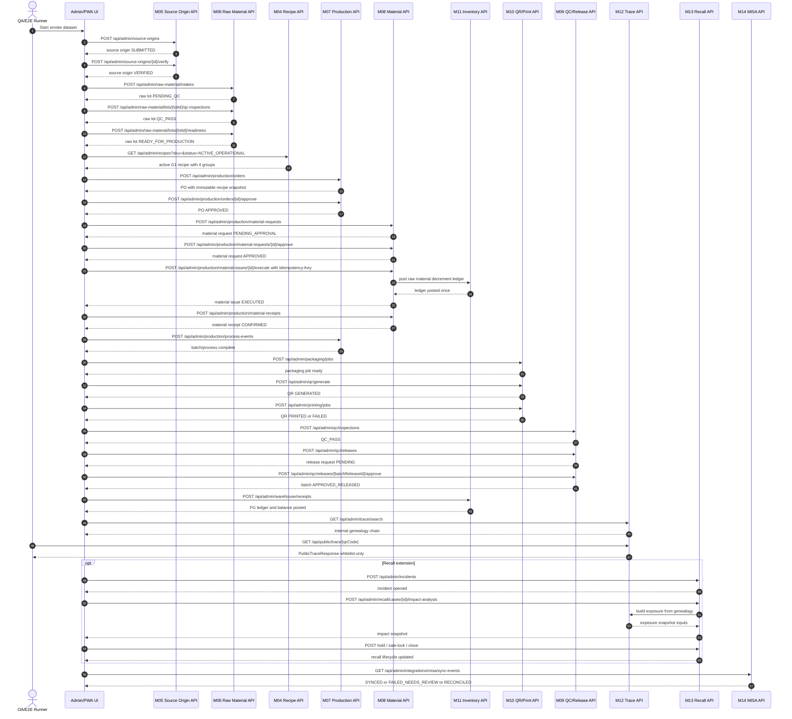

# 04 Sequence Diagram

## 1. Mục tiêu

Diagram này mô tả sequence E2E smoke cho chuỗi vận hành canonical, tập trung vào API/service boundaries và các điểm bắt buộc: snapshot G1, material issue decrement, release gate, public trace whitelist và MISA integration layer.

## 2. Mermaid Diagram

## 3. Liên kết triển khai

| Sequence segment | Module | Workflow | API | Tables |
|---|---|---|---|---|
| Source verify | M05 | WF-M05-VERIFY | `/api/admin/source-origins`, `/api/admin/source-origins/{id}/verify` | `op_source_origin`, `op_source_origin_verification` |
| Raw intake/QC/readiness | M06/M09 | WF-M06-INTAKE, WF-M06-QC, WF-M06-READINESS | `/api/admin/raw-material/intakes`, `/api/admin/raw-material/lots/{lotId}/qc-inspections`, `/api/admin/raw-material/lots/{lotId}/readiness` | `op_raw_material_lot`, `op_raw_material_qc_inspection`, `state_transition_log` |
| Recipe snapshot | M04/M07 | WF-M04-SNAPSHOT, WF-M07-PO | `/api/admin/recipes`, `/api/admin/production/orders` | `op_production_recipe`, `op_production_order_item` |
| Material issue decrement | M08/M11 | WF-M08-ISSUE, WF-M11-LEDGER | `/api/admin/production/material-issues/{id}/execute` | `op_material_issue`, `op_inventory_ledger` |
| Receipt confirmation | M08 | WF-M08-RECEIPT | `/api/admin/production/material-receipts` | `op_material_receipt`, `op_material_receipt_variance` |
| Packaging/QR/print | M10 | WF-M10-PACK, WF-M10-QR | `/api/admin/packaging/jobs`, `/api/admin/qr/generate`, `/api/admin/printing/jobs` | `op_packaging_job`, `op_qr_registry`, `op_print_job` |
| QC/release/warehouse | M09/M11 | WF-M09-RELEASE, WF-M11-WH | `/api/admin/qc/releases`, `/api/admin/warehouse/receipts` | `op_batch_release`, `op_warehouse_receipt` |
| Trace/public trace | M12 | WF-M12-INTERNAL, WF-M12-PUBLIC | `/api/admin/trace/search`, `/api/public/trace/{qrCode}` | `op_trace_link`, `vw_public_traceability` |
| Recall extension | M13 | WF-M13-RECALL | `/api/admin/incidents`, `/api/admin/recall/cases/*` | `op_recall_case`, `op_recall_exposure_snapshot` |
| MISA status | M14 | WF-M14-SYNC | `/api/admin/integrations/misa/sync-events` | `misa_sync_event`, `misa_sync_log` |

## 4. Test mapping

| E2E test | Sequence coverage |
|---|---|
| E2E-SMOKE-001 | Full main sequence |
| E2E-SMOKE-002 | Material issue idempotency and one ledger decrement |
| E2E-SMOKE-003 | QC/release/warehouse gates |
| E2E-SMOKE-004 | Public trace whitelist response |
| E2E-SMOKE-005 | MISA sync/retry/reconcile visibility |
| E2E-SMOKE-006 | Recall extension |
