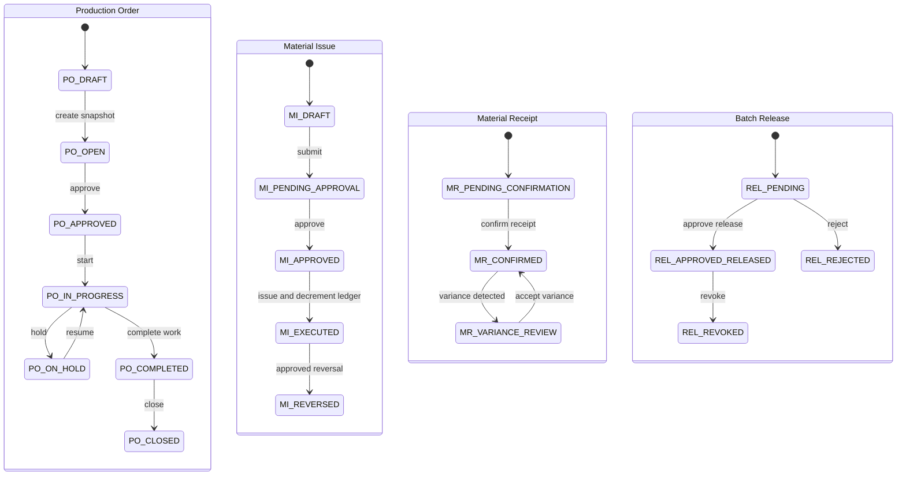
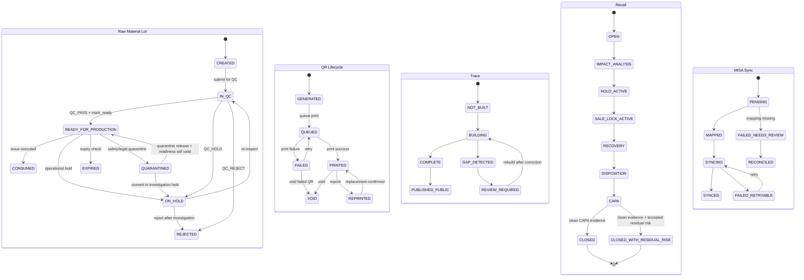

# 05 State Diagram

## 1. Mục tiêu

File này gom các state diagram quan trọng nhất từ workflow contract. Chi tiết đầy đủ nằm ở `workflows/04_STATE_MACHINES.md`; file này dùng để review nhanh các gate state chính.

## 2. Production / Material / Release State Overview

## 3. Raw Lot / QR / Trace / Recall / MISA State Overview

## 4. Liên kết triển khai

| State diagram | Module | Workflow | API | Tables |
|---|---|---|---|---|
| Production Order | M07 | WF-M07-PO | `/api/admin/production/orders`, `/api/admin/production/orders/{id}/approve` | `op_production_order`, `op_production_order_item` |
| Material Issue | M08/M11 | WF-M08-ISSUE | `/api/admin/production/material-issues/{id}/execute` | `op_material_issue`, `op_inventory_ledger` |
| Material Receipt | M08 | WF-M08-RECEIPT | `/api/admin/production/material-receipts` | `op_material_receipt`, `op_material_receipt_variance` |
| Batch Release | M09 | WF-M09-RELEASE | `/api/admin/qc/releases`, `/api/admin/qc/releases/{id}/approve` | `op_batch_release` |
| Raw Material Lot | M06/M09 | WF-M06-QC, WF-M06-READINESS | `/api/admin/raw-material/lots/{lotId}/qc-inspections`, `/api/admin/raw-material/lots/{lotId}/readiness` | `op_raw_material_lot`, `op_raw_material_qc_inspection`, `state_transition_log` |
| QR Lifecycle | M10/M12 | WF-M10-QR | `/api/admin/qr/generate`, `/api/admin/printing/jobs` | `op_qr_registry`, `op_qr_state_history` |
| Trace | M12 | WF-M12-INTERNAL, WF-M12-PUBLIC | `/api/admin/trace/search`, `/api/public/trace/{qrCode}` | `op_trace_link`, `vw_public_traceability` |
| Recall | M13 | WF-M13-RECALL | `/api/admin/recall/cases/*`, `/api/admin/recall/capas/{capaId}/evidence` | `op_recall_case`, `op_recall_exposure_snapshot`, `op_recall_capa`, `op_recall_capa_evidence` |
| MISA Sync | M14 | WF-M14-SYNC | `/api/admin/integrations/misa/*` | `misa_sync_event`, `misa_reconcile_record` |

## 5. Critical gates

| Gate | Rule |
|---|---|
| Material issue | Raw lot must be `READY_FOR_PRODUCTION`, available, not held. `QC_PASS` is prerequisite only. |
| Ledger | Issue posts decrement once; receipt does not decrement again. |
| Recall close | Recovery/CAPA must be closed and CAPA evidence must include at least 1 `CLEAN` scan metadata row. |
| Release | `QC_PASS` is prerequisite only; batch release approval is separate. |
| Warehouse | Warehouse receipt requires `APPROVED_RELEASED` batch. |
| Public trace | Only `PUBLISHED_PUBLIC` response uses whitelist fields. |
| MISA | Sync failure goes through retry/reconcile, never direct module sync. |
