# 06 ERD Diagram

## 1. Mục tiêu

Diagram này là ERD rút gọn nhưng đủ chain triển khai, đồng bộ với `database/02_ERD.md` và 16 module specs. ERD chi tiết đầy đủ nằm trong `database/02_ERD.md`.

## 2. Mermaid ERD

```mermaid
erDiagram
    auth_user ||--o{ auth_user_role : has
    auth_role ||--o{ auth_user_role : assigned
    auth_role ||--o{ role_action_permission : grants
    approval_request ||--o{ approval_action : records

    ref_uom ||--o{ ref_ingredient : default_uom
    ref_sku ||--o{ op_production_recipe : has_versions
    op_production_recipe ||--o{ op_recipe_ingredient : contains
    ref_ingredient ||--o{ op_recipe_ingredient : used_by
    ref_recipe_line_group ||--o{ op_recipe_ingredient : groups

    op_source_zone ||--o{ op_source_origin : contains
    op_source_origin ||--o{ op_source_origin_evidence : has
    op_source_origin ||--o{ op_source_origin_verification : verified_by

    op_supplier ||--o{ op_raw_material_receipt : supplies
    op_warehouse ||--o{ op_raw_material_receipt : receives
    op_raw_material_receipt ||--o{ op_raw_material_receipt_item : has
    op_raw_material_receipt_item ||--o{ op_raw_material_lot : creates
    ref_ingredient ||--o{ op_raw_material_lot : ingredient
    op_raw_material_lot ||--o{ op_raw_material_qc_inspection : inspected
    op_raw_material_lot ||--o{ state_transition_log : readiness_history

    ref_sku ||--o{ op_production_order : produces
    op_production_recipe ||--o{ op_production_order : snapshotted_from
    op_production_order ||--o{ op_production_order_item : snapshot_lines
    op_production_order ||--o{ op_work_order : has
    op_production_order ||--o{ op_batch : creates
    op_batch ||--o{ op_production_process_event : records

    op_production_order ||--o{ op_material_request : requests
    op_material_request ||--o{ op_material_issue : issues
    op_material_issue ||--o{ op_material_issue_line : has
    op_raw_material_lot ||--o{ op_material_issue_line : consumed_by
    op_material_issue ||--o{ op_material_receipt : received_by_workshop
    op_material_receipt ||--o{ op_material_receipt_variance : variance

    op_batch ||--o{ op_qc_inspection : inspected
    op_batch ||--o{ op_batch_release : released_by
    op_batch_release ||--o{ op_warehouse_receipt : enables
    op_warehouse_receipt ||--o{ op_inventory_ledger : posts
    op_material_issue ||--o{ op_inventory_ledger : decrements
    op_inventory_ledger ||--o{ op_inventory_lot_balance : projects

    op_batch ||--o{ op_packaging_job : packaged_by
    op_packaging_job ||--o{ op_packaging_unit : creates
    op_packaging_unit ||--o{ op_qr_registry : labeled_by
    op_qr_registry ||--o{ op_qr_state_history : state_history
    op_qr_registry ||--o{ op_print_job : printed_by

    op_trace_link }o--|| op_batch : links
    op_trace_link }o--|| op_raw_material_lot : links
    op_trace_link }o--|| op_qr_registry : links
    op_trace_link }o--|| op_warehouse_receipt : links

    op_recall_case ||--o{ op_recall_exposure_snapshot : snapshots
    op_recall_case ||--o{ op_batch_hold_registry : holds
    op_recall_case ||--o{ op_sale_lock_registry : locks
    op_recall_case ||--o{ op_recall_recovery_item : recovers
    op_recall_case ||--o{ op_recall_capa : capa

    outbox_event ||--o{ misa_sync_event : dispatched_to
    misa_mapping ||--o{ misa_sync_event : maps
    misa_sync_event ||--o{ misa_sync_log : logs
    misa_sync_event ||--o{ misa_reconcile_record : reconciles

    op_alert_rule ||--o{ op_alert_event : creates
    ui_screen_registry ||--o{ ui_action_registry : actions
    ui_screen_registry ||--o{ ui_menu_item : menu
```

## 3. Liên kết triển khai

| ERD area | Module | Main tables | APIs | Workflow |
|---|---|---|---|---|
| Auth/Approval | M02 | `auth_user`, `auth_role`, `role_action_permission`, `approval_request`, `approval_action` | `/api/admin/auth/login`, `/api/admin/roles`, `/api/admin/approvals` | WF-M02-APPROVAL |
| Recipe catalog | M04 | `ref_sku`, `ref_ingredient`, `op_production_recipe`, `op_recipe_ingredient` | `/api/admin/skus`, `/api/admin/ingredients`, `/api/admin/recipes` | WF-M04-RECIPE |
| Source/raw material | M05/M06 | `op_source_origin`, `op_raw_material_receipt`, `op_raw_material_lot`, `op_raw_material_qc_inspection`, `state_transition_log` | `/api/admin/source-origins`, `/api/admin/raw-material/intakes`, `/api/admin/raw-material/lots/{lotId}/readiness` | WF-M05-VERIFY, WF-M06-INTAKE, WF-M06-READINESS |
| Production/material flow | M07/M08 | `op_production_order`, `op_production_order_item`, `op_material_issue`, `op_material_receipt` | `/api/admin/production/orders`, `/api/admin/production/material-*` | WF-M07-PO, WF-M08-ISSUE |
| QC/release/inventory | M09/M11 | `op_qc_inspection`, `op_batch_release`, `op_warehouse_receipt`, `op_inventory_ledger` | `/api/admin/qc/*`, `/api/admin/warehouse/receipts` | WF-M09-RELEASE, WF-M11-WH |
| Packaging/trace | M10/M12 | `op_packaging_job`, `op_qr_registry`, `op_trace_link`, `vw_public_traceability` | `/api/admin/qr/generate`, `/api/public/trace/{qrCode}` | WF-M10-QR, WF-M12-PUBLIC |
| Recall | M13 | `op_recall_case`, `op_recall_exposure_snapshot`, `op_batch_hold_registry`, `op_recall_capa` | `/api/admin/recall/cases/*` | WF-M13-RECALL |
| Integration/reporting/UI | M14/M15/M16 | `misa_sync_event`, `op_dashboard_metric`, `ui_screen_registry` | `/api/admin/integrations/misa/*`, `/api/admin/dashboard/operations`, `/api/admin/ui/menu` | WF-M14-SYNC, WF-M15-METRIC, WF-M16-MENU |

## 4. Implementation Notes

- ERD này chỉ là view tổng hợp; table column chi tiết nằm ở `database/03_TABLE_SPECIFICATION.md`.
- Ledger, audit, QR state history, recall exposure snapshot và MISA sync log là append-only/history-oriented.
- `vw_public_traceability` phải là whitelist projection, không reuse internal trace view trực tiếp.
- `op_recall_capa` is the canonical CAPA table name for M13; do not introduce parallel `op_recall_capa_item` unless the database spec is formally changed.
- Raw material readiness is represented by `op_raw_material_lot.lotStatus` plus append-only `state_transition_log`; QC inspection result is not the downstream issue gate by itself.
