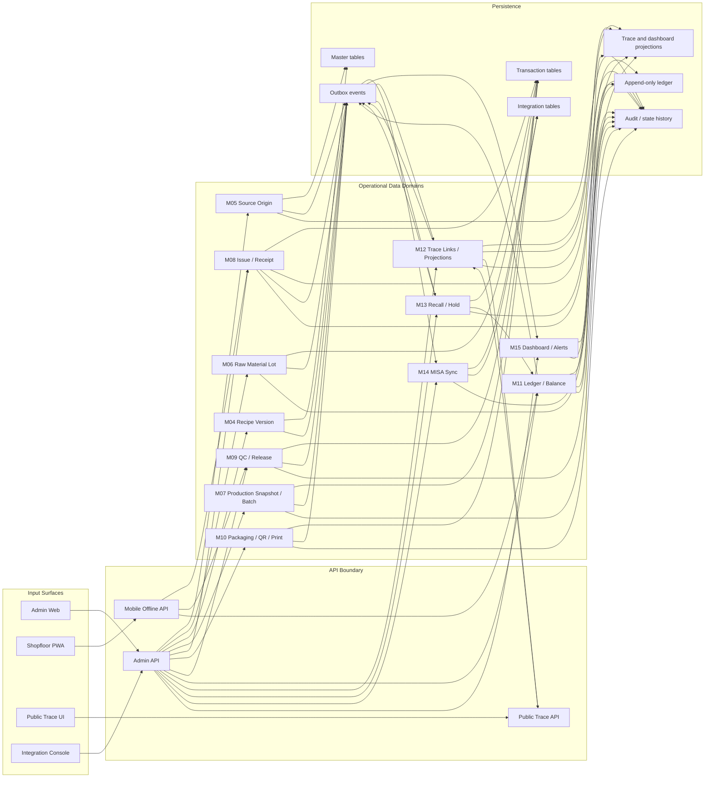

# 07 Data Flow Diagram

## 1. Mục tiêu

Diagram này mô tả luồng dữ liệu chính giữa UI/API/service/database/projection/event/integration. Trọng tâm là source-to-trace chain, inventory ledger, public trace field policy và MISA boundary.

## 2. Mermaid Diagram

## 3. Data Flow Contracts

| Flow | Source module | Target module | Data object | API/event | Tables |
|---|---|---|---|---|---|
| Source verified -> raw intake readiness | M05 | M06 | verified source origin | `SOURCE_ORIGIN_VERIFIED` | `op_source_origin`, `op_source_origin_verification` |
| Raw lot QC signed -> readiness decision | M06/M09 | M06 | QC result and readiness command | `RAW_LOT_QC_SIGNED`, `POST /api/admin/raw-material/lots/{lotId}/readiness` | `op_raw_material_lot`, `op_raw_material_qc_inspection`, `state_transition_log` |
| Raw lot ready -> material issue | M06 | M08 | ready raw lot | `RAW_LOT_READY_FOR_PRODUCTION` | `op_raw_material_lot`, `op_material_issue_line` |
| Recipe active -> PO snapshot | M04 | M07 | recipe header and lines | `/api/admin/production/orders` resolves active recipe | `op_production_recipe`, `op_recipe_ingredient`, `op_production_order_item` |
| Material issue -> inventory ledger | M08 | M11 | issue line and qty | `MATERIAL_ISSUE_EXECUTED` | `op_material_issue`, `op_inventory_ledger` |
| Material receipt -> production continuation | M08 | M07 | workshop receipt status | `MATERIAL_RECEIPT_CONFIRMED` | `op_material_receipt`, `op_production_process_event` |
| Batch/process -> packaging/QR | M07 | M10 | batch/process complete | `BATCH_PROCESS_COMPLETED` | `op_batch`, `op_packaging_job`, `op_qr_registry` |
| QC/release -> warehouse receipt | M09 | M11 | release approval | `BATCH_RELEASED` | `op_batch_release`, `op_warehouse_receipt` |
| Warehouse receipt -> trace/MISA/dashboard | M11 | M12/M14/M15 | ledger and receipt refs | `WAREHOUSE_RECEIPT_CONFIRMED` | `op_inventory_ledger`, `op_trace_link`, `misa_sync_event` |
| QR printed -> public trace | M10 | M12 | QR lifecycle | `QR_PRINTED` | `op_qr_registry`, `vw_public_traceability` |
| Trace -> recall | M12 | M13 | genealogy/exposure inputs | impact analysis API | `op_trace_link`, `op_recall_exposure_snapshot` |
| Outbox -> MISA | M01/all modules | M14 | integration event | outbox dispatch | `outbox_event`, `misa_sync_event` |

## 4. Public/Internal Data Policy

| Data category | Internal trace | Public trace |
|---|---|---|
| SKU public name, public batch code, QR status | Yes | Yes if whitelisted |
| Source origin summary | Yes | Only public summary if owner-approved |
| Supplier internal data | Yes with permission | No |
| Personnel/operator/QC inspector | Yes with permission | No |
| Costing/loss/variance/QC defect detail | Yes with permission | No |
| MISA document/status/error | Integration/admin only | No |

## 5. Done Gate

- Data flow shows transaction tables, ledger, projections, audit, outbox and integration storage.
- Material issue consumes `RAW_LOT_READY_FOR_PRODUCTION`; `RAW_LOT_QC_SIGNED` is not enough by itself.
- Public trace is downstream of M12 projection, not direct internal data.
- MISA receives outbox events only through M14.
