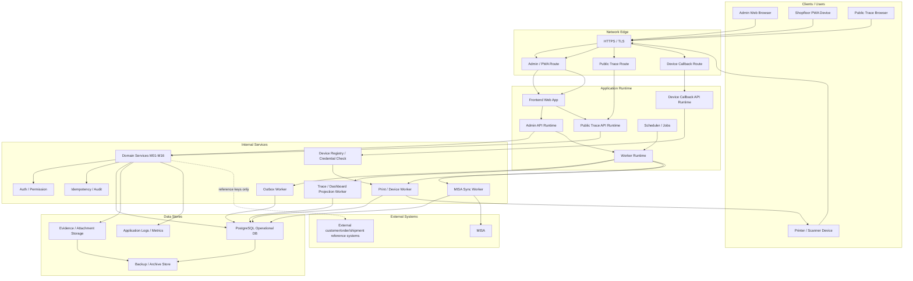

# 08 Deployment Diagram

## 1. Mục tiêu

Diagram này mô tả deployment view mục tiêu ở mức môi trường: user surfaces, application/API, worker, PostgreSQL, object storage/logging và external integration boundaries. Đây là deployment concept, không phải cấu hình cloud cụ thể.

## 2. Mermaid Diagram

## 3. Deployment Responsibility Mapping

| Node | Modules | APIs / jobs | Tables / storage | Workflow |
|---|---|---|---|---|
| Admin API Runtime | M01-M16 admin APIs | `/api/admin/*`, `/api/mobile/offline-submissions` | PostgreSQL operational DB | All admin workflows |
| Device Callback API Runtime | M10/M15 | print callback, heartbeat/error ingest | `op_print_job`, `op_print_log`, `op_qr_state_history`, device registry | WF-M10-QR, CODE12 |
| Public Trace API Runtime | M12 | `/api/public/trace/{qrCode}` | `vw_public_traceability`, `op_public_trace_policy` | WF-M12-PUBLIC |
| Worker Runtime / Outbox Worker | M01, M14, M15 | outbox dispatch, retry | `outbox_event`, `misa_sync_event`, `op_alert_event` | WF-M01-OUTBOX, WF-M14-SYNC |
| Projection Worker | M12, M15 | trace/dashboard rebuild | `op_trace_search_index`, `vw_internal_traceability`, `op_dashboard_metric` | WF-M12-INTERNAL, WF-M15-METRIC |
| Print / Device Worker | M10 | print queue/callback | `op_print_job`, `op_print_log`, `op_qr_state_history` | WF-M10-QR |
| PostgreSQL Operational DB | All modules | transactional persistence | all tables in database spec | all workflows |
| Evidence Storage Adapter | M05, M13 if evidence used | evidence/attachment refs, scan status | dev/test local filesystem evidence; production company storage server files by reference | WF-M05-VERIFY, WF-M13-RECALL |
| Backup / Archive Store | M01, M11, M12, M13, M14, M15 | backup/archive jobs | backups, archive indexes | CODE16 |

## 4. Deployment Rules

| Rule | Applies to |
|---|---|
| Admin/PWA APIs require auth/RBAC. | Admin API Runtime |
| Printer/device callbacks use registered device credentials on the device route, not general admin auth. | Device Callback API Runtime |
| Public Trace API is anonymous read-only and must use public projection. | Public Trace API Runtime |
| External integrations cannot access DB directly. | MISA, printer/device adapter |
| Outbox workers retry asynchronously and preserve idempotency/correlation. | Worker Runtime |
| Evidence/attachments stored by reference; DB stores metadata only. Dev/test uses local filesystem storage; production uses company storage server configured by DevOps. | Evidence Storage Adapter |
| Backup/restore policy requires owner RPO/RTO decision. | Backup / Archive Store |

## 5. Done Gate

- Deployment diagram separates admin, PWA, public trace and worker boundaries.
- MISA and printer/device are outside system boundary and have no direct DB access.
- Printer/device callbacks enter through a device callback route with device credentials and cannot call admin routes directly.
- Public trace route is isolated from admin API route.
