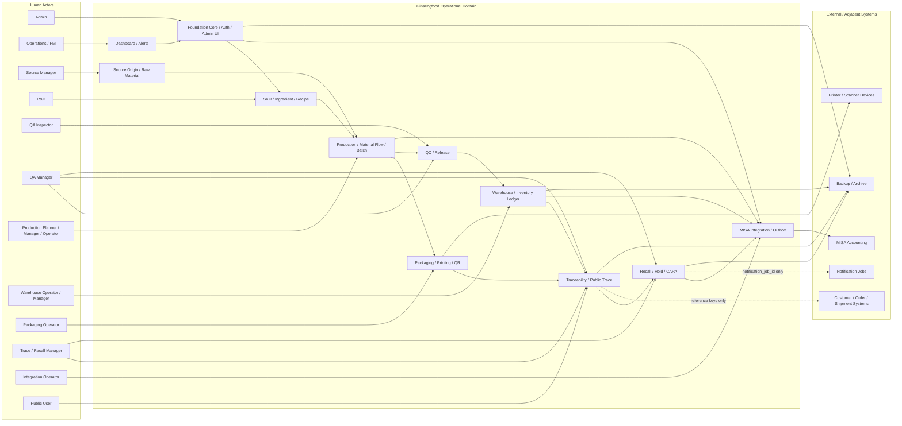

# 09 Context Diagram

## 1. Mục tiêu

Context diagram mô tả ranh giới hệ thống Operational Domain: actors, external systems, data ownership và integration boundaries. Diagram này làm rõ hệ thống sở hữu operational data, nhưng chỉ giữ reference keys cho external customer/order/shipment systems.

## 2. Mermaid Diagram

## 3. System Boundary

| Boundary item | Inside Operational Domain | Outside / reference only |
|---|---|---|
| SKU, ingredient, recipe, production snapshot | Owned by M04/M07 | Sales catalog marketing content |
| Source origin, raw lot, batch, genealogy | Owned by M05/M06/M07/M12 | External farm/customer CRM details not in sources |
| Inventory ledger and lot balance | Owned by M11 | Accounting ledger in MISA |
| QR registry and public trace projection | Owned by M10/M12 | Public web marketing pages |
| Recall case, hold, recovery, CAPA | Owned by M13 | Notification delivery engine detail |
| MISA mapping/sync/reconcile | Owned by M14 integration layer | MISA itself |
| Customer/order/shipment exposure | Reference keys only | Customer/order domain ownership |

## 4. Liên kết triển khai

| Context node | Module | Workflow | API | Tables |
|---|---|---|---|---|
| Core | M01/M02/M16 | WF-M01-AUDIT, WF-M02-PERM, WF-M16-MENU | `/api/admin/audit/logs`, `/api/admin/ui/menu` | `audit_log`, `auth_user`, `ui_screen_registry` |
| Catalog | M04 | WF-M04-RECIPE | `/api/admin/skus`, `/api/admin/recipes` | `ref_sku`, `op_production_recipe` |
| SourceRaw | M05/M06 | WF-M05-VERIFY, WF-M06-INTAKE | `/api/admin/source-origins`, `/api/admin/raw-material/intakes` | `op_source_origin`, `op_raw_material_lot` |
| Manufacturing | M07/M08 | WF-M07-PO, WF-M08-ISSUE | `/api/admin/production/orders`, `/api/admin/production/material-*` | `op_production_order`, `op_material_issue` |
| PackagingQr | M10 | WF-M10-PACK, WF-M10-QR | `/api/admin/packaging/jobs`, `/api/admin/qr/generate` | `op_packaging_job`, `op_qr_registry` |
| Quality | M09 | WF-M09-QC, WF-M09-RELEASE | `/api/admin/qc/inspections`, `/api/admin/qc/releases` | `op_qc_inspection`, `op_batch_release` |
| Inventory | M11 | WF-M11-WH, WF-M11-LEDGER | `/api/admin/warehouse/receipts`, `/api/admin/inventory/ledger` | `op_warehouse_receipt`, `op_inventory_ledger` |
| Trace | M12 | WF-M12-INTERNAL, WF-M12-PUBLIC | `/api/admin/trace/search`, `/api/public/trace/{qrCode}` | `op_trace_link`, `vw_public_traceability` |
| Recall | M13 | WF-M13-RECALL | `/api/admin/recall/cases/*` | `op_recall_case`, `op_recall_capa` |
| Integration | M14 | WF-M14-SYNC | `/api/admin/integrations/misa/*` | `misa_sync_event`, `misa_mapping` |
| Reporting | M15 | WF-M15-METRIC, WF-M15-ALERT | `/api/admin/dashboard/operations`, `/api/admin/alerts` | `op_dashboard_metric`, `op_alert_event` |

## 5. Context Rules

- Operational Domain owns batch, lot, genealogy, traceability, recall, operational inventory ledger and lot balance.
- External customer/order/shipment domains are referenced by key only unless owner creates a new accepted requirement.
- MISA is an external accounting system; integration runs through M14 mapping/sync/retry/reconcile.
- Printer/scanner devices are external adapters; they cannot write database directly.
- Public users can only access public trace response and never admin/internal trace data.
- QA Inspector and QA Manager are separated at context level because inspection/signing and release/recall approval carry different permission gates.
