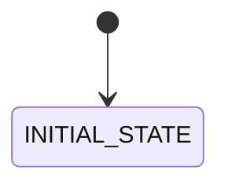
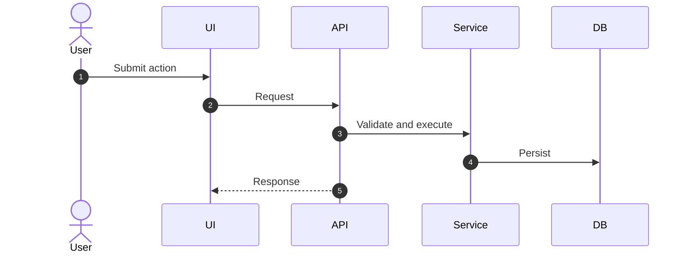

# 00 Module Template

## 1. Mục đích

Template này là cấu trúc bắt buộc cho mọi file module trong `docs/software-specs/modules/`. Mỗi module phải là một bounded implementation unit: đủ rõ để BA/SA/Dev/QA/AI coding agent triển khai, kiểm thử và review mà không suy đoán.

## 2. Metadata

| Field | Value |
|---|---|
| Module ID | `Mxx` |
| Module name |  |
| Primary owner |  |
| Supporting roles |  |
| Phase/CODE |  |
| Priority |  |
| Source policy | Prompt gốc, `docs-software/`, `.tmp-docx-extract/`, `docs/software-specs/` đã chuẩn hóa, owner approval |
| Related packs | business / functional / database / api / ui / workflows / testing files that this module depends on |

## 3. Purpose

Mô tả module giải quyết năng lực nghiệp vụ nào, người dùng nào hưởng lợi và output vận hành chính là gì.

## 4. Boundary

| In scope | Out of scope |
|---|---|
| Các entity, hành động, workflow thuộc module | Các nghiệp vụ thuộc module khác hoặc cần owner decision |

## 5. Owner

| Owner type | Role |
|---|---|
| Business owner |  |
| Product/BA owner |  |
| Technical owner |  |
| QA owner |  |

## 6. Chức năng

| function_id | Function | Description | Priority |
|---|---|---|---|

## 7. Business Rules

| rule_id | Rule | Affected data | Affected API | Affected UI | Validation | Exception | Test |
|---|---|---|---|---|---|---|---|

## 8. Tables

| table | Type | Purpose | Ownership | Notes |
|---|---|---|---|---|

## 9. APIs

| method | path | Purpose | Permission | Idempotency | Request | Response | Test |
|---|---|---|---|---|---|---|---|

## 10. UI Screens

| screen_id | Route | Purpose | Primary actions | Permission |
|---|---|---|---|---|

## 11. Roles / Permissions

| Role | Permissions/actions | Notes |
|---|---|---|

## 12. Workflow

| workflow_id | Trigger | Steps | Output | Related docs |
|---|---|---|---|---|

## 13. State Machine

Use a neutral placeholder. Each module must replace `INITIAL_STATE` with its real first state; do not assume every entity has `DRAFT`.

## 14. Sequence / Activity Flow

## 15. Input / Output

| Type | Input | Output |
|---|---|---|
| UI |  |  |
| API |  |  |
| Event |  |  |

## 16. Events

| event | Producer | Consumer | Payload summary |
|---|---|---|---|

## 17. Audit Log

| action | Audit payload | Retention/sensitivity |
|---|---|---|

## 18. Validation Rules

| validation_id | Rule | Error code | Blocking |
|---|---|---|---|

## 19. Exception Flow

| exception | Rule | Recovery |
|---|---|---|

## 20. Test Cases

| test_id | Scenario | Expected result | Priority |
|---|---|---|---|

## 21. Done Gate

- Database migration/schema reviewed.
- API contract implemented and tested.
- UI screen/action/permission implemented if in scope.
- Workflow/state transitions tested.
- Audit/idempotency/permission gates verified.
- Smoke/regression tests updated.

## 22. Risks

| risk | Impact | Mitigation |
|---|---|---|

## 23. Phase triển khai

| Phase/CODE | Scope in phase | Dependency | Done gate |
|---|---|---|---|
