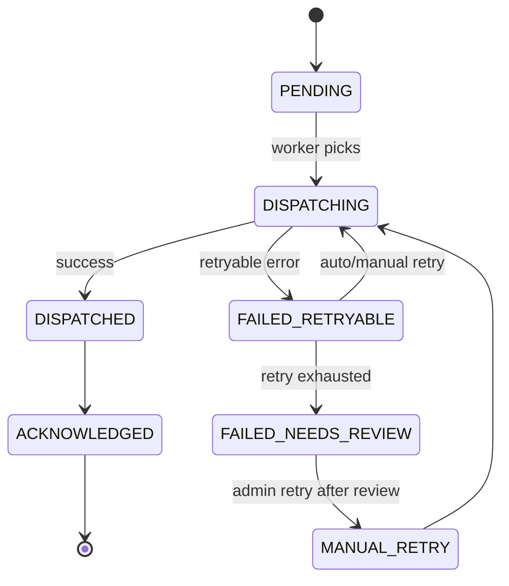
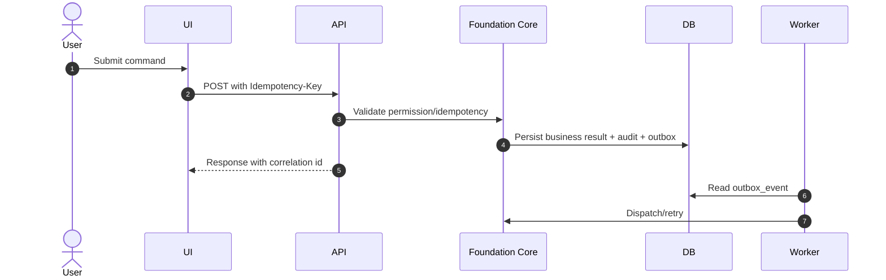

# M01 Foundation Core

## 1. Mục đích

Foundation Core cung cấp nền tảng governance kỹ thuật dùng chung: audit log, idempotency, event/outbox, error convention, state transition log, correlation id và append-only guard. Module này không sở hữu nghiệp vụ sản xuất cụ thể, nhưng là lớp bắt buộc để mọi module vận hành có thể an toàn, traceable và retry được.

## 2. Boundary

| In scope | Out of scope |
|---|---|
| Audit log, idempotency registry, event schema registry, outbox event, event store, state transition log, error/correlation convention, manual retry outbox | Business state của source/raw/production/QC/inventory/recall; UI business form; MISA adapter mapping chi tiết |

## 3. Owner

| Owner type | Role |
|---|---|
| Business owner | COO/Operations Owner |
| Product/BA owner | BA/SA phụ trách governance |
| Technical owner | Platform Architect / Backend Lead |
| QA owner | QA Lead phụ trách audit/idempotency/contract tests |

## 4. Chức năng

| function_id | Function | Description | Priority |
|---|---|---|---|
| M01-F01 | Audit logging | Ghi audit cho command, approval, exception, public/private boundary và security event. | P0 |
| M01-F02 | Idempotency registry | Chống duplicate command cho create/approve/issue/release/receipt/retry. | P0 |
| M01-F03 | Outbox/event | Ghi outbox event để integration/reporting xử lý bất đồng bộ. | P0 |
| M01-F04 | Event schema registry | Quản lý event type/version để tránh breaking change. | P1 |
| M01-F05 | State transition log | Lưu state transition append-only cho entity quan trọng. | P0 |
| M01-F06 | Error/correlation convention | Chuẩn hóa error response, request id, trace id. | P0 |
| M01-F07 | Manual retry | Cho phép retry outbox/dead-letter có quyền và audit. | P1 |
| M01-F08 | State transition validation | Central guard kiểm tra transition hợp lệ trước khi module đổi trạng thái. | P0 |
| M01-F09 | Override/break-glass governance | Ghi nhận reason, scope, expiry, dual approval và audit cho override khẩn cấp. | P0 |

## 5. Business Rules

| rule_id | Rule | Affected data | Affected API | Affected UI | Validation | Exception | Test |
|---|---|---|---|---|---|---|---|
| BR-M01-001 | Audit/event/history đã append thì không update/delete in-place. | `audit_log`, `event_store`, `state_transition_log` | All command APIs | SCR-AUDIT-LOG | DB/service guard | Correction record only | TC-M01-AUD-001 |
| BR-M01-002 | Mọi command critical phải có idempotency key. | `idempotency_registry` | POST command endpoints | All command forms | Header exists, payload hash stable | `IDEMPOTENCY_CONFLICT` | TC-M01-IDEMP-001 |
| BR-M01-003 | Outbox retry không tạo duplicate business side effect. | `outbox_event` | `/api/admin/events/outbox/{eventId}/manual-retry` | SCR-EVENT-OUTBOX | Retry only failed/retryable | Dead-letter/reconcile | TC-EVT-RETRY-001 |
| BR-M01-004 | Error response không lộ secret, token, private integration data. | Error payload | All APIs | All screens | Error shape policy | Safe generic message | TC-M01-ERR-001 |
| BR-M01-005 | Correlation id phải đi xuyên API, audit, outbox và log. | Audit/outbox/log | All APIs | Error panels | Required request id/correlation id | Generate if missing | TC-M01-CORR-001 |
| BR-M01-006 | State transition ngoài state machine đã khai báo phải bị chặn và ghi audit. | `state_transition_log` | All command APIs | All command screens | transition registry check | `STATE_CONFLICT` | TC-M01-STATE-001 |
| BR-M01-007 | Break-glass/override phải có action permission, reason, target scope, dual approval và expiry tối đa 15 phút; không được sửa append-only history. | override request/audit | governance override APIs | SCR-APPROVAL-QUEUE | policy/expiry check | `APPROVAL_POLICY_VIOLATION`, `OVERRIDE_EXPIRED` | TC-M01-OVR-001 |

## 6. Tables

| table | Type | Purpose | Ownership | Notes |
|---|---|---|---|---|
| `audit_log` | audit | Append-only audit action. | M01 | Không lưu secret. |
| `idempotency_registry` | control | Store key, payload hash, response reference, expiry. | M01 | Unique key by tenant/user/scope. |
| `event_schema_registry` | master/control | Event type and version registry. | M01 | Supports compatibility lock. |
| `outbox_event` | integration | Pending/failed/dispatched event queue. | M01 | Consumed by M14/M15/etc. |
| `event_store` | history | Domain event history if used. | M01 | Append-only. |
| `state_transition_log` | history | Entity state transition audit. | M01 | Links entity type/id and actor. |

## 7. APIs

| method | path | Purpose | Permission | Idempotency | Request | Response | Test |
|---|---|---|---|---|---|---|---|
| GET | `/api/admin/audit/logs` | Query audit logs | `AUDIT_VIEW` | No | filters | `AuditLogListResponse` | TC-M01-AUD-001 |
| GET | `/api/admin/events/outbox` | Monitor outbox | `EVENT_OUTBOX_VIEW` | No | filters | `OutboxEventListResponse` | TC-M01-EVT-003 |
| POST | `/api/admin/events/outbox/{eventId}/manual-retry` | Retry failed/dead-letter event | `EVENT_OUTBOX_RETRY` | Yes | `ManualRetryRequest` | `OutboxEventResponse` | TC-EVT-RETRY-001 |

## 8. UI Screens

| screen_id | Route | Purpose | Primary actions | Permission |
|---|---|---|---|---|
| SCR-AUDIT-LOG | `/admin/system/audit-log` | Tra cứu audit append-only | view detail, export | `audit_log.read` |
| SCR-EVENT-OUTBOX | `/admin/integrations/outbox` | Theo dõi và retry outbox | view payload, retry | `event_outbox.read`, `event_outbox.retry` |
| SCR-DASH-OPS | `/admin/dashboard` | Tóm tắt health/pending/failure | drilldown | `report.read` |

## 9. Roles / Permissions

| Role | Permissions/actions | Notes |
|---|---|---|
| Admin | `AUDIT_VIEW`, `EVENT_OUTBOX_VIEW`, `EVENT_OUTBOX_RETRY` | Có thể retry có audit. |
| QA Manager | `AUDIT_VIEW` | Xem audit liên quan QC/recall. |
| Integration Operator | `EVENT_OUTBOX_VIEW`, `EVENT_OUTBOX_RETRY` theo scope được gán | Không sửa business record; retry scope tách MISA/print/general. |
| PM/Operations Viewer | dashboard read | Read-only metrics. |

## 10. Workflow

| workflow_id | Trigger | Steps | Output | Related docs |
|---|---|---|---|---|
| WF-M01-AUDIT | Any command | Validate permission -> execute -> append audit/state transition | Audit and state log | `workflows/01_WORKFLOW_OVERVIEW.md` |
| WF-M01-IDEMP | Critical POST command | Receive key -> compare payload hash -> execute or replay | Single business side effect | `api/06_API_IDEMPOTENCY_SPEC.md` |
| WF-M01-OUTBOX | Domain event emitted | Store outbox -> dispatch -> retry/reconcile if failed | Event status terminal | `workflows/07_EXCEPTION_FLOWS.md` |

## 11. State Machine

## 12. Sequence / Activity Flow

## 13. Input / Output

| Type | Input | Output |
|---|---|---|
| UI | Filters, retry reason, audit query | Audit list, outbox status |
| API | Idempotency key, command context, actor | Audit/event/idempotency record |
| Event | Domain event payload | Outbox event and dispatch status |

## 14. Events

| event | Producer | Consumer | Payload summary |
|---|---|---|---|
| `AUDIT_RECORDED` | M01 | Reporting/security review | actor, action, entity, timestamp |
| `OUTBOX_EVENT_CREATED` | Any module via M01 | M14/M15/workers | event type, entity ref, payload version |
| `OUTBOX_EVENT_FAILED` | M01 worker | Dashboard/Integration UI | event id, error code, retry count |
| `IDEMPOTENCY_CONFLICT_DETECTED` | M01 | Audit/security dashboard | key, actor, scope |

## 15. Audit Log

| action | Audit payload | Retention/sensitivity |
|---|---|---|
| command accepted | actor, permission, endpoint, entity, before/after state, correlation id | High retention; no secret |
| manual retry | event id, reason, previous status, new status | High retention |
| idempotency conflict | key scope, actor, payload hash mismatch flag | Security-sensitive |

## 16. Validation Rules

| validation_id | Rule | Error code | Blocking |
|---|---|---|---|
| VAL-M01-001 | Critical command missing idempotency key | `IDEMPOTENCY_KEY_REQUIRED` | Yes |
| VAL-M01-002 | Same key with different payload | `IDEMPOTENCY_CONFLICT` | Yes |
| VAL-M01-003 | Retry event not retryable | `STATE_CONFLICT` | Yes |
| VAL-M01-004 | Error payload includes forbidden secret/private data | `INTERNAL_ERROR` plus audit alert | Yes for public response |
| VAL-M01-005 | State transition not allowed by module state machine | `STATE_CONFLICT` | Yes |
| VAL-M01-006 | Override missing scope/reason/dual approval or expiry exceeded | `APPROVAL_POLICY_VIOLATION`, `OVERRIDE_EXPIRED` | Yes |

## 17. Exception Flow

| exception | Rule | Recovery |
|---|---|---|
| retry | Retry only failed/retryable outbox with permission and reason if manual | Update retry count, keep original event |
| reconcile | Used by M14, M01 only records audit/event | Link reconcile record, do not mutate original event silently |
| rollback | Only for command not externalized | Otherwise use compensation/correction |
| override | Break-glass must not bypass append-only audit, state validation, or public/private field policy | Dual approval, target scope, reason and max 15-minute expiry are mandatory |

## 18. Test Cases

| test_id | Scenario | Expected result | Priority |
|---|---|---|---|
| TC-M01-AUD-001 | Query audit with filters | Returns paginated audit without private payload | P0 |
| TC-M01-IDEMP-001 | Submit same command twice with same key | Single side effect, replayed response | P0 |
| TC-M01-IDEMP-002 | Same key different payload | `IDEMPOTENCY_CONFLICT` | P0 |
| TC-EVT-RETRY-001 | Manual retry failed outbox | State changes and audit appended | P1 |
| TC-M01-ERR-001 | API error shape | Standard safe error with correlation id | P0 |
| TC-M01-STATE-001 | Invalid state transition | `STATE_CONFLICT` and no target mutation | P0 |
| TC-M01-OVR-001 | Break-glass without valid expiry/dual approval | Blocked and audited | P0 |

## 19. Done Gate

- Idempotency enforced for all critical POST commands.
- Audit log exists for command, approval, exception and retry.
- Outbox retry is safe and audited.
- Event/state logs are append-only.
- Error shape matches API convention.
- State transition guard rejects invalid transitions across modules.
- Break-glass/override policy enforces reason, scope, dual approval, expiry and audit.
- Dashboard/outbox/audit screens can show state and correlation id.

## 20. Risks

| risk | Impact | Mitigation |
|---|---|---|
| Idempotency scope too broad/narrow | Duplicate side effect or false conflict | Define key scope by endpoint, actor, entity and payload hash. |
| Audit stores sensitive payload | Security/compliance exposure | Redaction policy and tests. |
| Outbox retry duplicates external effect | MISA/print/reporting mismatch | Consumer idempotency and external reference tracking. |

## 21. Phase triển khai

| Phase/CODE | Scope in phase | Dependency | Done gate |
|---|---|---|---|
| CODE01 | Audit/idempotency/event base | None | Core tables/API ready |
| CODE10 | API middleware/error/idempotency hardening | CODE01 | Contract tests pass |
| CODE13 | Event schema/outbox adapter | CODE03-CODE08 event producers | Retry/dead-letter tested |
| CODE15 | Override governance | CODE10/CODE14 | Break-glass audited |
| CODE16 | Retention/archive | Owner retention decisions | Restore/archive tested |
