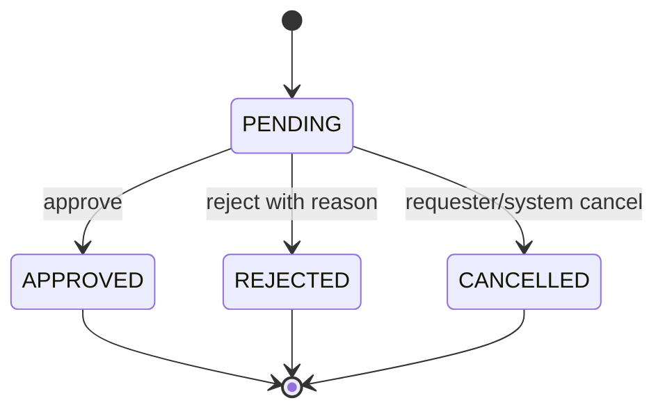
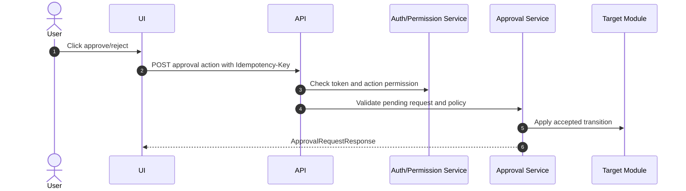

# M02 Auth Permission

## 1. Mục đích

Auth Permission quản lý đăng nhập, user, role, action permission, approval policy và permission-aware UI/API. Module này bảo đảm mọi hành động như verify, approve, issue, release, retry, reconcile, override đều được role/action gate và audit.

## 2. Boundary

| In scope | Out of scope |
|---|---|
| Local authentication, role/action permission, user-role mapping, approval request/action, permission check for API/UI, approval queue | External SSO nếu chưa được owner phê duyệt, business validation của từng module, HR/personnel master chi tiết |

## 3. Owner

| Owner type | Role |
|---|---|
| Business owner | Operations/Admin Owner |
| Product/BA owner | BA phụ trách RBAC/approval |
| Technical owner | Security Architect / Backend Lead |
| QA owner | QA security/permission reviewer |

## 4. Chức năng

| function_id | Function | Description | Priority |
|---|---|---|---|
| M02-F01 | Login/session | Đăng nhập local và cấp token/session. | P0 |
| M02-F02 | Role management | Quản lý role và gán role cho user. | P0 |
| M02-F03 | Action permission | Gán action permission theo role. | P0 |
| M02-F04 | Approval queue | Tạo, duyệt, reject approval request. | P0 |
| M02-F05 | UI action gating | Menu/button/action hiển thị theo permission. | P0 |
| M02-F06 | Approval policy | Rule ai được duyệt hành động nào. | P1 |
| M02-F07 | Break-glass governance | Submit/approve/activate/deactivate override có scope, reason, expiry và audit. | P0 |

## 5. Business Rules

| rule_id | Rule | Affected data | Affected API | Affected UI | Validation | Exception | Test |
|---|---|---|---|---|---|---|---|
| BR-M02-001 | Mọi API admin cần auth trừ login/public trace. | `auth_user`, token/session | All `/api/admin/*` | Admin UI | Token valid | `UNAUTHORIZED` | TC-M02-RBAC-001 |
| BR-M02-002 | Action permission kiểm tra ở backend dù UI đã ẩn button. | `role_action_permission` | Command endpoints | All command screens | Actor has action | `FORBIDDEN` | TC-M02-PERM-001 |
| BR-M02-003 | Reject approval bắt buộc reason. | `approval_request`, `approval_action` | Approval reject APIs | SCR-APPROVAL-QUEUE | reason not empty | `REASON_REQUIRED` | TC-APP-001 |
| BR-M02-004 | Approval chỉ áp dụng khi target đang pending state. | `approval_request` | Approval approve/reject APIs | SCR-APPROVAL-QUEUE | state pending | `STATE_CONFLICT` | TC-M02-APP-003 |
| BR-M02-005 | High-risk approval không cho self-approval; break-glass/override activation bắt buộc dual approval, reason, scope và expiry tối đa 15 phút. | `approval_policy`, `override_request` | Approval/governance APIs | Approval queue | policy check | `APPROVAL_POLICY_VIOLATION`, `OVERRIDE_EXPIRED` | TC-M02-APP-004 |

## 6. Tables

| table | Type | Purpose | Ownership | Notes |
|---|---|---|---|---|
| `auth_user` | master/security | User identity. | M02 | Minimal local user. |
| `auth_role` | master/security | Role catalog. | M02 | Seed core roles. |
| `auth_permission` | master/security | Permission/action catalog. | M02 | May be generated from API/action registry. |
| `auth_user_role` | mapping | User-role assignment. | M02 | Audited changes. |
| `role_action_permission` | mapping | Role to action permission. | M02 | Used by UI/API. |
| `approval_policy` | control | Approval rules by action/entity. | M02 | Owner policy can evolve. |
| `approval_request` | transaction | Approval request header. | M02 with owning module ref | Target entity ref. |
| `approval_action` | audit/history | Approve/reject actions. | M02 | Append-only. |
| `override_request` | transaction/control | Break-glass/override request lifecycle. | M02/M01 | Scoped target, expiry, dual approval and audit. |

## 7. APIs

| method | path | Purpose | Permission | Idempotency | Request | Response | Test |
|---|---|---|---|---|---|---|---|
| POST | `/api/admin/auth/login` | Login | N/A | No | `LoginRequest` | `AuthTokenResponse` | TC-M02-RBAC-001 |
| POST | `/api/admin/auth/logout` | Revoke current session/token | N/A | Yes | `LogoutRequest` | `LogoutResponse` | TC-M02-RBAC-001 |
| GET | `/api/admin/roles` | List roles | `ROLE_VIEW` | No | filters | `RoleListResponse` | TC-M02-RBAC-001 |
| POST | `/api/admin/roles/{roleCode}/actions` | Assign action permission | `ROLE_PERMISSION_UPDATE` | Yes | `RoleActionPermissionRequest` | `RoleActionPermissionResponse` | TC-M02-PERM-002 |
| GET | `/api/admin/approvals` | List approval queue | `APPROVAL_VIEW` | No | filters | `ApprovalRequestListResponse` | TC-M02-APP-003 |
| POST | `/api/admin/approvals/{approvalRequestId}/approve` | Approve request | per `actionCode` | Yes | `ApprovalActionRequest` | `ApprovalRequestResponse` | TC-M02-APP-003 |
| POST | `/api/admin/approvals/{approvalRequestId}/reject` | Reject request | per `actionCode` | Yes | `RejectRequest` | `ApprovalRequestResponse` | AC-APP-001 |
| POST | `/api/admin/approvals/{approvalRequestId}/cancel` | Cancel pending request | requester/system policy | Yes | `ApprovalCancelRequest` | `ApprovalRequestResponse` | TC-M02-APP-003 |
| POST | `/api/admin/governance/overrides` | Submit break-glass/override request | `OVERRIDE_REQUEST_SUBMIT` | Yes | `OverrideRequestSubmitRequest` | `OverrideRequestResponse` | TC-M02-OVR-001 |
| POST | `/api/admin/governance/overrides/{overrideRequestId}/approve` | Approve scoped override | `OVERRIDE_REQUEST_APPROVE` | Yes | `OverrideApproveRequest` | `OverrideRequestResponse` | TC-M02-OVR-001 |
| POST | `/api/admin/governance/overrides/{overrideRequestId}/activate` | Activate approved override | `BREAK_GLASS_ACTIVATE` | Yes | `OverrideActivateRequest` | `OverrideRequestResponse` | TC-M02-OVR-001 |
| POST | `/api/admin/governance/overrides/{overrideRequestId}/deactivate` | Deactivate/revoke active override | `BREAK_GLASS_DEACTIVATE` | Yes | `OverrideDeactivateRequest` | `OverrideRequestResponse` | TC-M02-OVR-002 |

## 8. UI Screens

| screen_id | Route | Purpose | Primary actions | Permission |
|---|---|---|---|---|
| SCR-USERS-ROLES | `/admin/system/users-roles` | User/role/permission management | create user, assign role, deactivate | `user.read`, `role.assign` |
| SCR-APPROVAL-QUEUE | `/admin/system/approvals` | Pending approvals | approve, reject, open detail | permission theo entity action |
| SCR-UI-SCREEN-REGISTRY | `/admin/system/screens` | Permission-aware UI registry | enable/disable/reorder | `screen_registry.write` |

## 9. Roles / Permissions

| Role | Permissions/actions | Notes |
|---|---|---|
| Admin | `ROLE_VIEW`, `ROLE_PERMISSION_UPDATE`, admin UI registry | Không tự bypass audit hoặc self-approve high-risk action. |
| Source Manager | `SOURCE_ZONE_CREATE`, `SOURCE_ORIGIN_CREATE`, `SOURCE_ORIGIN_EVIDENCE_ADD` | Không verify nếu không có QA permission. |
| R&D/Recipe Author | `RECIPE_CREATE`, `RECIPE_UPDATE_LINES`, `RECIPE_SUBMIT_APPROVAL` | Không tự approve/activate recipe. |
| QA Inspector | `RAW_QC_SIGN`, `QC_INSPECTION_SIGN` | Ký QC, không approve release nếu không được gán. |
| QA Manager | `SOURCE_ORIGIN_VERIFY`, `RECIPE_APPROVE`, `BATCH_RELEASE_APPROVE`, `RAW_LOT_MARK_READY`, recall quality approvals | Scope theo approval policy. |
| Production Planner | `PRODUCTION_ORDER_CREATE`, `PRODUCTION_ORDER_VIEW` | Không approve nếu policy tách nhiệm vụ. |
| Production Manager | `PRODUCTION_ORDER_APPROVE`, `WORK_ORDER_CREATE`, `MATERIAL_REQUEST_APPROVE` | Không release batch nếu không có role QA. |
| Production Operator | `PROCESS_EVENT_RECORD`, `MATERIAL_RECEIPT_CONFIRM`, workforce check-in actions | Không alter snapshot. |
| Warehouse Operator | `RAW_INTAKE_CREATE`, `MATERIAL_ISSUE_EXECUTE`, `WAREHOUSE_RECEIPT_CONFIRM` | Không mark raw lot ready hoặc adjust inventory. |
| Warehouse Manager | `WAREHOUSE_CREATE`, `INVENTORY_ADJUSTMENT_CREATE`, hold/release actions | No recipe approval. |
| Packaging Operator | `PACKAGING_JOB_CREATE`, `QR_GENERATE`, `PRINT_JOB_CREATE`, `QR_REPRINT` | Reprint/void phải có reason. |
| Recall Manager | `RECALL_CASE_CREATE`, `RECALL_IMPACT_ANALYSIS`, `RECALL_HOLD_APPLY`, `RECALL_SALE_LOCK_APPLY`, `RECALL_CAPA_EVIDENCE_ADD`, `RECALL_CLOSE` | Không owner CRM/customer master; CAPA evidence close gate vẫn cần clean scan. |
| Integration Operator | `MISA_SYNC_VIEW`, `MISA_MANUAL_RETRY`, `MISA_RECONCILE`, `ACCOUNTING_DOCUMENT_POST` | Không sửa operational truth. |
| Trace Operator | `TRACE_INTERNAL_VIEW`, `TRACE_GENEALOGY_VIEW` | Public-safe policy vẫn do QA/Admin duyệt. |
| PM/Operations Viewer | `DASHBOARD_VIEW`, read-only reports | Không mutate transaction. |
| Public User | Public trace only | Không có admin permission. |

## 10. Workflow

| workflow_id | Trigger | Steps | Output | Related docs |
|---|---|---|---|---|
| WF-M02-LOGIN | User login | Validate credentials -> issue token/session | Auth context | `api/05_API_AUTH_PERMISSION_SPEC.md` |
| WF-M02-PERM | API request | Authenticate -> authorize action -> execute or reject | Allowed/forbidden command | `ui/07_UI_STATE_AND_VALIDATION.md` |
| WF-M02-APPROVAL | Submit approval | Create request -> approve/reject -> apply transition | Target state change | `workflows/06_APPROVAL_WORKFLOWS.md` |

## 11. State Machine

## 12. Sequence / Activity Flow

## 13. Input / Output

| Type | Input | Output |
|---|---|---|
| UI | Login, role assignment, approval reason | Token, role list, approval state |
| API | Credentials, permission assignment, approval action | Auth context, permission map, approval response |
| Event | Approval submitted/approved/rejected | Audit and notifications/dashboard |

## 14. Events

| event | Producer | Consumer | Payload summary |
|---|---|---|---|
| `USER_ROLE_ASSIGNED` | M02 | Audit/Admin UI | user, role, actor |
| `APPROVAL_REQUESTED` | Owning module/M02 | Approval queue | action, target, requester |
| `APPROVAL_APPROVED` | M02 | Owning module/audit | approver, target, decision |
| `APPROVAL_REJECTED` | M02 | Owning module/audit | reason, target, approver |

## 15. Audit Log

| action | Audit payload | Retention/sensitivity |
|---|---|---|
| login success/fail | user, time, source, result | Security-sensitive |
| role/permission update | actor, user/role, before/after permission | High retention |
| approval action | request id, target, decision, reason | High retention |

## 16. Validation Rules

| validation_id | Rule | Error code | Blocking |
|---|---|---|---|
| VAL-M02-001 | Missing/invalid token | `UNAUTHORIZED` | Yes |
| VAL-M02-002 | Missing action permission | `FORBIDDEN` | Yes |
| VAL-M02-003 | Reject without reason | `REASON_REQUIRED` | Yes |
| VAL-M02-004 | Approval target stale/not pending | `STATE_CONFLICT` | Yes |
| VAL-M02-005 | Approval policy violation | `APPROVAL_POLICY_VIOLATION` | Yes |

## 17. Exception Flow

| exception | Rule | Recovery |
|---|---|---|
| reject | Reason required; request remains visible in history | Submit corrected request if needed |
| cancel approval | Only requester/system before decision | Audit cancellation |
| override | Requires break-glass policy, dual approval, scoped target, reason and max 15-minute expiry | Auto-expire/revoke and keep full audit trail |
| stale approval | Reload target and approval queue | User re-evaluates action |

## 18. Test Cases

| test_id | Scenario | Expected result | Priority |
|---|---|---|---|
| TC-M02-RBAC-001 | Login and access protected route | Token accepted; unauthorized rejected | P0 |
| TC-M02-PERM-001 | User lacks action permission | API returns `FORBIDDEN`; UI hides action | P0 |
| TC-M02-PERM-002 | Assign role action permission | Permission available after update and audited | P0 |
| TC-M02-APP-003 | Approve pending request | Target state changes once | P0 |
| TC-M02-APP-004 | Reject without reason | `REASON_REQUIRED` | P0 |
| TC-M02-OVR-001 | Activate break-glass without dual approval/expiry | Blocked with `APPROVAL_POLICY_VIOLATION` or `OVERRIDE_EXPIRED` | P0 |
| TC-M02-OVR-002 | Deactivate active override | Override revoked and audit appended | P0 |

## 19. Done Gate

- Role/action permission seed exists for all module actions.
- Admin API rejects unauthorized/forbidden requests.
- Approval queue supports approve/reject with audit and idempotency.
- UI action gating matches backend permission.
- Role/action permission seed covers all P0 module actions, including `RAW_LOT_MARK_READY`, `RECALL_CAPA_EVIDENCE_ADD`, `ACCOUNTING_DOCUMENT_POST`, `BREAK_GLASS_ACTIVATE` and `BREAK_GLASS_DEACTIVATE`.
- Break-glass policy is implemented with dual approval, scoped target, reason, short expiry and audit.

## 20. Risks

| risk | Impact | Mitigation |
|---|---|---|
| Role matrix not finalized | Users blocked or over-privileged | Start with least privilege and owner approval. |
| UI-only permission | Security bypass via API | Backend enforces every action. |
| Self-approval ambiguity | Compliance issue | Block self-approval for high-risk actions and require dual approval for break-glass. |

## 21. Phase triển khai

| Phase/CODE | Scope in phase | Dependency | Done gate |
|---|---|---|---|
| CODE01 | Minimal RBAC hooks and audit | M01 | Admin can login and verify source if permitted |
| CODE09 | Role-based Admin UI engine | CODE01 | Menu/action gating works |
| CODE10 | API auth/permission middleware | CODE01 | Contract tests for 401/403 |
| CODE15 | Override governance | CODE10/CODE14 | Break-glass audited |
