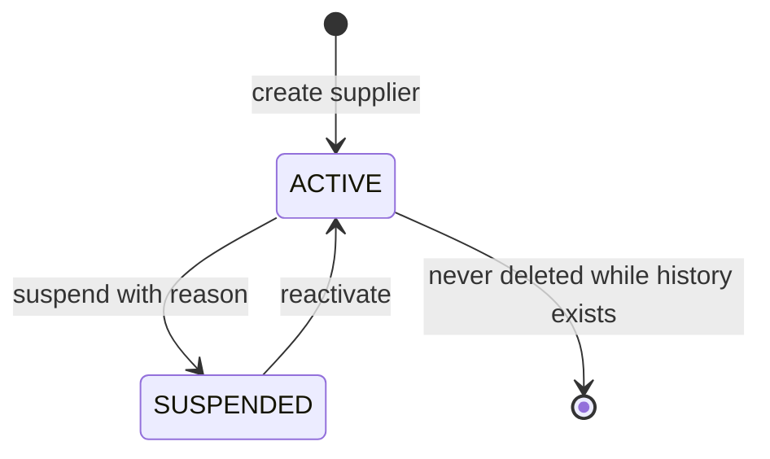
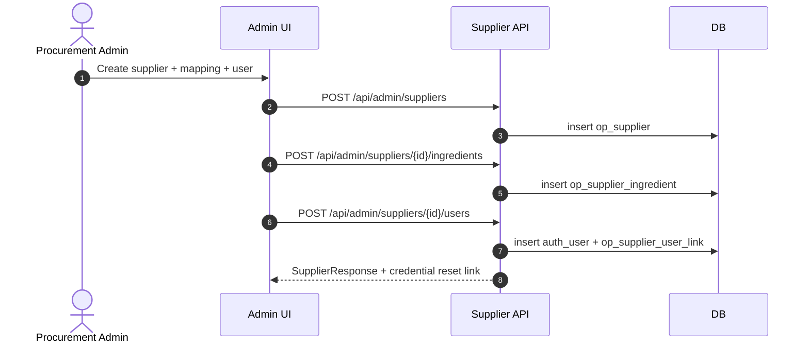

# M03A Supplier Management

> Sub-module phụ thuộc M03 Master Data và M02 Auth Permission. Không phá vỡ numbering M01-M16; phục vụ Supplier Collaboration cho M06 Raw Material.
>
> Nguồn quyết định: `docs/v2-decisions/OD-M06-SUP-COLLAB.md` (OD-MODULE-M03A-001, HL-SUP-001..017).

## 1. Mục đích

Quản lý hồ sơ supplier (master), supplier user (party) và supplier-ingredient mapping. Cung cấp identity/permission/scope cho supplier khi tham gia luồng pre-receipt cộng tác trong M06 Raw Material. Module này sở hữu master supplier; M06 sở hữu transaction raw_material_receipt và evidence/feedback gắn với receipt.

## 2. Boundary

| In scope                                                                                                                                                             | Out of scope                                                                                                                                   |
| -------------------------------------------------------------------------------------------------------------------------------------------------------------------- | ---------------------------------------------------------------------------------------------------------------------------------------------- |
| Supplier master CRUD (code/name/status/tax/contact); supplier user accounts (`user_type = SUPPLIER_USER`); supplier-ingredient allowed mapping; supplier scope check | Raw receipt transaction, evidence/feedback gắn receipt (M06), QC signing (M09), inventory ledger (M11), public trace (M12), MISA mapping (M14) |

## 3. Owner

| Owner type       | Role                                      |
| ---------------- | ----------------------------------------- |
| Business owner   | Procurement / Supplier Onboarding Manager |
| Product/BA owner | BA M03/M03A                               |
| Technical owner  | Backend Lead / DBA                        |
| QA owner         | QA Manager (supplier verification)        |

## 4. Chức năng

| function_id | Function                    | Description                                                                     | Priority |
| ----------- | --------------------------- | ------------------------------------------------------------------------------- | -------- |
| M03A-F01    | Supplier master             | Tạo/cập nhật/đình chỉ supplier (code/name/status/tax/contact).                  | P0       |
| M03A-F02    | Supplier user account       | Tạo user `user_type = SUPPLIER_USER` gắn `supplier_id`, role `R-SUPPLIER`.      | P0       |
| M03A-F03    | Supplier-ingredient mapping | Khai báo supplier nào được phép cung cấp ingredient nào (allowlist).            | P0       |
| M03A-F04    | Supplier scope check        | API helper trả `supplier_id` của session, dùng cho mọi route `/api/supplier/*`. | P0       |
| M03A-F05    | Supplier suspend/reactivate | Đình chỉ supplier giữ lịch sử receipt; không xóa hồ sơ.                         | P0       |

## 5. Business Rules

| rule_id     | Rule                                                                                                                                                                                                                                                                                                                                                                    | Affected data                                                                                     | Affected API                        | Affected UI                              | Validation                      | Exception                         | Test              |
| ----------- | ----------------------------------------------------------------------------------------------------------------------------------------------------------------------------------------------------------------------------------------------------------------------------------------------------------------------------------------------------------------------- | ------------------------------------------------------------------------------------------------- | ----------------------------------- | ---------------------------------------- | ------------------------------- | --------------------------------- | ----------------- |
| BR-M03A-001 | `supplier_code` unique và bất biến sau khi có receipt tham chiếu.                                                                                                                                                                                                                                                                                                       | `op_supplier`                                                                                     | supplier CRUD                       | SCR-SUPPLIER-\*                          | unique check + reference guard  | `SUPPLIER_CODE_LOCKED`            | TC-M03A-SUP-001   |
| BR-M03A-002 | Supplier `SUSPENDED` không tạo được receipt mới nhưng giữ lịch sử và evidence cũ. Precedence: kiểm tra `op_supplier.status = SUSPENDED` PHẢI thực hiện TRƯỚC kiểm tra allowlist `op_supplier_ingredient`; supplier SUSPENDED reject `SUPPLIER_SUSPENDED` ngay cả khi `(supplier_id, ingredient_id)` còn active trong allowlist. Allowlist KHÔNG bypass supplier status. | `op_supplier`, `op_raw_material_receipt`                                                          | supplier suspend, raw intake create | SCR-SUPPLIER-LIST, SCR-RAW-INTAKES       | status check tại receipt create | `SUPPLIER_SUSPENDED`              | TC-M03A-SUP-002   |
| BR-M03A-003 | Supplier user phải gắn đúng 1 `supplier_id` và role `R-SUPPLIER`; không gán role admin/operator.                                                                                                                                                                                                                                                                        | `auth_user`, `op_supplier_user_link`                                                              | supplier user create                | SCR-SUPPLIER-USERS                       | role/scope check                | `SUPPLIER_USER_INVALID_ROLE`      | TC-M03A-SUP-003   |
| BR-M03A-004 | Supplier-ingredient mapping required: receipt với `(supplier_id, ingredient_id)` không có trong `op_supplier_ingredient` bị reject.                                                                                                                                                                                                                                     | `op_supplier_ingredient`                                                                          | mapping CRUD, raw intake create     | SCR-SUPPLIER-INGREDIENT, SCR-RAW-INTAKES | allowlist check                 | `SUPPLIER_INGREDIENT_NOT_ALLOWED` | TC-M03A-MAP-004   |
| BR-M03A-005 | Tất cả route `/api/supplier/*` phải scope theo `supplier_id` của session; cross-supplier access reject `403`.                                                                                                                                                                                                                                                           | `op_raw_material_receipt`, `op_raw_material_receipt_evidence`, `op_raw_material_receipt_feedback` | supplier API family                 | Supplier Portal                          | scope guard middleware          | `SUPPLIER_SCOPE_VIOLATION`        | TC-M03A-SCOPE-005 |
| BR-M03A-006 | Password policy supplier user theo HL-SUP-008 (min length 12, mixed case + digit + symbol; rotation 90 ngày khuyến nghị, không bắt buộc force).                                                                                                                                                                                                                         | `app_user_password`                                                                               | auth login/change                   | Supplier login                           | password policy                 | `WEAK_PASSWORD`                   | TC-M03A-AUTH-006  |

## 6. Tables

| table                    | Type   | Purpose                                                      | Ownership | Notes                                                                                                                                                                                                               |
| ------------------------ | ------ | ------------------------------------------------------------ | --------- | ------------------------------------------------------------------------------------------------------------------------------------------------------------------------------------------------------------------- |
| `op_supplier`            | master | Supplier identity.                                           | M03A      | columns: `supplier_id`, `supplier_code`, `supplier_name`, `tax_code`, `contact_email`, `contact_phone`, `status` (`ACTIVE`/`SUSPENDED`), audit columns                                                              |
| `op_supplier_ingredient` | master | Allowlist `(supplier_id, ingredient_id)` được phép cung cấp. | M03A      | columns: `supplier_id`, `ingredient_id`, `default_uom_code`, `status`, evidence policy flags/counts, `effective_from`, `effective_to`, audit/approval cols; unique active effective mapping per supplier+ingredient |
| `op_supplier_user_link`  | master | Liên kết user (`user_type = SUPPLIER_USER`) với supplier.    | M03A/M02  | UQ `(user_id)`; FK `supplier_id`. Một user thuộc đúng 1 supplier.                                                                                                                                                   |

> Migration group `03A` đã được thêm vào `database/08_MIGRATION_STRATEGY.md` (Đợt B).

## 7. APIs

| method | path                                                   | Purpose                             | Permission             | Idempotency | Request                           | Response                         | Test              |
| ------ | ------------------------------------------------------ | ----------------------------------- | ---------------------- | ----------- | --------------------------------- | -------------------------------- | ----------------- |
| GET    | `/api/admin/suppliers`                                 | List supplier                       | `supplier.read`        | No          | filters                           | `SupplierListResponse`           | TC-M03A-SUP-001   |
| POST   | `/api/admin/suppliers`                                 | Create supplier                     | `supplier.create`      | Yes         | `SupplierCreateRequest`           | `SupplierResponse`               | TC-M03A-SUP-001   |
| PUT    | `/api/admin/suppliers/{id}`                            | Update supplier                     | `supplier.update`      | No          | `SupplierUpdateRequest`           | `SupplierResponse`               | TC-M03A-SUP-001   |
| POST   | `/api/admin/suppliers/{id}/suspend`                    | Suspend supplier                    | `supplier.suspend`     | Yes         | `SuspendRequest`                  | `SupplierResponse`               | TC-M03A-SUP-002   |
| POST   | `/api/admin/suppliers/{id}/reactivate`                 | Reactivate supplier                 | `supplier.suspend`     | Yes         | `ReactivateRequest`               | `SupplierResponse`               | TC-M03A-SUP-002   |
| GET    | `/api/admin/suppliers/{id}/ingredients`                | List allowed ingredients            | `supplier.read`        | No          | filters                           | `SupplierIngredientListResponse` | TC-M03A-MAP-004   |
| POST   | `/api/admin/suppliers/{id}/ingredients`                | Add allowlist mapping               | `supplier.update`      | Yes         | `SupplierIngredientCreateRequest` | `SupplierIngredientResponse`     | TC-M03A-MAP-004   |
| DELETE | `/api/admin/suppliers/{id}/ingredients/{ingredientId}` | Retire mapping (set `effective_to`) | `supplier.update`      | Yes         | N/A                               | `SupplierIngredientResponse`     | TC-M03A-MAP-004   |
| POST   | `/api/admin/suppliers/{id}/users`                      | Create supplier user account        | `supplier.user.manage` | Yes         | `SupplierUserCreateRequest`       | `SupplierUserResponse`           | TC-M03A-SUP-003   |
| GET    | `/api/supplier/me`                                     | Trả supplier scope của session      | `supplier.self.read`   | No          | N/A                               | `SupplierSelfResponse`           | TC-M03A-SCOPE-005 |

## 8. UI Screens

| screen_id               | Route                                           | Purpose                                     | Primary actions                    | Permission                                             |
| ----------------------- | ----------------------------------------------- | ------------------------------------------- | ---------------------------------- | ------------------------------------------------------ |
| SCR-SUPPLIER-LIST       | `/admin/master-data/suppliers`                  | Danh sách supplier                          | view, create, suspend, reactivate  | `supplier.read`, `supplier.create`, `supplier.suspend` |
| SCR-SUPPLIER-DETAIL     | `/admin/master-data/suppliers/{id}`             | Chi tiết + ingredient allowlist + user list | edit, manage mapping, manage users | `supplier.update`, `supplier.user.manage`              |
| SCR-SUPPLIER-INGREDIENT | `/admin/master-data/suppliers/{id}/ingredients` | Allowlist editor                            | add, retire                        | `supplier.update`                                      |
| SCR-SUPPLIER-USERS      | `/admin/master-data/suppliers/{id}/users`       | Supplier user management                    | create, reset password, deactivate | `supplier.user.manage`                                 |
| SCR-SUP-LOGIN           | `/supplier/login`                               | Supplier portal login                       | login                              | public                                                 |

## 9. Roles / Permissions

| Role         | Permissions/actions                              | Notes                                                     |
| ------------ | ------------------------------------------------ | --------------------------------------------------------- |
| `R-ADMIN`    | full supplier admin                              | Tạo supplier, mapping, user.                              |
| `R-OPS-MGR`  | supplier suspend/reactivate, mapping update      | Operational override.                                     |
| `R-SUPPLIER` | `supplier.self.read`, `supplier.receipt.*` (M06) | Chỉ thấy chính supplier mình; không truy cập admin route. |

## 10. Workflow

| workflow_id     | Trigger                             | Steps                                                                    | Output                                   | Related docs                                                     |
| --------------- | ----------------------------------- | ------------------------------------------------------------------------ | ---------------------------------------- | ---------------------------------------------------------------- |
| WF-M03A-ONBOARD | Procurement onboarding supplier mới | Create supplier → add ingredient mapping → create supplier user → notify | Supplier `ACTIVE` ready cho M06          | `workflows/05_CANONICAL_OPERATIONAL_FLOW.md` (block pre-receipt) |
| WF-M03A-SUSPEND | Vi phạm/ngừng hợp tác               | Suspend supplier với reason → block receipt mới                          | Supplier `SUSPENDED`, lịch sử giữ nguyên | `workflows/07_EXCEPTION_FLOWS.md` (EX-SUP-DECLINE liên quan)     |

## 11. State Machine

## 12. Sequence / Activity Flow

## 13. Input / Output

| Type  | Input                                                                                                                   | Output                                                                                           |
| ----- | ----------------------------------------------------------------------------------------------------------------------- | ------------------------------------------------------------------------------------------------ |
| UI    | supplier code/name/tax/contact, ingredient mapping, user account                                                        | supplier `ACTIVE`, mapping list, user credential link                                            |
| API   | `SupplierCreateRequest`, `SupplierIngredientCreateRequest`, `SupplierUserCreateRequest`                                 | `SupplierResponse`, `SupplierIngredientResponse`, `SupplierUserResponse`, `SupplierSelfResponse` |
| Event | `SUPPLIER_CREATED`, `SUPPLIER_SUSPENDED`, `SUPPLIER_REACTIVATED`, `SUPPLIER_INGREDIENT_MAPPED`, `SUPPLIER_USER_CREATED` | Audit + downstream M06 cache invalidation                                                        |

## 14. Events

| event                        | Producer | Consumer    | Payload summary                            |
| ---------------------------- | -------- | ----------- | ------------------------------------------ |
| `SUPPLIER_CREATED`           | M03A     | M06/M14/M15 | supplier_id, code, name                    |
| `SUPPLIER_SUSPENDED`         | M03A     | M06/M15     | supplier_id, reason, actor                 |
| `SUPPLIER_INGREDIENT_MAPPED` | M03A     | M06         | supplier_id, ingredient_id, effective_from |
| `SUPPLIER_USER_CREATED`      | M03A     | M02/M15     | user_id, supplier_id                       |

## 15. Audit Log

| action                          | Audit payload                                | Retention/sensitivity |
| ------------------------------- | -------------------------------------------- | --------------------- |
| supplier create/update          | actor, supplier code, fields changed         | Operational audit     |
| supplier suspend/reactivate     | actor, reason, before/after status           | High retention        |
| ingredient mapping add/retire   | actor, supplier, ingredient, effective dates | High retention        |
| supplier user create/deactivate | actor, supplier_id, user_id                  | High retention        |

## 16. Validation Rules

| validation_id | Rule                                                                | Error code                      | Blocking |
| ------------- | ------------------------------------------------------------------- | ------------------------------- | -------- |
| VAL-M03A-001  | `supplier_code` unique                                              | `DUPLICATE_SUPPLIER_CODE`       | Yes      |
| VAL-M03A-002  | Supplier user phải có role `R-SUPPLIER` và `supplier_id` hợp lệ     | `SUPPLIER_USER_INVALID_ROLE`    | Yes      |
| VAL-M03A-003  | Mapping `(supplier_id, ingredient_id)` không trùng `effective_from` | `DUPLICATE_SUPPLIER_INGREDIENT` | Yes      |
| VAL-M03A-004  | Suspend supplier có receipt OPEN bị reject                          | `SUPPLIER_HAS_OPEN_RECEIPT`     | Yes      |

## 17. Exception Flow

| exception                                             | Rule                                                                | Recovery                                                  |
| ----------------------------------------------------- | ------------------------------------------------------------------- | --------------------------------------------------------- |
| Supplier suspend khi đang có receipt OPEN             | Block suspend                                                       | Đóng/cancel receipt trước, hoặc dùng override `R-OPS-MGR` |
| Mapping retire khi receipt WAITING_DELIVERY đang dùng | Cảnh báo nhưng cho phép retire forward (không ảnh hưởng receipt cũ) | Receipt cũ giữ mapping snapshot tại thời điểm tạo         |

## 18. Test Cases

| test_id           | Scenario                                         | Expected result                                              | Priority |
| ----------------- | ------------------------------------------------ | ------------------------------------------------------------ | -------- |
| TC-M03A-SUP-001   | Create supplier + duplicate code                 | First pass; second `DUPLICATE_SUPPLIER_CODE`                 | P0       |
| TC-M03A-SUP-002   | Suspend supplier rồi tạo receipt mới             | Receipt reject `SUPPLIER_SUSPENDED`; lịch sử cũ vẫn xem được | P0       |
| TC-M03A-SUP-003   | Tạo supplier user với role admin                 | Reject `SUPPLIER_USER_INVALID_ROLE`                          | P0       |
| TC-M03A-MAP-004   | Tạo receipt với ingredient không trong allowlist | Reject `SUPPLIER_INGREDIENT_NOT_ALLOWED`                     | P0       |
| TC-M03A-SCOPE-005 | Supplier user A truy cập receipt của supplier B  | Reject `403 SUPPLIER_SCOPE_VIOLATION`                        | P0       |
| TC-M03A-AUTH-006  | Supplier user đặt password yếu                   | Reject `WEAK_PASSWORD`                                       | P0       |

## 19. Done Gate

- Supplier master CRUD + suspend/reactivate hoạt động.
- Allowlist `(supplier_id, ingredient_id)` enforce tại M06 receipt create.
- Supplier user account tách biệt admin user; scope guard active.
- Permission `R-SUPPLIER` không truy cập route admin.
- Audit + event đầy đủ cho mọi action.

## 20. Risks

| risk                                | Impact                     | Mitigation                                                              |
| ----------------------------------- | -------------------------- | ----------------------------------------------------------------------- |
| Supplier user dùng chung account    | Lộ scope dữ liệu           | UQ `(user_id)` trên `op_supplier_user_link`; password policy HL-SUP-008 |
| Mapping retire ảnh hưởng receipt mở | Block flow                 | Snapshot mapping vào receipt khi tạo; retire chỉ ảnh hưởng receipt mới  |
| Suspend supplier giữa luồng         | Block receipt mới đột ngột | Validation VAL-M03A-004 + override `R-OPS-MGR` có audit                 |

## 21. Phase triển khai

| Phase/CODE | Scope in phase                                                                                                          | Dependency                    | Done gate                                                     |
| ---------- | ----------------------------------------------------------------------------------------------------------------------- | ----------------------------- | ------------------------------------------------------------- |
| CODE01A    | M03A scaffold: supplier master + ingredient allowlist + supplier user link + scope guard middleware + role `R-SUPPLIER` | CODE01 (M02 RBAC, M03 master) | Supplier portal login + `GET /api/supplier/me` trả đúng scope |
| CODE02     | Tích hợp M03A vào M06 raw receipt (allowlist check, scope-filtered receipt list)                                        | CODE01A, CODE02 base          | Pre-receipt collaboration flow chạy được                      |

## 22. PF-03 Contract Freeze Note

| Area                | Freeze evidence                                                                                                                                            | Impact                                                                                                                |
| ------------------- | ---------------------------------------------------------------------------------------------------------------------------------------------------------- | --------------------------------------------------------------------------------------------------------------------- |
| Supplier hard locks | `testing/02_TEST_CASE_MATRIX.md` has mandatory 1-1 `TC-HL-SUP-001..017` coverage for `HL-SUP-001..017`.                                                    | CODE01A/CODE02 must implement scope, allowlist, supplier evidence, password, and public leakage tests from those IDs. |
| Permission seed     | `roles_permissions.csv` includes supplier admin actions and `R-SUPPLIER` scoped actions with no duplicate `(role_code, action_code)` pairs.                | Backend permission middleware must enforce seeded action codes; UI hiding is not the security boundary.               |
| Public leakage      | `PublicTracePublicResponse` is whitelist-only with `additionalProperties=false`; `HL-SUP-017` verifies supplier/evidence data never leaks to public trace. | Supplier evidence/identity remains internal even when purchased lots are part of public-trace batches.                |
