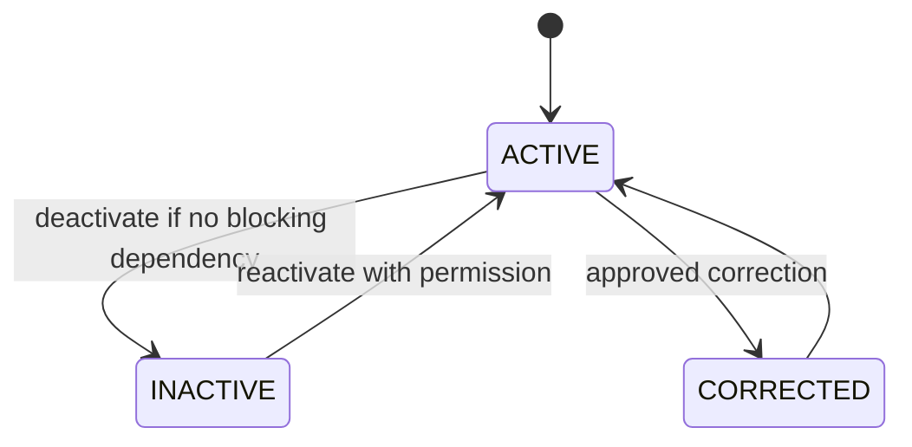
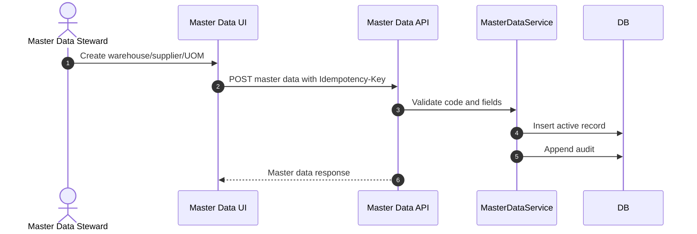

# M03 Master Data

## 1. Mục đích

Master Data quản lý dữ liệu nền dùng chung: UOM, supplier, warehouse/location, reason/config và reference chung không thuộc SKU/recipe. Module này bảo đảm các transaction sau đó dùng cùng một bộ mã chuẩn, tránh duplicate truth giữa raw material, production, inventory, trace và integration.

## 2. Boundary

| In scope                                                                             | Out of scope                                                                                                      |
| ------------------------------------------------------------------------------------ | ----------------------------------------------------------------------------------------------------------------- |
| `ref_uom`, supplier, warehouse, warehouse location, adjustment reason, common config | SKU/ingredient/recipe chi tiết, source origin evidence/verification, inventory ledger, customer/order/pricing/CRM |

## 3. Owner

| Owner type       | Role                     |
| ---------------- | ------------------------ |
| Business owner   | Operations/Admin Owner   |
| Product/BA owner | Master Data Steward / BA |
| Technical owner  | Backend Lead / DBA       |
| QA owner         | QA data validation owner |

## 4. Chức năng

| function_id | Function                                   | Description                                                                                                                                                                                             | Priority |
| ----------- | ------------------------------------------ | ------------------------------------------------------------------------------------------------------------------------------------------------------------------------------------------------------- | -------- |
| M03-F01     | UOM management                             | Quản lý đơn vị tính, precision, active status.                                                                                                                                                          | P0       |
| M03-F02     | Supplier reference (canonical owner: M03A) | Giữ supplier code/identity reference cho raw material/ingredient master link; canonical CRUD/RBAC/portal nằm ở [M03A Supplier Management](03A_SUPPLIER_MANAGEMENT.md). M03 chỉ expose read-only lookup. | P0       |
| M03-F03     | Warehouse management                       | Quản lý kho nguyên liệu/thành phẩm và location.                                                                                                                                                         | P0       |
| M03-F04     | Reason/config registry                     | Quản lý reason code theo scope và module config chung có namespace/owner rõ ràng.                                                                                                                       | P1       |
| M03-F05     | Active/inactive governance                 | Không cho deactivate master data đang được transaction active dùng.                                                                                                                                     | P0       |

## 5. Business Rules

| rule_id    | Rule                                                                                                                         | Affected data                  | Affected API               | Affected UI                            | Validation              | Exception                      | Test           |
| ---------- | ---------------------------------------------------------------------------------------------------------------------------- | ------------------------------ | -------------------------- | -------------------------------------- | ----------------------- | ------------------------------ | -------------- |
| BR-M03-001 | Master code phải unique và ổn định sau khi tạo.                                                                              | UOM/supplier/warehouse         | POST/PATCH master APIs     | SCR-UOM, SCR-SUPPLIERS, SCR-WAREHOUSES | Unique code             | Correction with audit          | TC-UI-MD-001   |
| BR-M03-002 | Không deactivate warehouse còn balance hoặc open transaction.                                                                | `op_warehouse`, inventory refs | Warehouse PATCH/deactivate | SCR-WAREHOUSES                         | Dependency check        | Keep active or migrate balance | TC-UI-MD-003   |
| BR-M03-003 | Supplier dùng trong raw intake không được xóa.                                                                               | `op_supplier`, raw intake      | Supplier deactivate        | SCR-SUPPLIERS                          | FK/dependency check     | Set inactive only              | TC-UI-MD-002   |
| BR-M03-004 | UOM used by ingredient/transaction không đổi precision phá vỡ dữ liệu cũ.                                                    | `ref_uom`, recipe/ledger       | UOM update                 | SCR-UOM                                | Dependency impact check | New UOM or correction          | TC-M03-UOM-002 |
| BR-M03-005 | Supplier đang được dùng trong MISA mapping hoặc sync reference không được xóa; chỉ set inactive sau khi mapping được review. | `op_supplier`, `misa_mapping`  | Supplier deactivate        | SCR-SUPPLIERS, SCR-MISA-MAPPING        | MISA dependency check   | Set inactive/re-map            | TC-M03-SUP-004 |

## 6. Tables

| table                   | Type   | Purpose                                                      | Ownership | Notes                                                                                                                                                                                           |
| ----------------------- | ------ | ------------------------------------------------------------ | --------- | ----------------------------------------------------------------------------------------------------------------------------------------------------------------------------------------------- |
| `ref_uom`               | master | Unit of measure.                                             | M03       | Used by ingredient, recipe, ledger.                                                                                                                                                             |
| `op_supplier`           | master | Supplier reference (read-only ở M03; canonical CRUD ở M03A). | M03A      | Public trace must not expose internal supplier detail. M03 chỉ truy vấn lookup; mọi mutation đi qua M03A endpoint.                                                                              |
| `op_warehouse`          | master | Warehouse header.                                            | M03/M11   | `warehouse_type`: `RAW_MATERIAL`, `FINISHED_GOODS`.                                                                                                                                             |
| `op_warehouse_location` | master | Warehouse location/bin.                                      | M03/M11   | Optional depth owner decision.                                                                                                                                                                  |
| `ref_adjustment_reason` | master | Reason code for correction/adjustment.                       | M03       | Scope-coded by module/action, e.g. inventory adjustment, variance, recall hold, override.                                                                                                       |
| `op_config`             | config | Common system config.                                        | M03/M01   | Namespace required. Baseline keys include `raw_intake.requires_source_origin`, `misa.test_mode`, `idempotency.default_ttl_hours`, `break_glass.max_ttl_minutes`, `public_trace.enabled_fields`. |

## 7. APIs

| method | path                          | Purpose          | Permission         | Idempotency | Request                  | Response                | Test           |
| ------ | ----------------------------- | ---------------- | ------------------ | ----------- | ------------------------ | ----------------------- | -------------- |
| GET    | `/api/admin/master-data/uoms` | List UOM         | `MASTER_DATA_VIEW` | No          | filters                  | `UomListResponse`       | TC-M03-MD-001  |
| GET    | `/api/admin/suppliers`        | List suppliers   | `SUPPLIER_VIEW`    | No          | filters                  | `SupplierListResponse`  | TC-M03-SUP-003 |
| POST   | `/api/admin/suppliers`        | Create supplier  | `SUPPLIER_CREATE`  | Yes         | `SupplierCreateRequest`  | `SupplierResponse`      | TC-SUP-001     |
| GET    | `/api/admin/warehouses`       | List warehouses  | `WAREHOUSE_VIEW`   | No          | filters                  | `WarehouseListResponse` | TC-M03-WH-002  |
| POST   | `/api/admin/warehouses`       | Create warehouse | `WAREHOUSE_CREATE` | Yes         | `WarehouseCreateRequest` | `WarehouseResponse`     | TC-M03-WH-002  |

## 8. UI Screens

| screen_id      | Route                           | Purpose            | Primary actions          | Permission                          |
| -------------- | ------------------------------- | ------------------ | ------------------------ | ----------------------------------- |
| SCR-UOM        | `/admin/master-data/uom`        | UOM registry       | create, edit, deactivate | `uom.read`, `uom.write`             |
| SCR-SUPPLIERS  | `/admin/master-data/suppliers`  | Supplier registry  | create, edit, deactivate | `supplier.read`, `supplier.write`   |
| SCR-WAREHOUSES | `/admin/master-data/warehouses` | Warehouse registry | create, edit, deactivate | `warehouse.read`, `warehouse.write` |

## 9. Roles / Permissions

| Role                | Permissions/actions                  | Notes                            |
| ------------------- | ------------------------------------ | -------------------------------- |
| Admin               | Full master data write               | Audit required.                  |
| Master Data Steward | Create/update UOM/supplier/warehouse | Cannot bypass dependency checks. |
| Warehouse Manager   | Warehouse read/write if allowed      | Warehouse-specific only.         |
| Viewer              | Read-only master data                | No mutation.                     |

## 10. Workflow

| workflow_id       | Trigger                   | Steps                                          | Output                          | Related docs                             |
| ----------------- | ------------------------- | ---------------------------------------------- | ------------------------------- | ---------------------------------------- |
| WF-M03-CREATE     | Create master data        | Validate code -> create active record -> audit | Active master row               | `ui/05_FORM_FIELD_SPECIFICATION.md`      |
| WF-M03-DEACTIVATE | Deactivate master data    | Check dependencies -> set inactive -> audit    | Inactive record                 | `workflows/07_EXCEPTION_FLOWS.md`        |
| WF-M03-SEED       | Seed baseline master data | Load idempotent seed -> validate uniqueness    | UOM/warehouse/supplier baseline | `database/07_SEED_DATA_SPECIFICATION.md` |

## 11. State Machine

## 12. Sequence / Activity Flow

## 13. Input / Output

| Type  | Input                                    | Output                            |
| ----- | ---------------------------------------- | --------------------------------- |
| UI    | Code, name, active flag, type, precision | List/detail rows                  |
| API   | Create/update/deactivate request         | Master response                   |
| Event | Master data changed                      | Audit/outbox for caches if needed |

## 14. Events

| event                     | Producer | Consumer          | Payload summary         |
| ------------------------- | -------- | ----------------- | ----------------------- |
| `MASTER_DATA_CREATED`     | M03      | Audit/Dashboard   | entity type/code        |
| `MASTER_DATA_DEACTIVATED` | M03      | Dependent modules | entity type/code/reason |
| `WAREHOUSE_CREATED`       | M03      | M11/M15           | warehouse id/type       |

## 15. Audit Log

| action                          | Audit payload                       | Retention/sensitivity |
| ------------------------------- | ----------------------------------- | --------------------- |
| create/update/deactivate master | actor, entity, before/after, reason | High retention        |
| failed dependency deactivate    | actor, entity, dependency summary   | Operational audit     |

## 16. Validation Rules

| validation_id | Rule                                                         | Error code          | Blocking |
| ------------- | ------------------------------------------------------------ | ------------------- | -------- |
| VAL-M03-001   | Code unique                                                  | `DUPLICATE_KEY`     | Yes      |
| VAL-M03-002   | Required name/type/UOM fields                                | `VALIDATION_FAILED` | Yes      |
| VAL-M03-003   | Cannot deactivate referenced active entity                   | `STATE_CONFLICT`    | Yes      |
| VAL-M03-004   | Warehouse type must be valid                                 | `VALIDATION_FAILED` | Yes      |
| VAL-M03-005   | Config key namespace/owner/data type required                | `VALIDATION_FAILED` | Yes      |
| VAL-M03-006   | Supplier referenced by active MISA mapping cannot be deleted | `STATE_CONFLICT`    | Yes      |

## 17. Exception Flow

| exception          | Rule                                                     | Recovery                                           |
| ------------------ | -------------------------------------------------------- | -------------------------------------------------- |
| deactivate blocked | If referenced by active transaction/balance              | Keep active, migrate/close dependent records first |
| correction         | Use correction/audit, do not rewrite transaction history | Patch master and preserve historical snapshots     |
| duplicate code     | Reject create                                            | User picks another code or reactivates existing    |

## 18. Test Cases

| test_id         | Scenario                                     | Expected result                         | Priority |
| --------------- | -------------------------------------------- | --------------------------------------- | -------- |
| TC-UI-MD-001    | Create UOM with unique code                  | UOM active and visible                  | P0       |
| TC-M03-UOM-002  | Duplicate UOM code                           | `DUPLICATE_KEY`                         | P0       |
| TC-UI-MD-002    | Supplier create/deactivate                   | Active/inactive state audited           | P0       |
| TC-UI-MD-003    | Deactivate warehouse with balance            | Blocked                                 | P0       |
| TC-M03-SUP-004  | Deactivate supplier with active MISA mapping | Blocked or requires remap/inactive flow | P0       |
| TC-M03-SEED-001 | Seed baseline idempotent                     | Running twice creates no duplicates     | P0       |

## 19. Done Gate

- UOM/supplier/warehouse schemas and APIs exist.
- Master data seed is idempotent.
- Deactivate dependency checks protect active transaction data.
- UI forms/tables handle duplicate, empty, dependency error states.
- Audit exists for create/update/deactivate.

## 20. Risks

| risk                                   | Impact                             | Mitigation                                           |
| -------------------------------------- | ---------------------------------- | ---------------------------------------------------- |
| Supplier/source responsibility overlap | Confused raw intake ownership      | Supplier stays M03; source verification stays M05.   |
| Warehouse model too shallow            | Later inventory location migration | Mark location/bin depth as owner decision if needed. |
| Master data correction breaks history  | Wrong trace/ledger interpretation  | Use snapshots in transaction modules.                |

## 21. Phase triển khai

| Phase/CODE | Scope in phase                        | Dependency | Done gate                                   |
| ---------- | ------------------------------------- | ---------- | ------------------------------------------- |
| CODE01     | Minimal master data for source origin | M01/M02    | Source origin can reference supplier/config |
| CODE02     | Raw material dependency               | CODE01     | Raw intake has supplier/UOM/warehouse refs  |
| CODE06     | Warehouse/inventory expansion         | CODE05     | Warehouse master supports receipts/ledger   |
| CODE17     | Seed close-out                        | All        | Seed validation passes                      |
