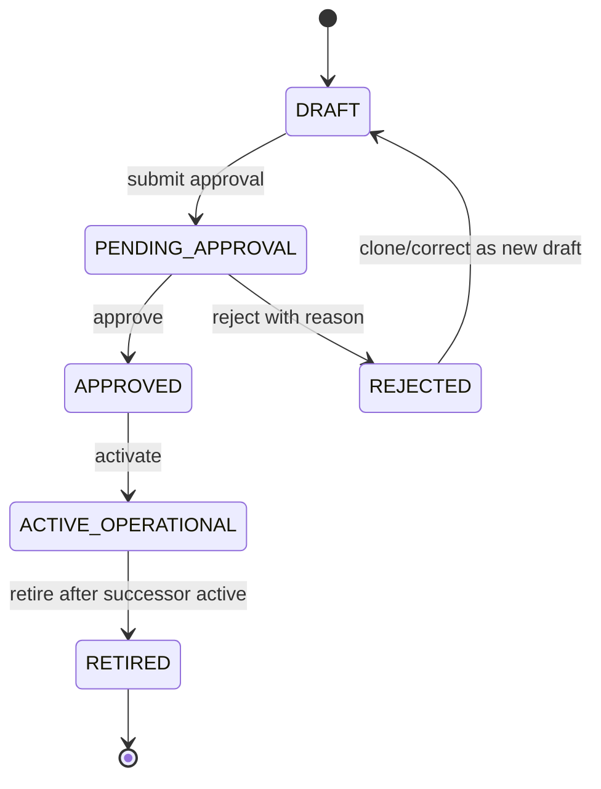
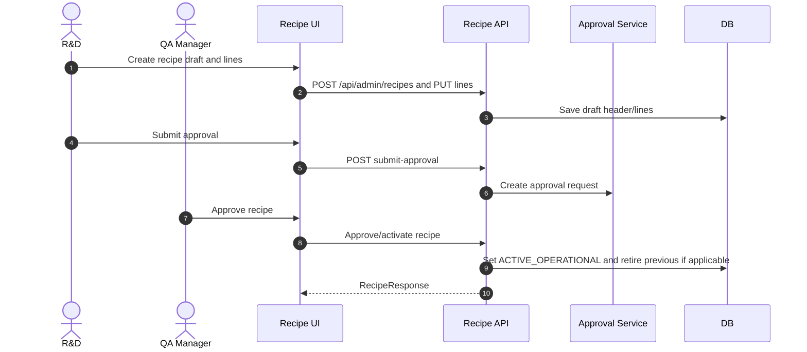

# M04 SKU Ingredient Recipe

## 1. Mục đích

SKU Ingredient Recipe quản lý SKU baseline, ingredient master, recipe versioning, 4 recipe groups và active operational recipe version dùng để snapshot vào production order. Module này là nguồn sự thật cho công thức vận hành G1 (`formula_kind = PILOT_PERCENT_BASED`, anchor + ratio cho giai đoạn pilot) và G2 (`formula_kind = FIXED_QUANTITY_BATCH`, lượng cố định cho mẻ chuẩn 400 ở giai đoạn production), cùng các version tương lai G3/G4. G1 và G2 có thể coexist `ACTIVE_OPERATIONAL` cho cùng SKU trong giai đoạn chuyển giao pilot → production; planner phải chọn rõ `formula_version` + `formula_kind` khi tạo Production Order. Production order cũ phải giữ snapshot lịch sử bất biến.

## 2. Boundary

| In scope                                                                                                                                               | Out of scope                                                                                                               |
| ------------------------------------------------------------------------------------------------------------------------------------------------------ | -------------------------------------------------------------------------------------------------------------------------- |
| SKU master, ingredient master/alias, recipe header/version, recipe lines, recipe approval/activation, active recipe config, production snapshot source | Production execution, material issue decrement, raw material lot QC, costing, sales catalog, CRM/product marketing content |

## 3. Owner

| Owner type       | Role                          |
| ---------------- | ----------------------------- |
| Business owner   | R&D / Operations Owner        |
| Product/BA owner | BA phụ trách catalog/recipe   |
| Technical owner  | Backend Lead / DBA            |
| QA owner         | QA recipe/versioning reviewer |

## 4. Chức năng

| function_id | Function               | Description                                                                                                                                                                                                                                                                                                                      | Priority |
| ----------- | ---------------------- | -------------------------------------------------------------------------------------------------------------------------------------------------------------------------------------------------------------------------------------------------------------------------------------------------------------------------------- | -------- |
| M04-F01     | SKU master             | Quản lý SKU code, display/public name, status, category.                                                                                                                                                                                                                                                                         | P0       |
| M04-F02     | Ingredient master      | Quản lý ingredient code, UOM, type, active status, alias.                                                                                                                                                                                                                                                                        | P0       |
| M04-F03     | Recipe draft           | Tạo recipe version draft theo SKU, gồm `formula_kind` (PILOT_PERCENT_BASED hoặc FIXED_QUANTITY_BATCH) và anchor metadata cho PILOT (`anchor_ingredient_id`, `anchor_baseline_quantity`, `anchor_uom_code`, `anchor_ratio_percent`).                                                                                              | P0       |
| M04-F04     | Recipe lines           | Quản lý line theo 4 group chuẩn. PILOT line dùng `ratio_percent` (SUM ≈ 100%) + `is_anchor` flag; FIXED line dùng `quantity_per_batch_400`. UOM, prep note, usage role bắt buộc.                                                                                                                                                 | P0       |
| M04-F05     | Approval/activation    | Submit, approve, activate, retire recipe version. Activate kiểm cùng `(sku_id, formula_kind)` không có active khác.                                                                                                                                                                                                              | P0       |
| M04-F06     | Snapshot provider      | Cung cấp active approved recipe lines + metadata (`formula_kind`, anchor) cho production order snapshot. PILOT trả ratio + anchor để PO recompute theo `anchor_quantity_input`; FIXED trả `quantity_per_batch_400` để PO nhân với `batch_size`. Thiếu active recipe theo `(sku_id, formula_kind)` trả `ACTIVE_RECIPE_NOT_FOUND`. | P0       |
| M04-F07     | Future version support | Hỗ trợ G2/G3/... và coexistence pilot↔production; không sửa lịch sử PO cũ.                                                                                                                                                                                                                                                       | P0       |

## 5. Business Rules

| rule_id    | Rule                                                                                                                                                                                                                                                                                                                                                                                                                                                                                                                                                                                                                                                                  | Affected data           | Affected API                        | Affected UI           | Validation                                         | Exception                                                          | Test            |
| ---------- | --------------------------------------------------------------------------------------------------------------------------------------------------------------------------------------------------------------------------------------------------------------------------------------------------------------------------------------------------------------------------------------------------------------------------------------------------------------------------------------------------------------------------------------------------------------------------------------------------------------------------------------------------------------------- | ----------------------- | ----------------------------------- | --------------------- | -------------------------------------------------- | ------------------------------------------------------------------ | --------------- |
| BR-M04-001 | G1 (`formula_kind = PILOT_PERCENT_BASED`) là pilot operational baseline cho go-live. G2 (`formula_kind = FIXED_QUANTITY_BATCH`) là production baseline. Cả hai có thể coexist `ACTIVE_OPERATIONAL` cho cùng SKU trong giai đoạn chuyển giao; planner pick `formula_version` + `formula_kind` khi tạo PO. G0 cấm vận hành.                                                                                                                                                                                                                                                                                                                                             | `op_production_recipe`  | `/api/admin/recipes/*`              | SCR-RECIPE            | version/kind/status/effective date                 | Non-operational version blocked                                    | TC-M04-REC-004  |
| BR-M04-002 | Recipe line chỉ dùng 4 group: `SPECIAL_SKU_COMPONENT`, `NUTRITION_BASE`, `BROTH_EXTRACT`, `SEASONING_FLAVOR`.                                                                                                                                                                                                                                                                                                                                                                                                                                                                                                                                                         | `op_recipe_ingredient`  | `PUT /api/admin/recipes/{id}/lines` | SCR-RECIPE-LINES      | group enum check                                   | `INVALID_RECIPE_GROUP`                                             | TC-UI-REC-002   |
| BR-M04-003 | Chỉ một active operational recipe per `(sku_id, formula_kind)` tại một thời điểm; G1 PILOT và G2 FIXED có thể cùng active cho cùng SKU.                                                                                                                                                                                                                                                                                                                                                                                                                                                                                                                               | `op_production_recipe`  | activate endpoint                   | SCR-RECIPE            | partial unique active per `(sku_id, formula_kind)` | `ACTIVE_RECIPE_CONFLICT`                                           | TC-M04-REC-006  |
| BR-M04-004 | Active recipe phải approved và effective.                                                                                                                                                                                                                                                                                                                                                                                                                                                                                                                                                                                                                             | recipe status/effective | activate endpoint                   | SCR-RECIPE            | status/date check                                  | `RECIPE_NOT_APPROVED`                                              | TC-UI-REC-003   |
| BR-M04-005 | Production order snapshot không đổi khi recipe version sau này thay đổi.                                                                                                                                                                                                                                                                                                                                                                                                                                                                                                                                                                                              | PO snapshot tables      | M07 create PO                       | SCR-PROD-ORDER-DETAIL | snapshot immutable                                 | correction only                                                    | TC-UI-PO-002    |
| BR-M04-006 | Ingredient inactive không được thêm vào recipe draft mới.                                                                                                                                                                                                                                                                                                                                                                                                                                                                                                                                                                                                             | ingredient refs         | recipe line API                     | SCR-RECIPE-LINES      | active ingredient check                            | reactivate or choose alternative                                   | TC-M04-ING-002  |
| BR-M04-007 | G0 chỉ là research/baseline context, không được seed hoặc activate như operational formula.                                                                                                                                                                                                                                                                                                                                                                                                                                                                                                                                                                           | recipe seed/version     | recipe seed/activate                | SCR-RECIPE            | version policy check                               | `NON_OPERATIONAL_RECIPE_VERSION`                                   | TC-M04-REC-007  |
| BR-M04-008 | Production snapshot phải capture `formula_version`, `formula_kind_snapshot`, `recipe_line_group_code`, ingredient code/display name, UOM, prep note, usage role và snapshot quantity theo branch: PILOT → `is_anchor`, anchor metadata (`anchor_ingredient_id_snapshot`, `anchor_quantity_input`, `anchor_uom_code_snapshot`, `anchor_ratio_percent_snapshot`, `total_batch_quantity`), `ratio_percent`, `snapshot_quantity = ratio_percent / 100 × total_batch_quantity`, `snapshot_basis = PILOT_RATIO_OF_ANCHOR`; FIXED → `batch_size`, `quantity_per_batch_400`, `snapshot_quantity = quantity_per_batch_400 × batch_size`, `snapshot_basis = FIXED_PER_BATCH_N`. | recipe snapshot tables  | M07 create PO                       | SCR-PROD-ORDER-DETAIL | snapshot completeness theo branch                  | `SNAPSHOT_INCOMPLETE`, `PRODUCTION_ORDER_ANCHOR_QUANTITY_REQUIRED` | TC-M04-SNAP-001 |

## 6. Tables

| table                        | Type             | Purpose                                                      | Ownership | Notes                                                                                                                                                                                                                     |
| ---------------------------- | ---------------- | ------------------------------------------------------------ | --------- | ------------------------------------------------------------------------------------------------------------------------------------------------------------------------------------------------------------------------- |
| `ref_sku`                    | master           | SKU master.                                                  | M04       | 20 baseline SKU seed; supports future additions by approval.                                                                                                                                                              |
| `ref_ingredient`             | master           | Ingredient master.                                           | M04       | Includes required baseline ingredients from source.                                                                                                                                                                       |
| `ref_ingredient_alias`       | mapping          | Alias/search names.                                          | M04       | Optional but useful for import.                                                                                                                                                                                           |
| `ref_recipe_line_group`      | master/config    | 4 recipe groups.                                             | M04       | Seed locked values.                                                                                                                                                                                                       |
| `op_production_recipe`       | versioned master | Recipe header/version/status/`formula_kind`/anchor metadata. | M04       | Includes `formula_version` + `formula_kind`; G1 PILOT_PERCENT_BASED + G2 FIXED_QUANTITY_BATCH coexist được; G0 not active operational. PILOT có `anchor_ingredient_id/baseline_quantity/uom_code/ratio_percent` NOT NULL. |
| `op_recipe_ingredient`       | versioned detail | Recipe lines.                                                | M04       | Includes `recipe_line_group_code`, `is_anchor`, UOM, prep note, usage role. PILOT line dùng `ratio_percent` (SUM ≈ 100%); FIXED line dùng `quantity_per_batch_400`.                                                       |
| `ref_sku_operational_config` | mapping/config   | Active recipe/config per SKU.                                | M04/M07   | Avoid duplicate active truth.                                                                                                                                                                                             |

## 7. APIs

| method | path                                            | Purpose                    | Permission                | Idempotency | Request                    | Response                  | Test           |
| ------ | ----------------------------------------------- | -------------------------- | ------------------------- | ----------- | -------------------------- | ------------------------- | -------------- |
| GET    | `/api/admin/skus`                               | List SKU                   | `SKU_VIEW`                | No          | filters                    | `SkuListResponse`         | TC-M04-SKU-001 |
| POST   | `/api/admin/skus`                               | Create SKU after go-live   | `SKU_CREATE`              | Yes         | `SkuCreateRequest`         | `SkuResponse`             | TC-M04-SKU-001 |
| GET    | `/api/admin/ingredients`                        | List ingredients           | `INGREDIENT_VIEW`         | No          | filters                    | `IngredientListResponse`  | TC-M04-ING-002 |
| POST   | `/api/admin/ingredients`                        | Create ingredient          | `INGREDIENT_CREATE`       | Yes         | `IngredientCreateRequest`  | `IngredientResponse`      | TC-M04-ING-003 |
| POST   | `/api/admin/ingredients/{ingredientId}/aliases` | Add alias                  | `INGREDIENT_ALIAS_CREATE` | Yes         | `IngredientAliasRequest`   | `IngredientResponse`      | TC-M04-ING-002 |
| GET    | `/api/admin/recipes`                            | List recipe versions       | `RECIPE_VIEW`             | No          | filters                    | `RecipeListResponse`      | TC-M04-REC-004 |
| POST   | `/api/admin/recipes`                            | Create recipe draft        | `RECIPE_CREATE`           | Yes         | `RecipeCreateRequest`      | `RecipeResponse`          | TC-M04-REC-004 |
| PUT    | `/api/admin/recipes/{recipeId}/lines`           | Replace draft recipe lines | `RECIPE_UPDATE_LINES`     | Yes         | `RecipeLinesUpsertRequest` | `RecipeResponse`          | TC-M04-REC-005 |
| POST   | `/api/admin/recipes/{recipeId}/submit-approval` | Submit approval            | `RECIPE_SUBMIT_APPROVAL`  | Yes         | `SubmitApprovalRequest`    | `ApprovalRequestResponse` | TC-M04-REC-006 |
| POST   | `/api/admin/recipes/{recipeId}/activate`        | Activate approved recipe   | `RECIPE_ACTIVATE`         | Yes         | `ActivateRecipeRequest`    | `RecipeResponse`          | TC-M04-REC-006 |

## 8. UI Screens

| screen_id        | Route                                    | Purpose             | Primary actions                                 | Permission                            |
| ---------------- | ---------------------------------------- | ------------------- | ----------------------------------------------- | ------------------------------------- |
| SCR-SKU          | `/admin/catalog/skus`                    | SKU registry        | create, edit, deactivate, open recipes          | `sku.read`, `sku.write`               |
| SCR-INGREDIENT   | `/admin/catalog/ingredients`             | Ingredient registry | create, edit, deactivate, alias                 | `ingredient.read`, `ingredient.write` |
| SCR-RECIPE       | `/admin/catalog/recipes`                 | Recipe versions     | create draft, submit, approve, activate, retire | `recipe.read`, command permissions    |
| SCR-RECIPE-LINES | `/admin/catalog/recipes/:recipeId/lines` | Recipe line editor  | add/edit/remove/reorder draft lines             | `recipe.write`                        |

## 9. Roles / Permissions

| Role                | Permissions/actions                                       | Notes                            |
| ------------------- | --------------------------------------------------------- | -------------------------------- |
| R&D                 | `RECIPE_CREATE`, `RECIPE_UPDATE_LINES`, `INGREDIENT_VIEW` | Draft/maintain recipe.           |
| QA Manager          | `RECIPE_APPROVE`, `INGREDIENT_VIEW`                       | Review and approve.              |
| Production Manager  | `RECIPE_VIEW`, optional approval                          | Uses recipe as production input. |
| Master Data Steward | `SKU_CREATE`, `INGREDIENT_CREATE`                         | Master data maintenance.         |
| Admin               | Full with audit                                           | No silent activation.            |

## 10. Workflow

| workflow_id     | Trigger                             | Steps                                                        | Output                | Related docs                                 |
| --------------- | ----------------------------------- | ------------------------------------------------------------ | --------------------- | -------------------------------------------- |
| WF-M04-RECIPE   | Recipe creation                     | Create draft -> add lines -> submit -> approve -> activate   | Active recipe version | `workflows/06_APPROVAL_WORKFLOWS.md`         |
| WF-M04-SNAPSHOT | Production order create             | M07 requests active recipe -> M04 returns immutable line set | PO snapshot input     | `workflows/05_CANONICAL_OPERATIONAL_FLOW.md` |
| WF-M04-SEED     | Seed baseline SKU/ingredient/recipe | Load 20 SKU/ingredients/recipe lines -> validate             | G1 readiness          | `database/07_SEED_DATA_SPECIFICATION.md`     |

## 11. State Machine

## 12. Sequence / Activity Flow

## 13. Input / Output

| Type  | Input                                           | Output                                |
| ----- | ----------------------------------------------- | ------------------------------------- |
| UI    | SKU, ingredient, recipe header, recipe lines    | Approved/active recipe version        |
| API   | Recipe create/line/approval/activation requests | Recipe response and approval response |
| Event | Recipe activated                                | Production planning readiness         |

## 14. Events

| event                | Producer | Consumer          | Payload summary                         |
| -------------------- | -------- | ----------------- | --------------------------------------- |
| `SKU_CREATED`        | M04      | M15/M14 if needed | sku id/code                             |
| `INGREDIENT_CREATED` | M04      | M06/M08           | ingredient id/code/UOM                  |
| `RECIPE_SUBMITTED`   | M04      | Approval queue    | recipe id/version                       |
| `RECIPE_ACTIVATED`   | M04      | M07/M15           | sku, recipe id, version, effective date |
| `RECIPE_RETIRED`     | M04      | Audit/reporting   | recipe id/version                       |

## 15. Audit Log

| action                 | Audit payload                           | Retention/sensitivity |
| ---------------------- | --------------------------------------- | --------------------- |
| recipe line change     | recipe id, before/after lines, actor    | High retention        |
| approve/reject recipe  | approver, decision, reason              | High retention        |
| activate/retire recipe | version, effective date, old/new active | High retention        |
| ingredient/SKU change  | before/after master fields              | Operational audit     |

## 16. Validation Rules

| validation_id | Rule                                                                                                                                                     | Error code                                          | Blocking |
| ------------- | -------------------------------------------------------------------------------------------------------------------------------------------------------- | --------------------------------------------------- | -------- |
| VAL-M04-001   | SKU code unique                                                                                                                                          | `DUPLICATE_KEY`                                     | Yes      |
| VAL-M04-002   | Ingredient code unique and active for new line                                                                                                           | `VALIDATION_FAILED`                                 | Yes      |
| VAL-M04-003   | Recipe group must be one of 4 required groups                                                                                                            | `INVALID_RECIPE_GROUP`                              | Yes      |
| VAL-M04-004   | PILOT non-anchor line: `ratio_percent > 0`. FIXED line: `quantity_per_batch_400 > 0`.                                                                    | `VALIDATION_FAILED`                                 | Yes      |
| VAL-M04-005   | Activate only approved/effective recipe                                                                                                                  | `RECIPE_NOT_APPROVED`                               | Yes      |
| VAL-M04-006   | Only one active operational recipe per `(sku_id, formula_kind)`                                                                                          | `ACTIVE_RECIPE_CONFLICT`                            | Yes      |
| VAL-M04-007   | Non-operational recipe version cannot enter production flow                                                                                              | `NON_OPERATIONAL_RECIPE_VERSION`                    | Yes      |
| VAL-M04-008   | G0 cannot be seeded/activated as active operational formula                                                                                              | `NON_OPERATIONAL_RECIPE_VERSION`                    | Yes      |
| VAL-M04-009   | Active recipe snapshot source missing or incomplete                                                                                                      | `ACTIVE_RECIPE_NOT_FOUND`, `SNAPSHOT_INCOMPLETE`    | Yes      |
| VAL-M04-010   | PILOT recipe phải có đúng 1 line `is_anchor = true` trùng `recipe.anchor_ingredient_id`.                                                                 | `RECIPE_ANCHOR_REQUIRED`, `RECIPE_ANCHOR_DUPLICATE` | Yes      |
| VAL-M04-011   | PILOT recipe `SUM(ratio_percent) ∈ [99.95, 100.05]` per `recipe_id`.                                                                                     | `RECIPE_RATIO_SUM_INVALID`                          | Yes      |
| VAL-M04-012   | `formula_kind` phải thuộc `{PILOT_PERCENT_BASED, FIXED_QUANTITY_BATCH}`; PILOT yêu cầu anchor metadata NOT NULL > 0; FIXED yêu cầu anchor metadata NULL. | `FORMULA_KIND_INVALID`                              | Yes      |

## 17. Exception Flow

| exception             | Rule                                              | Recovery                                                   |
| --------------------- | ------------------------------------------------- | ---------------------------------------------------------- |
| reject recipe         | Reason required; rejected version remains history | Clone/correct as new draft                                 |
| retire active recipe  | Must not alter historical PO snapshots            | Activate successor then retire                             |
| ingredient correction | Do not rewrite PO snapshots                       | Update master for future only; historical snapshot remains |
| active conflict       | Block activation                                  | Resolve current active version lifecycle                   |

## 18. Test Cases

| test_id          | Scenario                                                                                                                                                                                                                                                                                                                                                                         | Expected result                                                                                                                   | Priority |
| ---------------- | -------------------------------------------------------------------------------------------------------------------------------------------------------------------------------------------------------------------------------------------------------------------------------------------------------------------------------------------------------------------------------- | --------------------------------------------------------------------------------------------------------------------------------- | -------- |
| TC-M04-SKU-001   | SKU create/list                                                                                                                                                                                                                                                                                                                                                                  | Unique active SKU visible                                                                                                         | P0       |
| TC-M04-ING-002   | Ingredient list/alias                                                                                                                                                                                                                                                                                                                                                            | Ingredient searchable and UOM valid                                                                                               | P0       |
| TC-M04-REC-004   | Create recipe draft                                                                                                                                                                                                                                                                                                                                                              | Draft saved, invalid version blocked                                                                                              | P0       |
| TC-M04-REC-005   | Replace recipe lines with invalid group                                                                                                                                                                                                                                                                                                                                          | `INVALID_RECIPE_GROUP`                                                                                                            | P0       |
| TC-M04-REC-006   | Approve/activate recipe                                                                                                                                                                                                                                                                                                                                                          | One active recipe per SKU                                                                                                         | P0       |
| TC-M04-REC-007   | Attempt to activate/seed G0 operationally                                                                                                                                                                                                                                                                                                                                        | Blocked                                                                                                                           | P0       |
| TC-M04-SNAP-001  | Snapshot provider returns full recipe metadata theo branch: PILOT trả `formula_kind=PILOT_PERCENT_BASED`, anchor metadata, ratio_percent từng line, snapshot_quantity tính từ `anchor_quantity_input`; FIXED trả `formula_kind=FIXED_QUANTITY_BATCH`, `batch_size`, `quantity_per_batch_400` từng line, snapshot_quantity = qty × batch_size. Cả hai branch đều có 4 group code. | P0                                                                                                                                |
| TC-M04-PILOT-001 | PILOT recipe approve khi `SUM(ratio_percent) = 100% ± 0.05` và đúng 1 anchor                                                                                                                                                                                                                                                                                                     | Approve OK; sai SUM trả `RECIPE_RATIO_SUM_INVALID`; thiếu/duplicate anchor trả `RECIPE_ANCHOR_REQUIRED`/`RECIPE_ANCHOR_DUPLICATE` | P0       |
| TC-M04-COEX-001  | G1 PILOT và G2 FIXED đồng thời `ACTIVE_OPERATIONAL` cho cùng SKU                                                                                                                                                                                                                                                                                                                 | Activate G2 không retire G1; planner thấy cả 2 trong dropdown create PO                                                           | P0       |
| TC-UI-PO-002     | Later recipe change does not alter PO snapshot                                                                                                                                                                                                                                                                                                                                   | Historical snapshot unchanged                                                                                                     | P0       |

## 19. Done Gate

- 20 SKU baseline seed exists and validates.
- Ingredient master includes required baseline ingredients and active UOM.
- Mỗi SKU baseline có active G1 (`formula_kind = PILOT_PERCENT_BASED`) hoặc G2 (`formula_kind = FIXED_QUANTITY_BATCH`); coexistence được phép. Pilot baseline go-live require G1 PILOT.
- G0 is not seeded or activated as an operational recipe.
- Recipe lines use exactly 4 groups.
- PILOT recipes có đúng 1 anchor line, `SUM(ratio_percent) ≈ 100%`.
- Snapshot provider returns `formula_version`, `formula_kind`, anchor (PILOT) hoặc `quantity_per_batch_400` (FIXED) cho mỗi line.
- Approval/activation/retire lifecycle works.
- Production order can snapshot recipe theo branch và keep history immutable.
- Negative tests block non-operational version, invalid groups, missing anchor, ratio sum invalid.

## 20. Risks

| risk                                         | Impact                        | Mitigation                                                   |
| -------------------------------------------- | ----------------------------- | ------------------------------------------------------------ |
| Recipe line source data incomplete           | Production blocked            | Seed validation and owner sign-off.                          |
| Active version overlap                       | Wrong production snapshot     | Unique active constraint and activation transaction.         |
| Ingredient UOM drift                         | Wrong issue/ledger quantities | Snapshot UOM and validate line UOM.                          |
| SKU baseline treated as permanent hard limit | Future SKU blocked            | Treat 20 SKU as go-live baseline, allow future approved SKU. |

## 21. Phase triển khai

| Phase/CODE | Scope in phase                  | Dependency                    | Done gate                        |
| ---------- | ------------------------------- | ----------------------------- | -------------------------------- |
| MX-GATE-G1 | SKU/ingredient/recipe readiness | CODE01/CODE02 data foundation | G1 active recipes ready          |
| CODE03     | Production snapshot source      | M07/M08                       | PO snapshots active recipe lines |
| CODE17     | Seed close-out validation       | All                           | Seed and smoke pass              |
