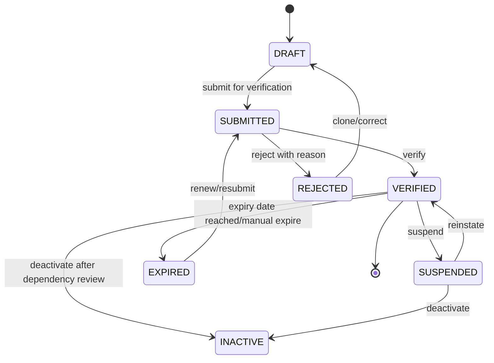
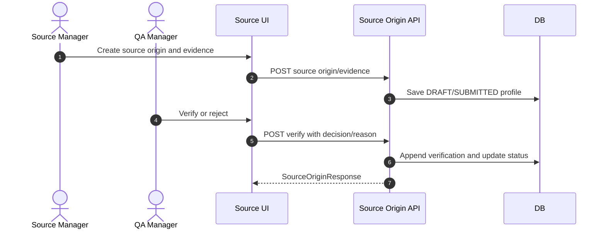

# M05 Source Origin

## 1. Mục đích

Source Origin quản lý vùng nguồn, hồ sơ nguồn, evidence và verification trước khi raw material được đưa vào chuỗi vận hành. Module này tạo dữ liệu nền cho traceability và public origin summary, nhưng không sở hữu raw intake, QC hay inventory.

## 2. Boundary

| In scope | Out of scope |
|---|---|
| Source zone, source origin, evidence, verification, source status, public-safe origin summary | Supplier master chi tiết, raw material receipt/lot, QC inspection, public trace projection cuối cùng |

## 3. Owner

| Owner type | Role |
|---|---|
| Business owner | Source/Operations Owner |
| Product/BA owner | BA phụ trách source origin |
| Technical owner | Backend Lead / DBA |
| QA owner | QA Manager phụ trách verification |

## 4. Chức năng

| function_id | Function | Description | Priority |
|---|---|---|---|
| M05-F01 | Source zone registry | Tạo/sửa/deactivate vùng nguồn. | P0 |
| M05-F02 | Source origin registry | Tạo hồ sơ nguồn liên kết zone/supplier/evidence. | P0 |
| M05-F03 | Evidence management | Lưu evidence phục vụ verification. | P0 |
| M05-F04 | Verification | QA verify/reject/suspend source origin. | P0 |
| M05-F05 | Public origin summary | Quản lý text public-safe nếu owner cho phép public trace hiển thị. | P1 |

## 5. Business Rules

| rule_id | Rule | Affected data | Affected API | Affected UI | Validation | Exception | Test |
|---|---|---|---|---|---|---|---|
| BR-M05-001 | Source origin required by intake policy must be `VERIFIED` before raw intake. | `op_source_origin` | raw intake create | SCR-RAW-INTAKES | status check | reject intake | TC-OP-SRC-001 |
| BR-M05-002 | Reject verification requires reason. | `op_source_origin_verification` | verify/reject API | SCR-SOURCE-ORIGINS | reason required | `REASON_REQUIRED` | TC-UI-SRC-002 |
| BR-M05-003 | Source zone cannot deactivate while active source origin depends on it. | `op_source_zone` | source zone update | SCR-SOURCE-ZONES | dependency check | keep active | TC-UI-SRC-001 |
| BR-M05-004 | Public origin summary must not include internal supplier/personnel/cost fields. | public summary | public trace preview | SCR-PUBLIC-TRACE-PREVIEW | field policy | block preview | TC-UI-PTR-001 |
| BR-M05-005 | `EXPIRED`, `INACTIVE` or `SUSPENDED` source origin cannot be used for new raw intake. | `op_source_origin` | raw intake create | SCR-RAW-INTAKES | status check | reactivate/reverify | TC-OP-SRC-002 |

## 6. Tables

| table | Type | Purpose | Ownership | Notes |
|---|---|---|---|---|
| `op_source_zone` | master | Source zone catalog. | M05 | Referenced by source origin. |
| `op_source_origin` | master/workflow | Source origin profile and status. | M05 | Status: `DRAFT`, `SUBMITTED`, `VERIFIED`, `REJECTED`, `SUSPENDED`, `EXPIRED`, `INACTIVE`. |
| `op_source_origin_evidence` | history/file-ref | Evidence references. | M05 | Store file object key/URI, checksum, MIME type and retention class; no blob payload in operational table. |
| `op_source_origin_verification` | audit/history | Verification decisions. | M05 | Append-only verification history. |

## 7. APIs

| method | path | Purpose | Permission | Idempotency | Request | Response | Test |
|---|---|---|---|---|---|---|---|
| GET | `/api/admin/source-zones` | List source zones | `SOURCE_ZONE_VIEW` | No | filters | `SourceZoneListResponse` | TC-M05-SRC-001 |
| POST | `/api/admin/source-zones` | Create source zone | `SOURCE_ZONE_CREATE` | Yes | `SourceZoneCreateRequest` | `SourceZoneResponse` | TC-M05-SRC-001 |
| GET | `/api/admin/source-origins` | List source origins | `SOURCE_ORIGIN_VIEW` | No | filters | `SourceOriginListResponse` | TC-M05-SRC-002 |
| POST | `/api/admin/source-origins` | Create source origin | `SOURCE_ORIGIN_CREATE` | Yes | `SourceOriginCreateRequest` | `SourceOriginResponse` | TC-M05-SRC-002 |
| POST | `/api/admin/source-origins/{sourceOriginId}/evidence` | Add evidence | `SOURCE_ORIGIN_EVIDENCE_ADD` | Yes | `EvidenceCreateRequest` | `SourceOriginResponse` | TC-M05-SRC-002 |
| POST | `/api/admin/source-origins/{sourceOriginId}/verify` | Verify/reject source origin | `SOURCE_ORIGIN_VERIFY` | Yes | `VerifySourceOriginRequest` | `SourceOriginResponse` | TC-M05-SRC-002 |
| POST | `/api/admin/source-origins/{sourceOriginId}/suspend` | Suspend source origin | `SOURCE_ORIGIN_VERIFY` | Yes | `SuspendSourceOriginRequest` | `SourceOriginResponse` | TC-M05-SRC-003 |
| POST | `/api/admin/source-origins/{sourceOriginId}/expire` | Mark source origin expired | `SOURCE_ORIGIN_VERIFY` | Yes | `ExpireSourceOriginRequest` | `SourceOriginResponse` | TC-M05-SRC-003 |

## 8. UI Screens

| screen_id | Route | Purpose | Primary actions | Permission |
|---|---|---|---|---|
| SCR-SOURCE-ZONES | `/admin/source-origin/zones` | Source zone management | create, edit, deactivate | `source_zone.read`, `source_zone.write` |
| SCR-SOURCE-ORIGINS | `/admin/source-origin/origins` | Source origin verification | create, evidence, verify, reject | `source_origin.read`, `source_origin.verify` |
| SCR-PUBLIC-TRACE-PREVIEW | `/admin/traceability/public-preview` | Preview source fields in public trace | preview, flag violation | `public_trace.preview` |

## 9. Roles / Permissions

| Role | Permissions/actions | Notes |
|---|---|---|
| Source Manager | Create/update source zone/origin/evidence | Cannot verify unless also granted QA permission. |
| QA Manager | Verify/reject/suspend source origin | Reject reason required. |
| Admin | Full with audit | No silent deletion. |
| Trace Operator | Read public-safe source summary | Read-only. |

## 10. Workflow

| workflow_id | Trigger | Steps | Output | Related docs |
|---|---|---|---|---|
| WF-M05-VERIFY | Source submitted | Create source -> attach evidence -> submit -> verify/reject | `VERIFIED` or `REJECTED` source origin | `workflows/05_CANONICAL_OPERATIONAL_FLOW.md` |
| WF-M05-PUBLIC | Public summary update | Validate text -> preview policy -> approve if needed | Public-safe origin summary | `ui/08_FRONTEND_API_CLIENT_CONTRACT.md` |

## 11. State Machine

## 12. Sequence / Activity Flow

## 13. Input / Output

| Type | Input | Output |
|---|---|---|
| UI | zone, origin, supplier/source fields, evidence, reason | verified/rejected source origin |
| API | Source origin/evidence/verify requests | SourceOriginResponse |
| Event | Verification decision | Source readiness/audit |

## 14. Events

| event | Producer | Consumer | Payload summary |
|---|---|---|---|
| `SOURCE_ORIGIN_CREATED` | M05 | Audit/M15 | origin id/code/status |
| `SOURCE_ORIGIN_VERIFIED` | M05 | M06/M12 | origin id, zone, public summary flag |
| `SOURCE_ORIGIN_REJECTED` | M05 | Audit/UI | origin id, reason |
| `SOURCE_ORIGIN_SUSPENDED` | M05 | M06/M12/M13 | origin id, reason |
| `SOURCE_ORIGIN_EXPIRED` | M05 | M06/M12/M15 | origin id, expiry reason |
| `SOURCE_ORIGIN_INACTIVATED` | M05 | M06/M12/M15 | origin id, dependency review ref |

## 15. Audit Log

| action | Audit payload | Retention/sensitivity |
|---|---|---|
| create/update source origin | before/after, actor, evidence refs | Operational audit |
| verify/reject/suspend | decision, reason, actor, timestamp | High retention |
| public summary change | before/after public text, policy result | Public-boundary sensitive |

## 16. Validation Rules

| validation_id | Rule | Error code | Blocking |
|---|---|---|---|
| VAL-M05-001 | Source zone code unique | `DUPLICATE_KEY` | Yes |
| VAL-M05-002 | Verify requires submitted state | `STATE_CONFLICT` | Yes |
| VAL-M05-003 | Reject requires reason | `REASON_REQUIRED` | Yes |
| VAL-M05-004 | Public summary cannot contain forbidden internal data | `PUBLIC_FIELD_POLICY_VIOLATION` | Yes |
| VAL-M05-005 | Raw intake cannot use unverified required origin | `SOURCE_ORIGIN_NOT_VERIFIED` | Yes |
| VAL-M05-006 | Raw intake cannot use expired/inactive/suspended source origin | `SOURCE_ORIGIN_NOT_VERIFIED` | Yes |

## 17. Exception Flow

| exception | Rule | Recovery |
|---|---|---|
| reject | Reason required; source remains historical | Correct/clone and resubmit |
| suspend | Blocks new dependent intake where policy requires | Reinstate with reason/approval |
| correction | Do not rewrite verification history | New evidence/verification record |
| deactivate zone | Block if active origin depends on it | Migrate/deactivate dependent origins first |

## 18. Test Cases

| test_id | Scenario | Expected result | Priority |
|---|---|---|---|
| TC-UI-SRC-001 | Create/deactivate source zone | Unique zone created; dependency block works | P0 |
| TC-UI-SRC-002 | Verify/reject source origin | Verified or rejected with audit/reason | P0 |
| TC-OP-SRC-001 | Raw intake with unverified origin | Rejected | P0 |
| TC-OP-SRC-002 | Raw intake with expired/inactive/suspended origin | Rejected | P0 |
| TC-UI-PTR-001 | Public source summary has forbidden field | Preview blocked | P0 |

## 19. Done Gate

- Source zone/origin/evidence/verification schemas and APIs exist.
- Verification/reject/suspend audited.
- Raw intake can validate verified source origin.
- Public-safe origin summary policy enforced.
- UI screens cover list/detail/evidence/verification/error states.

## 20. Risks

| risk | Impact | Mitigation |
|---|---|---|
| Public origin detail not owner-approved | Public trace leakage | Keep public summary optional and whitelist-only. |
| Evidence storage policy missing | Verification incomplete | Store object reference/checksum/retention metadata in DB; binary storage provider remains infrastructure config. |
| Source/supplier overlap | Data duplication | Supplier belongs M03; verification belongs M05. |

## 21. Phase triển khai

| Phase/CODE | Scope in phase | Dependency | Done gate |
|---|---|---|---|
| CODE01 | Source zone/origin/evidence/verification | M01-M03 | Verified origin can gate raw intake |
| CODE07 | Trace/public source use | M12 | Public summary complies with field policy |
