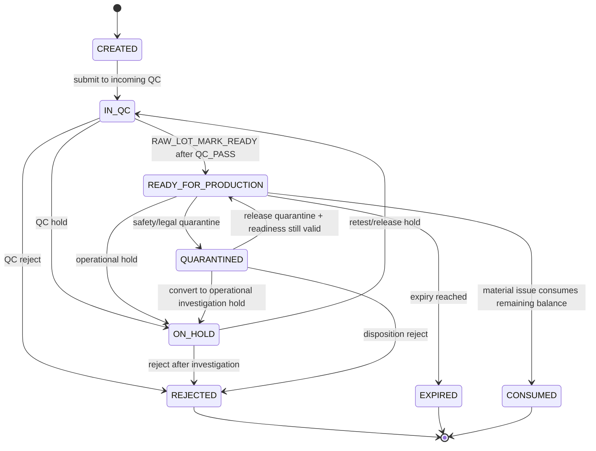
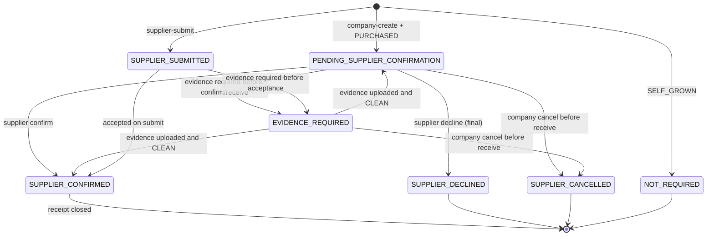
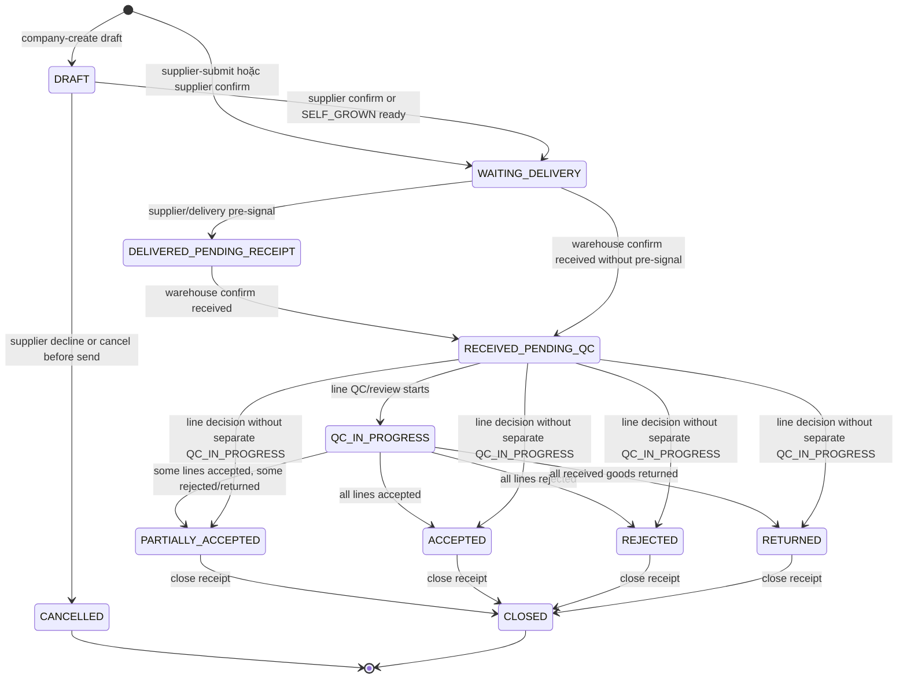

# M06 Raw Material

## 1. Mục đích

Raw Material quản lý tiếp nhận nguyên liệu, raw material receipt/item, raw material lot, readiness và incoming QC đầu vào. Module này tạo nguyên liệu đủ điều kiện để material issue, nhưng không thực hiện trừ kho sản xuất; điểm trừ kho thật nằm ở M08 Material Issue.

## 2. Boundary

| In scope                                                                                                                                                                                                                                                                      | Out of scope                                                                                                                |
| ----------------------------------------------------------------------------------------------------------------------------------------------------------------------------------------------------------------------------------------------------------------------------- | --------------------------------------------------------------------------------------------------------------------------- |
| Raw material intake, raw receipt/item, raw lot, procurement type, incoming QC link, lot readiness, **supplier collaboration pre-receipt (company-create / supplier-submit + supplier confirm/decline + evidence upload + receive→lot + line accept/reject + return + close)** | Material issue execution, production order, finished goods warehouse receipt, **supplier master (M03A)**, recipe definition |

> Supplier Collaboration extension: nguồn quyết định `docs/v2-decisions/OD-M06-SUP-COLLAB.md` (HL-SUP-001..017). M06 sở hữu transaction `op_raw_material_receipt` + evidence/feedback gắn receipt; M03A sở hữu supplier master + allowlist + supplier user.

## 3. Owner

| Owner type       | Role                         |
| ---------------- | ---------------------------- |
| Business owner   | Warehouse/Raw Material Owner |
| Product/BA owner | BA phụ trách raw material    |
| Technical owner  | Backend Lead / DBA           |
| QA owner         | QA Inspector/QA Manager      |

## 4. Chức năng

| function_id | Function                            | Description                                                                                                                                                                       | Priority |
| ----------- | ----------------------------------- | --------------------------------------------------------------------------------------------------------------------------------------------------------------------------------- | -------- |
| M06-F01     | Raw intake                          | Ghi nhận receipt nguyên liệu từ supplier/source origin.                                                                                                                           | P0       |
| M06-F02     | Raw lot creation                    | Tạo raw material lot từ intake.                                                                                                                                                   | P0       |
| M06-F03     | Procurement type rules              | Validate `SELF_GROWN`/`PURCHASED` field requirements.                                                                                                                             | P0       |
| M06-F04     | Incoming QC                         | Liên kết QC đầu vào với raw lot.                                                                                                                                                  | P0       |
| M06-F05     | Lot readiness                       | Kiểm tra lot có `lot_status = READY_FOR_PRODUCTION`, available, not held.                                                                                                         | P0       |
| M06-F06     | Lot mark ready                      | Chuyển lot sang `READY_FOR_PRODUCTION` sau khi có QC_PASS, không hold/quarantine/expired và còn balance.                                                                          | P0       |
| M06-F07     | Receipt company-create (PURCHASED)  | Procurement tạo receipt `created_by_party = COMPANY`, `raw_receipt_status = DRAFT`, `supplier_collaboration_status = PENDING_SUPPLIER_CONFIRMATION`; supplier sẽ confirm/decline. | P0       |
| M06-F08     | Receipt supplier-submit (PURCHASED) | Supplier user tạo receipt `created_by_party = SUPPLIER` ở `WAITING_DELIVERY`; bỏ qua bước confirm.                                                                                | P0       |
| M06-F09     | Supplier confirm/decline            | Supplier user confirm (→`WAITING_DELIVERY`) hoặc decline (→`SUPPLIER_DECLINED` final) với reason.                                                                                 | P0       |
| M06-F10     | Evidence upload                     | Đính kèm COA/photo/cert (`evidence_type`, `scan_status`); enforce HL-SUP-005 nếu policy yêu cầu trước receive.                                                                    | P0       |
| M06-F11     | Receive → lot                       | Warehouse confirm received quantity per line → tạo `op_raw_material_lot` (`PENDING_QC`); sum(lot_qty) ≤ received_qty.                                                             | P0       |
| M06-F12     | Line accept/reject                  | Sau receive, line có `lot_qc_status` (`PENDING_QC`/`ACCEPTED`/`REJECTED_QUALITY`/`REJECTED_QUANTITY`/`PARTIALLY_ACCEPTED`); axis độc lập với QC inspection của lot.               | P0       |
| M06-F13     | Return to supplier                  | Tạo flow EX-RECEIPT-RETURN cho line REJECTED; ghi return_qty + reason; giữ receipt RECEIVED_PENDING_QC.                                                                           | P0       |
| M06-F14     | Close receipt                       | Đóng receipt khi mọi line accepted/rejected/returned; chuyển `raw_receipt_status = CLOSED`.                                                                                       | P0       |

## 5. Business Rules

| rule_id    | Rule                                                                                                                                                                                                                                                                                                                                                                                                | Affected data                 | Affected API                       | Affected UI                             | Validation                 | Exception                                                                    | Test          |
| ---------- | --------------------------------------------------------------------------------------------------------------------------------------------------------------------------------------------------------------------------------------------------------------------------------------------------------------------------------------------------------------------------------------------------- | ----------------------------- | ---------------------------------- | --------------------------------------- | -------------------------- | ---------------------------------------------------------------------------- | ------------- |
| BR-M06-001 | Raw intake quantity phải > 0 và UOM hợp lệ.                                                                                                                                                                                                                                                                                                                                                         | receipt/item/lot              | raw intake create                  | SCR-RAW-INTAKES                         | numeric/UOM check          | reject request                                                               | TC-UI-RM-001  |
| BR-M06-002 | `SELF_GROWN` cần verified source origin; `PURCHASED` cần supplier nếu policy áp dụng.                                                                                                                                                                                                                                                                                                               | raw lot                       | raw intake create                  | SCR-RAW-INTAKES                         | field combination          | `SOURCE_ORIGIN_NOT_VERIFIED`, `SUPPLIER_REQUIRED`                            | TC-M06-RM-002 |
| BR-M06-003 | Raw lot chỉ ready cho issue khi `lot_status = READY_FOR_PRODUCTION`; `QC_PASS` chỉ là tiền điều kiện để mark ready.                                                                                                                                                                                                                                                                                 | raw lot                       | lot readiness, material issue      | SCR-RAW-LOTS                            | lot status/readiness check | `RAW_MATERIAL_LOT_NOT_READY`                                                 | TC-UI-RM-002  |
| BR-M06-004 | Incoming QC hold/reject cần note/reason.                                                                                                                                                                                                                                                                                                                                                            | QC inspection                 | raw lot QC API                     | SCR-INCOMING-QC                         | reason required            | `REASON_REQUIRED`                                                            | TC-UI-QC-001  |
| BR-M06-005 | Raw lot history append-only; correction không sửa lot issue history.                                                                                                                                                                                                                                                                                                                                | raw lot/QC                    | correction APIs                    | SCR-RAW-LOTS                            | state/history guard        | correction record                                                            | TC-OP-RM-001  |
| BR-M06-006 | Receipt với `supplier_id + ingredient_id` không có trong `op_supplier_ingredient` bị reject (HL-SUP-001). Precedence: pipeline validate THEO THỨ TỰ (1) `op_supplier.status = SUSPENDED` → reject `SUPPLIER_SUSPENDED` (BR-M03A-002), (2) allowlist `(supplier_id, ingredient_id)` active effective → reject `SUPPLIER_INGREDIENT_NOT_ALLOWED`. Allowlist không có hiệu lực với supplier SUSPENDED. | receipt + mapping             | raw intake create, supplier submit | SCR-RAW-INTAKES, SCR-SUP-PORTAL-INTAKES | allowlist check            | `SUPPLIER_INGREDIENT_NOT_ALLOWED`                                            | AC-SUP-001    |
| BR-M06-007 | Supplier-submitted receipt edit-locked sau khi supplier `WAITING_DELIVERY` hoặc company-created sau supplier confirm (HL-SUP-002).                                                                                                                                                                                                                                                                  | receipt                       | receipt update                     | SCR-SUP-PORTAL-INTAKES                  | state guard                | `SUPPLIER_EDIT_LOCKED_AFTER_CONFIRMED`                                       | AC-SUP-002    |
| BR-M06-008 | Decline là final cho receipt đó; tạo receipt mới nếu cần (HL-SUP-003).                                                                                                                                                                                                                                                                                                                              | receipt                       | supplier decline                   | SCR-SUP-PORTAL-INTAKES                  | state guard                | `SUPPLIER_DECLINED_BLOCKED`                                                  | AC-SUP-003    |
| BR-M06-009 | Receipt sau RECEIVED_PENDING_QC không sửa quantity/ingredient; chỉ accept/reject/return/close (HL-SUP-004).                                                                                                                                                                                                                                                                                         | receipt + line                | line action APIs                   | SCR-RAW-RECEIVE, SCR-RAW-LINE-QC        | state guard                | `RECEIPT_LOCKED_AFTER_RECEIVE`                                               | AC-SUP-004    |
| BR-M06-010 | Evidence required nếu policy ingredient/supplier bật `requires_evidence_before_receive`; thiếu evidence reject receive (HL-SUP-005).                                                                                                                                                                                                                                                                | evidence + receipt            | receive command                    | SCR-RAW-RECEIVE                         | policy check               | `SUPPLIER_EVIDENCE_REQUIRED`                                                 | AC-SUP-005    |
| BR-M06-011 | Evidence file phải `scan_status = CLEAN` trước khi count cho HL-SUP-005.                                                                                                                                                                                                                                                                                                                            | evidence                      | evidence upload + scan worker      | SCR-RAW-RECEIVE                         | scan gate                  | `EVIDENCE_SCAN_PENDING`, `EVIDENCE_SCAN_FAILED`, `EVIDENCE_MALWARE_DETECTED` | AC-SUP-006    |
| BR-M06-012 | Sum quantity các raw lot tạo từ 1 line ≤ `received_quantity` của line (HL-SUP-006).                                                                                                                                                                                                                                                                                                                 | lot vs line                   | receive→lot command                | SCR-RAW-RECEIVE                         | invariant check            | `LOT_QUANTITY_EXCEEDS_RECEIVED`                                              | AC-SUP-007    |
| BR-M06-013 | Sum (received + rejected_quantity + returned_quantity) per line phải khớp `expected_quantity` khi close; sai trả invariant error (HL-SUP-006).                                                                                                                                                                                                                                                      | line                          | close receipt                      | SCR-RAW-LINE-QC                         | invariant check            | `RECEIPT_QUANTITY_INVARIANT_FAILED`                                          | AC-SUP-008    |
| BR-M06-014 | Mọi route `/api/supplier/raw-material/*` scope theo `supplier_id` của session (HL-SUP-007).                                                                                                                                                                                                                                                                                                         | receipt + evidence + feedback | supplier API family                | Supplier Portal                         | scope middleware           | `SUPPLIER_SCOPE_VIOLATION`                                                   | AC-SUP-009    |

## 6. Tables

| table                              | Type               | Purpose                                                                                                          | Ownership | Notes                                                                                                                           |
| ---------------------------------- | ------------------ | ---------------------------------------------------------------------------------------------------------------- | --------- | ------------------------------------------------------------------------------------------------------------------------------- |
| `op_raw_material_receipt`          | transaction        | Raw intake header.                                                                                               | M06       | Links supplier/source.                                                                                                          |
| `op_raw_material_receipt_item`     | transaction detail | Intake ingredient/qty lines.                                                                                     | M06       | UOM/quantity captured.                                                                                                          |
| `op_raw_material_lot`              | transaction/lot    | Raw material lot identity and status.                                                                            | M06       | Includes `lot_status`: `CREATED`, `IN_QC`, `ON_HOLD`, `REJECTED`, `READY_FOR_PRODUCTION`, `CONSUMED`, `EXPIRED`, `QUARANTINED`. |
| `op_raw_material_qc_inspection`    | QC/history         | Incoming QC result.                                                                                              | M06/M09   | May normalize into `op_qc_inspection` later.                                                                                    |
| `op_raw_material_receipt_evidence` | evidence           | Tệp đính kèm receipt (COA/photo/cert) với `evidence_type`, `evidence_status`, `scan_status`, `created_by_party`. | M06       | FK `receipt_id`; metadata only, file ở object storage.                                                                          |
| `op_raw_material_receipt_feedback` | comm/log           | Hội thoại supplier↔company gắn receipt (`feedback_type`, `created_by_party`, `body`).                            | M06       | Append-only; không xóa.                                                                                                         |

> Cột mở rộng `op_raw_material_receipt`: `procurement_type`, `created_by_party`, `supplier_collaboration_status`, `raw_receipt_status`, `requires_evidence_before_receive` (snapshot policy), `closed_at`. Cột mở rộng `op_raw_material_receipt_item`: `received_quantity`, `rejected_quantity`, `returned_quantity`, `lot_qc_status`. Schema chi tiết ở `database/08_MIGRATION_STRATEGY.md` group 06A.

## 7. APIs

| method | path                                                         | Purpose                                                   | Permission                         | Idempotency | Request                         | Response                       | Test          |
| ------ | ------------------------------------------------------------ | --------------------------------------------------------- | ---------------------------------- | ----------- | ------------------------------- | ------------------------------ | ------------- |
| GET    | `/api/admin/raw-material/intakes`                            | List raw intakes                                          | `RAW_INTAKE_VIEW`                  | No          | filters                         | `RawIntakeListResponse`        | TC-M06-RM-001 |
| POST   | `/api/admin/raw-material/intakes`                            | Create/confirm raw intake                                 | `RAW_INTAKE_CREATE`                | Yes         | `RawIntakeCreateRequest`        | `RawIntakeResponse`            | TC-M06-RM-001 |
| GET    | `/api/admin/raw-material/lots`                               | List raw lots                                             | `RAW_LOT_VIEW`                     | No          | filters                         | `RawLotListResponse`           | TC-M06-RM-004 |
| GET    | `/api/admin/raw-material/lots/{lotId}/readiness`             | Check lot readiness                                       | `RAW_LOT_VIEW`                     | No          | N/A                             | `RawLotReadinessResponse`      | TC-M06-RM-004 |
| POST   | `/api/admin/raw-material/lots/{lotId}/readiness`             | Mark lot ready for production issue                       | `RAW_LOT_MARK_READY`               | Yes         | `LotReadinessTransitionRequest` | `RawLotReadinessResponse`      | TC-M06-RM-005 |
| POST   | `/api/admin/raw-material/lots/{lotId}/qc-inspections`        | Sign raw lot QC                                           | `RAW_QC_SIGN`                      | Yes         | `RawQcSignRequest`              | `RawLotResponse`               | TC-M06-QC-003 |
| GET    | `/api/admin/raw-material/intakes/{id}`                       | Get receipt detail (admin scope)                          | `RAW_INTAKE_VIEW`                  | No          | N/A                             | `RawIntakeDetailResponse`      | AC-SUP-002    |
| POST   | `/api/admin/raw-material/intakes/{id}/receive`               | Confirm received quantity per line + create lots          | `raw_intake.receive`               | Yes         | `RawIntakeReceiveRequest`       | `RawIntakeDetailResponse`      | AC-SUP-007    |
| POST   | `/api/admin/raw-material/intakes/{id}/lines/{lineId}/accept` | Mark line `ACCEPTED`                                      | `raw_intake.line.accept`           | Yes         | `LineAcceptRequest`             | `RawIntakeLineResponse`        | AC-SUP-004    |
| POST   | `/api/admin/raw-material/intakes/{id}/lines/{lineId}/reject` | Mark line `REJECTED_QUALITY`/`REJECTED_QUANTITY` + reason | `raw_intake.line.reject`           | Yes         | `LineRejectRequest`             | `RawIntakeLineResponse`        | AC-SUP-004    |
| POST   | `/api/admin/raw-material/intakes/{id}/lines/{lineId}/return` | Ghi return_quantity gửi trả supplier                      | `raw_intake.line.return`           | Yes         | `LineReturnRequest`             | `RawIntakeLineResponse`        | AC-SUP-010    |
| POST   | `/api/admin/raw-material/intakes/{id}/close`                 | Đóng receipt (`CLOSED`) khi đủ điều kiện                  | `raw_intake.close`                 | Yes         | `CloseReceiptRequest`           | `RawIntakeDetailResponse`      | AC-SUP-008    |
| POST   | `/api/admin/raw-material/intakes/{id}/evidence`              | Admin upload evidence                                     | `raw_intake.evidence.upload`       | Yes         | `EvidenceUploadRequest`         | `EvidenceResponse`             | AC-SUP-005    |
| POST   | `/api/admin/raw-material/intakes/{id}/feedback`              | Admin reply feedback                                      | `raw_intake.feedback.write`        | Yes         | `FeedbackCreateRequest`         | `FeedbackResponse`             | AC-SUP-011    |
| GET    | `/api/supplier/raw-material/intakes`                         | Supplier list scope-filtered                              | `supplier.receipt.read`            | No          | filters                         | `SupplierIntakeListResponse`   | AC-SUP-009    |
| GET    | `/api/supplier/raw-material/intakes/{id}`                    | Supplier intake detail                                    | `supplier.receipt.read`            | No          | N/A                             | `SupplierIntakeDetailResponse` | AC-SUP-009    |
| POST   | `/api/supplier/raw-material/intakes`                         | Supplier-submit receipt mới                               | `supplier.receipt.submit`          | Yes         | `SupplierIntakeSubmitRequest`   | `SupplierIntakeDetailResponse` | AC-SUP-002    |
| POST   | `/api/supplier/raw-material/intakes/{id}/confirm`            | Supplier confirm company-created receipt                  | `supplier.receipt.confirm`         | Yes         | `SupplierConfirmRequest`        | `SupplierIntakeDetailResponse` | AC-SUP-003    |
| POST   | `/api/supplier/raw-material/intakes/{id}/decline`            | Supplier decline (final)                                  | `supplier.receipt.decline`         | Yes         | `SupplierDeclineRequest`        | `SupplierIntakeDetailResponse` | AC-SUP-003    |
| POST   | `/api/supplier/raw-material/intakes/{id}/evidence`           | Supplier upload evidence                                  | `supplier.receipt.evidence.upload` | Yes         | `EvidenceUploadRequest`         | `EvidenceResponse`             | AC-SUP-005    |
| POST   | `/api/supplier/raw-material/intakes/{id}/feedback`           | Supplier post feedback                                    | `supplier.receipt.feedback.write`  | Yes         | `FeedbackCreateRequest`         | `FeedbackResponse`             | AC-SUP-011    |

## 8. UI Screens

| screen_id               | Route                                      | Purpose                                                                    | Primary actions                                                        | Permission                                                                                                                                    |
| ----------------------- | ------------------------------------------ | -------------------------------------------------------------------------- | ---------------------------------------------------------------------- | --------------------------------------------------------------------------------------------------------------------------------------------- |
| SCR-RAW-INTAKES         | `/admin/raw-material/intakes`              | Raw intake list/create                                                     | create, receive, cancel                                                | `raw_intake.read`, `raw_intake.receive`                                                                                                       |
| SCR-RAW-LOTS            | `/admin/raw-material/lots`                 | Raw lot status/readiness                                                   | view, mark ready, hold, release hold, trace                            | `raw_lot.read`, `RAW_LOT_MARK_READY`, `raw_lot.hold`                                                                                          |
| SCR-INCOMING-QC         | `/admin/qc/incoming`                       | Incoming QC                                                                | create inspection, record result                                       | `qc_inspection.result`                                                                                                                        |
| SCR-RAW-INTAKE-DETAIL   | `/admin/raw-material/intakes/{id}`         | Receipt detail (admin) gồm timeline 2 trục, evidence, feedback, line table | view, upload evidence, post feedback, navigate to receive/line-qc      | `RAW_INTAKE_VIEW`, `raw_intake.evidence.upload`, `raw_intake.feedback.write`                                                                  |
| SCR-RAW-RECEIVE         | `/admin/raw-material/intakes/{id}/receive` | Form ghi received_quantity per line + tạo lot                              | submit receive, validate evidence-required, validate sum(lot)≤received | `raw_intake.receive`                                                                                                                          |
| SCR-RAW-LINE-QC         | `/admin/raw-material/intakes/{id}/line-qc` | Bảng line accept/reject/return                                             | accept, reject with reason, return                                     | `raw_intake.line.accept`, `raw_intake.line.reject`, `raw_intake.line.return`                                                                  |
| SCR-SUP-PORTAL-INTAKES  | `/supplier/intakes`                        | Supplier portal list + detail receipt scope của mình                       | view, submit, confirm, decline, post feedback                          | `supplier.receipt.read`, `supplier.receipt.submit`, `supplier.receipt.confirm`, `supplier.receipt.decline`, `supplier.receipt.feedback.write` |
| SCR-SUP-PORTAL-EVIDENCE | `/supplier/intakes/{id}/evidence`          | Supplier upload evidence (COA/photo)                                       | upload, view scan_status                                               | `supplier.receipt.evidence.upload`                                                                                                            |

## 9. Roles / Permissions

| Role                    | Permissions/actions                                                                                     | Notes                                                                  |
| ----------------------- | ------------------------------------------------------------------------------------------------------- | ---------------------------------------------------------------------- |
| Warehouse Operator      | `RAW_INTAKE_CREATE`, `RAW_LOT_VIEW`                                                                     | Cannot sign QC.                                                        |
| QA Inspector            | `RAW_QC_SIGN`, QC read                                                                                  | Can sign incoming QC.                                                  |
| QA Manager              | QC read/hold review, `RAW_LOT_MARK_READY`                                                               | Marks ready only after QC_PASS and no blocking hold/quarantine/expiry. |
| Warehouse Manager       | Read/hold raw lots                                                                                      | Operational hold.                                                      |
| Procurement (R-OPS-MGR) | Create company-created receipt, manage supplier-ingredient mapping (qua M03A)                           | Pre-receipt block.                                                     |
| `R-SUPPLIER` (M03A)     | `supplier.receipt.read/submit/confirm/decline/evidence.upload/feedback.write` scoped theo `supplier_id` | Chỉ thấy receipt của chính mình.                                       |

## 10. Workflow

| workflow_id       | Trigger          | Steps                                                                      | Output                       | Related docs                                 |
| ----------------- | ---------------- | -------------------------------------------------------------------------- | ---------------------------- | -------------------------------------------- |
| WF-M06-INTAKE     | Material arrives | Create intake -> validate source/supplier -> create lot                    | Lot `IN_QC`                  | `workflows/05_CANONICAL_OPERATIONAL_FLOW.md` |
| WF-M06-QC         | Lot pending QC   | QC inspection -> pass/hold/reject                                          | QC result recorded           | `workflows/04_STATE_MACHINES.md`             |
| WF-M06-MARK-READY | QC passed lot    | Validate QC_PASS, balance, source, no hold/quarantine/expiry -> mark ready | Lot `READY_FOR_PRODUCTION`   | `api/03_API_REQUEST_RESPONSE_SPEC.md`        |
| WF-M06-READINESS  | M08 requests lot | Check `lot_status`, hold and balance                                       | Eligible/ineligible response | `api/03_API_REQUEST_RESPONSE_SPEC.md`        |

## 11. State Machine

### 11.1 Raw Material Lot (single-axis, không đổi)



`QC_PASS` is stored on `lot_qc_status`, not as a separate `lot_status`. If UI needs a "QC passed, waiting mark-ready" bucket, derive it from `lot_status = IN_QC` + `lot_qc_status = QC_PASS`; do not persist `QC_PASSED_WAITING_READY`. Lot reservation is handled by inventory allocation/balance, not by adding `RESERVED` to `lot_status`.

### 11.2 Raw Material Receipt — 2-axis state machine (HL-SUP-008)

Hai trục độc lập: `supplier_collaboration_status` (axis A) và `raw_receipt_status` (axis B). Trục A chỉ active khi `procurement_type = PURCHASED`; `SELF_GROWN` bypass axis A (giữ `NOT_REQUIRED`).

#### 11.2.1 Axis A — supplier_collaboration_status



#### 11.2.2 Axis B — raw_receipt_status



#### 11.2.3 Combined valid (axis A × axis B)

| created_by_party | procurement_type | Axis A start                              | Axis B start                | Terminal hợp lệ                                                      |
| ---------------- | ---------------- | ----------------------------------------- | --------------------------- | -------------------------------------------------------------------- |
| COMPANY          | PURCHASED        | `PENDING_SUPPLIER_CONFIRMATION`           | `DRAFT -> WAITING_DELIVERY` | `(SUPPLIER_CONFIRMED, CLOSED)` hoặc `(SUPPLIER_DECLINED, CANCELLED)` hoặc `(SUPPLIER_CANCELLED, CANCELLED)` |
| SUPPLIER         | PURCHASED        | `SUPPLIER_SUBMITTED → SUPPLIER_CONFIRMED` | `WAITING_DELIVERY`          | `(SUPPLIER_CONFIRMED, CLOSED)` hoặc `(SUPPLIER_CANCELLED, CANCELLED)`                                       |
| COMPANY          | SELF_GROWN       | `NOT_REQUIRED`                            | `DRAFT → WAITING_DELIVERY`  | `(NOT_REQUIRED, CLOSED)`                                             |

Enum coverage: axis A covers all 7 `supplier_collaboration_status` values and axis B covers all 11 `raw_receipt_status` values from `database/04_ENUM_REFERENCE.md`. `SUPPLIER_DECLINED` and `SUPPLIER_CANCELLED` are terminal collaboration states; after `RECEIVED_PENDING_QC`, normal cancel is blocked and the receipt must use accept/reject/return/close or correction/reversal flows.

## 12. Sequence / Activity Flow

```mermaid
sequenceDiagram
    autonumber
    actor Wh as Warehouse Operator
    actor QA as QA Inspector
    participant UI as Raw Material UI
    participant API as Raw Material API
    participant Source as Source Origin Service
    participant DB
    Wh->>UI: Create raw intake
    UI->>API: POST raw intake
    API->>Source: Validate source origin if required
    API->>DB: Create receipt only; lot waits for receive action
    QA->>UI: Sign incoming QC
    UI->>API: POST lot QC inspection
    API->>DB: Append QC result
    QA->>UI: Mark lot ready
    UI->>API: POST lot readiness with Idempotency-Key
    API->>DB: Validate QC_PASS, no hold/quarantine/expiry and set READY_FOR_PRODUCTION
    API-->>UI: RawLotResponse
```

## 13. Input / Output

| Type  | Input                                                                           | Output                                                     |
| ----- | ------------------------------------------------------------------------------- | ---------------------------------------------------------- |
| UI    | supplier/source origin, ingredient, quantity, UOM, QC result, mark-ready reason | raw intake/lot/QC/readiness status                         |
| API   | RawIntakeCreateRequest, RawQcSignRequest, LotReadinessTransitionRequest         | RawIntakeResponse, RawLotResponse, RawLotReadinessResponse |
| Event | Raw lot created/QC signed/ready                                                 | Lot readiness for material issue                           |

## 14. Events

| event                          | Producer | Consumer    | Payload summary                                     |
| ------------------------------ | -------- | ----------- | --------------------------------------------------- |
| `RAW_LOT_CREATED`              | M06      | M09/M12/M15 | lot, ingredient, source, qty                        |
| `RAW_LOT_QC_SIGNED`            | M06/M09  | M08/M12     | lot, result, inspector                              |
| `RAW_LOT_READY_FOR_PRODUCTION` | M06      | M08/M12/M15 | lot, ingredient, available balance, readiness actor |
| `RAW_LOT_HELD`                 | M06      | M08/M15     | lot, reason                                         |
| `RAW_LOT_REJECTED`             | M06      | M11/M13/M15 | lot, reason/disposition                             |

## 15. Audit Log

| action                           | Audit payload                                                 | Retention/sensitivity |
| -------------------------------- | ------------------------------------------------------------- | --------------------- |
| raw intake create/confirm/cancel | actor, supplier/source, ingredient, qty                       | Operational audit     |
| QC pass/hold/reject              | actor, lot, result, note                                      | High retention        |
| mark ready                       | actor, lot, QC ref, readiness checks, previous/new lot status | High retention        |
| hold/release hold                | reason, target lot, actor                                     | High retention        |

## 16. Validation Rules

| validation_id | Rule                                                                                  | Error code                                                                        | Blocking   |
| ------------- | ------------------------------------------------------------------------------------- | --------------------------------------------------------------------------------- | ---------- |
| VAL-M06-001   | Quantity > 0                                                                          | `VALIDATION_FAILED`                                                               | Yes        |
| VAL-M06-002   | Required source origin verified                                                       | `SOURCE_ORIGIN_NOT_VERIFIED`                                                      | Yes        |
| VAL-M06-003   | Purchased flow requires supplier if configured                                        | `SUPPLIER_REQUIRED`                                                               | Yes        |
| VAL-M06-004   | QC hold/reject requires note                                                          | `REASON_REQUIRED`                                                                 | Yes        |
| VAL-M06-005   | Only `READY_FOR_PRODUCTION` lot eligible for issue                                    | `RAW_MATERIAL_LOT_NOT_READY`                                                      | Yes in M08 |
| VAL-M06-006   | Mark ready requires QC_PASS, no hold/quarantine/expiry and positive available balance | `RAW_MATERIAL_LOT_QC_NOT_PASSED`, `LOT_QUARANTINED`, `RAW_MATERIAL_LOT_NOT_READY` | Yes        |
| VAL-M06-007   | Receipt PURCHASED phải có `(supplier_id, ingredient_id)` trong allowlist              | `SUPPLIER_INGREDIENT_NOT_ALLOWED`                                                 | Yes        |
| VAL-M06-008   | Edit receipt sau supplier confirm/`WAITING_DELIVERY` bị chặn (trừ override)           | `SUPPLIER_EDIT_LOCKED_AFTER_CONFIRMED`                                            | Yes        |
| VAL-M06-009   | Decline final, không reopen                                                           | `SUPPLIER_DECLINED_BLOCKED`                                                       | Yes        |
| VAL-M06-010   | Edit quantity/ingredient sau RECEIVED_PENDING_QC bị chặn                              | `RECEIPT_LOCKED_AFTER_RECEIVE`                                                    | Yes        |
| VAL-M06-011   | Receive khi policy yêu cầu evidence nhưng thiếu evidence CLEAN                        | `SUPPLIER_EVIDENCE_REQUIRED`                                                      | Yes        |
| VAL-M06-012   | Sum(lot quantity per line) ≤ received_quantity                                        | `LOT_QUANTITY_EXCEEDS_RECEIVED`                                                   | Yes        |
| VAL-M06-013   | Sum (received + rejected + returned) per line = expected khi close                    | `RECEIPT_QUANTITY_INVARIANT_FAILED`                                               | Yes        |
| VAL-M06-014   | Supplier API session scope khớp `supplier_id` của resource                            | `SUPPLIER_SCOPE_VIOLATION` (HTTP 403)                                             | Yes        |

## 17. Exception Flow

| exception             | Rule                                                                 | Recovery                                                                                                                      |
| --------------------- | -------------------------------------------------------------------- | ----------------------------------------------------------------------------------------------------------------------------- |
| cancel intake         | Only before lot QC/issue side effects                                | Cancel with reason                                                                                                            |
| QC hold               | Blocks material issue                                                | Investigation/retest/release hold                                                                                             |
| QC reject             | Blocks material issue                                                | Disposition/correction if wrong                                                                                               |
| QC_PASS but not ready | Blocks material issue                                                | Mark ready after source/balance/hold checks pass                                                                              |
| correction            | Signed QC/receipt not updated silently                               | New correction/retest record                                                                                                  |
| EX-SUP-DECLINE        | Supplier decline = final, receipt → `(SUPPLIER_DECLINED, CANCELLED)` | Tạo receipt mới (không reopen). Xem `workflows/07_EXCEPTION_FLOWS.md`.                                                        |
| EX-RECEIPT-RETURN     | Line REJECTED → ghi `returned_quantity` + reason → gửi trả supplier  | Receipt giữ trạng thái RECEIVED_PENDING_QC/PARTIALLY_ACCEPTED, không sửa quantity gốc. Xem `workflows/07_EXCEPTION_FLOWS.md`. |

## 18. Test Cases

| test_id       | Scenario                                         | Expected result                                               | Priority |
| ------------- | ------------------------------------------------ | ------------------------------------------------------------- | -------- |
| TC-M06-RM-001 | Create raw intake                                | Receipt and lot created                                       | P0       |
| TC-M06-RM-002 | Unverified source origin                         | Intake rejected                                               | P0       |
| TC-M06-QC-003 | QC pass/hold/reject                              | Lot status updates and audit exists                           | P0       |
| TC-M06-RM-004 | Readiness check                                  | Returns eligible only for `READY_FOR_PRODUCTION` and not held | P0       |
| TC-M06-RM-005 | QC_PASS lot not marked ready                     | Readiness false and M08 issue blocked                         | P0       |
| AC-SUP-001    | Receipt với ingredient không trong allowlist     | Reject `SUPPLIER_INGREDIENT_NOT_ALLOWED`                      | P0       |
| AC-SUP-002    | Edit receipt sau supplier confirm                | Reject `SUPPLIER_EDIT_LOCKED_AFTER_CONFIRMED`                 | P0       |
| AC-SUP-003    | Supplier decline rồi tạo lại receipt             | Decline final; receipt mới có id mới                          | P0       |
| AC-SUP-004    | Edit quantity/ingredient sau RECEIVED_PENDING_QC | Reject `RECEIPT_LOCKED_AFTER_RECEIVE`                         | P0       |
| AC-SUP-005    | Receive thiếu evidence khi policy yêu cầu        | Reject `SUPPLIER_EVIDENCE_REQUIRED`                           | P0       |
| AC-SUP-006    | Evidence chưa CLEAN                              | Reject scan-gate codes; không tính cho VAL-M06-011            | P0       |
| AC-SUP-007    | Sum lot > received_quantity                      | Reject `LOT_QUANTITY_EXCEEDS_RECEIVED`                        | P0       |
| AC-SUP-008    | Close receipt khi tổng line ≠ expected           | Reject `RECEIPT_QUANTITY_INVARIANT_FAILED`                    | P0       |
| AC-SUP-009    | Supplier A truy cập receipt supplier B           | HTTP 403 `SUPPLIER_SCOPE_VIOLATION`                           | P0       |
| AC-SUP-010    | Return line REJECTED gửi trả supplier            | Ghi `returned_quantity`, audit, không sửa expected            | P0       |
| AC-SUP-011    | Feedback giữa supplier và company                | Append-only; cả 2 bên đọc được trong scope                    | P1       |

## 19. Done Gate

- Raw intake creates raw lot with required source/supplier fields.
- Incoming QC signs lot and gates eligibility for mark-ready.
- `RAW_LOT_MARK_READY` is a distinct audited action after QC_PASS.
- Hold/reject/cancel/correction flows audited.
- Lot readiness API is usable by M08.
- UI supports empty/error/permission/stale states.
- Supplier/admin evidence uses PF-02 storage adapter object key, scan gate and retry semantics.

## 20. Risks

| risk                                   | Impact                       | Mitigation                                                         |
| -------------------------------------- | ---------------------------- | ------------------------------------------------------------------ |
| Procurement field policy unclear       | Intake rejected unexpectedly | Owner decision for `SELF_GROWN`/`PURCHASED` fields.                |
| QC split between M06 and M09 ambiguous | Duplicate QC logic           | M06 owns incoming raw lot flow; M09 owns common QC/release policy. |
| Raw lot balance mixed with ledger      | Inventory drift              | Ledger/balance ownership remains M11.                              |

## 21. PF-02 Supplier Evidence Closure

| area | frozen decision |
|---|---|
| Storage owner | M06 owns receipt evidence metadata and gates; DevOps/Security own storage server, encryption, access log and scan worker configuration. |
| Object key | Raw receipt evidence object key format: `evidence/raw-receipt/{raw_material_receipt_id}/{evidence_id}/{safe_filename}`. |
| Dev/test | Local filesystem adapter and supplier fixtures are `DEV_TEST_ONLY`; supplier fixture accounts remain reset-required/no-plaintext. |
| Production | Production evidence binaries go to company storage server through `EvidenceStorage.*`; DB stores URI/key, hash, MIME, size, scan status, evidence status and uploader party only. |
| Scan retry | If scan is `INFECTED` or `SCAN_FAILED`, supplier/admin may upload a new evidence record; existing append-only evidence remains for audit and cannot satisfy receive/close gates. |

## 22. Phase triển khai

| Phase/CODE | Scope in phase                                                                                                                                                                                            | Dependency                           | Done gate                                                                                 |
| ---------- | --------------------------------------------------------------------------------------------------------------------------------------------------------------------------------------------------------- | ------------------------------------ | ----------------------------------------------------------------------------------------- |
| CODE02     | Raw intake, raw lot, incoming QC, mark ready                                                                                                                                                              | CODE01                               | READY_FOR_PRODUCTION raw lot usable by M08                                                |
| CODE02-SUP | Supplier Collaboration extension: 2-axis receipt state machine, evidence/feedback tables, supplier API family, allowlist enforcement, scope guard, line accept/reject/return/close, invariants HL-SUP-006 | CODE01A (M03A scaffold), CODE02 base | Pre-receipt collaboration luồng đầy đủ; AC-SUP-001..011 pass; smoke SMK-SUP-001..006 pass |
| CODE03     | Feed material issue                                                                                                                                                                                       | CODE02/M04                           | M08 can consume ready lot                                                                 |
