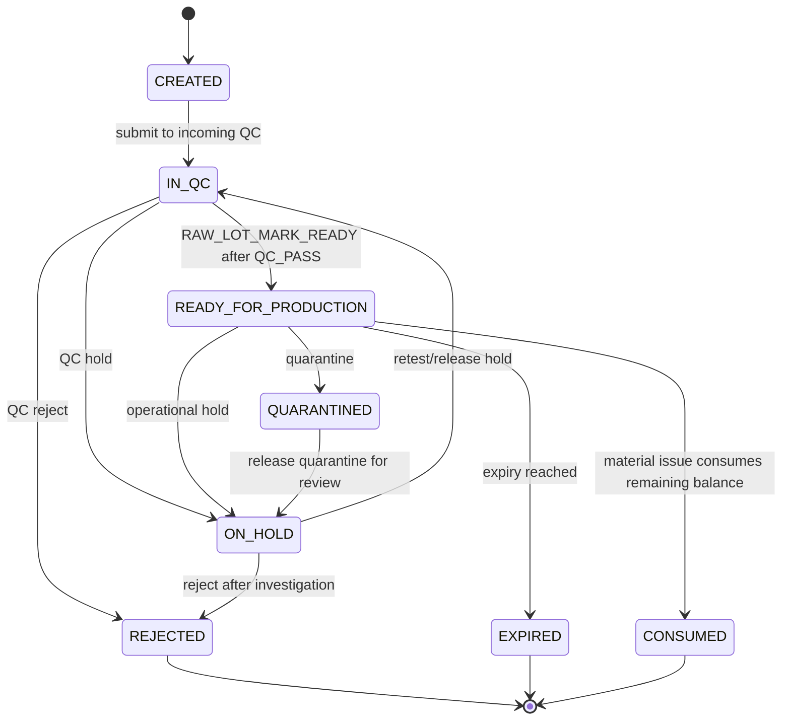
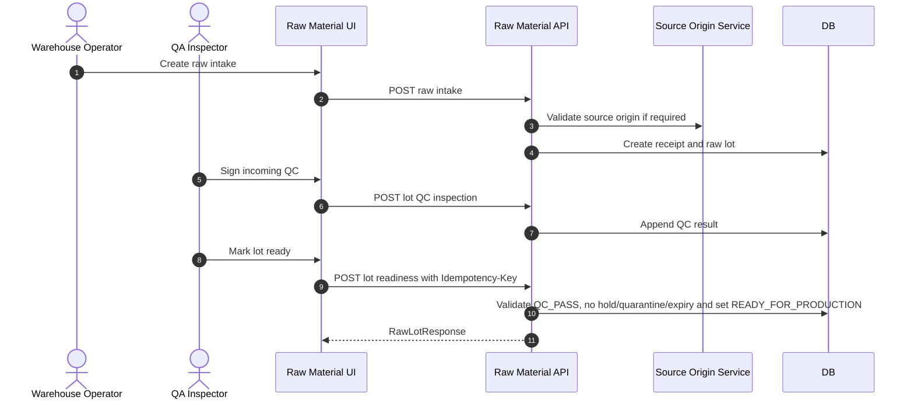

# M06 Raw Material

## 1. Mục đích

Raw Material quản lý tiếp nhận nguyên liệu, raw material receipt/item, raw material lot, readiness và incoming QC đầu vào. Module này tạo nguyên liệu đủ điều kiện để material issue, nhưng không thực hiện trừ kho sản xuất; điểm trừ kho thật nằm ở M08 Material Issue.

## 2. Boundary

| In scope | Out of scope |
|---|---|
| Raw material intake, raw receipt/item, raw lot, procurement type, incoming QC link, lot readiness | Material issue execution, production order, finished goods warehouse receipt, supplier master, recipe definition |

## 3. Owner

| Owner type | Role |
|---|---|
| Business owner | Warehouse/Raw Material Owner |
| Product/BA owner | BA phụ trách raw material |
| Technical owner | Backend Lead / DBA |
| QA owner | QA Inspector/QA Manager |

## 4. Chức năng

| function_id | Function | Description | Priority |
|---|---|---|---|
| M06-F01 | Raw intake | Ghi nhận receipt nguyên liệu từ supplier/source origin. | P0 |
| M06-F02 | Raw lot creation | Tạo raw material lot từ intake. | P0 |
| M06-F03 | Procurement type rules | Validate `SELF_GROWN`/`PURCHASED` field requirements. | P0 |
| M06-F04 | Incoming QC | Liên kết QC đầu vào với raw lot. | P0 |
| M06-F05 | Lot readiness | Kiểm tra lot có `lot_status = READY_FOR_PRODUCTION`, available, not held. | P0 |
| M06-F06 | Lot mark ready | Chuyển lot sang `READY_FOR_PRODUCTION` sau khi có QC_PASS, không hold/quarantine/expired và còn balance. | P0 |

## 5. Business Rules

| rule_id | Rule | Affected data | Affected API | Affected UI | Validation | Exception | Test |
|---|---|---|---|---|---|---|---|
| BR-M06-001 | Raw intake quantity phải > 0 và UOM hợp lệ. | receipt/item/lot | raw intake create | SCR-RAW-INTAKES | numeric/UOM check | reject request | TC-UI-RM-001 |
| BR-M06-002 | `SELF_GROWN` cần verified source origin; `PURCHASED` cần supplier nếu policy áp dụng. | raw lot | raw intake create | SCR-RAW-INTAKES | field combination | `SOURCE_ORIGIN_NOT_VERIFIED`, `SUPPLIER_REQUIRED` | TC-M06-RM-002 |
| BR-M06-003 | Raw lot chỉ ready cho issue khi `lot_status = READY_FOR_PRODUCTION`; `QC_PASS` chỉ là tiền điều kiện để mark ready. | raw lot | lot readiness, material issue | SCR-RAW-LOTS | lot status/readiness check | `RAW_MATERIAL_LOT_NOT_READY` | TC-UI-RM-002 |
| BR-M06-004 | Incoming QC hold/reject cần note/reason. | QC inspection | raw lot QC API | SCR-INCOMING-QC | reason required | `REASON_REQUIRED` | TC-UI-QC-001 |
| BR-M06-005 | Raw lot history append-only; correction không sửa lot issue history. | raw lot/QC | correction APIs | SCR-RAW-LOTS | state/history guard | correction record | TC-OP-RM-001 |

## 6. Tables

| table | Type | Purpose | Ownership | Notes |
|---|---|---|---|---|
| `op_raw_material_receipt` | transaction | Raw intake header. | M06 | Links supplier/source. |
| `op_raw_material_receipt_item` | transaction detail | Intake ingredient/qty lines. | M06 | UOM/quantity captured. |
| `op_raw_material_lot` | transaction/lot | Raw material lot identity and status. | M06 | Includes `lot_status`: `CREATED`, `IN_QC`, `ON_HOLD`, `REJECTED`, `READY_FOR_PRODUCTION`, `CONSUMED`, `EXPIRED`, `QUARANTINED`. |
| `op_raw_material_qc_inspection` | QC/history | Incoming QC result. | M06/M09 | May normalize into `op_qc_inspection` later. |

## 7. APIs

| method | path | Purpose | Permission | Idempotency | Request | Response | Test |
|---|---|---|---|---|---|---|---|
| GET | `/api/admin/raw-material/intakes` | List raw intakes | `RAW_INTAKE_VIEW` | No | filters | `RawIntakeListResponse` | TC-M06-RM-001 |
| POST | `/api/admin/raw-material/intakes` | Create/confirm raw intake | `RAW_INTAKE_CREATE` | Yes | `RawIntakeCreateRequest` | `RawIntakeResponse` | TC-M06-RM-001 |
| GET | `/api/admin/raw-material/lots` | List raw lots | `RAW_LOT_VIEW` | No | filters | `RawLotListResponse` | TC-M06-RM-004 |
| GET | `/api/admin/raw-material/lots/{lotId}/readiness` | Check lot readiness | `RAW_LOT_VIEW` | No | N/A | `RawLotReadinessResponse` | TC-M06-RM-004 |
| POST | `/api/admin/raw-material/lots/{lotId}/readiness` | Mark lot ready for production issue | `RAW_LOT_MARK_READY` | Yes | `LotReadinessTransitionRequest` | `RawLotReadinessResponse` | TC-M06-RM-005 |
| POST | `/api/admin/raw-material/lots/{lotId}/qc-inspections` | Sign raw lot QC | `RAW_QC_SIGN` | Yes | `RawQcSignRequest` | `RawLotResponse` | TC-M06-QC-003 |

## 8. UI Screens

| screen_id | Route | Purpose | Primary actions | Permission |
|---|---|---|---|---|
| SCR-RAW-INTAKES | `/admin/raw-material/intakes` | Raw intake list/create | create, receive, cancel | `raw_intake.read`, `raw_intake.receive` |
| SCR-RAW-LOTS | `/admin/raw-material/lots` | Raw lot status/readiness | view, mark ready, hold, release hold, trace | `raw_lot.read`, `RAW_LOT_MARK_READY`, `raw_lot.hold` |
| SCR-INCOMING-QC | `/admin/qc/incoming` | Incoming QC | create inspection, record result | `qc_inspection.result` |

## 9. Roles / Permissions

| Role | Permissions/actions | Notes |
|---|---|---|
| Warehouse Operator | `RAW_INTAKE_CREATE`, `RAW_LOT_VIEW` | Cannot sign QC. |
| QA Inspector | `RAW_QC_SIGN`, QC read | Can sign incoming QC. |
| QA Manager | QC read/hold review, `RAW_LOT_MARK_READY` | Marks ready only after QC_PASS and no blocking hold/quarantine/expiry. |
| Warehouse Manager | Read/hold raw lots | Operational hold. |

## 10. Workflow

| workflow_id | Trigger | Steps | Output | Related docs |
|---|---|---|---|---|
| WF-M06-INTAKE | Material arrives | Create intake -> validate source/supplier -> create lot | Lot `IN_QC` | `workflows/05_CANONICAL_OPERATIONAL_FLOW.md` |
| WF-M06-QC | Lot pending QC | QC inspection -> pass/hold/reject | QC result recorded | `workflows/04_STATE_MACHINES.md` |
| WF-M06-MARK-READY | QC passed lot | Validate QC_PASS, balance, source, no hold/quarantine/expiry -> mark ready | Lot `READY_FOR_PRODUCTION` | `api/03_API_REQUEST_RESPONSE_SPEC.md` |
| WF-M06-READINESS | M08 requests lot | Check `lot_status`, hold and balance | Eligible/ineligible response | `api/03_API_REQUEST_RESPONSE_SPEC.md` |

## 11. State Machine

## 12. Sequence / Activity Flow

## 13. Input / Output

| Type | Input | Output |
|---|---|---|
| UI | supplier/source origin, ingredient, quantity, UOM, QC result, mark-ready reason | raw intake/lot/QC/readiness status |
| API | RawIntakeCreateRequest, RawQcSignRequest, LotReadinessTransitionRequest | RawIntakeResponse, RawLotResponse, RawLotReadinessResponse |
| Event | Raw lot created/QC signed/ready | Lot readiness for material issue |

## 14. Events

| event | Producer | Consumer | Payload summary |
|---|---|---|---|
| `RAW_LOT_CREATED` | M06 | M09/M12/M15 | lot, ingredient, source, qty |
| `RAW_LOT_QC_SIGNED` | M06/M09 | M08/M12 | lot, result, inspector |
| `RAW_LOT_READY_FOR_PRODUCTION` | M06 | M08/M12/M15 | lot, ingredient, available balance, readiness actor |
| `RAW_LOT_HELD` | M06 | M08/M15 | lot, reason |
| `RAW_LOT_REJECTED` | M06 | M11/M13/M15 | lot, reason/disposition |

## 15. Audit Log

| action | Audit payload | Retention/sensitivity |
|---|---|---|
| raw intake create/confirm/cancel | actor, supplier/source, ingredient, qty | Operational audit |
| QC pass/hold/reject | actor, lot, result, note | High retention |
| mark ready | actor, lot, QC ref, readiness checks, previous/new lot status | High retention |
| hold/release hold | reason, target lot, actor | High retention |

## 16. Validation Rules

| validation_id | Rule | Error code | Blocking |
|---|---|---|---|
| VAL-M06-001 | Quantity > 0 | `VALIDATION_FAILED` | Yes |
| VAL-M06-002 | Required source origin verified | `SOURCE_ORIGIN_NOT_VERIFIED` | Yes |
| VAL-M06-003 | Purchased flow requires supplier if configured | `SUPPLIER_REQUIRED` | Yes |
| VAL-M06-004 | QC hold/reject requires note | `REASON_REQUIRED` | Yes |
| VAL-M06-005 | Only `READY_FOR_PRODUCTION` lot eligible for issue | `RAW_MATERIAL_LOT_NOT_READY` | Yes in M08 |
| VAL-M06-006 | Mark ready requires QC_PASS, no hold/quarantine/expiry and positive available balance | `RAW_MATERIAL_LOT_QC_NOT_PASSED`, `LOT_QUARANTINED`, `RAW_MATERIAL_LOT_NOT_READY` | Yes |

## 17. Exception Flow

| exception | Rule | Recovery |
|---|---|---|
| cancel intake | Only before lot QC/issue side effects | Cancel with reason |
| QC hold | Blocks material issue | Investigation/retest/release hold |
| QC reject | Blocks material issue | Disposition/correction if wrong |
| QC_PASS but not ready | Blocks material issue | Mark ready after source/balance/hold checks pass |
| correction | Signed QC/receipt not updated silently | New correction/retest record |

## 18. Test Cases

| test_id | Scenario | Expected result | Priority |
|---|---|---|---|
| TC-M06-RM-001 | Create raw intake | Receipt and lot created | P0 |
| TC-M06-RM-002 | Unverified source origin | Intake rejected | P0 |
| TC-M06-QC-003 | QC pass/hold/reject | Lot status updates and audit exists | P0 |
| TC-M06-RM-004 | Readiness check | Returns eligible only for `READY_FOR_PRODUCTION` and not held | P0 |
| TC-M06-RM-005 | QC_PASS lot not marked ready | Readiness false and M08 issue blocked | P0 |

## 19. Done Gate

- Raw intake creates raw lot with required source/supplier fields.
- Incoming QC signs lot and gates eligibility for mark-ready.
- `RAW_LOT_MARK_READY` is a distinct audited action after QC_PASS.
- Hold/reject/cancel/correction flows audited.
- Lot readiness API is usable by M08.
- UI supports empty/error/permission/stale states.

## 20. Risks

| risk | Impact | Mitigation |
|---|---|---|
| Procurement field policy unclear | Intake rejected unexpectedly | Owner decision for `SELF_GROWN`/`PURCHASED` fields. |
| QC split between M06 and M09 ambiguous | Duplicate QC logic | M06 owns incoming raw lot flow; M09 owns common QC/release policy. |
| Raw lot balance mixed with ledger | Inventory drift | Ledger/balance ownership remains M11. |

## 21. Phase triển khai

| Phase/CODE | Scope in phase | Dependency | Done gate |
|---|---|---|---|
| CODE02 | Raw intake, raw lot, incoming QC, mark ready | CODE01 | READY_FOR_PRODUCTION raw lot usable by M08 |
| CODE03 | Feed material issue | CODE02/M04 | M08 can consume ready lot |
