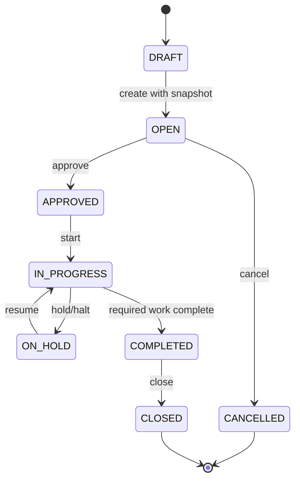
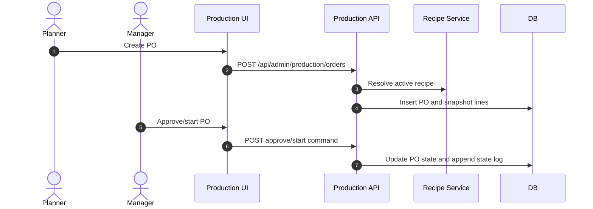

# M07 Production

## 1. Mục đích

Production quản lý production order, work order, batch creation, process execution và recipe snapshot root. Module này tạo xương sống sản xuất và genealogy root, nhưng không tự trừ kho nguyên liệu; material issue/receipt thuộc M08.

## 2. Boundary

| In scope | Out of scope |
|---|---|
| Production order, immutable recipe snapshot, work order, batch, process events, batch material usage reference | Recipe definition, raw lot QC, material issue ledger decrement, QC release, finished goods warehouse receipt |

## 3. Owner

| Owner type | Role |
|---|---|
| Business owner | Production Owner |
| Product/BA owner | BA phụ trách production workflow |
| Technical owner | Backend Lead / DBA |
| QA owner | QA production smoke owner |

## 4. Chức năng

| function_id | Function | Description | Priority |
|---|---|---|---|
| M07-F01 | Production order | Tạo/approve/start/close/cancel PO. | P0 |
| M07-F02 | Recipe snapshot | Snapshot active recipe lines vào PO. | P0 |
| M07-F03 | Work order | Quản lý work order và assignment. | P0 |
| M07-F04 | Batch context | Tạo batch/genealogy root. | P0 |
| M07-F05 | Process events | Ghi process steps, halt/correction, evidence. | P0 |
| M07-F06 | Production print | In PO từ snapshot nếu cần. | P1 |

## 5. Business Rules

| rule_id | Rule | Affected data | Affected API | Affected UI | Validation | Exception | Test |
|---|---|---|---|---|---|---|---|
| BR-M07-001 | PO chỉ tạo khi SKU có active approved operational recipe version. | `op_production_order` | production order create | SCR-PROD-ORDERS | M04 active recipe check | `ACTIVE_RECIPE_NOT_FOUND` | TC-UI-PO-001 |
| BR-M07-002 | Recipe snapshot immutable sau khi PO mở/start. | `op_production_order_item` | PO create/update | SCR-PROD-ORDER-DETAIL | no update after start | correction only | TC-UI-PO-002 |
| BR-M07-003 | Process events phải theo thứ tự đã định nghĩa. | `op_production_process_event` | process event API | SCR-PROCESS-EXEC | previous step done | `PROCESS_STEP_ORDER_INVALID` | TC-M07-PROC-003 |
| BR-M07-004 | Halt/cancel production phải có reason và audit. | PO/work order/process | command APIs | production UI | reason/state check | halt/correction | TC-EXC-HALT-001 |
| BR-M07-005 | PO close chỉ khi work/process/material receipt prerequisites complete. | PO/work order | close endpoint | SCR-PROD-ORDER-DETAIL | dependency check | block close | TC-UI-BATCH-001 |
| BR-M07-006 | Batch không được chuyển sang release/warehouse downstream khi PO/work order/process chưa complete. | `op_batch`, PO/work order | batch/process APIs | SCR-PROCESS-EXEC | production completion check | `STATE_CONFLICT` | TC-M07-BATCH-004 |

## 6. Tables

| table | Type | Purpose | Ownership | Notes |
|---|---|---|---|---|
| `op_production_order` | transaction | Production order header. | M07 | Links SKU and recipe snapshot. |
| `op_production_order_item` | snapshot | Immutable recipe/material snapshot line. | M07 | Source for M08 request. |
| `op_work_order` | transaction | Work order and step/task container. | M07 | May map to batch. |
| `op_production_process_event` | history | Process event append-only. | M07 | Step order and evidence. |
| `op_batch` | transaction/lot | Batch identity and status. | M07 | Includes `batch_status`: `CREATED`, `IN_PROGRESS`, `PROCESS_COMPLETED`, `QC_PENDING`, `QC_PASS`, `QC_HOLD`, `QC_REJECT`, `PACKAGED`, `BLOCKED`; release remains M09. |
| `op_batch_material_usage` | mapping/history | Batch material usage summary. | M07/M08 | Derived from material issue. |

## 7. APIs

| method | path | Purpose | Permission | Idempotency | Request | Response | Test |
|---|---|---|---|---|---|---|---|
| GET | `/api/admin/production/orders` | List PO | `PRODUCTION_ORDER_VIEW` | No | filters | `ProductionOrderListResponse` | TC-M07-PO-001 |
| POST | `/api/admin/production/orders` | Create PO with recipe snapshot | `PRODUCTION_ORDER_CREATE` | Yes | `ProductionOrderCreateRequest` | `ProductionOrderResponse` | TC-M07-PO-001 |
| POST | `/api/admin/production/orders/{productionOrderId}/approve` | Approve PO | `PRODUCTION_ORDER_APPROVE` | Yes | `ApproveProductionOrderRequest` | `ProductionOrderResponse` | TC-APP-PO-001 |
| POST | `/api/admin/production/orders/{productionOrderId}/print` | Print PO from snapshot | `PRODUCTION_ORDER_PRINT` | Yes | `PrintProductionOrderRequest` | `PrintJobResponse` | TC-M07-PRINT-004 |
| POST | `/api/admin/production/work-orders` | Create work order | `WORK_ORDER_CREATE` | Yes | `WorkOrderCreateRequest` | `WorkOrderResponse` | TC-M07-BATCH-002 |
| POST | `/api/admin/production/process-events` | Record process event | `PROCESS_EVENT_RECORD` | Yes | `ProcessEventRequest` | `ProcessEventResponse` | TC-M07-PROC-003 |

## 8. UI Screens

| screen_id | Route | Purpose | Primary actions | Permission |
|---|---|---|---|---|
| SCR-PROD-ORDERS | `/admin/production/orders` | Production order list/create | create, start, cancel, close | `production_order.read`, command permissions |
| SCR-PROD-ORDER-DETAIL | `/admin/production/orders/:id` | PO snapshot/detail | view snapshot, create request, start/cancel | permission theo action |
| SCR-WORK-ORDERS | `/admin/production/work-orders` | Work order management | create, assign, start, complete | `work_order.write` |
| SCR-PROCESS-EXEC | `/admin/production/process-execution` | Batch/process event execution | record step, halt, complete | `batch_execution.write` |

## 9. Roles / Permissions

| Role | Permissions/actions | Notes |
|---|---|---|
| Production Planner | Create/read PO | Cannot approve if policy separates duties. |
| Production Manager | Approve/start/close PO, manage work order | Must not bypass material/QC gates. |
| Production Operator | Record process events | Cannot alter snapshot. |
| QA Manager | View production state for QC/release | Read/gate context. |

## 10. Workflow

| workflow_id | Trigger | Steps | Output | Related docs |
|---|---|---|---|---|
| WF-M07-PO | Create PO | Resolve active recipe -> snapshot -> approve/start | PO with immutable snapshot | `workflows/05_CANONICAL_OPERATIONAL_FLOW.md` |
| WF-M07-WO | Start production | Create work order/batch -> wait material receipt -> execute steps | Batch/process complete | `workflows/04_STATE_MACHINES.md` |
| WF-M07-HALT | Production issue | Halt -> reason/evidence -> resume/cancel/correction | Controlled interruption | `workflows/07_EXCEPTION_FLOWS.md` |

## 11. State Machine

## 12. Sequence / Activity Flow

## 13. Input / Output

| Type | Input | Output |
|---|---|---|
| UI | SKU, planned qty, planned date, process event info | PO/work order/batch status |
| API | ProductionOrderCreateRequest, ProcessEventRequest | ProductionOrderResponse, WorkOrderResponse |
| Event | PO created, process completed | Trace, dashboard, MISA outbox if needed |

## 14. Events

| event | Producer | Consumer | Payload summary |
|---|---|---|---|
| `PRODUCTION_ORDER_CREATED` | M07 | M08/M12/M15 | PO, SKU, recipe version |
| `PRODUCTION_ORDER_APPROVED` | M07/M02 | M08/M15 | PO state, approver |
| `WORK_ORDER_CREATED` | M07 | Shopfloor/PWA | work order id/step |
| `PROCESS_EVENT_RECORDED` | M07 | M09/M10/M12 | batch, step, status |
| `BATCH_PROCESS_COMPLETED` | M07 | M09/M10 | batch id/status |

## 15. Audit Log

| action | Audit payload | Retention/sensitivity |
|---|---|---|
| PO create/approve/start/cancel/close | actor, state, snapshot ref, reason if any | High retention |
| process event | actor, step, evidence, timestamp | High retention |
| halt/resume/correction | reason, step, before/after | High retention |

## 16. Validation Rules

| validation_id | Rule | Error code | Blocking |
|---|---|---|---|
| VAL-M07-001 | Active recipe required | `ACTIVE_RECIPE_NOT_FOUND` | Yes |
| VAL-M07-002 | Snapshot complete | `SNAPSHOT_INCOMPLETE` | Yes |
| VAL-M07-003 | Cannot edit snapshot after start | `STATE_CONFLICT` | Yes |
| VAL-M07-004 | Process step order valid | `PROCESS_STEP_ORDER_INVALID` | Yes |
| VAL-M07-005 | Close only after prerequisites complete | `STATE_CONFLICT` | Yes |
| VAL-M07-006 | Batch downstream handoff requires completed production prerequisites | `STATE_CONFLICT` | Yes |

## 17. Exception Flow

| exception | Rule | Recovery |
|---|---|---|
| cancel PO | Allowed before irreversible downstream side effects | Cancel with reason |
| halt production | Temporary stop with safe resume point | Resume or correction/cancel |
| process correction | Append correction event, do not edit original event | Retest/review |
| missing recipe | Block PO | Activate recipe in M04 |

## 18. Test Cases

| test_id | Scenario | Expected result | Priority |
|---|---|---|---|
| TC-M07-PO-001 | Create PO with active recipe | PO and snapshot lines created | P0 |
| TC-APP-PO-001 | Approve PO | State transitions and audit | P0 |
| TC-M07-PROC-003 | Record process out of order | `PROCESS_STEP_ORDER_INVALID` | P0 |
| TC-M07-BATCH-004 | Handoff batch before process complete | Blocked | P0 |
| TC-UI-PO-002 | Attempt snapshot edit after start | Blocked | P0 |
| TC-UI-BATCH-001 | Complete batch prerequisites | Batch ready for downstream flow | P0 |

## 19. Done Gate

- PO creation snapshots active recipe fully.
- Snapshot is immutable after start.
- Work order/batch/process event lifecycle is implemented.
- Halt/cancel/correction flows audited.
- M08 can create material request from PO snapshot.
- M09/M10 can consume batch readiness.

## 20. Risks

| risk | Impact | Mitigation |
|---|---|---|
| Snapshot fields incomplete | Trace/material issue incorrect | Strict snapshot readiness validation. |
| Process step details under-specified | QA cannot test execution | Keep step order in workflow and ask owner for extra steps if needed. |
| Production and material modules overlap | Double decrement or duplicate truth | M07 owns PO/batch; M08 owns issue/receipt. |

## 21. Phase triển khai

| Phase/CODE | Scope in phase | Dependency | Done gate |
|---|---|---|---|
| CODE03 | PO, snapshot, work order, batch, process events | CODE01/CODE02/MX-GATE-G1 | Batch genealogy root exists |
| CODE17 | E2E production smoke | All P0 flow modules | Smoke passes |
