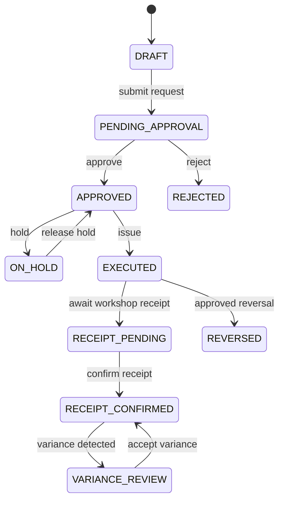
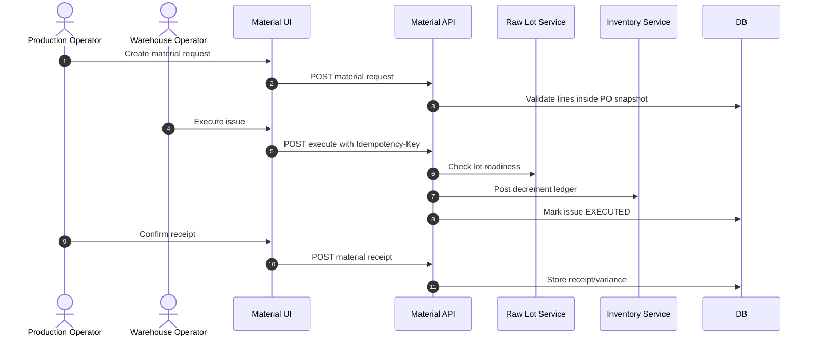

# M08 Material Issue Receipt

## 1. Mục đích

Material Issue Receipt quản lý material request, approval, issue execution và material receipt confirmation tại xưởng. Đây là module quyết định điểm trừ kho nguyên liệu thật: chỉ Material Issue Execution được ghi ledger decrement; Material Receipt chỉ xác nhận xưởng nhận và ghi variance.

## 2. Boundary

| In scope | Out of scope |
|---|---|
| Material request from PO snapshot, approval, material issue, issue lines, issue execution, receipt confirmation, receipt variance | Production order snapshot creation, raw lot QC, inventory ledger ownership, batch release, warehouse receipt |

## 3. Owner

| Owner type | Role |
|---|---|
| Business owner | Production/Warehouse Owner |
| Product/BA owner | BA phụ trách material flow |
| Technical owner | Backend Lead / DBA |
| QA owner | QA inventory/material flow owner |

## 4. Chức năng

| function_id | Function | Description | Priority |
|---|---|---|---|
| M08-F01 | Material request | Tạo request từ PO snapshot. | P0 |
| M08-F02 | Request approval | Approve/reject material request. | P0 |
| M08-F03 | Material issue execution | Chọn raw lot `READY_FOR_PRODUCTION` và execute issue. | P0 |
| M08-F04 | Inventory decrement integration | Gọi M11 để post raw material decrement ledger. | P0 |
| M08-F05 | Receipt confirmation | Xác nhận xưởng nhận vật tư. | P0 |
| M08-F06 | Variance handling | Ghi lý do lệch nhận/cấp. | P0 |

## 5. Business Rules

| rule_id | Rule | Affected data | Affected API | Affected UI | Validation | Exception | Test |
|---|---|---|---|---|---|---|---|
| BR-M08-001 | Request/issue lines phải thuộc PO snapshot. | `op_material_request`, `op_material_issue_line` | request/issue APIs | SCR-MATERIAL-REQUESTS | snapshot line check | exception approval if owner permits | TC-UI-MR-001 |
| BR-M08-002 | Material issue chỉ dùng raw lot `READY_FOR_PRODUCTION`, còn balance và không hold/quarantine/expired. | `op_material_issue` | issue execute | SCR-MATERIAL-ISSUES | lot readiness check | `RAW_MATERIAL_LOT_NOT_READY` | TC-UI-MI-001 |
| BR-M08-003 | Issue execution là điểm decrement raw inventory duy nhất. | `op_inventory_ledger` | issue execute | SCR-INVENTORY-LEDGER | ledger single post | reversal/correction | TC-M08-MI-001 |
| BR-M08-004 | Receipt confirmation không decrement inventory lần hai. | `op_material_receipt` | receipt confirm | SCR-MATERIAL-RECEIPTS | no ledger decrement | variance review | TC-UI-MRCP-001 |
| BR-M08-005 | Variance requires reason. | `op_material_receipt_variance` | receipt confirm | SCR-MATERIAL-RECEIPTS | reason required if mismatch | `VARIANCE_REASON_REQUIRED` | TC-M08-MR-002 |
| BR-M08-006 | Issue/receipt commands require idempotency. | idempotency registry | POST issue/receipt | PWA/Admin | idempotency key | conflict/replay | TC-M01-IDEMP-001 |

## 6. Tables

| table | Type | Purpose | Ownership | Notes |
|---|---|---|---|---|
| `op_material_request` | transaction | Request header from PO snapshot. | M08 | Approval-controlled. |
| `op_material_issue` | transaction | Issue header/status. | M08 | Execute creates inventory decrement; stores command idempotency key/reference for replay. |
| `op_material_issue_line` | transaction detail | Lot/ingredient/qty lines. | M08 | Must match snapshot. |
| `op_material_receipt` | transaction | Workshop receipt confirmation. | M08 | No raw decrement. |
| `op_material_receipt_variance` | transaction/history | Variance reason/details. | M08 | Required if mismatch. |

## 7. APIs

| method | path | Purpose | Permission | Idempotency | Request | Response | Test |
|---|---|---|---|---|---|---|---|
| POST | `/api/admin/production/material-requests` | Create material request | `MATERIAL_REQUEST_CREATE` | Yes | `MaterialRequestCreateRequest` | `MaterialRequestResponse` | TC-M08-MI-003 |
| POST | `/api/admin/production/material-requests/{materialRequestId}/approve` | Approve request | `MATERIAL_REQUEST_APPROVE` | Yes | `ApprovalActionRequest` | `MaterialRequestResponse` | TC-M08-MI-003 |
| POST | `/api/admin/production/material-issues/{materialIssueId}/execute` | Execute issue and decrement inventory | `MATERIAL_ISSUE_EXECUTE` | Yes | `MaterialIssueExecuteRequest` | `MaterialIssueResponse` | TC-M08-MI-001 |
| POST | `/api/admin/production/material-receipts` | Confirm workshop receipt | `MATERIAL_RECEIPT_CONFIRM` | Yes | `MaterialReceiptConfirmRequest` | `MaterialReceiptResponse` | TC-M08-MR-002 |

## 8. UI Screens

| screen_id | Route | Purpose | Primary actions | Permission |
|---|---|---|---|---|
| SCR-MATERIAL-REQUESTS | `/admin/material/requests` | Material request approval | create, approve, reject | `material_request.read`, command permissions |
| SCR-MATERIAL-ISSUES | `/admin/material/issues` | Issue execution | issue, cancel, print slip | `material_issue.issue` |
| SCR-MATERIAL-RECEIPTS | `/admin/material/receipts` | Workshop receipt confirmation | confirm, record variance | `material_receipt.confirm` |
| SCR-SHOPFLOOR-PWA | `/pwa/tasks` | Mobile issue/receipt tasks | scan, submit, sync offline | permission theo task |

## 9. Roles / Permissions

| Role | Permissions/actions | Notes |
|---|---|---|
| Production Operator | Create request, confirm receipt | Cannot execute warehouse issue. |
| Production Manager | Approve material request | Cannot bypass snapshot rules. |
| Warehouse Operator | Execute material issue | Must scan/select `READY_FOR_PRODUCTION` lot. |
| Warehouse Manager | Hold/cancel/reversal if allowed | Requires reason/audit. |

## 10. Workflow

| workflow_id | Trigger | Steps | Output | Related docs |
|---|---|---|---|---|
| WF-M08-REQUEST | PO approved | Create request from snapshot -> submit -> approve/reject | Approved material request | `workflows/06_APPROVAL_WORKFLOWS.md` |
| WF-M08-ISSUE | Request approved | Select raw lot -> validate readiness/balance -> execute -> post ledger | Issue executed | `workflows/05_CANONICAL_OPERATIONAL_FLOW.md` |
| WF-M08-RECEIPT | Issue executed | Confirm received qty -> record variance if needed | Receipt confirmed | `workflows/04_STATE_MACHINES.md` |

## 11. State Machine

## 12. Sequence / Activity Flow

## 13. Input / Output

| Type | Input | Output |
|---|---|---|
| UI | PO snapshot lines, raw lot scan, issue qty, receipt qty, variance reason | issue/receipt status |
| API | MaterialRequestCreateRequest, MaterialIssueExecuteRequest, MaterialReceiptConfirmRequest | MaterialRequest/Issue/ReceiptResponse |
| Event | Issue/receipt executed | Ledger, trace, production readiness |

## 14. Events

| event | Producer | Consumer | Payload summary |
|---|---|---|---|
| `MATERIAL_REQUEST_APPROVED` | M08 | Warehouse/PWA | request id, PO, lines |
| `MATERIAL_ISSUE_EXECUTED` | M08 | M11/M12/M14 | issue id, lot, qty, ledger ref |
| `MATERIAL_RECEIPT_CONFIRMED` | M08 | M07/M12 | receipt id, issue id, variance |
| `MATERIAL_RECEIPT_VARIANCE_RECORDED` | M08 | M15/QA | variance summary |

## 15. Audit Log

| action | Audit payload | Retention/sensitivity |
|---|---|---|
| request create/approve/reject | PO, lines, requester/approver, reason | High retention |
| issue execute | lot, qty, warehouse, idempotency key, ledger ref | High retention |
| receipt confirm/variance | qty, variance reason, actor | High retention |
| reversal/correction | original issue/receipt, reason, approval | High retention |

## 16. Validation Rules

| validation_id | Rule | Error code | Blocking |
|---|---|---|---|
| VAL-M08-001 | Line must be inside PO snapshot | `OUTSIDE_SNAPSHOT_MATERIAL` | Yes |
| VAL-M08-002 | Raw lot must be `READY_FOR_PRODUCTION` | `RAW_MATERIAL_LOT_NOT_READY` | Yes |
| VAL-M08-003 | Balance sufficient | `INSUFFICIENT_BALANCE` | Yes |
| VAL-M08-004 | Receipt variance requires reason | `VARIANCE_REASON_REQUIRED` | Yes |
| VAL-M08-005 | Issue command idempotent | `IDEMPOTENCY_CONFLICT` | Yes |

## 17. Exception Flow

| exception | Rule | Recovery |
|---|---|---|
| reject request | Reason required | Correct request and resubmit |
| cancel issue | Only before execution | Cancel with reason |
| reverse issue | After ledger posted, use reversal | Approved reversal ledger |
| receipt variance | Must capture reason | Review/accept/correction |
| offline duplicate | Same idempotency key replay | Return existing result |

## 18. Test Cases

| test_id | Scenario | Expected result | Priority |
|---|---|---|---|
| TC-UI-MR-001 | Request outside snapshot | Rejected | P0 |
| TC-UI-MI-001 | Execute issue with READY_FOR_PRODUCTION lot | Issue executed and ledger posted | P0 |
| TC-M08-MI-002 | Execute issue with QC_PASS lot not marked ready | Rejected with `RAW_MATERIAL_LOT_NOT_READY` | P0 |
| TC-M08-MI-001 | Duplicate issue retry | One ledger decrement | P0 |
| TC-UI-MRCP-001 | Confirm receipt no variance | Receipt confirmed, no decrement | P0 |
| TC-M08-MR-002 | Variance without reason | Rejected | P0 |

## 19. Done Gate

- Material request can only use PO snapshot lines.
- Issue validates `READY_FOR_PRODUCTION` raw lot readiness and balance; QC_PASS alone is rejected.
- Issue posts exactly one decrement ledger via M11.
- Receipt does not post second decrement.
- Variance/reversal/cancel flows audited.
- PWA/offline commands preserve idempotency.

## 20. Risks

| risk | Impact | Mitigation |
|---|---|---|
| Issue and receipt confused | Double decrement inventory | Hard rule and tests: issue decrements, receipt does not. |
| Snapshot mismatch | Wrong material consumed | Request/issue source only from PO snapshot. |
| Offline duplicate | Duplicate ledger | Idempotency registry and replay tests. |

## 21. Phase triển khai

| Phase/CODE | Scope in phase | Dependency | Done gate |
|---|---|---|---|
| CODE03 | Material request/issue/receipt with production | CODE02/M07/M11 | Issue/receipt smoke passes |
| CODE11 | PWA/offline material commands | CODE10/CODE03 | Offline idempotency tested |
