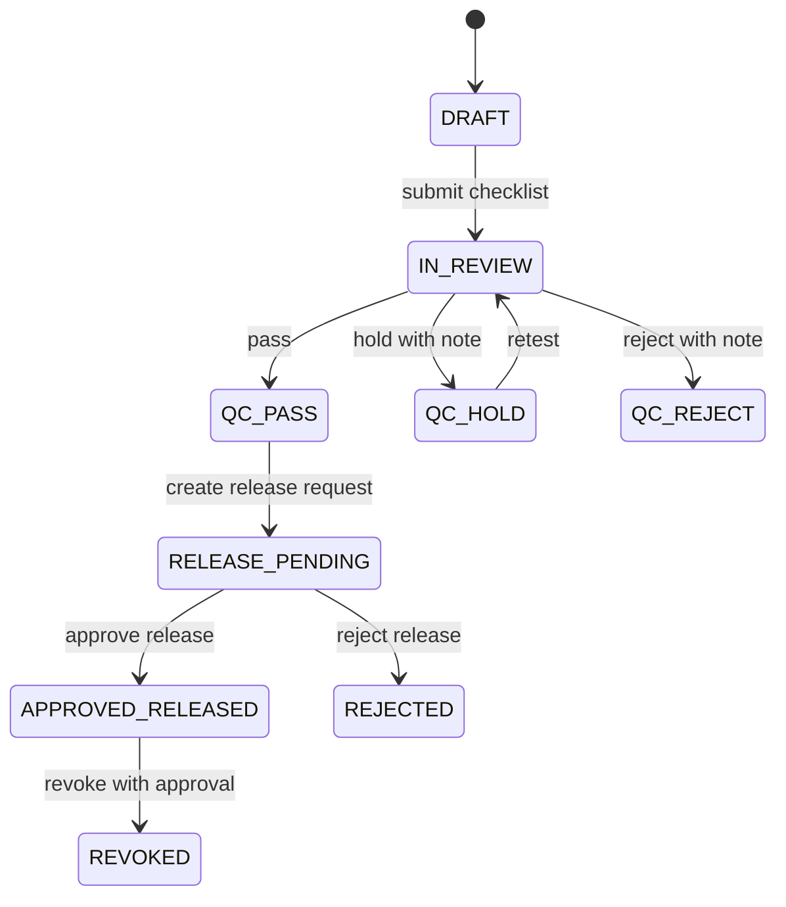
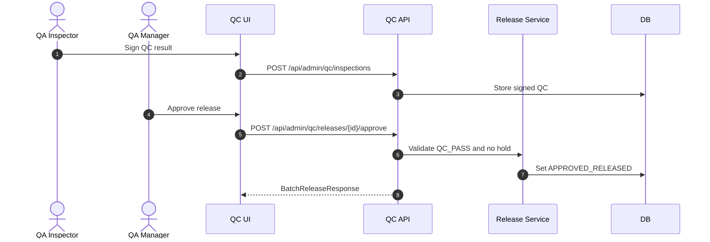

# M09 QC Release

## 1. Mục đích

QC Release quản lý QC inspection, QC result, hold/reject/disposition và batch release. Module này khóa nguyên tắc quan trọng: `QC_PASS` không tự động là release; batch chỉ được warehouse receipt khi có release record/action được approve.

## 2. Boundary

| In scope | Out of scope |
|---|---|
| QC inspection/item, QC result, batch disposition, batch release request/approval, release state transition | Raw intake creation, production process execution, warehouse receipt posting, public trace rendering |

## 3. Owner

| Owner type | Role |
|---|---|
| Business owner | QA/Quality Owner |
| Product/BA owner | BA phụ trách QC/release |
| Technical owner | Backend Lead / DBA |
| QA owner | QA Manager |

## 4. Chức năng

| function_id | Function | Description | Priority |
|---|---|---|---|
| M09-F01 | QC inspection | Tạo/sign QC inspection theo scope/entity. | P0 |
| M09-F02 | QC result | Ghi `QC_PASS`, `QC_HOLD`, `QC_REJECT`. | P0 |
| M09-F03 | Disposition | Lưu disposition/hold/reject record; bắt buộc khi QC_HOLD/QC_REJECT hoặc release reject cần xử lý. | P1 |
| M09-F04 | Batch release request | Tạo release request sau QC pass. | P0 |
| M09-F05 | Release approval | Approve/reject release record. | P0 |
| M09-F06 | Release revoke | Revoke approved release bằng approval/reason và chặn downstream mới. | P0 |

## 5. Business Rules

| rule_id | Rule | Affected data | Affected API | Affected UI | Validation | Exception | Test |
|---|---|---|---|---|---|---|---|
| BR-M09-001 | HOLD/REJECT QC result requires note/reason. | `op_qc_inspection` | QC sign API | SCR-QC-INSPECTIONS | reason required | reject command | TC-UI-QC-002 |
| BR-M09-002 | `QC_PASS` is prerequisite, not release. | `op_batch_release` | release APIs, warehouse receipt | SCR-BATCH-RELEASE | release record required | block warehouse | TC-UI-REL-001 |
| BR-M09-003 | Release requires no active hold. | batch/release/hold registry | release approve | SCR-BATCH-RELEASE | hold check | `HOLD_ACTIVE` | TC-M09-REL-003 |
| BR-M09-004 | Signed QC/release records append-only. | QC/release history | correction/revoke | QC/release UI | immutability guard | correction/revoke | TC-OP-QC-001 |
| BR-M09-005 | Batch release revoke requires approval/reason and appends a new revoke record/state transition. | `op_batch_release` | revoke endpoint | SCR-BATCH-RELEASE | reason/approval | recall hold/revoke | TC-EXC-HOLD-001 |

## 6. Tables

| table | Type | Purpose | Ownership | Notes |
|---|---|---|---|---|
| `op_qc_inspection` | transaction/history | QC inspection header. | M09 | Scope/entity generic. |
| `op_qc_inspection_item` | detail | QC checklist/item results. | M09 | Optional checklist granularity. |
| `op_batch_disposition` | history | Hold/reject/disposition decisions. | M09 | Links batch/QC. |
| `op_batch_release` | transaction/approval | Release record/action. | M09 | Distinct from QC pass. |
| `op_batch_state_transition_log` | history | Batch state changes. | M09/M01 | Append-only. |

## 7. APIs

| method | path | Purpose | Permission | Idempotency | Request | Response | Test |
|---|---|---|---|---|---|---|---|
| POST | `/api/admin/qc/inspections` | Create/sign QC inspection | `QC_INSPECTION_SIGN` | Yes | `QcInspectionRequest` | `QcInspectionResponse` | TC-M09-QC-001 |
| GET | `/api/admin/qc/releases` | List release queue | `BATCH_RELEASE_VIEW` | No | filters | `BatchReleaseListResponse` | TC-M09-REL-002 |
| POST | `/api/admin/qc/releases` | Create release request | `BATCH_RELEASE_CREATE` | Yes | `BatchReleaseCreateRequest` | `BatchReleaseResponse` | TC-M09-REL-002 |
| POST | `/api/admin/qc/releases/{batchReleaseId}/approve` | Approve release | `BATCH_RELEASE_APPROVE` | Yes | `BatchReleaseApproveRequest` | `BatchReleaseResponse` | TC-M09-REL-003 |
| POST | `/api/admin/qc/releases/{batchReleaseId}/revoke` | Revoke approved release | `BATCH_RELEASE_REVOKE` | Yes | `BatchReleaseRevokeRequest` | `BatchReleaseResponse` | TC-EXC-HOLD-001 |

## 8. UI Screens

| screen_id | Route | Purpose | Primary actions | Permission |
|---|---|---|---|---|
| SCR-INCOMING-QC | `/admin/qc/incoming` | Raw material incoming QC | record result | `qc_inspection.result` |
| SCR-QC-INSPECTIONS | `/admin/qc/inspections` | QC inspection registry | create, sign, hold/reject | `qc_inspection.write` |
| SCR-BATCH-RELEASE | `/admin/release/batches` | Batch release queue/detail | create, approve, reject | `batch_release.release` |

## 9. Roles / Permissions

| Role | Permissions/actions | Notes |
|---|---|---|
| QA Inspector | Create/sign QC inspection | Cannot approve release unless configured. |
| QA Manager | Approve release, hold/reject review | Release gate owner. |
| Production Manager | Read QC/release status | Cannot bypass release. |
| Warehouse Operator | Read release status for receipt | No release approval. |

## 10. Workflow

| workflow_id | Trigger | Steps | Output | Related docs |
|---|---|---|---|---|
| WF-M09-QC | Entity ready for QC | Create inspection -> sign result -> update status | QC result | `workflows/04_STATE_MACHINES.md` |
| WF-M09-RELEASE | Batch QC_PASS | Create release request -> check hold -> approve/reject | Batch release record | `workflows/06_APPROVAL_WORKFLOWS.md` |
| WF-M09-HOLD | QC issue found | Set hold/reject/disposition | Downstream block | `workflows/07_EXCEPTION_FLOWS.md` |

## 11. State Machine

## 12. Sequence / Activity Flow

## 13. Input / Output

| Type | Input | Output |
|---|---|---|
| UI | scope/entity, checklist, QC result, release note | QC/release status |
| API | QcInspectionRequest, BatchReleaseRequest | QcInspectionResponse, BatchReleaseResponse |
| Event | QC signed/release approved | Warehouse eligibility, trace, dashboard |

## 14. Events

| event | Producer | Consumer | Payload summary |
|---|---|---|---|
| `QC_INSPECTION_SIGNED` | M09 | M07/M10/M11/M15 | entity, result, inspector |
| `BATCH_RELEASE_REQUESTED` | M09 | Approval queue | batch, QC ref |
| `BATCH_RELEASED` | M09 | M11/M12/M14 | batch, release id, approver |
| `BATCH_RELEASE_REJECTED` | M09 | Production/QA dashboard | reason, batch |

## 15. Audit Log

| action | Audit payload | Retention/sensitivity |
|---|---|---|
| QC sign | entity, result, checklist summary, actor | High retention |
| release approve/reject | batch, decision, reason, approver | High retention |
| release revoke/correction | original release, reason, approval | High retention |

## 16. Validation Rules

| validation_id | Rule | Error code | Blocking |
|---|---|---|---|
| VAL-M09-001 | QC result required | `VALIDATION_FAILED` | Yes |
| VAL-M09-002 | Hold/reject note required | `REASON_REQUIRED` | Yes |
| VAL-M09-003 | Release requires QC_PASS | `QC_NOT_PASS` | Yes |
| VAL-M09-004 | Release blocked by active hold | `HOLD_ACTIVE` | Yes |
| VAL-M09-005 | Warehouse receipt requires release | enforced in M11 with `BATCH_NOT_RELEASED` | Yes |
| VAL-M09-006 | Release revoke requires approval and reason | `REASON_REQUIRED`, `APPROVAL_POLICY_VIOLATION` | Yes |

## 17. Exception Flow

| exception | Rule | Recovery |
|---|---|---|
| QC hold | Blocks downstream; reason required | Retest/release hold/reject |
| QC reject | Blocks release/warehouse | Disposition/correction |
| release reject | Reason required | Correct batch/QC and resubmit |
| release revoke | Requires approval/reason | Blocks downstream and triggers recall/hold if needed |

## 18. Test Cases

| test_id | Scenario | Expected result | Priority |
|---|---|---|---|
| TC-M09-QC-001 | Sign QC pass | QC_PASS recorded, audit exists | P0 |
| TC-UI-QC-002 | Hold/reject without note | Rejected | P0 |
| TC-M09-REL-002 | Create release request after QC_PASS | Release pending | P0 |
| TC-M09-REL-003 | Approve release with active hold | Blocked | P0 |
| TC-UI-REL-001 | Warehouse before release | M11 blocks receipt | P0 |
| TC-EXC-HOLD-001 | Revoke release without reason/approval | Blocked | P0 |

## 19. Done Gate

- QC inspection supports pass/hold/reject with reason rules.
- Release record/action is distinct from QC pass.
- Warehouse receipt can validate release status.
- Hold/reject/revoke/correction audited.
- UI release queue and tests cover negative gates.

## 20. Risks

| risk | Impact | Mitigation |
|---|---|---|
| Teams treat QC_PASS as RELEASED | Warehouse bypass | Separate release table/API/state and negative tests. |
| QC checklist detail under-specified | QA cannot write granular tests | Use generic item table and owner-defined checklist later. |
| Release revoke misuse | Recall/warehouse confusion | Require approval/reason, append-only revoke record and downstream hold checks. |

## 21. Phase triển khai

| Phase/CODE | Scope in phase | Dependency | Done gate |
|---|---|---|---|
| CODE02 | Incoming QC basic with M06 | CODE01 | Raw lot QC gate works |
| CODE05 | Batch QC and release | CODE04 | Batch release gates warehouse |
| CODE15 | Override/revoke governance | CODE10/CODE14 | Release override audited |
