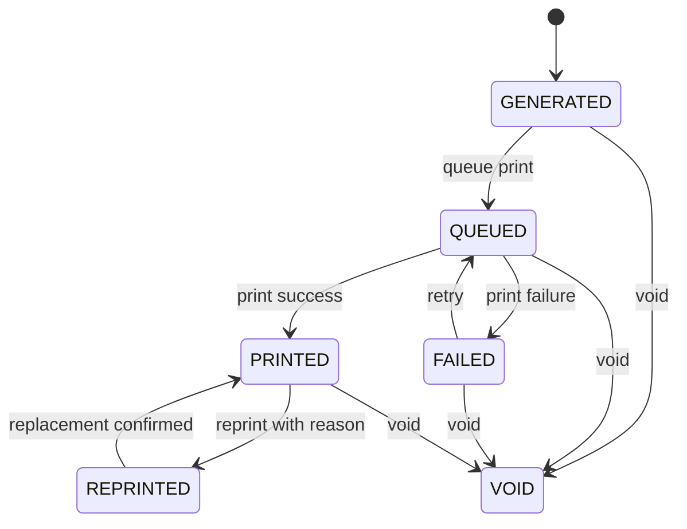
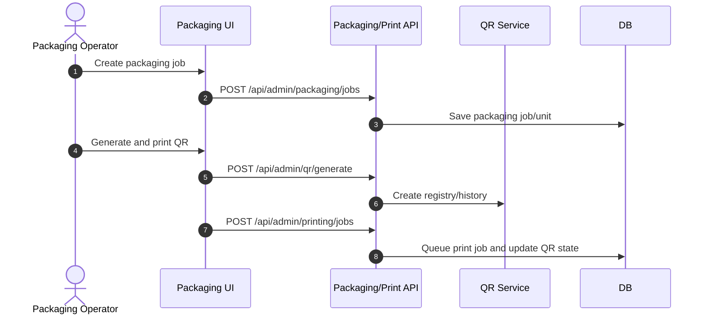

# M10 Packaging Printing

## 1. Mục đích

Packaging Printing quản lý trade item/GTIN, packaging job/unit, print job/log, QR registry và QR lifecycle. Module này tách identity thương phẩm/GTIN khỏi SKU, quản lý in/reprint/void và tạo dữ liệu đầu vào cho public trace.

## 2. Boundary

| In scope                                                                                              | Out of scope                                                                                                          |
| ----------------------------------------------------------------------------------------------------- | --------------------------------------------------------------------------------------------------------------------- |
| Trade item, GTIN, packaging job/unit, QR generate, print queue, print log, reprint/void, QR lifecycle | SKU/recipe definition, batch release decision, public trace rendering, device driver chi tiết nếu chưa owner-approved |

## 3. Owner

| Owner type       | Role                            |
| ---------------- | ------------------------------- |
| Business owner   | Packaging/Operations Owner      |
| Product/BA owner | BA phụ trách packaging/QR       |
| Technical owner  | Backend Lead / Integration Lead |
| QA owner         | QA packaging/trace reviewer     |

## 4. Chức năng

| function_id | Function        | Description                                       | Priority |
| ----------- | --------------- | ------------------------------------------------- | -------- |
| M10-F01     | Trade item/GTIN | Quản lý thương phẩm/GTIN tách khỏi SKU.           | P0       |
| M10-F02     | Packaging job   | Tạo/start/complete/cancel packaging job.          | P0       |
| M10-F03     | Packaging unit  | Ghi đơn vị đóng gói theo job/batch.               | P0       |
| M10-F04     | QR generation   | Sinh QR cho packaging unit/job.                   | P0       |
| M10-F05     | Print queue     | Queue, mark printed/failed, retry.                | P0       |
| M10-F06     | Void/reprint    | Vô hiệu hoặc in lại QR/print job có reason/audit. | P0       |

## 5. Business Rules

| rule_id    | Rule                                                                                                                                                                                                                                                                                                                                     | Affected data                         | Affected API      | Affected UI                         | Validation                        | Exception                                                    | Test               |
| ---------- | ---------------------------------------------------------------------------------------------------------------------------------------------------------------------------------------------------------------------------------------------------------------------------------------------------------------------------------------- | ------------------------------------- | ----------------- | ----------------------------------- | --------------------------------- | ------------------------------------------------------------ | ------------------ |
| BR-M10-001 | Trade item/GTIN identity tách khỏi SKU identity.                                                                                                                                                                                                                                                                                         | `op_trade_item_gtin`                  | trade item APIs   | SCR-TRADE-ITEMS                     | unique GTIN                       | `DUPLICATE_GTIN`                                             | TC-M10-GTIN-002    |
| BR-M10-002 | Packaging job chỉ tạo khi batch/process prerequisites đủ.                                                                                                                                                                                                                                                                                | `op_packaging_job`                    | packaging job API | SCR-PACKAGING-JOBS                  | prerequisite check                | halt/cancel                                                  | TC-M10-PKG-001     |
| BR-M10-003 | QR lifecycle chỉ theo `GENERATED`, `QUEUED`, `PRINTED`, `FAILED`, `VOID`, `REPRINTED`.                                                                                                                                                                                                                                                   | `op_qr_registry`                      | QR/print APIs     | SCR-QR-REGISTRY                     | state transition check            | `QR_INVALID_STATE`                                           | TC-M10-QR-003      |
| BR-M10-004 | Void/reprint bắt buộc reason và audit.                                                                                                                                                                                                                                                                                                   | `op_qr_state_history`, `op_print_log` | reprint/void APIs | SCR-PRINT-QUEUE                     | reason required                   | `REASON_REQUIRED`                                            | TC-EXC-REPRINT-001 |
| BR-M10-005 | Public trace API CHỈ trả QR có `qr_status = PRINTED`. QR ở trạng thái `GENERATED`/`QUEUED`/`FAILED`/`VOID`/`REPRINTED` KHÔNG xuất hiện trong public trace; với chuỗi REPRINTED, public trace dùng QR mới nhất có `qr_status = PRINTED` của cùng packaging_unit. VOID/FAILED/REPRINTED-cũ trả safe invalid response (xem M12 BR-M12-003). | QR/public trace                       | public trace      | SCR-PUBLIC-TRACE                    | status policy                     | safe public response                                         | TC-OP-QR-001       |
| BR-M10-006 | Commercial outbound print/public QR activation must not bypass required batch/job readiness and QC/release gates.                                                                                                                                                                                                                        | batch/packaging                       | print job API     | SCR-PRINT-QUEUE                     | batch/job readiness               | block print                                                  | TC-M10-PRINT-004   |
| BR-M10-007 | Reprint must link original QR/print history and preserve genealogy.                                                                                                                                                                                                                                                                      | `op_qr_state_history`, `op_print_log` | reprint API       | SCR-PRINT-QUEUE                     | original QR link check            | `QR_INVALID_STATE`                                           | TC-M10-PRINT-005   |
| BR-M10-008 | Print payload theo `packaging_level` phải khớp bảng `PRINT_PAYLOAD_BY_LEVEL` (mục 13.1). PACKET chỉ in SKU code/public name/NSX/HSD; BOX có batch + identifier (GTIN_13/GTIN_14) + QR; CARTON có batch + identifier (GTIN_14/SSCC) + số hộp.                                                                                             | `op_print_job.print_payload_snapshot` | print job API     | SCR-PRINT-QUEUE                     | payload field allowlist per level | `INVALID_PACKAGING_LEVEL`                                    | TC-M10-PRINT-006   |
| BR-M10-009 | Khi `op_packaging_job.carton_requested = true` và `op_trade_item.boxes_per_carton IS NULL` (hoặc ≤ 0) → reject `CARTON_PACKAGING_NOT_CONFIGURED`. BOX job phải có `op_trade_item.units_per_box > 0` (default seed = 4). MVP enforcement ở service layer; DB CHECK là hardening sau.                                                      | `op_trade_item`, `op_packaging_job`   | packaging job API | SCR-PACKAGING-JOBS, SCR-TRADE-ITEMS | config presence check             | `CARTON_PACKAGING_NOT_CONFIGURED`, `INVALID_PACKAGING_LEVEL` | TC-M10-PRINT-007   |

## 6. Tables

| table                        | Type           | Purpose                              | Ownership                    | Notes                                                                                              |
| ---------------------------- | -------------- | ------------------------------------ | ---------------------------- | -------------------------------------------------------------------------------------------------- |
| `op_trade_item`              | master         | Trade item definition.               | M10                          | Links SKU but not same identity.                                                                   |
| `op_trade_item_gtin`         | master/mapping | GTIN/barcode config.                 | M10                          | Unique GTIN.                                                                                       |
| `op_packaging_job`           | transaction    | Packaging job header/status.         | M10                          | Batch/job linkage.                                                                                 |
| `op_packaging_unit`          | transaction    | Unit-level packaging record.         | M10                          | QR source.                                                                                         |
| `op_print_job`               | transaction    | Print queue/job.                     | M10                          | Async/retry.                                                                                       |
| `op_print_log`               | history        | Printer result/history.              | M10                          | Append-only.                                                                                       |
| `ref_sku_operational_config` | config (read)  | Production readiness/QC/trace flags. | M04 (owner) / M10 (consumer) | M10 chỉ đọc `trace_public_enabled`, `recall_applicable`. Packaging hierarchy KHÔNG còn ở bảng này. |
| `op_qr_registry`             | registry       | QR identity and lifecycle.           | M10/M12                      | Public trace input.                                                                                |
| `op_qr_state_history`        | history        | QR lifecycle transitions.            | M10                          | Append-only.                                                                                       |

## 7. APIs

| method | path                                            | Purpose                       | Permission             | Idempotency | Request                     | Response                | Test             |
| ------ | ----------------------------------------------- | ----------------------------- | ---------------------- | ----------- | --------------------------- | ----------------------- | ---------------- |
| GET    | `/api/admin/trade-items`                        | List trade items/GTIN         | `TRADE_ITEM_VIEW`      | No          | filters                     | `TradeItemListResponse` | TC-M10-GTIN-002  |
| POST   | `/api/admin/trade-items`                        | Create trade item/GTIN config | `TRADE_ITEM_CREATE`    | Yes         | `TradeItemCreateRequest`    | `TradeItemResponse`     | TC-M10-GTIN-002  |
| POST   | `/api/admin/packaging/jobs`                     | Create packaging job          | `PACKAGING_JOB_CREATE` | Yes         | `PackagingJobCreateRequest` | `PackagingJobResponse`  | TC-M10-PKG-001   |
| POST   | `/api/admin/qr/generate`                        | Generate QR                   | `QR_GENERATE`          | Yes         | `QrGenerateRequest`         | `QrGenerateResponse`    | TC-M10-QR-003    |
| POST   | `/api/admin/printing/jobs`                      | Queue print job               | `PRINT_JOB_CREATE`     | Yes         | `PrintJobRequest`           | `PrintJobResponse`      | TC-M10-PRINT-004 |
| POST   | `/api/admin/printing/jobs/{printJobId}/reprint` | Reprint with reason           | `QR_REPRINT`           | Yes         | `ReprintRequest`            | `PrintJobResponse`      | TC-M10-PRINT-004 |

## 8. UI Screens

| screen_id          | Route                          | Purpose                | Primary actions                         | Permission                     |
| ------------------ | ------------------------------ | ---------------------- | --------------------------------------- | ------------------------------ |
| SCR-TRADE-ITEMS    | `/admin/packaging/trade-items` | Trade item/GTIN config | create, edit, deactivate                | `trade_item.write`             |
| SCR-PACKAGING-JOBS | `/admin/packaging/jobs`        | Packaging jobs         | create, start, complete, cancel         | `packaging_job.write`          |
| SCR-QR-REGISTRY    | `/admin/printing/qr-registry`  | QR lifecycle registry  | generate, queue, void, reprint, preview | `qr.read`, command permissions |
| SCR-PRINT-QUEUE    | `/admin/printing/queue`        | Print queue            | queue, mark printed/failed, retry       | `print_job.write`              |

## 9. Roles / Permissions

| Role                 | Permissions/actions                     | Notes                                          |
| -------------------- | --------------------------------------- | ---------------------------------------------- |
| Packaging Operator   | Packaging job, QR generate, print queue | Requires reason for void/reprint.              |
| Packaging Manager    | Trade item/GTIN and job oversight       | Can approve config changes if policy requires. |
| QA Manager           | QR preview/void review                  | Public trace policy oversight.                 |
| Integration Operator | Printer/device monitoring if integrated | No direct DB/device bypass.                    |

## 10. Workflow

| workflow_id    | Trigger              | Steps                                        | Output                      | Related docs                                 |
| -------------- | -------------------- | -------------------------------------------- | --------------------------- | -------------------------------------------- |
| WF-M10-PACK    | Batch ready          | Create packaging job -> complete unit        | Packaging unit/job complete | `workflows/05_CANONICAL_OPERATIONAL_FLOW.md` |
| WF-M10-QR      | Packaging unit ready | Generate QR -> queue print -> printed/failed | QR lifecycle state          | `workflows/04_STATE_MACHINES.md`             |
| WF-M10-REPRINT | Print issue          | Reason -> reprint job -> history             | Reprinted QR/print log      | `workflows/07_EXCEPTION_FLOWS.md`            |

## 11. State Machine

## 12. Sequence / Activity Flow

## 13. Input / Output

| Type  | Input                                                         | Output                                                     |
| ----- | ------------------------------------------------------------- | ---------------------------------------------------------- |
| UI    | batch, trade item, quantity, printer, QR action reason        | packaging job, QR, print status                            |
| API   | PackagingJobCreateRequest, QrGenerateRequest, PrintJobRequest | PackagingJobResponse, QrGenerateResponse, PrintJobResponse |
| Event | QR printed/failed/void/reprinted                              | Public trace projection, dashboard                         |

## 13.1 Print Payload By Level

Bảng `PRINT_PAYLOAD_BY_LEVEL` định nghĩa cố định payload in cho từng `packaging_level`. Print service phải snapshot toàn bộ field tương ứng vào `op_print_job.print_payload_snapshot` trước khi queue, không được thêm/bớt field theo SKU.

Nguồn dữ liệu packaging hierarchy: `op_trade_item.units_per_box`, `op_trade_item.boxes_per_carton`, `op_trade_item.carton_enabled`. Identifier (`GTIN_13`/`GTIN_14`/`SSCC`/`INTERNAL_BARCODE`) lấy từ `op_trade_item_gtin.identifier_type` + `identifier_value`; fixture/dev status dùng `is_test_fixture`, không dùng `identifier_type`.

| packaging_level | Cấp                                   | Khi nào in                                                                                                                                                            | Required fields                                                                                                                                                                                   | QR                                                           | batch_code | Identifier                                                          | Quantity field                                    |
| --------------- | ------------------------------------- | --------------------------------------------------------------------------------------------------------------------------------------------------------------------- | ------------------------------------------------------------------------------------------------------------------------------------------------------------------------------------------------- | ------------------------------------------------------------ | ---------- | ------------------------------------------------------------------- | ------------------------------------------------- |
| `PACKET`        | Cấp 1 (gói nhỏ — consumer-facing)     | Luôn (mọi SKU producible)                                                                                                                                             | `sku_code`, `sku_public_name`, `manufacture_date` (NSX), `expiry_date` (HSD)                                                                                                                      | Không                                                        | Không      | Không                                                               | —                                                 |
| `BOX`           | Cấp 2 (hộp chứa N gói)                | Luôn                                                                                                                                                                  | `sku_code`, `sku_public_name`, `manufacture_date`, `expiry_date`, `batch_code`, `identifier_type`, `identifier_value`, `qr_code` (link public trace), `units_per_box_snapshot` (số gói trong hộp) | Có (public trace entry point)                                | Có         | Có (`identifier_type` ∈ `GTIN_13`/`GTIN_14`/`INTERNAL_BARCODE`)     | `units_per_box_snapshot` từ `op_packaging_job`    |
| `CARTON`        | Cấp 2.1 (thùng chứa M hộp — optional) | Khi `op_packaging_job.carton_requested = true` và `op_trade_item.boxes_per_carton IS NOT NULL`. Operator quyết định lúc tạo job (giao đại lý/sỉ/vận chuyển gom hàng). | `sku_code`, `batch_code`, `identifier_type`, `identifier_value` (GTIN_14 hoặc SSCC), `boxes_per_carton_snapshot` (số hộp trong thùng), `manufacture_date`, `expiry_date`                          | Không bắt buộc (carton-level, không phải public trace entry) | Có         | Có (`identifier_type` ∈ `GTIN_14`/`SSCC`, tách khỏi BOX identifier) | `boxes_per_carton_snapshot` từ `op_packaging_job` |

Rules bắt buộc:

- BR-M10-PAYLOAD-001: PACKET label KHÔNG được chứa `batch_code`, `identifier_value`, hoặc `qr_code`. Trace lẻ (consumer cầm gói lẻ) đi qua `batch_code` in trên BOX của lô đó, không qua PACKET.
- BR-M10-PAYLOAD-002: BOX là cấp duy nhất mang QR public trace; mỗi packaging_unit cấp BOX phát sinh đúng 1 QR `op_qr_registry`.
- BR-M10-PAYLOAD-003: CARTON identifier phải tách khỏi BOX identifier (`(identifier_type, identifier_value)` khác nhau theo level). Thiếu mapping → reject với `GTIN_MAPPING_MISSING`.
- BR-M10-PAYLOAD-004: Service phải reject create packaging job khi `carton_requested = true` mà `op_trade_item.boxes_per_carton IS NULL` → trả `CARTON_PACKAGING_NOT_CONFIGURED`. UI phải hướng người dùng vào SCR-TRADE-ITEMS để cấu hình quy cách thùng trước.
- BR-M10-PAYLOAD-005: Service phải reject create packaging job cấp `BOX` nếu `op_trade_item.units_per_box IS NULL` hoặc ≤ 0 → trả `INVALID_PACKAGING_LEVEL` (default seed = 4).

## 13.2 Packaging Config Form (SCR-TRADE-ITEMS)

Người có quyền `trade_item.write` (Admin / Packaging Manager) cấu hình quy cách đóng gói theo SKU/trade item.

| field              | Type                                                              | Required                    | Default | Validation/Behavior                                                                                                           |
| ------------------ | ----------------------------------------------------------------- | --------------------------- | ------- | ----------------------------------------------------------------------------------------------------------------------------- |
| `packaging_level`  | enum `PACKET`/`BOX`/`CARTON`                                      | Yes                         | —       | Một SKU có thể có nhiều trade item, mỗi cấp đóng gói = 1 trade item nếu cần quản lý thương mại/logistics riêng.               |
| `units_per_box`    | int                                                               | Khi level = `BOX`           | 4       | Default seed = 4 (không hard-code source). Cho phép Admin chỉnh trên UI; phải > 0.                                            |
| `boxes_per_carton` | int                                                               | Khi `carton_enabled = true` | NULL    | NULL ⇒ chưa cấu hình quy cách thùng; phải > 0 nếu set. Bắt buộc set trước khi tạo CARTON job.                                 |
| `carton_enabled`   | bool                                                              | Yes                         | false   | `false` ⇒ SKU/trade item không hỗ trợ đóng thùng cho tới khi owner bật. Bật mà không có `boxes_per_carton` → reject lưu form. |
| `identifier_type`  | enum `GTIN_13`/`GTIN_14`/`SSCC`/`INTERNAL_BARCODE`                | Khi tạo identifier          | —       | PACKET/BOX dùng `GTIN_13` hoặc `GTIN_14`; CARTON dùng `GTIN_14` hoặc `SSCC`; dev/test fixture vẫn dùng một identifier type thật. |
| `identifier_value` | text                                                              | Khi tạo identifier          | —       | UNIQUE per `(identifier_type, identifier_value)` khi `status = ACTIVE`.                                                       |
| `is_test_fixture`  | bool                                                              | Yes                         | false   | Bật cho identifier fixture ở dev/test. Production print phải fail nếu `is_test_fixture = true`.                                 |
| `status`           | enum `DRAFT`/`ACTIVE`/`INACTIVE`                                  | Yes                         | DRAFT   | Lifecycle theo audit. INACTIVE không dùng cho commercial print.                                                               |

## 13.3 Packaging Job Carton Decision (SCR-PACKAGING-JOBS)

Operator chọn `carton_requested = true/false` khi tạo packaging job. Service flow:

1. Operator chọn batch + trade item + level (`PACKET`/`BOX`/`CARTON`) + `carton_requested` (mặc định `false` khi level ≠ `CARTON`).
2. Nếu level = `BOX`: bắt buộc `op_trade_item.units_per_box > 0`. Thiếu → `INVALID_PACKAGING_LEVEL`.
3. Nếu level = `CARTON` hoặc `carton_requested = true`:
   - Bắt buộc `op_trade_item.carton_enabled = true` AND `op_trade_item.boxes_per_carton > 0`.
   - Thiếu → reject `CARTON_PACKAGING_NOT_CONFIGURED`. UI hướng người dùng vào SCR-TRADE-ITEMS.
4. Khi tạo job thành công, snapshot vào `op_packaging_job`:
   - `units_per_box_snapshot` = `op_trade_item.units_per_box`
   - `boxes_per_carton_snapshot` = `op_trade_item.boxes_per_carton` (NULL nếu không đóng thùng)
   - `carton_requested` = giá trị operator chọn
   - `packaging_level` = level đã chọn
5. Bán online/bán lẻ: `carton_requested = false`, hệ thống chỉ tạo PACKET → BOX. Bán sỉ/giao đại lý: `carton_requested = true`, hệ thống tạo thêm CARTON job/unit.

MVP enforcement ở service layer; DB CHECK constraint là hardening sau (xem `op_packaging_job` trong [03_TABLE_SPECIFICATION.md](../database/03_TABLE_SPECIFICATION.md)).

## 14. Events

| event                   | Producer | Consumer           | Payload summary           |
| ----------------------- | -------- | ------------------ | ------------------------- |
| `PACKAGING_JOB_CREATED` | M10      | M15/M12            | job, batch, trade item    |
| `QR_GENERATED`          | M10      | M12/M15            | qr id/code, batch/job     |
| `PRINT_JOB_QUEUED`      | M10      | Printer worker/M15 | print job, QR count       |
| `QR_PRINTED`            | M10      | M12                | QR status and trace input |
| `QR_VOIDED`             | M10      | M12/M13            | QR, reason                |
| `QR_REPRINTED`          | M10      | M12/Audit          | original/new print refs   |

## 15. Audit Log

| action                           | Audit payload                            | Retention/sensitivity |
| -------------------------------- | ---------------------------------------- | --------------------- |
| GTIN/trade item change           | before/after, actor                      | Operational audit     |
| QR generate/queue/printed/failed | QR, print job, actor/system              | High retention        |
| void/reprint                     | reason, original QR/print, new print ref | High retention        |

## 16. Validation Rules

| validation_id | Rule                                                                                                                                                                              | Error code                                                   | Blocking |
| ------------- | --------------------------------------------------------------------------------------------------------------------------------------------------------------------------------- | ------------------------------------------------------------ | -------- |
| VAL-M10-001   | GTIN unique if provided                                                                                                                                                           | `DUPLICATE_GTIN`                                             | Yes      |
| VAL-M10-002   | Packaging job prerequisites complete                                                                                                                                              | `PROCESS_NOT_COMPLETE`                                       | Yes      |
| VAL-M10-003   | QR transition valid                                                                                                                                                               | `QR_INVALID_STATE`                                           | Yes      |
| VAL-M10-007   | Print payload phải đúng allowlist field theo `packaging_level` (mục 13.1)                                                                                                         | `INVALID_PACKAGING_LEVEL`                                    | Yes      |
| VAL-M10-008   | CARTON job hoặc `carton_requested = true`: `op_trade_item.carton_enabled = true` AND `op_trade_item.boxes_per_carton > 0`; BOX job: `op_trade_item.units_per_box > 0` (default 4) | `CARTON_PACKAGING_NOT_CONFIGURED`, `INVALID_PACKAGING_LEVEL` | Yes      |
| VAL-M10-004   | Reprint/void reason required                                                                                                                                                      | `REASON_REQUIRED`                                            | Yes      |
| VAL-M10-005   | Commercial print requires active trade item GTIN mapping                                                                                                                          | `GTIN_REQUIRED`, `GTIN_MAPPING_MISSING`                      | Yes      |
| VAL-M10-006   | Reprint requires original QR/print link                                                                                                                                           | `QR_INVALID_STATE`                                           | Yes      |

## 17. Exception Flow

| exception      | Rule                                           | Recovery                          |
| -------------- | ---------------------------------------------- | --------------------------------- |
| halt packaging | Reason and current step required               | Resume/cancel/correction          |
| print failed   | Mark `FAILED`, retry or void                   | Retry with count/reason if manual |
| void QR        | Reason required; public safe invalid status    | No delete                         |
| reprint        | Reason required; link original and replacement | Append history                    |

## 18. Test Cases

| test_id          | Scenario                                                                                                                                                                                                 | Expected result                                               | Priority |
| ---------------- | -------------------------------------------------------------------------------------------------------------------------------------------------------------------------------------------------------- | ------------------------------------------------------------- | -------- |
| TC-M10-GTIN-002  | Create duplicate GTIN                                                                                                                                                                                    | `DUPLICATE_GTIN`                                              | P0       |
| TC-M10-PKG-001   | Create packaging job                                                                                                                                                                                     | Job created when prerequisites pass                           | P0       |
| TC-M10-QR-003    | Generate QR and lifecycle                                                                                                                                                                                | State history valid                                           | P0       |
| TC-M10-PRINT-006 | Print payload mismatch (PACKET gửi kèm batch_code)                                                                                                                                                       | Reject with `INVALID_PACKAGING_LEVEL`                         | P0       |
| TC-M10-PRINT-007 | Tạo packaging job với `carton_requested = true` cho trade item có `boxes_per_carton IS NULL`                                                                                                             | Reject with `CARTON_PACKAGING_NOT_CONFIGURED`                 | P0       |
| TC-M10-PRINT-008 | Service-level: tạo CARTON job cho trade item có `carton_enabled = false`                                                                                                                                 | Reject with `CARTON_PACKAGING_NOT_CONFIGURED`                 | P0       |
| TC-M10-PRINT-009 | Service-level: tạo BOX job cho trade item có `units_per_box IS NULL` hoặc ≤ 0                                                                                                                            | Reject with `INVALID_PACKAGING_LEVEL`                         | P0       |
| TC-M10-PRINT-010 | Service-level: tạo BOX job hợp lệ → `op_packaging_job.units_per_box_snapshot = trade_item.units_per_box` (default 4) tại thời điểm tạo, không đổi khi config sau này thay đổi                            | Snapshot persisted bằng giá trị tại job creation              | P0       |
| TC-M10-PRINT-011 | Service-level: tạo CARTON job hợp lệ (`carton_enabled = true`, `boxes_per_carton > 0`) → `op_packaging_job.boxes_per_carton_snapshot = trade_item.boxes_per_carton`, `carton_requested = true` persisted | Snapshot persisted; sửa config sau không ảnh hưởng job đã tạo | P0       |
| TC-M10-PRINT-004 | Reprint without reason                                                                                                                                                                                   | Rejected                                                      | P0       |
| TC-M10-PRINT-005 | Reprint without original QR history link                                                                                                                                                                 | Rejected                                                      | P0       |
| TC-OP-QR-001     | Public trace on void QR                                                                                                                                                                                  | Safe invalid/void response                                    | P0       |

## 19. Done Gate

- Trade item/GTIN config separate from SKU.
- Packaging job and QR generation implemented.
- QR lifecycle supports generated/queued/printed/failed/void/reprinted.
- Reprint/void/retry audited with reason.
- Public trace can consume printed QR but blocks invalid/void as safe response.
- Print/device callback baseline frozen: HTTP adapter + HMAC-SHA256 callback auth, device registered in `op_device_registry`.
- Production print blocks any identifier row where `is_test_fixture=true`.

## 20. Risks

| risk                                           | Impact                                      | Mitigation                                                                                                                                                                                                                                                                                 |
| ---------------------------------------------- | ------------------------------------------- | ------------------------------------------------------------------------------------------------------------------------------------------------------------------------------------------------------------------------------------------------------------------------------------------ |
| Printer model/callback drift                   | Incomplete automation                       | PF-02 freezes baseline adapter as HTTP/ZPL-like payload over printer/device adapter with HMAC-SHA256 callback auth; exact physical model is device registry/config, not schema/API truth.                                                                                                  |
| SKU and trade item confused                    | Wrong GTIN/trace                            | Separate tables and UI; PACKET/BOX/CARTON là 3 trade item khác nhau theo `packaging_level`.                                                                                                                                                                                                |
| Reprint without lineage                        | Duplicate/invalid trace                     | Link original and reprint history.                                                                                                                                                                                                                                                         |
| Service-level CARTON enforcement bypass        | CARTON job tạo dù trade item chưa config    | Bắt buộc TC-M10-PRINT-007/008/009/010/011 chạy unit test trước khi service M10 merge; DB CHECK partial là hardening sau, không thay thế service guard. Service phải dùng repository read `op_trade_item.{units_per_box, boxes_per_carton, carton_enabled}` trong cùng transaction tạo job. |
| `op_trade_item_gtin` rename V3 vỡ API contract | Frontend/admin types phải refactor toàn cục | Locked V2 = `op_trade_item_gtin` (ADR-025). Đặt sẵn API route `/api/admin/trade-items/{id}/identifiers` + DTO `TradeItemIdentifier*` từ baseline để rename V3 chỉ ảnh hưởng EF entity + migration, không vỡ contract.                                                                      |

## 21. PF-02 Production Data/Config Closure

| area | frozen decision |
|---|---|
| PACKET trace | PACKET không in QR và không có public trace standalone; consumer trace đi qua BOX/CARTON chứa PACKET. |
| GTIN/GS1 | BOX/CARTON production identifiers do owner import; commercial print requires active identifier with `is_test_fixture=false`. `gtin_fixture.csv` remains `DEV_TEST_ONLY`. |
| Printer protocol | Adapter baseline is `HTTP_ZPL`-compatible command payload. If final physical model differs, adapter maps internally without changing `PrintJobRequest`/QR lifecycle. |
| Callback auth | Device callback uses HMAC-SHA256 over canonical request body + timestamp + nonce, secret loaded through `PrinterOptions.DeviceSecretRef`; no device secret in repo. |
| Label format | PACKET label allowlist: SKU/public name/NSX/HSD only. BOX label: batch + QR public trace + GTIN/identifier. CARTON label: batch + GTIN_14/SSCC + box count; carton QR optional but not public trace entry. |
| Device ownership | Packaging Ops owns physical model/label acceptance; DevOps owns endpoint, secret rotation, network allowlist and monitoring. |

## 22. Phase triển khai

| Phase/CODE | Scope in phase             | Dependency    | Done gate                           |
| ---------- | -------------------------- | ------------- | ----------------------------------- |
| CODE04     | Packaging, QR, print, GTIN | CODE03        | QR lifecycle and reprint audit pass |
| CODE12     | Device/printer integration | CODE04/CODE10 | Printer boundary tested             |
| CODE07     | Public trace consumes QR   | CODE04/CODE06 | Public trace policy pass            |
