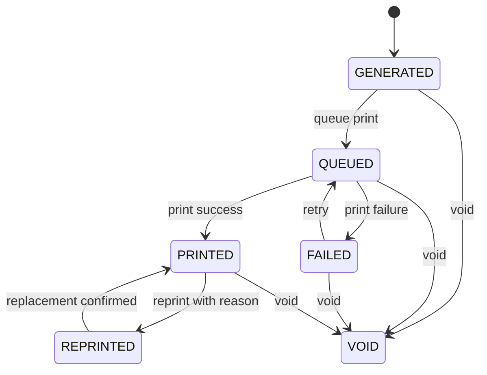
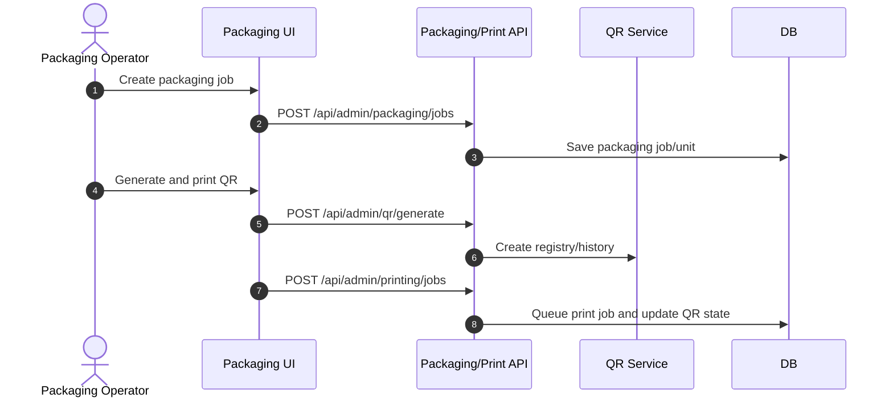

# M10 Packaging Printing

## 1. Mục đích

Packaging Printing quản lý trade item/GTIN, packaging job/unit, print job/log, QR registry và QR lifecycle. Module này tách identity thương phẩm/GTIN khỏi SKU, quản lý in/reprint/void và tạo dữ liệu đầu vào cho public trace.

## 2. Boundary

| In scope | Out of scope |
|---|---|
| Trade item, GTIN, packaging job/unit, QR generate, print queue, print log, reprint/void, QR lifecycle | SKU/recipe definition, batch release decision, public trace rendering, device driver chi tiết nếu chưa owner-approved |

## 3. Owner

| Owner type | Role |
|---|---|
| Business owner | Packaging/Operations Owner |
| Product/BA owner | BA phụ trách packaging/QR |
| Technical owner | Backend Lead / Integration Lead |
| QA owner | QA packaging/trace reviewer |

## 4. Chức năng

| function_id | Function | Description | Priority |
|---|---|---|---|
| M10-F01 | Trade item/GTIN | Quản lý thương phẩm/GTIN tách khỏi SKU. | P0 |
| M10-F02 | Packaging job | Tạo/start/complete/cancel packaging job. | P0 |
| M10-F03 | Packaging unit | Ghi đơn vị đóng gói theo job/batch. | P0 |
| M10-F04 | QR generation | Sinh QR cho packaging unit/job. | P0 |
| M10-F05 | Print queue | Queue, mark printed/failed, retry. | P0 |
| M10-F06 | Void/reprint | Vô hiệu hoặc in lại QR/print job có reason/audit. | P0 |

## 5. Business Rules

| rule_id | Rule | Affected data | Affected API | Affected UI | Validation | Exception | Test |
|---|---|---|---|---|---|---|---|
| BR-M10-001 | Trade item/GTIN identity tách khỏi SKU identity. | `op_trade_item_gtin` | trade item APIs | SCR-TRADE-ITEMS | unique GTIN | `DUPLICATE_GTIN` | TC-M10-GTIN-002 |
| BR-M10-002 | Packaging job chỉ tạo khi batch/process prerequisites đủ. | `op_packaging_job` | packaging job API | SCR-PACKAGING-JOBS | prerequisite check | halt/cancel | TC-M10-PKG-001 |
| BR-M10-003 | QR lifecycle chỉ theo `GENERATED`, `QUEUED`, `PRINTED`, `FAILED`, `VOID`, `REPRINTED`. | `op_qr_registry` | QR/print APIs | SCR-QR-REGISTRY | state transition check | `QR_INVALID_STATE` | TC-M10-QR-003 |
| BR-M10-004 | Void/reprint bắt buộc reason và audit. | `op_qr_state_history`, `op_print_log` | reprint/void APIs | SCR-PRINT-QUEUE | reason required | `REASON_REQUIRED` | TC-EXC-REPRINT-001 |
| BR-M10-005 | QR `VOID`/`FAILED` không public trace như valid QR. | QR/public trace | public trace | SCR-PUBLIC-TRACE | status policy | safe public response | TC-OP-QR-001 |
| BR-M10-006 | Commercial outbound print/public QR activation must not bypass required batch/job readiness and QC/release gates. | batch/packaging | print job API | SCR-PRINT-QUEUE | batch/job readiness | block print | TC-M10-PRINT-004 |
| BR-M10-007 | Reprint must link original QR/print history and preserve genealogy. | `op_qr_state_history`, `op_print_log` | reprint API | SCR-PRINT-QUEUE | original QR link check | `QR_INVALID_STATE` | TC-M10-PRINT-005 |

## 6. Tables

| table | Type | Purpose | Ownership | Notes |
|---|---|---|---|---|
| `op_trade_item` | master | Trade item definition. | M10 | Links SKU but not same identity. |
| `op_trade_item_gtin` | master/mapping | GTIN/barcode config. | M10 | Unique GTIN. |
| `op_packaging_job` | transaction | Packaging job header/status. | M10 | Batch/job linkage. |
| `op_packaging_unit` | transaction | Unit-level packaging record. | M10 | QR source. |
| `op_print_job` | transaction | Print queue/job. | M10 | Async/retry. |
| `op_print_log` | history | Printer result/history. | M10 | Append-only. |
| `op_qr_registry` | registry | QR identity and lifecycle. | M10/M12 | Public trace input. |
| `op_qr_state_history` | history | QR lifecycle transitions. | M10 | Append-only. |

## 7. APIs

| method | path | Purpose | Permission | Idempotency | Request | Response | Test |
|---|---|---|---|---|---|---|---|
| GET | `/api/admin/trade-items` | List trade items/GTIN | `TRADE_ITEM_VIEW` | No | filters | `TradeItemListResponse` | TC-M10-GTIN-002 |
| POST | `/api/admin/trade-items` | Create trade item/GTIN config | `TRADE_ITEM_CREATE` | Yes | `TradeItemCreateRequest` | `TradeItemResponse` | TC-M10-GTIN-002 |
| POST | `/api/admin/packaging/jobs` | Create packaging job | `PACKAGING_JOB_CREATE` | Yes | `PackagingJobCreateRequest` | `PackagingJobResponse` | TC-M10-PKG-001 |
| POST | `/api/admin/qr/generate` | Generate QR | `QR_GENERATE` | Yes | `QrGenerateRequest` | `QrGenerateResponse` | TC-M10-QR-003 |
| POST | `/api/admin/printing/jobs` | Queue print job | `PRINT_JOB_CREATE` | Yes | `PrintJobRequest` | `PrintJobResponse` | TC-M10-PRINT-004 |
| POST | `/api/admin/printing/jobs/{printJobId}/reprint` | Reprint with reason | `QR_REPRINT` | Yes | `ReprintRequest` | `PrintJobResponse` | TC-M10-PRINT-004 |

## 8. UI Screens

| screen_id | Route | Purpose | Primary actions | Permission |
|---|---|---|---|---|
| SCR-TRADE-ITEMS | `/admin/packaging/trade-items` | Trade item/GTIN config | create, edit, deactivate | `trade_item.write` |
| SCR-PACKAGING-JOBS | `/admin/packaging/jobs` | Packaging jobs | create, start, complete, cancel | `packaging_job.write` |
| SCR-QR-REGISTRY | `/admin/printing/qr-registry` | QR lifecycle registry | generate, queue, void, reprint, preview | `qr.read`, command permissions |
| SCR-PRINT-QUEUE | `/admin/printing/queue` | Print queue | queue, mark printed/failed, retry | `print_job.write` |

## 9. Roles / Permissions

| Role | Permissions/actions | Notes |
|---|---|---|
| Packaging Operator | Packaging job, QR generate, print queue | Requires reason for void/reprint. |
| Packaging Manager | Trade item/GTIN and job oversight | Can approve config changes if policy requires. |
| QA Manager | QR preview/void review | Public trace policy oversight. |
| Integration Operator | Printer/device monitoring if integrated | No direct DB/device bypass. |

## 10. Workflow

| workflow_id | Trigger | Steps | Output | Related docs |
|---|---|---|---|---|
| WF-M10-PACK | Batch ready | Create packaging job -> complete unit | Packaging unit/job complete | `workflows/05_CANONICAL_OPERATIONAL_FLOW.md` |
| WF-M10-QR | Packaging unit ready | Generate QR -> queue print -> printed/failed | QR lifecycle state | `workflows/04_STATE_MACHINES.md` |
| WF-M10-REPRINT | Print issue | Reason -> reprint job -> history | Reprinted QR/print log | `workflows/07_EXCEPTION_FLOWS.md` |

## 11. State Machine

## 12. Sequence / Activity Flow

## 13. Input / Output

| Type | Input | Output |
|---|---|---|
| UI | batch, trade item, quantity, printer, QR action reason | packaging job, QR, print status |
| API | PackagingJobCreateRequest, QrGenerateRequest, PrintJobRequest | PackagingJobResponse, QrGenerateResponse, PrintJobResponse |
| Event | QR printed/failed/void/reprinted | Public trace projection, dashboard |

## 14. Events

| event | Producer | Consumer | Payload summary |
|---|---|---|---|
| `PACKAGING_JOB_CREATED` | M10 | M15/M12 | job, batch, trade item |
| `QR_GENERATED` | M10 | M12/M15 | qr id/code, batch/job |
| `PRINT_JOB_QUEUED` | M10 | Printer worker/M15 | print job, QR count |
| `QR_PRINTED` | M10 | M12 | QR status and trace input |
| `QR_VOIDED` | M10 | M12/M13 | QR, reason |
| `QR_REPRINTED` | M10 | M12/Audit | original/new print refs |

## 15. Audit Log

| action | Audit payload | Retention/sensitivity |
|---|---|---|
| GTIN/trade item change | before/after, actor | Operational audit |
| QR generate/queue/printed/failed | QR, print job, actor/system | High retention |
| void/reprint | reason, original QR/print, new print ref | High retention |

## 16. Validation Rules

| validation_id | Rule | Error code | Blocking |
|---|---|---|---|
| VAL-M10-001 | GTIN unique if provided | `DUPLICATE_GTIN` | Yes |
| VAL-M10-002 | Packaging job prerequisites complete | `PROCESS_NOT_COMPLETE` | Yes |
| VAL-M10-003 | QR transition valid | `QR_INVALID_STATE` | Yes |
| VAL-M10-004 | Reprint/void reason required | `REASON_REQUIRED` | Yes |
| VAL-M10-005 | Commercial print requires active trade item GTIN mapping | `GTIN_REQUIRED`, `GTIN_MAPPING_MISSING` | Yes |
| VAL-M10-006 | Reprint requires original QR/print link | `QR_INVALID_STATE` | Yes |

## 17. Exception Flow

| exception | Rule | Recovery |
|---|---|---|
| halt packaging | Reason and current step required | Resume/cancel/correction |
| print failed | Mark `FAILED`, retry or void | Retry with count/reason if manual |
| void QR | Reason required; public safe invalid status | No delete |
| reprint | Reason required; link original and replacement | Append history |

## 18. Test Cases

| test_id | Scenario | Expected result | Priority |
|---|---|---|---|
| TC-M10-GTIN-002 | Create duplicate GTIN | `DUPLICATE_GTIN` | P0 |
| TC-M10-PKG-001 | Create packaging job | Job created when prerequisites pass | P0 |
| TC-M10-QR-003 | Generate QR and lifecycle | State history valid | P0 |
| TC-M10-PRINT-004 | Reprint without reason | Rejected | P0 |
| TC-M10-PRINT-005 | Reprint without original QR history link | Rejected | P0 |
| TC-OP-QR-001 | Public trace on void QR | Safe invalid/void response | P0 |

## 19. Done Gate

- Trade item/GTIN config separate from SKU.
- Packaging job and QR generation implemented.
- QR lifecycle supports generated/queued/printed/failed/void/reprinted.
- Reprint/void/retry audited with reason.
- Public trace can consume printed QR but blocks invalid/void as safe response.
- Print/device exact callbacks marked if owner decision needed.

## 20. Risks

| risk | Impact | Mitigation |
|---|---|---|
| Printer model/callback unspecified | Incomplete automation | Define adapter/callback in CODE12 owner decision. |
| SKU and trade item confused | Wrong GTIN/trace | Separate tables and UI. |
| Reprint without lineage | Duplicate/invalid trace | Link original and reprint history. |

## 21. Phase triển khai

| Phase/CODE | Scope in phase | Dependency | Done gate |
|---|---|---|---|
| CODE04 | Packaging, QR, print, GTIN | CODE03 | QR lifecycle and reprint audit pass |
| CODE12 | Device/printer integration | CODE04/CODE10 | Printer boundary tested |
| CODE07 | Public trace consumes QR | CODE04/CODE06 | Public trace policy pass |
