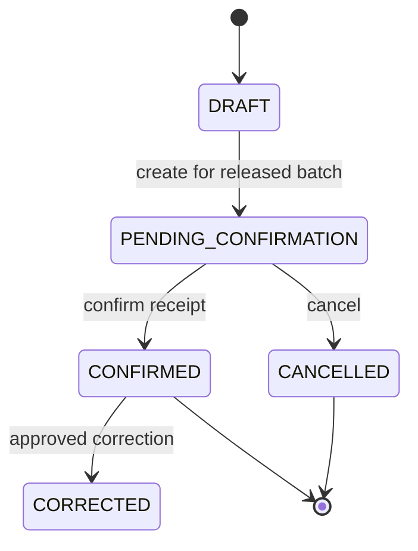
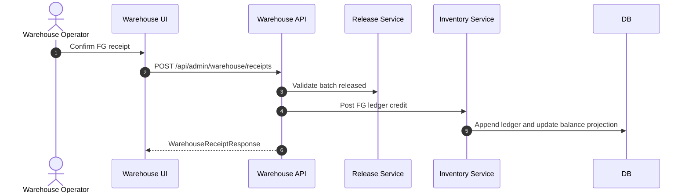

# M11 Warehouse Inventory

## 1. Mục đích

Warehouse Inventory quản lý warehouse receipt, inventory ledger, lot balance, allocation reference và inventory adjustment. Module này là nguồn sự thật vận hành cho ledger và tồn kho; finished goods chỉ tăng khi warehouse receipt của batch đã release được confirm.

## 2. Boundary

| In scope | Out of scope |
|---|---|
| Warehouse receipt, inventory ledger append-only, lot balance projection, allocation reference, inventory adjustment/reversal | Raw intake creation, production order, material request business logic, batch release decision, sales order/customer master |

## 3. Owner

| Owner type | Role |
|---|---|
| Business owner | Warehouse/Inventory Owner |
| Product/BA owner | BA phụ trách inventory |
| Technical owner | DBA / Backend Lead |
| QA owner | QA inventory ledger owner |

## 4. Chức năng

| function_id | Function | Description | Priority |
|---|---|---|---|
| M11-F01 | Warehouse receipt | Confirm finished-goods receipt for released batch. | P0 |
| M11-F02 | Inventory ledger | Append-only movement ledger. | P0 |
| M11-F03 | Lot balance | Projection of available/hold/reserved/consumed balance. | P0 |
| M11-F04 | Inventory adjustment | Adjustment/reversal with approval and reason. | P1 |
| M11-F05 | Allocation reference | Reserve/confirm/release allocation references when shipment/sale-lock/recall/external order refs require stock hold. | P1 |
| M11-F06 | Hold impact | Support inventory hold/sale lock from recall. | P0 |

## 5. Business Rules

| rule_id | Rule | Affected data | Affected API | Affected UI | Validation | Exception | Test |
|---|---|---|---|---|---|---|---|
| BR-M11-001 | Warehouse receipt requires batch release `APPROVED_RELEASED`. | `op_warehouse_receipt` | warehouse receipt API | SCR-WAREHOUSE-RECEIPTS | release check | `BATCH_NOT_RELEASED` | TC-UI-WH-001 |
| BR-M11-002 | Confirmed warehouse receipt posts finished-goods ledger credit. | `op_inventory_ledger` | receipt confirm | SCR-INVENTORY-LEDGER | atomic transaction | reversal/correction | TC-M11-WH-001 |
| BR-M11-003 | Inventory ledger is append-only. | `op_inventory_ledger` | all movement APIs | SCR-INVENTORY-LEDGER | no update/delete | reversal/adjustment | TC-OP-INV-001 |
| BR-M11-004 | Lot balance derives from ledger, not manual source of truth. | `op_inventory_lot_balance` | balance query | SCR-LOT-BALANCE | projection check | rebuild projection | TC-UI-BAL-001 |
| BR-M11-005 | Adjustment requires reason and approval before ledger effect. | adjustment/ledger | adjustment API | SCR-INVENTORY-ADJUSTMENTS | reason/approval | reject | TC-UI-ADJ-001 |
| BR-M11-006 | Active hold/sale lock blocks allocation/shipment/receipt actions according scope. | balance/hold refs | warehouse/inventory APIs | SCR-RECALL-HOLD | hold check | release hold | TC-UI-HOLD-001 |

## 6. Tables

| table | Type | Purpose | Ownership | Notes |
|---|---|---|---|---|
| `op_warehouse_receipt` | transaction | Finished-goods warehouse receipt. | M11 | Requires released batch. |
| `op_inventory_ledger` | ledger | Append-only movement ledger. | M11 | Raw decrement and FG credit. |
| `op_inventory_lot_balance` | projection | Lot balance by warehouse/item/status. | M11 | Derived from ledger. |
| `op_inventory_allocation` | transaction/ref | Reservation/allocation references. | M11 | External order refs only. |
| `op_inventory_adjustment` | transaction/control | Adjustment/reversal request. | M11 | Approval and reason. |

## 7. APIs

| method | path | Purpose | Permission | Idempotency | Request | Response | Test |
|---|---|---|---|---|---|---|---|
| POST | `/api/admin/warehouse/receipts` | Confirm FG warehouse receipt | `WAREHOUSE_RECEIPT_CONFIRM` | Yes | `WarehouseReceiptCreateRequest` | `WarehouseReceiptResponse` | TC-M11-WH-001 |
| GET | `/api/admin/inventory/ledger` | Query inventory ledger | `INVENTORY_LEDGER_VIEW` | No | filters | `InventoryLedgerListResponse` | TC-M11-INV-002 |
| GET | `/api/admin/inventory/balances` | Query lot balances | `INVENTORY_BALANCE_VIEW` | No | filters | `InventoryBalanceListResponse` | TC-M11-INV-003 |
| POST | `/api/admin/inventory/adjustments` | Create adjustment/reversal | `INVENTORY_ADJUSTMENT_CREATE` | Yes | `InventoryAdjustmentRequest` | `InventoryAdjustmentResponse` | TC-M11-INV-004 |

## 8. UI Screens

| screen_id | Route | Purpose | Primary actions | Permission |
|---|---|---|---|---|
| SCR-WAREHOUSE-RECEIPTS | `/admin/warehouse/receipts` | FG warehouse receipts | create, confirm, cancel | `warehouse_receipt.confirm` |
| SCR-INVENTORY-LEDGER | `/admin/inventory/ledger` | Append-only ledger viewer | view source, export | `inventory_ledger.read` |
| SCR-LOT-BALANCE | `/admin/inventory/lot-balance` | Lot balance projection | view ledger, hold/release if allowed | `lot_balance.read` |
| SCR-INVENTORY-ADJUSTMENTS | `/admin/inventory/adjustments` | Adjustments/reversals | create, submit, approve, apply | `inventory_adjustment.write` |

## 9. Roles / Permissions

| Role | Permissions/actions | Notes |
|---|---|---|
| Warehouse Operator | Confirm warehouse receipt, view balances | Cannot adjust without approval. |
| Warehouse Manager | Adjustment/hold management | Reason required. |
| Finance Viewer | Ledger read/reconcile support | Read-only unless owner grants. |
| Admin | Governance/override | No direct ledger mutation. |

## 10. Workflow

| workflow_id | Trigger | Steps | Output | Related docs |
|---|---|---|---|---|
| WF-M11-WH | Batch released | Create receipt -> confirm -> post FG ledger -> update balance | FG inventory available | `workflows/05_CANONICAL_OPERATIONAL_FLOW.md` |
| WF-M11-LEDGER | Movement event | Validate source -> post ledger -> update projection | Ledger row and balance | `database/03_TABLE_SPECIFICATION.md` |
| WF-M11-ADJ | Correction needed | Create adjustment -> approval -> apply reversal/adjustment | Adjusted ledger/balance | `workflows/07_EXCEPTION_FLOWS.md` |

## 11. State Machine

## 12. Sequence / Activity Flow

## 13. Input / Output

| Type | Input | Output |
|---|---|---|
| UI | batch, warehouse, qty, receipt time, adjustment reason | receipt/ledger/balance response |
| API | WarehouseReceiptCreateRequest, InventoryAdjustmentRequest | WarehouseReceiptResponse, ledger/balance lists |
| Event | Receipt confirmed/ledger posted | Trace, MISA, dashboard |

## 14. Events

| event | Producer | Consumer | Payload summary |
|---|---|---|---|
| `WAREHOUSE_RECEIPT_CONFIRMED` | M11 | M12/M14/M15 | receipt, batch, warehouse, qty |
| `INVENTORY_LEDGER_POSTED` | M11 | M12/M15 | ledger id, source type, qty delta |
| `LOT_BALANCE_UPDATED` | M11 | M15/M13 | lot, available/hold/reserved |
| `INVENTORY_ADJUSTMENT_APPLIED` | M11 | Audit/MISA if needed | adjustment id, reason |

## 15. Audit Log

| action | Audit payload | Retention/sensitivity |
|---|---|---|
| receipt confirm/cancel/correct | actor, batch, qty, warehouse, reason | High retention |
| ledger post/reversal/adjustment | source, qty delta, actor/system, reason | High retention |
| hold/allocation change | target, reason, actor | High retention |

## 16. Validation Rules

| validation_id | Rule | Error code | Blocking |
|---|---|---|---|
| VAL-M11-001 | Batch must be released | `BATCH_NOT_RELEASED` | Yes |
| VAL-M11-002 | Quantity > 0 | `VALIDATION_FAILED` | Yes |
| VAL-M11-003 | Warehouse active and correct type | `VALIDATION_FAILED` | Yes |
| VAL-M11-004 | Ledger posted records cannot mutate | `STATE_CONFLICT` | Yes |
| VAL-M11-005 | Adjustment reason and approval required | `REASON_REQUIRED`, `APPROVAL_POLICY_VIOLATION` | Yes |

## 17. Exception Flow

| exception | Rule | Recovery |
|---|---|---|
| warehouse receipt cancel | Only before confirmation | Cancel with reason |
| correction after confirm | Use reversal/adjustment | Link original receipt/ledger |
| active hold | Blocks allocation/receipt depending scope | Release hold with approval |
| projection mismatch | Rebuild projection from ledger | Alert and audit |

## 18. Test Cases

| test_id | Scenario | Expected result | Priority |
|---|---|---|---|
| TC-UI-WH-001 | Warehouse receipt before release | Rejected | P0 |
| TC-M11-WH-001 | Confirm released batch receipt | FG ledger credit posted | P0 |
| TC-M11-INV-002 | Query ledger | Append-only movements returned | P0 |
| TC-M11-INV-003 | Lot balance projection | Matches ledger | P0 |
| TC-M11-INV-004 | Adjustment without reason | Rejected | P0 |

## 19. Done Gate

- Warehouse receipt blocks unreleased batch.
- Confirmed receipt posts FG ledger and lot balance.
- Ledger append-only and reversal/adjustment flow exists.
- Balance projection derives from ledger.
- Trace/MISA/dashboard can consume inventory events.

## 20. Risks

| risk | Impact | Mitigation |
|---|---|---|
| Ledger correction done by update | Audit/trace broken | DB/service append-only guard. |
| Release gate bypass | Unapproved goods in inventory | M11 validates M09 release status. |
| Projection drift | Incorrect availability | Rebuild from ledger and reconciliation test. |

## 21. Phase triển khai

| Phase/CODE | Scope in phase | Dependency | Done gate |
|---|---|---|---|
| CODE06 | Warehouse receipt, ledger, balance | CODE05 | Released batch receipt posts ledger |
| CODE08 | Recall hold/sale lock support | CODE07 | Holds affect balances/actions |
| CODE16 | Retention/archive | Owner retention | Ledger retention safe |
