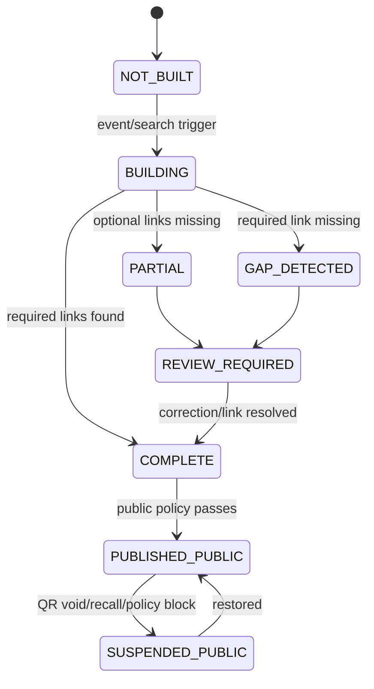
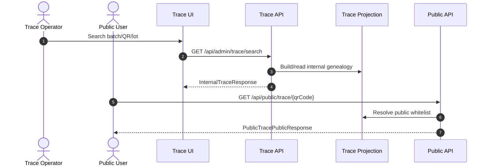

# M12 Traceability

## 1. Mục đích

Traceability cung cấp internal trace, genealogy search, trace link/index và public trace projection. Module này liên kết source origin, raw lot, material issue, batch, packaging, QR, warehouse và shipment reference nếu có; public trace chỉ trả dữ liệu whitelist-safe.

## 2. Boundary

| In scope                                                                                               | Out of scope                                                                                                      |
| ------------------------------------------------------------------------------------------------------ | ----------------------------------------------------------------------------------------------------------------- |
| `op_trace_link`, genealogy, internal trace search, public trace projection/policy, trace gap detection | Raw/production/inventory creation, recall case ownership, customer/order data ownership, public marketing content |

## 3. Owner

| Owner type       | Role                          |
| ---------------- | ----------------------------- |
| Business owner   | QA/Traceability Owner         |
| Product/BA owner | BA phụ trách trace/recall     |
| Technical owner  | Data Architect / Backend Lead |
| QA owner         | QA trace/public policy owner  |

## 4. Chức năng

| function_id | Function              | Description                                                                                  | Priority |
| ----------- | --------------------- | -------------------------------------------------------------------------------------------- | -------- |
| M12-F01     | Trace link capture    | Lưu link giữa source/raw/issue/batch/packaging/QR/warehouse.                                 | P0       |
| M12-F02     | Internal trace search | Search forward/backward theo QR/batch/lot/material.                                          | P0       |
| M12-F03     | Genealogy view        | Hiển thị chain nội bộ.                                                                       | P0       |
| M12-F04     | Public trace resolve  | Resolve QR public-safe.                                                                      | P0       |
| M12-F05     | Public field policy   | Whitelist fields, block internal data leakage.                                               | P0       |
| M12-F06     | Trace gap detection   | Flag missing required link and block dependent close/release decisions when policy requires. | P0       |

## 5. Business Rules

| rule_id    | Rule                                                                                                                                                                                                                                                                                                                                                                                                                                                                                                   | Affected data              | Affected API                 | Affected UI       | Validation                                              | Exception            | Test              |
| ---------- | ------------------------------------------------------------------------------------------------------------------------------------------------------------------------------------------------------------------------------------------------------------------------------------------------------------------------------------------------------------------------------------------------------------------------------------------------------------------------------------------------------ | -------------------------- | ---------------------------- | ----------------- | ------------------------------------------------------- | -------------------- | ----------------- |
| BR-M12-001 | Internal trace must preserve genealogy chain across raw lot -> issue -> batch -> QR -> warehouse.                                                                                                                                                                                                                                                                                                                                                                                                      | `op_trace_link`            | `/api/admin/trace/search`    | SCR-GENEALOGY     | required links                                          | gap flag             | TC-UI-TRC-002     |
| BR-M12-002 | Public trace must not expose supplier/personnel/cost/QC defect/loss/MISA.                                                                                                                                                                                                                                                                                                                                                                                                                              | public projection          | `/api/public/trace/{qrCode}` | SCR-PUBLIC-TRACE  | whitelist policy                                        | suppress/block       | TC-UI-PTR-002     |
| BR-M12-003 | Public trace API (`/api/public/trace/{qrCode}`) lookup QR trả `qr_status` an toàn: chỉ `PRINTED` trả full whitelist payload; `VOID`/`FAILED` trả safe invalid/void state; `GENERATED`/`QUEUED`/`REPRINTED-cũ` trả `QR_NOT_FOUND` (deny-by-default). Mọi field whitelist phải có row active `is_public = true` trong `op_public_trace_policy`; field thiếu policy bị suppress (xem `database/03_TABLE_SPECIFICATION.md` deny-by-default note). Parity bắt buộc với MISA redaction (xem M14 BR-M14-005). | QR status/projection       | public trace API             | SCR-PUBLIC-TRACE  | QR lifecycle check + policy whitelist + deny-by-default | safe response        | TC-OP-QR-001      |
| BR-M12-004 | Trace gap does not invent relationship.                                                                                                                                                                                                                                                                                                                                                                                                                                                                | trace index                | trace APIs                   | SCR-GENEALOGY     | no inferred link                                        | `TRACE_GAP_DETECTED` | TC-M12-TRACE-001  |
| BR-M12-005 | Recall uses trace snapshot, not parallel trace truth.                                                                                                                                                                                                                                                                                                                                                                                                                                                  | trace/recall               | recall impact API            | SCR-RECALL-IMPACT | snapshot version                                        | re-run new snapshot  | TC-M13-RECALL-002 |
| BR-M12-006 | Internal trace fields require explicit permission; export requires stronger permission than view.                                                                                                                                                                                                                                                                                                                                                                                                      | `vw_internal_traceability` | trace APIs                   | SCR-GENEALOGY     | permission check                                        | `FORBIDDEN`          | TC-M12-PERM-001   |

## 6. Tables

| table                      | Type             | Purpose                               | Ownership | Notes                                                                                   |
| -------------------------- | ---------------- | ------------------------------------- | --------- | --------------------------------------------------------------------------------------- |
| `op_trace_link`            | mapping/history  | Directed trace links.                 | M12       | Append-only/corrected by new link record.                                               |
| `op_batch_genealogy_link`  | mapping          | Batch genealogy summary.              | M12       | Can be derived/optimized.                                                               |
| `op_trace_search_index`    | projection/index | Search optimization.                  | M12       | Rebuildable.                                                                            |
| `vw_internal_traceability` | view/projection  | Internal trace view.                  | M12       | Internal fields require `TRACE_INTERNAL_VIEW`; export requires `TRACE_INTERNAL_EXPORT`. |
| `vw_public_traceability`   | view/projection  | Public trace view.                    | M12       | Whitelist-only.                                                                         |
| `op_public_trace_policy`   | config/policy    | Public field allowlist/status policy. | M12       | Owner-controlled.                                                                       |

## 7. APIs

| method | path                         | Purpose               | Permission            | Idempotency | Request        | Response                | Test              |
| ------ | ---------------------------- | --------------------- | --------------------- | ----------- | -------------- | ----------------------- | ----------------- |
| GET    | `/api/admin/trace/search`    | Internal trace search | `TRACE_INTERNAL_VIEW` | No          | filters/search | `InternalTraceResponse` | TC-M12-TRACE-001  |
| GET    | `/api/public/trace/{qrCode}` | Public trace resolve  | N/A                   | No          | N/A            | `PublicTracePublicResponse` | TC-M12-PTRACE-002 |

## 8. UI Screens

| screen_id                | Route                                | Purpose                           | Primary actions                  | Permission             |
| ------------------------ | ------------------------------------ | --------------------------------- | -------------------------------- | ---------------------- |
| SCR-TRACE-SEARCH         | `/admin/traceability/search`         | Internal trace search             | search, open genealogy, export   | `trace.read`           |
| SCR-GENEALOGY            | `/admin/traceability/genealogy`      | Trace genealogy tree              | expand, export internal trace    | `trace.genealogy.read` |
| SCR-PUBLIC-TRACE-PREVIEW | `/admin/traceability/public-preview` | Public trace preview/policy check | preview, compare, flag violation | `public_trace.preview` |
| SCR-PUBLIC-TRACE         | `/trace/:qrCode`                     | Anonymous public trace            | public lookup only               | anonymous              |

## 9. Roles / Permissions

| Role           | Permissions/actions                                                   | Notes                                 |
| -------------- | --------------------------------------------------------------------- | ------------------------------------- |
| Trace Operator | `TRACE_INTERNAL_VIEW`, `TRACE_GENEALOGY_VIEW`                         | No public policy edit unless granted. |
| QA Manager     | Trace review, `TRACE_INTERNAL_EXPORT`, public preview, recall support | Can flag gap.                         |
| Recall Manager | Read impact trace                                                     | Uses snapshot from M13.               |
| Public User    | Public trace only                                                     | Anonymous, safe fields only.          |

## 10. Workflow

| workflow_id     | Trigger                   | Steps                                            | Output               | Related docs                                 |
| --------------- | ------------------------- | ------------------------------------------------ | -------------------- | -------------------------------------------- |
| WF-M12-INTERNAL | Operational events posted | Build links/index -> search/genealogy            | Internal trace chain | `workflows/05_CANONICAL_OPERATIONAL_FLOW.md` |
| WF-M12-PUBLIC   | QR printed/public lookup  | Resolve QR -> apply policy -> return safe fields | PublicTracePublicResponse | `api/03_API_REQUEST_RESPONSE_SPEC.md`        |
| WF-M12-GAP      | Missing link              | Flag gap -> review/correction                    | Trace gap alert      | `workflows/07_EXCEPTION_FLOWS.md`            |

## 11. State Machine

## 12. Sequence / Activity Flow

## 13. Input / Output

| Type  | Input                                   | Output                                     |
| ----- | --------------------------------------- | ------------------------------------------ |
| UI    | QR/batch/lot/search type                | genealogy/internal trace/public trace      |
| API   | search params, QR code                  | InternalTraceResponse, PublicTracePublicResponse |
| Event | Raw lot/issue/batch/QR/warehouse events | trace link/index/projection                |

## 14. Events

| event                           | Producer | Consumer             | Payload summary                         |
| ------------------------------- | -------- | -------------------- | --------------------------------------- |
| `TRACE_LINK_CREATED`            | M12      | M13/M15              | source entity, target entity, link type |
| `TRACE_GAP_DETECTED`            | M12      | Alerts/Recall review | missing link details                    |
| `PUBLIC_TRACE_POLICY_VIOLATION` | M12      | QA/Admin             | forbidden field/policy                  |
| `PUBLIC_TRACE_RESOLVED`         | M12      | Audit/metrics        | QR and public status only               |

## 15. Audit Log

| action                       | Audit payload                          | Retention/sensitivity |
| ---------------------------- | -------------------------------------- | --------------------- |
| internal trace search/export | actor, search key, result count        | Sensitive internal    |
| public trace resolve         | QR, public status, request metadata    | Public-safe only      |
| policy violation             | field, source projection, actor/system | High retention        |
| trace correction             | original/new link, reason              | High retention        |

## 16. Validation Rules

| validation_id | Rule                                                   | Error code                      | Blocking                      |
| ------------- | ------------------------------------------------------ | ------------------------------- | ----------------------------- |
| VAL-M12-001   | Public trace QR must exist and be public-eligible      | `QR_INVALID`, `QR_NOT_PUBLIC`   | Yes for valid response        |
| VAL-M12-002   | Public response whitelist-only                         | `PUBLIC_FIELD_POLICY_VIOLATION` | Yes in preview/build          |
| VAL-M12-003   | Internal search requires permission                    | `FORBIDDEN`                     | Yes                           |
| VAL-M12-004   | Required chain missing                                 | `TRACE_GAP_DETECTED`            | Blocks recall close if policy |
| VAL-M12-005   | Internal trace export requires `TRACE_INTERNAL_EXPORT` | `FORBIDDEN`                     | Yes                           |

## 17. Exception Flow

| exception             | Rule                             | Recovery                                |
| --------------------- | -------------------------------- | --------------------------------------- |
| trace gap             | Do not infer relationship        | Create correction link or mark reviewed |
| public leakage        | Fail closed/suppress field       | Fix projection/policy                   |
| QR void/failed        | Public returns safe invalid/void | No internal reason leakage              |
| recall snapshot rerun | New snapshot version             | Do not overwrite previous snapshot      |

## 18. Test Cases

| test_id           | Scenario                                                    | Expected result               | Priority |
| ----------------- | ----------------------------------------------------------- | ----------------------------- | -------- |
| TC-M12-TRACE-001  | Search internal trace                                       | Chain returned or gap flagged | P0       |
| TC-UI-TRC-002     | Genealogy expands raw lot -> issue -> batch -> QR/warehouse | Nodes and links present       | P0       |
| TC-M12-PTRACE-002 | Public trace resolve printed QR                             | Whitelisted fields only       | P0       |
| TC-UI-PTR-002     | Public trace leakage field                                  | Block/suppress forbidden data | P0       |
| TC-OP-QR-001      | Void QR public trace                                        | Safe invalid/void message     | P0       |
| TC-M12-PERM-001   | Internal trace export without export permission             | `FORBIDDEN`                   | P0       |

## 19. Done Gate

- Trace links cover source/raw/issue/batch/packaging/QR/warehouse.
- Internal trace and genealogy work by QR/batch/lot.
- Public trace DTO/projection is separate and whitelist-only.
- Trace gaps are flagged, not inferred.
- Trace gap detection is P0 and permission-gated internal export is enforced.
- Recall can consume trace snapshot.

## 20. Risks

| risk                                         | Impact                | Mitigation                                                       |
| -------------------------------------------- | --------------------- | ---------------------------------------------------------------- |
| Public trace leaks internal fields           | Compliance/brand risk | Separate public DTO, whitelist tests.                            |
| Trace index drift                            | Wrong recall impact   | Rebuildable projection and gap detection.                        |
| External shipment/customer ownership unclear | Recall exposure gap   | Store only external reference keys until commerce owner decides. |

## 21. Phase triển khai

| Phase/CODE | Scope in phase              | Dependency      | Done gate                  |
| ---------- | --------------------------- | --------------- | -------------------------- |
| CODE07     | Internal trace/public trace | CODE06          | Trace smoke passes         |
| CODE08     | Recall impact dependency    | CODE07          | Impact snapshot uses trace |
| CODE16     | Retention/archive           | Owner retention | Trace retention safe       |
