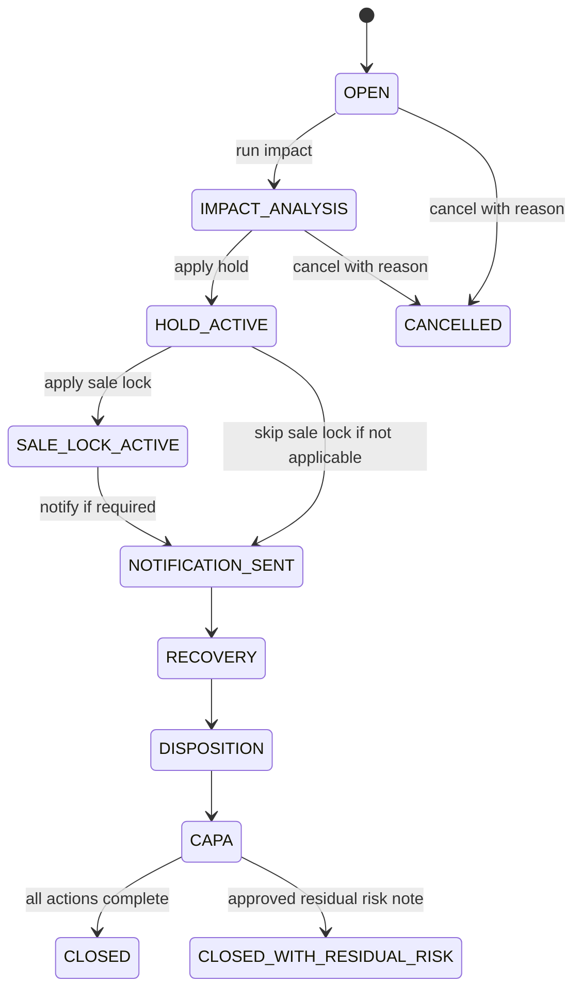
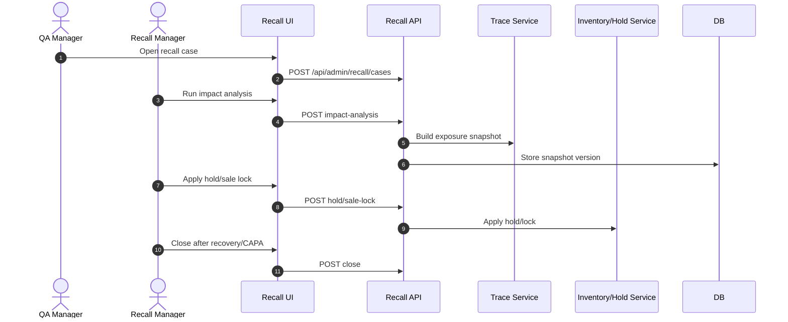

# M13 Recall

## 1. Mục đích

Recall quản lý incident, recall case, impact analysis, hold, sale lock, recovery, disposition và CAPA. Module này sử dụng trace snapshot để xác định exposure, nhưng không tạo nguồn trace riêng song song.

## 2. Boundary

| In scope                                                                                                              | Out of scope                                                                                          |
| --------------------------------------------------------------------------------------------------------------------- | ----------------------------------------------------------------------------------------------------- |
| Incident, recall case lifecycle, exposure snapshot, hold/sale lock, recovery item, disposition, CAPA, recall timeline | Internal trace engine, customer notification system chi tiết, CRM ownership, shipment/customer master |

## 3. Owner

| Owner type       | Role                          |
| ---------------- | ----------------------------- |
| Business owner   | QA/Recall Owner               |
| Product/BA owner | BA phụ trách recall           |
| Technical owner  | Backend Lead / Data Architect |
| QA owner         | QA recall test owner          |

## 4. Chức năng

| function_id | Function             | Description                                                               | Priority |
| ----------- | -------------------- | ------------------------------------------------------------------------- | -------- |
| M13-F01     | Incident capture     | Ghi nhận sự cố chất lượng/trace.                                          | P0       |
| M13-F02     | Recall case          | Mở/quản lý lifecycle recall.                                              | P0       |
| M13-F03     | Impact analysis      | Tạo exposure snapshot từ trace.                                           | P0       |
| M13-F04     | Hold/sale lock       | Hold inventory/batch/shipment references.                                 | P0       |
| M13-F05     | Recovery/disposition | Theo dõi recovery và disposition.                                         | P0       |
| M13-F06     | CAPA                 | Theo dõi corrective/preventive action.                                    | P0       |
| M13-F06a    | CAPA evidence upload | Upload và kiểm soát evidence ảnh/video/tài liệu cho CAPA close gate.      | P0       |
| M13-F07     | Recall close gate    | Chỉ close khi recovery/disposition/CAPA đạt policy.                       | P0       |
| M13-F08     | Close type handling  | Xử lý `CLOSED` và `CLOSED_WITH_RESIDUAL_RISK` với residual note bắt buộc. | P0       |

## 5. Business Rules

| rule_id    | Rule                                                                                                                                                                                                                                                                                                                                                                                                     | Affected data                    | Affected API            | Affected UI              | Validation                | Exception                                                                   | Test              |
| ---------- | -------------------------------------------------------------------------------------------------------------------------------------------------------------------------------------------------------------------------------------------------------------------------------------------------------------------------------------------------------------------------------------------------------- | -------------------------------- | ----------------------- | ------------------------ | ------------------------- | --------------------------------------------------------------------------- | ----------------- |
| BR-M13-001 | Recall impact analysis phải dựa trên trace genealogy/snapshot.                                                                                                                                                                                                                                                                                                                                           | `op_recall_exposure_snapshot`    | impact API              | SCR-RECALL-IMPACT        | trace availability        | trace gap review                                                            | TC-M13-RECALL-002 |
| BR-M13-002 | Hold/sale lock requires reason and target.                                                                                                                                                                                                                                                                                                                                                               | hold/sale lock tables            | hold/sale-lock APIs     | SCR-RECALL-HOLD          | reason/target check       | `REASON_REQUIRED`                                                           | TC-UI-HOLD-001    |
| BR-M13-003 | Recall close blocked while recovery/CAPA open.                                                                                                                                                                                                                                                                                                                                                           | recall/capa                      | close API               | SCR-RECALL-RECOVERY-CAPA | open item check           | `RECOVERY_OPEN`, `CAPA_REQUIRED`                                            | TC-UI-CAPA-001    |
| BR-M13-004 | Re-run impact creates new snapshot version, not overwrite.                                                                                                                                                                                                                                                                                                                                               | exposure snapshot                | impact API              | SCR-RECALL-IMPACT        | snapshot version          | preserve history                                                            | TC-UI-RCL-002     |
| BR-M13-005 | Public/customer notification references do not make Recall owner of CRM/customer master.                                                                                                                                                                                                                                                                                                                 | recall refs                      | notification ref fields | Recall UI                | reference-only            | external integration                                                        | TC-M13-EXT-001    |
| BR-M13-006 | Close type `CLOSED_WITH_RESIDUAL_RISK` requires residual note, trace gap review and explicit approval.                                                                                                                                                                                                                                                                                                   | `op_recall_case`                 | close API               | SCR-RECALL-CASES         | close type/residual check | `RECALL_RESIDUAL_RISK_NOTE_REQUIRED`, `TRACE_GAP_DETECTED`                  | TC-M13-CLOSE-004  |
| BR-M13-007 | CAPA evidence upload tuân thủ cùng MIME/size policy với M05 source origin evidence: MIME allowlist `image/jpeg`,`image/png`,`image/webp` (≤10MB), `video/mp4`,`video/quicktime` (≤100MB). Binary lưu qua storage adapter: dev/test dùng local filesystem storage, production dùng server lưu trữ của công ty qua cấu hình; DB chỉ lưu metadata (`evidence_uri`, `evidence_hash`, `mime_type`, `file_size_bytes`, `original_filename`, `evidence_type`, `scan_status`). Evidence chỉ được tính hợp lệ khi scan sạch (`scan_status = CLEAN`); cần ít nhất 1 evidence hợp lệ trước khi close CAPA/recall. | `op_recall_capa`, `op_recall_capa_evidence` | evidence API, recall close API | SCR-RECALL-RECOVERY-CAPA | MIME/size/scan/existence check | `EVIDENCE_REQUIRED`, `EVIDENCE_MIME_NOT_ALLOWED`, `EVIDENCE_FILE_TOO_LARGE`, `EVIDENCE_SCAN_PENDING`, `EVIDENCE_SCAN_FAILED`, `EVIDENCE_MALWARE_DETECTED` | TC-UI-CAPA-001    |

## 6. Tables

| table                          | Type                 | Purpose                        | Ownership | Notes                                                         |
| ------------------------------ | -------------------- | ------------------------------ | --------- | ------------------------------------------------------------- |
| `op_incident_case`             | transaction          | Incident record.               | M13       | May escalate to recall.                                       |
| `op_recall_case`               | transaction/workflow | Recall case header/status.     | M13       | Lifecycle state.                                              |
| `op_recall_case_batch`         | mapping              | Affected batch mapping.        | M13       | Could be exposure snapshot detail.                            |
| `op_recall_exposure_snapshot`  | snapshot             | Impact analysis snapshot.      | M13       | Versioned.                                                    |
| `op_batch_hold_registry`       | control              | Batch/lot hold registry.       | M13/M11   | Blocks downstream actions.                                    |
| `op_sale_lock_registry`        | control              | Sale/shipment lock references. | M13       | External refs only.                                           |
| `op_recall_recovery_item`      | transaction          | Recovery actions.              | M13       | Must close before recall close.                               |
| `op_recall_disposition_record` | transaction/history  | Disposition outcome.           | M13       | Audit-heavy.                                                  |
| `op_recall_capa`               | transaction          | CAPA action/task.              | M13       | Canonical CAPA table; owner, due date, status and close gate. |
| `op_recall_capa_evidence`      | history/file-ref     | CAPA evidence references.      | M13       | Append-only file metadata; FK CAPA; no binary blob in DB.     |
| N/A                            | N/A                  | `op_recall_capa_item`          | M13       | Do not create in baseline; `op_recall_capa` is the canonical CAPA action/task table unless a later ADR changes database spec. |

## 7. APIs

| method | path                                                     | Purpose             | Permission               | Idempotency | Request                   | Response               | Test              |
| ------ | -------------------------------------------------------- | ------------------- | ------------------------ | ----------- | ------------------------- | ---------------------- | ----------------- |
| POST   | `/api/admin/incidents`                                   | Open incident       | `INCIDENT_CREATE`        | Yes         | `IncidentCreateRequest`   | `IncidentResponse`     | TC-M13-RECALL-001 |
| POST   | `/api/admin/recall/cases`                                | Open recall case    | `RECALL_CASE_CREATE`     | Yes         | `RecallCaseCreateRequest` | `RecallCaseResponse`   | TC-M13-RECALL-001 |
| POST   | `/api/admin/recall/cases/{recallCaseId}/impact-analysis` | Run impact snapshot | `RECALL_IMPACT_ANALYSIS` | Yes         | `RecallImpactRequest`     | `RecallImpactResponse` | TC-M13-RECALL-002 |
| POST   | `/api/admin/recall/cases/{recallCaseId}/hold`            | Apply hold          | `RECALL_HOLD_APPLY`      | Yes         | `RecallHoldRequest`       | `RecallCaseResponse`   | TC-M13-RECALL-003 |
| POST   | `/api/admin/recall/cases/{recallCaseId}/sale-lock`       | Apply sale lock     | `RECALL_SALE_LOCK_APPLY` | Yes         | `RecallSaleLockRequest`   | `RecallCaseResponse`   | TC-M13-RECALL-003 |
| POST   | `/api/admin/recall/capas/{capaId}/evidence`              | Add CAPA evidence   | `RECALL_CAPA_EVIDENCE_ADD` | Yes       | `EvidenceCreateRequest`   | `RecallCapaResponse`   | TC-UI-CAPA-001    |
| POST   | `/api/admin/recall/cases/{recallCaseId}/close`           | Close recall        | `RECALL_CLOSE`           | Yes         | `RecallCloseRequest`      | `RecallCaseResponse`   | TC-M13-RECALL-001 |

## 8. UI Screens

| screen_id                | Route                           | Purpose                   | Primary actions                       | Permission              |
| ------------------------ | ------------------------------- | ------------------------- | ------------------------------------- | ----------------------- |
| SCR-INCIDENTS            | `/admin/recall/incidents`       | Incident management       | create, classify, escalate, close     | `incident.write`        |
| SCR-RECALL-CASES         | `/admin/recall/cases`           | Recall case lifecycle     | create, approve/start, close, cancel  | `recall_case.write`     |
| SCR-RECALL-IMPACT        | `/admin/recall/impact-analysis` | Exposure snapshot         | compute, export, mark reviewed        | `recall_impact.compute` |
| SCR-RECALL-HOLD          | `/admin/recall/holds`           | Hold/sale lock            | create/release hold, sale lock/unlock | `recall_hold.write`     |
| SCR-RECALL-RECOVERY-CAPA | `/admin/recall/recovery-capa`   | Recovery/disposition/CAPA | create/update/close CAPA              | `capa.write`            |

## 9. Roles / Permissions

| Role              | Permissions/actions                                | Notes                   |
| ----------------- | -------------------------------------------------- | ----------------------- |
| QA Inspector      | Create incident                                    | No close recall.        |
| QA Manager        | Classify, run impact, approve quality actions      | High accountability.    |
| Recall Manager    | Manage recall lifecycle, hold, recovery, CAPA      | Must not rewrite trace. |
| Warehouse Manager | Execute inventory hold/release with recall context | Scope-limited.          |
| Admin             | Override with policy                               | Break-glass only.       |

## 10. Workflow

| workflow_id     | Trigger                    | Steps                                                                | Output                  | Related docs                                 |
| --------------- | -------------------------- | -------------------------------------------------------------------- | ----------------------- | -------------------------------------------- |
| WF-M13-INCIDENT | Quality/trace issue        | Open incident -> classify -> close or escalate                       | Incident or recall case | `workflows/05_CANONICAL_OPERATIONAL_FLOW.md` |
| WF-M13-RECALL   | Recall opened              | Impact -> hold/sale lock -> recovery -> disposition -> CAPA -> close | Closed recall           | `workflows/04_STATE_MACHINES.md`             |
| WF-M13-HOLD     | Affected entity identified | Apply hold/sale lock -> audit -> release when approved               | Active/released hold    | `workflows/07_EXCEPTION_FLOWS.md`            |

## 11. State Machine

## 12. Sequence / Activity Flow

## 13. Input / Output

| Type  | Input                                                              | Output                                                     |
| ----- | ------------------------------------------------------------------ | ---------------------------------------------------------- |
| UI    | incident, severity, scope, seed entity, reason, recovery/CAPA data | recall status, exposure snapshot, hold/sale lock           |
| API   | Incident/Recall/Impact/Hold/Close requests                         | IncidentResponse, RecallCaseResponse, RecallImpactResponse |
| Event | Recall opened/hold applied/closed                                  | Inventory lock, dashboard, MISA if required                |

## 14. Events

| event                            | Producer | Consumer          | Payload summary            |
| -------------------------------- | -------- | ----------------- | -------------------------- |
| `INCIDENT_OPENED`                | M13      | M15/QA            | incident id, severity      |
| `RECALL_CASE_OPENED`             | M13      | M12/M15           | case id, scope             |
| `RECALL_IMPACT_SNAPSHOT_CREATED` | M13      | M11/M15           | snapshot id/version        |
| `RECALL_HOLD_APPLIED`            | M13      | M11/M14/M15       | target, reason             |
| `SALE_LOCK_APPLIED`              | M13      | M11/external refs | target refs                |
| `RECALL_CLOSED`                  | M13      | Dashboard/audit   | case id/outcome/close type |

## 15. Audit Log

| action                    | Audit payload                                 | Retention/sensitivity |
| ------------------------- | --------------------------------------------- | --------------------- |
| incident/recall open      | actor, severity, source, related entity       | High retention        |
| impact analysis           | seed entity, snapshot version, trace gap flag | High retention        |
| hold/sale lock            | target, reason, actor, scope                  | High retention        |
| recovery/disposition/CAPA | outcome, evidence refs, owner                 | High retention        |
| close/cancel recall       | reason, checklist, actor                      | High retention        |

## 16. Validation Rules

| validation_id | Rule                                                                                            | Error code                                                        | Blocking                   |
| ------------- | ----------------------------------------------------------------------------------------------- | ----------------------------------------------------------------- | -------------------------- |
| VAL-M13-001   | Recall reason/severity required                                                                 | `VALIDATION_FAILED`                                               | Yes                        |
| VAL-M13-002   | Impact seed entity required                                                                     | `VALIDATION_FAILED`                                               | Yes                        |
| VAL-M13-003   | Hold/sale lock reason required                                                                  | `REASON_REQUIRED`                                                 | Yes                        |
| VAL-M13-004   | Cannot close with open recovery                                                                 | `RECOVERY_OPEN`                                                   | Yes                        |
| VAL-M13-005   | CAPA required before close if policy applies                                                    | `CAPA_REQUIRED`                                                   | Yes                        |
| VAL-M13-006   | Trace gap requires review                                                                       | `TRACE_GAP_DETECTED`                                              | Blocks close if unresolved |
| VAL-M13-007   | `CLOSED_WITH_RESIDUAL_RISK` requires residual note and approval                                 | `RECALL_RESIDUAL_RISK_NOTE_REQUIRED`, `APPROVAL_POLICY_VIOLATION` | Yes                        |
| VAL-M13-008   | CAPA close requires ít nhất 1 evidence hợp lệ (MIME trong allowlist, size trong cap, hash khớp, `scan_status = CLEAN`) | `EVIDENCE_REQUIRED`                                               | Yes                        |
| VAL-M13-009   | CAPA evidence MIME ngoài allowlist bị reject                                                    | `EVIDENCE_MIME_NOT_ALLOWED`                                       | Yes                        |
| VAL-M13-010   | CAPA evidence file vượt size cap (image 10MB, video 100MB) bị reject                            | `EVIDENCE_FILE_TOO_LARGE`                                         | Yes                        |
| VAL-M13-011   | CAPA evidence chưa scan xong không được dùng để close                                           | `EVIDENCE_SCAN_PENDING`                                           | Yes                        |
| VAL-M13-012   | CAPA evidence scan lỗi hoặc phát hiện malware bị reject/block close                             | `EVIDENCE_SCAN_FAILED`, `EVIDENCE_MALWARE_DETECTED`               | Yes                        |

## 17. Exception Flow

| exception     | Rule                                      | Recovery                                         |
| ------------- | ----------------------------------------- | ------------------------------------------------ |
| cancel recall | Requires reason; only when policy permits | Cancel with audit                                |
| trace gap     | Do not invent exposure                    | Review/correction or documented partial snapshot |
| hold release  | Requires reason/approval                  | Release hold and audit                           |
| recovery open | Blocks close                              | Complete recovery/CAPA                           |

## 18. Test Cases

| test_id           | Scenario                                       | Expected result                   | Priority |
| ----------------- | ---------------------------------------------- | --------------------------------- | -------- |
| TC-M13-RECALL-001 | Open and close recall lifecycle                | Close only after required actions | P0       |
| TC-M13-RECALL-002 | Run impact analysis                            | Exposure snapshot from trace      | P0       |
| TC-M13-RECALL-003 | Apply hold/sale lock                           | Target blocked and audited        | P0       |
| TC-UI-CAPA-001    | Close with open CAPA or CAPA without clean evidence | Rejected                      | P0       |
| TC-UI-CAPA-002    | CAPA evidence pending/failed/malware scan      | Upload visible but close blocked  | P0       |
| TC-M13-CLOSE-004  | Close with residual risk without note/approval | Rejected                          | P0       |
| TC-EXC-HOLD-001   | Release hold with reason                       | Hold released and audited         | P1       |

## 19. Done Gate

- Incident and recall case lifecycle implemented.
- Impact analysis uses trace snapshot.
- Hold/sale lock affects inventory/sale actions by reference.
- Recovery/disposition/CAPA close gate enforced.
- Close type handling supports `CLOSED_WITH_RESIDUAL_RISK` with residual note and approval.
- Recall smoke extension passes.

## 20. Risks

| risk                                    | Impact                       | Mitigation                                                |
| --------------------------------------- | ---------------------------- | --------------------------------------------------------- |
| Notification/customer ownership unclear | Incomplete exposure workflow | Store external reference keys only until owner decides.   |
| Trace gaps ignored                      | Wrong recall scope           | Block close or require reviewed partial snapshot.         |
| Hold scope too broad                    | Operational deadlock         | Scope hold target precisely and require release workflow. |

## 21. Phase triển khai

| Phase/CODE | Scope in phase                     | Dependency      | Done gate               |
| ---------- | ---------------------------------- | --------------- | ----------------------- |
| CODE08     | Incident/recall/hold/recovery/CAPA | CODE07          | Recall smoke passes     |
| CODE15     | Override governance                | CODE10/CODE14   | Break-glass audited     |
| CODE16     | Retention/archive                  | Owner retention | Recall records retained |
