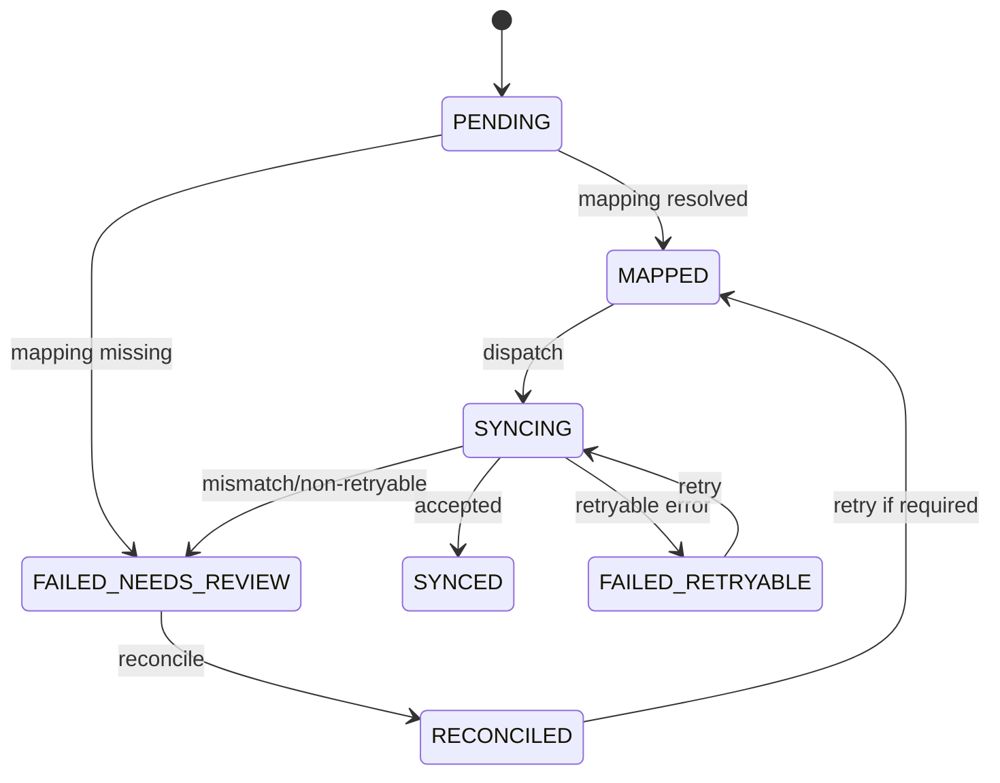
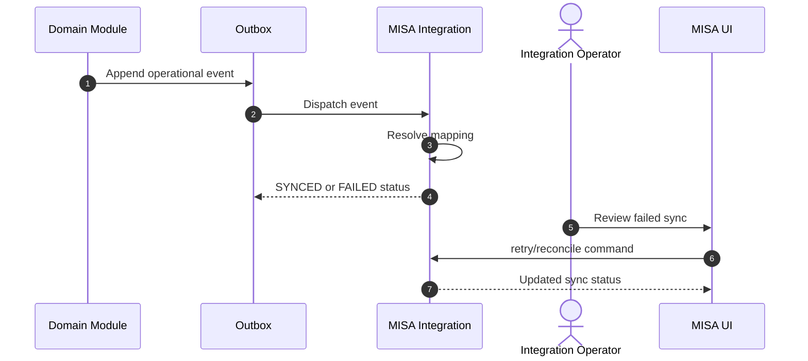

# M14 MISA Integration

## 1. Mục đích

MISA Integration quản lý mapping, sync event/log, retry, reconcile và audit cho đồng bộ MISA. Module nghiệp vụ không được sync trực tiếp sang MISA; tất cả đi qua integration layer và outbox/event.

## 2. Boundary

| In scope                                                                                             | Out of scope                                                                                                                |
| ---------------------------------------------------------------------------------------------------- | --------------------------------------------------------------------------------------------------------------------------- |
| MISA mapping, sync event, sync log, retry, reconcile, external reference tracking, integration audit | Business transaction ownership, direct module-to-MISA calls, MISA credential secret design chi tiết nếu chưa owner-approved |

## 3. Owner

| Owner type       | Role                      |
| ---------------- | ------------------------- |
| Business owner   | Finance/Integration Owner |
| Product/BA owner | BA phụ trách integration  |
| Technical owner  | Integration Architect     |
| QA owner         | QA integration owner      |

## 4. Chức năng

| function_id | Function                    | Description                                                                            | Priority |
| ----------- | --------------------------- | -------------------------------------------------------------------------------------- | -------- |
| M14-F01     | Mapping                     | Map internal code/entity to MISA code/document type.                                   | P0       |
| M14-F02     | Sync event                  | Nhận event từ outbox và tạo sync lifecycle.                                            | P0       |
| M14-F03     | Retry                       | Auto/manual retry failed retryable sync with `max_retry_count` and backoff policy.     | P0       |
| M14-F04     | Reconcile                   | Đối soát mismatch/mapping missing/non-retryable failure.                               | P0       |
| M14-F05     | Sync log                    | Ghi log request/response an toàn, không lộ secret.                                     | P0       |
| M14-F06     | Dashboard/alert integration | Cảnh báo failed sync.                                                                  | P1       |
| M14-F07     | Accounting document post    | Post phiếu kế toán xuất nguyên liệu qua integration layer, không gọi trực tiếp từ M08. | P0       |

## 5. Business Rules

| rule_id    | Rule                                                                                                                                                                                                                                                                                                                                                                                                                                              | Affected data                                  | Affected API        | Affected UI        | Validation                             | Exception                                | Test             |
| ---------- | ------------------------------------------------------------------------------------------------------------------------------------------------------------------------------------------------------------------------------------------------------------------------------------------------------------------------------------------------------------------------------------------------------------------------------------------------- | ---------------------------------------------- | ------------------- | ------------------ | -------------------------------------- | ---------------------------------------- | ---------------- |
| BR-M14-001 | Module nghiệp vụ chỉ phát event; không gọi MISA trực tiếp.                                                                                                                                                                                                                                                                                                                                                                                        | outbox/sync event                              | all domain APIs     | N/A                | architecture boundary                  | block direct sync                        | TC-M14-MISA-001  |
| BR-M14-002 | Mapping required before sync.                                                                                                                                                                                                                                                                                                                                                                                                                     | `misa_mapping`, `misa_sync_event`              | retry/sync          | SCR-MISA-MAPPING   | mapping check                          | `MISA_MAPPING_MISSING`                   | TC-M14-MISA-002  |
| BR-M14-003 | Retry only for retryable failure and must preserve event identity.                                                                                                                                                                                                                                                                                                                                                                                | `misa_sync_event`                              | retry API           | SCR-MISA-SYNC      | status check                           | `STATE_CONFLICT`                         | TC-EXC-RETRY-001 |
| BR-M14-004 | Reconcile requires reason/resolution.                                                                                                                                                                                                                                                                                                                                                                                                             | `misa_reconcile_record`                        | reconcile API       | SCR-MISA-RECONCILE | reason required                        | `RECONCILE_NOT_REQUIRED`                 | TC-EXC-RECON-001 |
| BR-M14-005 | Sync logs must not expose token/secret/private data. Redaction parity: field nào bị `op_public_trace_policy.is_public = false` (hoặc thiếu policy active) thì cũng phải redact khỏi `misa_sync_log` body/payload visible trong UI/API; supplier_name/cost_amount/qc_defect/loss/internal_personnel KHÔNG được lộ qua cả public trace LẪN MISA log (xem M12 BR-M12-002/BR-M12-003 và `database/03_TABLE_SPECIFICATION.md` op_public_trace_policy). | `misa_sync_log`                                | sync log UI/API     | SCR-MISA-SYNC      | redaction + public-policy parity check | safe log                                 | TC-M14-SEC-001   |
| BR-M14-006 | Retry must stop at `max_retry_count`; exhausted retryable sync moves to `FAILED_NEEDS_REVIEW`.                                                                                                                                                                                                                                                                                                                                                    | `misa_sync_event`                              | retry/worker        | SCR-MISA-SYNC      | retry count/backoff check              | review/reconcile                         | TC-M14-RETRY-003 |
| BR-M14-007 | Accounting material issue document can be posted only through M14 mapping/sync layer.                                                                                                                                                                                                                                                                                                                                                             | `misa_sync_event`, material issue document ref | accounting post API | SCR-MISA-SYNC      | mapping/status check                   | `MISA_MAPPING_MISSING`, `STATE_CONFLICT` | TC-M14-DOC-004   |

## 6. Tables

| table                   | Type                    | Purpose                     | Ownership | Notes                                                                                                                                  |
| ----------------------- | ----------------------- | --------------------------- | --------- | -------------------------------------------------------------------------------------------------------------------------------------- |
| `misa_mapping`          | mapping/config          | Internal-to-MISA mapping.   | M14       | Required before sync.                                                                                                                  |
| `misa_sync_event`       | integration transaction | Sync lifecycle record.      | M14       | Status: `PENDING`, `MAPPED`, `SYNCING`, `SYNCED`, `FAILED_RETRYABLE`, `FAILED_NEEDS_REVIEW`, `RECONCILED`; stores retry count/backoff. |
| `misa_sync_log`         | integration history     | Request/response/error log. | M14       | Redacted.                                                                                                                              |
| `misa_reconcile_record` | audit/control           | Reconciliation decisions.   | M14       | Reason required.                                                                                                                       |

## 7. APIs

| method | path                                                                      | Purpose                                 | Permission                 | Idempotency | Request                         | Response                     | Test            |
| ------ | ------------------------------------------------------------------------- | --------------------------------------- | -------------------------- | ----------- | ------------------------------- | ---------------------------- | --------------- |
| GET    | `/api/admin/integrations/misa/sync-events`                                | List sync events                        | `MISA_SYNC_VIEW`           | No          | filters                         | `MisaSyncEventListResponse`  | TC-M14-MISA-001 |
| POST   | `/api/admin/integrations/misa/mappings`                                   | Upsert mapping                          | `MISA_MAPPING_UPDATE`      | Yes         | `MisaMappingUpsertRequest`      | `MisaMappingResponse`        | TC-M14-MISA-002 |
| POST   | `/api/admin/integrations/misa/sync-events/{syncEventId}/retry`            | Manual retry                            | `MISA_MANUAL_RETRY`        | Yes         | `MisaRetryRequest`              | `MisaSyncEventResponse`      | TC-M14-MISA-002 |
| POST   | `/api/admin/integrations/misa/sync-events/{syncEventId}/reconcile`        | Reconcile mismatch                      | `MISA_RECONCILE`           | Yes         | `MisaReconcileRequest`          | `MisaReconcileResponse`      | TC-M14-MISA-002 |
| POST   | `/api/admin/integrations/misa/material-issue-documents/{documentId}/post` | Post accounting material issue document | `ACCOUNTING_DOCUMENT_POST` | Yes         | `AccountingDocumentPostRequest` | `AccountingDocumentResponse` | TC-M14-DOC-004  |

## 8. UI Screens

| screen_id          | Route                                | Purpose               | Primary actions                       | Permission             |
| ------------------ | ------------------------------------ | --------------------- | ------------------------------------- | ---------------------- |
| SCR-MISA-SYNC      | `/admin/integrations/misa/sync-jobs` | Sync job monitor      | retry, view payload, mark resolved    | `misa_sync.retry`      |
| SCR-MISA-MAPPING   | `/admin/integrations/misa/mapping`   | Mapping configuration | create, edit, deactivate              | `misa_mapping.write`   |
| SCR-MISA-RECONCILE | `/admin/integrations/misa/reconcile` | Reconcile mismatch    | reconcile, ignore with reason, export | `misa_reconcile.write` |
| SCR-EVENT-OUTBOX   | `/admin/integrations/outbox`         | Event/outbox monitor  | retry event                           | `event_outbox.retry`   |

## 9. Roles / Permissions

| Role                 | Permissions/actions                       | Notes                                    |
| -------------------- | ----------------------------------------- | ---------------------------------------- |
| Integration Operator | View/retry/reconcile sync, manage mapping | Cannot alter operational truth directly. |
| Admin                | Mapping and emergency reconcile           | Audit required.                          |
| Finance Viewer       | Read sync/reconcile status                | Read-only unless owner grants.           |

## 10. Workflow

| workflow_id  | Trigger                  | Steps                                         | Output               | Related docs                                 |
| ------------ | ------------------------ | --------------------------------------------- | -------------------- | -------------------------------------------- |
| WF-M14-SYNC  | Operational event posted | Resolve mapping -> sync -> synced/failed      | MISA sync status     | `workflows/05_CANONICAL_OPERATIONAL_FLOW.md` |
| WF-M14-RETRY | Retryable failure        | retry count check -> dispatch again           | Synced or failed     | `workflows/07_EXCEPTION_FLOWS.md`            |
| WF-M14-RECON | Missing mapping/mismatch | review -> mapping/reconcile -> optional retry | Reconciled or synced | `workflows/07_EXCEPTION_FLOWS.md`            |

## 11. State Machine

## 12. Sequence / Activity Flow

## 13. Input / Output

| Type  | Input                                                            | Output                                     |
| ----- | ---------------------------------------------------------------- | ------------------------------------------ |
| UI    | mapping, retry reason, reconcile resolution                      | sync/reconcile status                      |
| API   | MisaMappingUpsertRequest, MisaRetryRequest, MisaReconcileRequest | MisaMappingResponse, MisaSyncEventResponse |
| Event | operational outbox event                                         | MISA sync event/log                        |

## 14. Events

| event               | Producer | Consumer        | Payload summary         |
| ------------------- | -------- | --------------- | ----------------------- |
| `MISA_SYNC_CREATED` | M14      | M15             | sync event id/entity    |
| `MISA_SYNCED`       | M14      | Dashboard/audit | external ref/status     |
| `MISA_SYNC_FAILED`  | M14      | Alerts/MISA UI  | error, retryable flag   |
| `MISA_RECONCILED`   | M14      | Audit/dashboard | reconcile record/reason |

## 15. Audit Log

| action                | Audit payload                          | Retention/sensitivity |
| --------------------- | -------------------------------------- | --------------------- |
| mapping create/update | actor, internal ref, MISA ref          | Integration audit     |
| retry                 | actor, sync event, reason, retry count | High retention        |
| reconcile             | mismatch, resolution, reason, actor    | High retention        |
| sync failure          | error code, redacted payload ref       | Sensitive/redacted    |

## 16. Validation Rules

| validation_id | Rule                                         | Error code               | Blocking                        |
| ------------- | -------------------------------------------- | ------------------------ | ------------------------------- |
| VAL-M14-001   | Mapping required before sync                 | `MISA_MAPPING_MISSING`   | Blocks sync, not business truth |
| VAL-M14-002   | Retry only failed retryable status           | `STATE_CONFLICT`         | Yes                             |
| VAL-M14-003   | Reconcile only when mismatch/review required | `RECONCILE_NOT_REQUIRED` | Yes                             |
| VAL-M14-004   | Reconcile reason required                    | `REASON_REQUIRED`        | Yes                             |
| VAL-M14-005   | Secret/private data redacted                 | `INTERNAL_ERROR`/alert   | Yes for exposure                |
| VAL-M14-006   | Retry count/backoff policy exceeded          | `STATE_CONFLICT`         | Yes                             |

## 17. Exception Flow

| exception           | Rule                      | Recovery                               |
| ------------------- | ------------------------- | -------------------------------------- |
| missing mapping     | Set `FAILED_NEEDS_REVIEW` | Add mapping then retry                 |
| retryable failure   | Set `FAILED_RETRYABLE`    | Auto/manual retry with count           |
| mismatch            | Reconcile with reason     | Mark reconciled or retry               |
| direct sync attempt | Not allowed               | Route through outbox/integration layer |

## 18. Test Cases

| test_id          | Scenario                                                | Expected result                                              | Priority |
| ---------------- | ------------------------------------------------------- | ------------------------------------------------------------ | -------- |
| TC-M14-MISA-001  | Business event creates sync event                       | Event visible in monitor                                     | P0       |
| TC-M14-MISA-002  | Missing mapping                                         | `FAILED_NEEDS_REVIEW`, mapping screen action                 | P0       |
| TC-EXC-RETRY-001 | Retry retryable failure                                 | Status advances/retries audited                              | P0       |
| TC-M14-RETRY-003 | Retry exhausted                                         | Moves to `FAILED_NEEDS_REVIEW` and requires review/reconcile | P0       |
| TC-EXC-RECON-001 | Reconcile mismatch                                      | Reconcile record with reason                                 | P0       |
| TC-M14-SEC-001   | Log redaction                                           | No secret/private payload visible                            | P0       |
| TC-M14-DOC-004   | Post material issue accounting document without mapping | `MISA_MAPPING_MISSING` and no direct MISA side effect        | P0       |

## 19. Done Gate

- No business module syncs directly to MISA.
- Mapping, retry, reconcile and sync log exist.
- Failed sync appears in dashboard/MISA UI.
- Retry/reconcile audited and idempotent.
- PF-02 mode gate enforced: `DryRun`/fixture mode is allowed for dev/test; `Production` mode requires tenant/endpoint/secret refs and production mapping owner sign-off.

## 20. Risks

| risk                        | Impact                                     | Mitigation                                               |
| --------------------------- | ------------------------------------------ | -------------------------------------------------------- |
| MISA sandbox unavailable    | Smoke cannot require synced terminal state | Accept controlled failed/reconciled state with evidence in `DryRun`; production mode requires real tenant/endpoint/secret refs. |
| Mapping owner unclear       | Failed sync backlog                        | PF-02 assigns Finance/Accounting Integration + DevOps ownership; mapping screen remains controlled by `R-ACC-INT`.             |
| Direct sync added by module | Duplicate/inconsistent accounting          | Architecture rule and code review gate.                  |

## 21. PF-02 Production MISA Config Closure

| config item | production rule |
|---|---|
| Mode | `MisaSyncOptions.Mode` supports `DryRun` and `Production`; `Production` cannot start if required refs are missing. |
| Tenant/endpoint | `MisaSyncOptions.TenantId` and `MisaSyncOptions.BaseUrl` are environment config values owned by Finance/Integration + DevOps. |
| Credentials | `ClientId` may be config; `ClientSecretRef`/`WebhookSecretRef` must resolve through secret manager/environment secret. No literal secret in repo, seed, log or UI. |
| Object mapping | `misa_mapping` stores internal-to-AMIS object references only. Dev/test rows from `misa_mapping_fixture.csv` are `DEV_TEST_ONLY`; production mappings are imported or maintained by `R-ACC-INT`. |
| Dry-run behavior | Dry-run creates `misa_sync_event`/`misa_sync_log` and can reach controlled terminal/review state without calling MISA. Business truth remains Operational. |
| Production behavior | Production sync always goes through outbox -> M14 mapper -> MISA client -> redacted log -> retry/reconcile. Business modules must not call MISA directly. |
| Secret/log redaction | Request/response logs store redacted payload refs; visible UI/API must not expose token, secret, supplier-private, cost, QC defect/loss or public-trace-denied fields. |

## 22. Phase triển khai

| Phase/CODE | Scope in phase             | Dependency | Done gate                              |
| ---------- | -------------------------- | ---------- | -------------------------------------- |
| CODE06     | Inventory/MISA event basis | M11        | Warehouse events can create sync event |
| CODE08     | Recall integration refs    | M13        | Recall hold event can sync if required |
| CODE13     | Event/outbox integration   | M01        | Event schema/retry pass                |
| CODE17     | Integration smoke          | All        | MISA terminal/review status documented |
