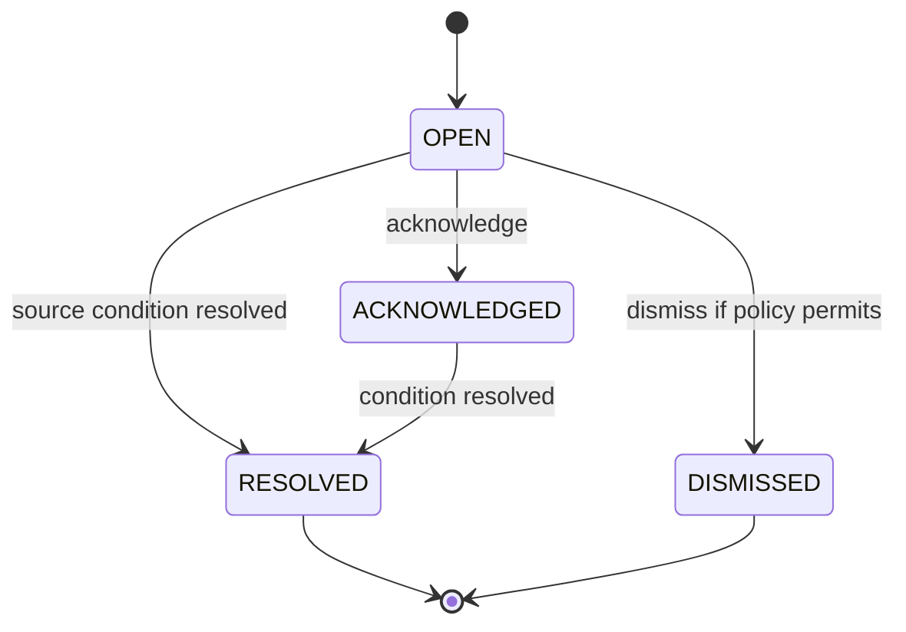
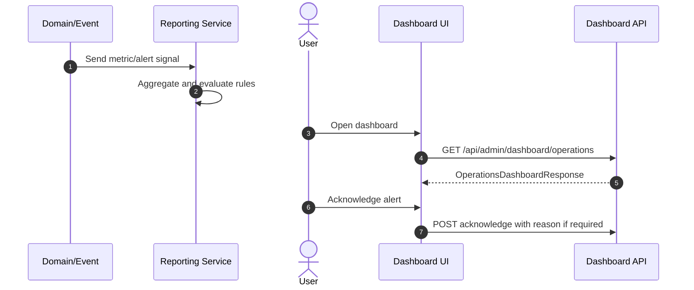

# M15 Reporting Dashboard

## 1. Mục đích

Reporting Dashboard cung cấp dashboard vận hành, alert, health snapshot và monitoring summary cho toàn bộ chuỗi source/raw/production/QC/inventory/trace/recall/MISA. Module này đọc dữ liệu/projection từ module khác, không tạo business truth mới.

## 2. Boundary

| In scope | Out of scope |
|---|---|
| Operational dashboard, alert rule/event, health snapshot, KPI projection, drilldown links | Business transaction mutation, BI data warehouse nâng cao, financial reporting chính thức, AI analytics ngoài nguồn |

## 3. Owner

| Owner type | Role |
|---|---|
| Business owner | PM/Operations Owner |
| Product/BA owner | BA reporting owner |
| Technical owner | Backend/Data Lead |
| QA owner | QA dashboard/monitoring owner |

## 4. Chức năng

| function_id | Function | Description | Priority |
|---|---|---|---|
| M15-F01 | Operations dashboard | Tổng quan pending/hold/failed/smoke status. | P0 |
| M15-F02 | Alert rules | Rule cảnh báo MISA fail, hold, trace gap, recall SLA, inventory risk. | P0 |
| M15-F03 | Alert events | Ghi và acknowledge alert. | P0 |
| M15-F04 | Health snapshot | Snapshot trạng thái hệ thống/worker/integration. | P0 |
| M15-F05 | Drilldown | Link từ metric tới module screen liên quan. | P1 |

## 5. Business Rules

| rule_id | Rule | Affected data | Affected API | Affected UI | Validation | Exception | Test |
|---|---|---|---|---|---|---|---|
| BR-M15-001 | Dashboard chỉ đọc/projection, không là source of truth. | dashboard metric | dashboard APIs | SCR-DASH-OPS | read-only | rebuild projection | TC-M15-DASH-001 |
| BR-M15-002 | Alert acknowledge requires permission and reason if critical. | alert event | alert acknowledge API | SCR-ALERTS | permission/reason | `STATE_CONFLICT` | TC-M15-ALERT-002 |
| BR-M15-003 | Alert source must link to owning module/entity. | alert event | alert APIs | SCR-ALERTS | source ref required | orphan alert review | TC-M15-ALERT-003 |
| BR-M15-004 | Health snapshot must not expose secrets/private integration payload. | health snapshot | dashboard API | SCR-DASH-OPS | redaction | safe summary | TC-M15-SEC-001 |
| BR-M15-005 | Alert events are retained as audit history; acknowledge/dismiss/resolution append status changes, not silent delete. | `op_alert_event` | alert APIs | SCR-ALERTS | append-only/status guard | correction/audit | TC-M15-ALERT-004 |

## 6. Tables

| table | Type | Purpose | Ownership | Notes |
|---|---|---|---|---|
| `op_dashboard_metric` | projection | Dashboard metric values. | M15 | Rebuildable/read-only. Baseline metrics: `pending_approval_count`, `raw_lot_ready_count`, `material_issue_failed_count`, `misa_failed_needs_review_count`, `trace_gap_count`, `recall_open_count`, `inventory_hold_count`, `smoke_status`. |
| `op_alert_rule` | config | Alert rule definitions. | M15 | Owner-tunable. |
| `op_alert_event` | transaction | Alert instances/ack status. | M15 | Links source entity. |
| `op_health_snapshot` | projection/history | Health snapshot. | M15 | Redacted. |

## 7. APIs

| method | path | Purpose | Permission | Idempotency | Request | Response | Test |
|---|---|---|---|---|---|---|---|
| GET | `/api/admin/dashboard/operations` | Operations dashboard | `DASHBOARD_VIEW` | No | filters | `OperationsDashboardResponse` | TC-M15-DASH-001 |
| GET | `/api/admin/alerts` | List alerts | `ALERT_VIEW` | No | filters | `AlertEventListResponse` | TC-M15-ALERT-002 |
| POST | `/api/admin/alerts/{alertEventId}/acknowledge` | Acknowledge alert | `ALERT_ACKNOWLEDGE` | Yes | `AlertAcknowledgeRequest` | `AlertEventResponse` | TC-M15-ALERT-002 |

## 8. UI Screens

| screen_id | Route | Purpose | Primary actions | Permission |
|---|---|---|---|---|
| SCR-DASH-OPS | `/admin/dashboard` | Operations overview | drilldown, export summary | `report.read` |
| SCR-ALERTS | `/admin/system/alerts` | Alert center | acknowledge, open source | `alert.acknowledge` |
| SCR-EVENT-OUTBOX | `/admin/integrations/outbox` | Event failure monitor | retry/view payload | `event_outbox.read` |
| SCR-MISA-SYNC | `/admin/integrations/misa/sync-jobs` | Sync status monitor | retry/reconcile | `misa_sync.read` |

## 9. Roles / Permissions

| Role | Permissions/actions | Notes |
|---|---|---|
| PM/Operations Viewer | Dashboard read | Cannot mutate transactions. |
| Admin | Alert rule/admin if enabled | Owner decision for rule editing UI. |
| QA Manager | QC/recall alert read/ack | Critical ack may require reason. |
| Integration Operator | MISA/outbox alerts | Can drill to retry/reconcile. |

## 10. Workflow

| workflow_id | Trigger | Steps | Output | Related docs |
|---|---|---|---|---|
| WF-M15-METRIC | Event/projection update | Aggregate -> store metric -> dashboard read | Dashboard metric | `workflows/01_WORKFLOW_OVERVIEW.md` |
| WF-M15-ALERT | Alert condition met | Evaluate rule -> create alert -> notify UI | Alert event | `workflows/07_EXCEPTION_FLOWS.md` |
| WF-M15-ACK | User acknowledges alert | Validate permission -> mark acknowledged | Alert acknowledged | `ui/06_TABLE_ACTION_FILTER_SPECIFICATION.md` |

## 11. State Machine

## 12. Sequence / Activity Flow

## 13. Input / Output

| Type | Input | Output |
|---|---|---|
| UI | date range, module, alert filters | dashboard metrics, alert list |
| API | dashboard/alert query, acknowledge request | dashboard/alert response |
| Event | domain event, sync failure, trace gap, hold | metric/alert snapshot |

## 14. Events

| event | Producer | Consumer | Payload summary |
|---|---|---|---|
| `ALERT_CREATED` | M15 | Admin/PM/QA UI | alert id, severity, source |
| `ALERT_ACKNOWLEDGED` | M15 | Audit/dashboard | actor, reason |
| `HEALTH_SNAPSHOT_RECORDED` | M15 | Dashboard | status, module |

## 15. Audit Log

| action | Audit payload | Retention/sensitivity |
|---|---|---|
| alert acknowledge/dismiss | actor, alert, reason | Operational audit |
| alert rule change | before/after, actor | High retention |
| dashboard export | actor, filters, timestamp | Reporting audit |

## 16. Validation Rules

| validation_id | Rule | Error code | Blocking |
|---|---|---|---|
| VAL-M15-001 | Dashboard read requires permission | `FORBIDDEN` | Yes |
| VAL-M15-002 | Critical alert acknowledge requires reason | `REASON_REQUIRED` | Yes |
| VAL-M15-003 | Alert source ref required | `VALIDATION_FAILED` | Yes |
| VAL-M15-004 | Health response redacted | `INTERNAL_ERROR`/alert | Yes for exposure |
| VAL-M15-005 | Alert history cannot be silently deleted | `STATE_CONFLICT` | Yes |

## 17. Exception Flow

| exception | Rule | Recovery |
|---|---|---|
| metric stale | Show stale warning | Rebuild projection |
| alert false positive | Acknowledge/dismiss with reason | Tune rule with audit |
| health collector failed | Show unknown/degraded | Retry collector, alert ops |

## 18. Test Cases

| test_id | Scenario | Expected result | Priority |
|---|---|---|---|
| TC-M15-DASH-001 | Load operations dashboard | Metrics and drilldowns visible | P0 |
| TC-M15-ALERT-002 | Acknowledge alert | Alert state updates and audit exists | P0 |
| TC-M15-ALERT-003 | Alert with no source | Rejected/flagged | P0 |
| TC-M15-ALERT-004 | Delete/overwrite alert event | Blocked; status/audit update required | P0 |
| TC-M15-SEC-001 | Health contains secret | Secret not exposed | P0 |

## 19. Done Gate

- Dashboard reads projections and does not mutate business truth.
- Alerts link to source module/entity.
- Critical ack reason policy works.
- MISA/trace/recall/inventory failures surface as alerts.
- No private payload in dashboard/health response.

## 20. Risks

| risk | Impact | Mitigation |
|---|---|---|
| Dashboard treated as source truth | Wrong operational decisions | Keep links to owning module and rebuildable projection. |
| Too many alerts | Alert fatigue | Severity/rule tuning and ack reasons. |
| Secret leakage in health | Security exposure | Redaction tests. |

## 21. Phase triển khai

| Phase/CODE | Scope in phase | Dependency | Done gate |
|---|---|---|---|
| CODE14 | Dashboard/alerts/health | CODE13 | Critical alerts visible |
| CODE17 | Release readiness dashboard | All | Smoke status visible |
