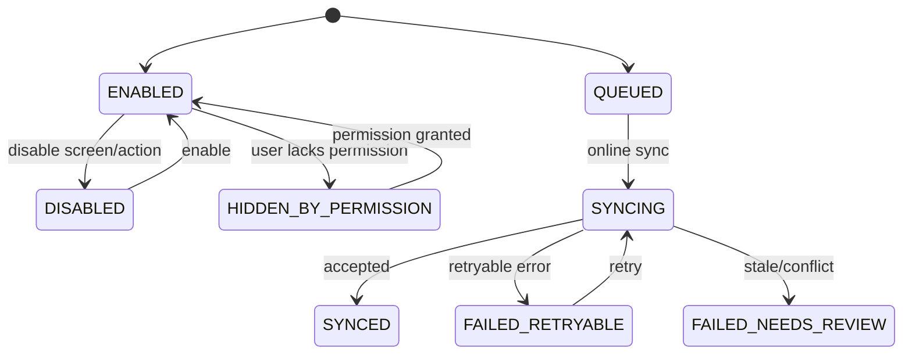
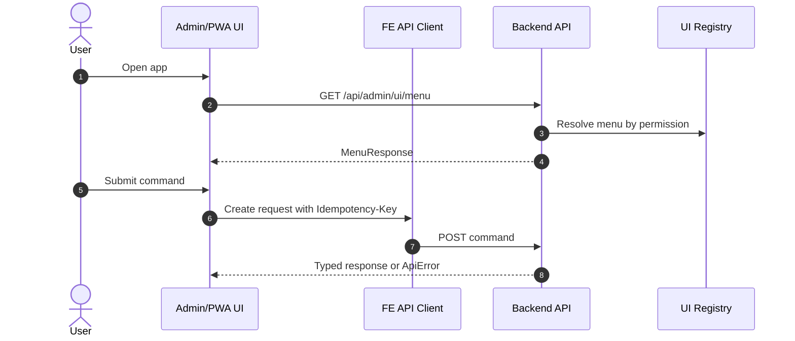

# M16 Admin UI

## 1. Mục đích

Admin UI quản lý thông tin điều hướng, screen registry, menu/sidebar, form/table/action registry, frontend API client contract và PWA/offline submission contract. Module này không sở hữu nghiệp vụ vận hành, nhưng bảo đảm UI gọi đúng API, đúng permission, đúng state và không tạo route song song.

## 2. Boundary

| In scope | Out of scope |
|---|---|
| Screen registry, menu item, action registry, form schema, table view config, API client conventions, PWA offline submission wrapper | Business validation cuối cùng, backend domain logic, frontend visual design chi tiết ngoài contract, public marketing site |

## 3. Owner

| Owner type | Role |
|---|---|
| Business owner | Operations/Admin Owner |
| Product/BA owner | BA/UX owner |
| Technical owner | Frontend Lead / Architect |
| QA owner | QA UI/E2E owner |

## 4. Chức năng

| function_id | Function | Description | Priority |
|---|---|---|---|
| M16-F01 | Screen registry | Đăng ký screen, route, module, enable/disable. | P1 |
| M16-F02 | Menu/sidebar | Menu theo role/permission. | P0 |
| M16-F03 | Action registry | Đăng ký action/button/permission/state. | P0 |
| M16-F04 | Form schema | Chuẩn field/form validation metadata nếu áp dụng. | P1 |
| M16-F05 | Table config | Chuẩn columns/filter/action theo screen. | P1 |
| M16-F06 | API client contract | Tách `adminClient`, `mobileClient`, `publicTraceClient`. | P0 |
| M16-F07 | PWA offline submission | Queue command offline có idempotency. | P0 |

## 5. Business Rules

| rule_id | Rule | Affected data | Affected API | Affected UI | Validation | Exception | Test |
|---|---|---|---|---|---|---|---|
| BR-M16-001 | UI route/action phải map tới API contract chuẩn; không tạo route song song chưa impact analysis. | screen/action registry | UI/API clients | all screens | route family check | owner decision | TC-M16-UI-001 |
| BR-M16-002 | Button/action visibility dựa trên permission và state, nhưng backend vẫn enforce. | action registry | all command APIs | all screens | permission check | forbidden | TC-M02-PERM-001 |
| BR-M16-003 | Critical command UI phải gửi `Idempotency-Key`. | API client/offline submission | command APIs | command forms/PWA | idempotency header | conflict/retry | TC-M16-PWA-003 |
| BR-M16-004 | Public trace UI dùng `publicTraceClient` và DTO riêng. | frontend client | `/api/public/trace/*` | SCR-PUBLIC-TRACE | client separation | block/suppress | TC-UI-PTR-002 |
| BR-M16-005 | Offline submission không được tạo duplicate side effect. | `idempotency_registry`/offline payload | `/api/mobile/offline-submissions` | SCR-SHOPFLOOR-PWA | key/payload/order | stale review | TC-M16-PWA-003 |
| BR-M16-006 | M16 chỉ sở hữu navigation/action contract; M15 sở hữu metric/drilldown source data. | screen/menu/action registry | UI registry APIs | SCR-DASH-OPS | module boundary check | reject duplicate truth | TC-M16-BOUNDARY-001 |

## 6. Tables

| table | Type | Purpose | Ownership | Notes |
|---|---|---|---|---|
| `ui_screen_registry` | config | Screen route/module registry. | M16 | Permission-aware. |
| `ui_action_registry` | config | UI action/actionCode registry. | M16/M02 | Maps to permission. |
| `ui_menu_item` | config | Menu/sidebar entries. | M16 | Role/permission display. |
| `ui_form_schema` | config | Form metadata if dynamic forms used. | M16 | Optional only for owner-approved dynamic forms; must not override API/domain validation or become business truth. |
| `ui_table_view_config` | config | Table columns/filter/action defaults. | M16 | Optional. |
| `idempotency_registry` | control | Offline submission/command idempotency. | M01/M16 | M01 owns core table. |

## 7. APIs

| method | path | Purpose | Permission | Idempotency | Request | Response | Test |
|---|---|---|---|---|---|---|---|
| GET | `/api/admin/ui/screens` | Screen registry | `UI_SCREEN_VIEW` | No | filters | `ScreenRegistryResponse` | TC-M16-UI-001 |
| GET | `/api/admin/ui/menu` | Menu/sidebar for current user | `UI_MENU_VIEW` | No | N/A | `MenuResponse` | TC-M16-UI-001 |
| POST | `/api/mobile/offline-submissions` | Submit queued PWA command | per embedded action | Yes | `OfflineSubmissionRequest` | `OfflineSubmissionResponse` | TC-M16-PWA-003 |

## 8. UI Screens

| screen_id | Route | Purpose | Primary actions | Permission |
|---|---|---|---|---|
| SCR-UI-SCREEN-REGISTRY | `/admin/system/screens` | Screen/menu/action registry | enable/disable, reorder, edit metadata | `screen_registry.write` |
| SCR-SHOPFLOOR-PWA | `/pwa/tasks` | Shopfloor task queue/offline submission | open task, scan, submit, sync | permission theo task |
| SCR-DASH-OPS | `/admin/dashboard` | Landing operational dashboard | drilldown | `report.read` |
| SCR-PUBLIC-TRACE | `/trace/:qrCode` | Public trace page | lookup only | anonymous |

## 9. Roles / Permissions

| Role | Permissions/actions | Notes |
|---|---|---|
| Admin | Screen/menu/action registry write | Cannot bypass backend permission. |
| Frontend/Admin Developer | Implements contract | No production permission unless user role grants. |
| Production/Warehouse/QC Operator | PWA task actions | Scope by task permission. |
| Public User | Public trace only | No admin API. |

## 10. Workflow

| workflow_id | Trigger | Steps | Output | Related docs |
|---|---|---|---|---|
| WF-M16-MENU | User login/load app | Fetch menu -> filter by permission -> render screens | Role-aware navigation | `ui/02_MENU_SIDEBAR_STRUCTURE.md` |
| WF-M16-ACTION | User command | Check UI permission/state -> send API with idempotency -> reload | Command UI state | `ui/07_UI_STATE_AND_VALIDATION.md` |
| WF-M16-PWA | Offline command | Queue payload/key -> sync in order -> handle stale/conflict | Offline submission result | `api/06_API_IDEMPOTENCY_SPEC.md` |
| WF-M16-PUBLIC | Public trace | Use public client -> render whitelist fields | Public-safe page | `ui/08_FRONTEND_API_CLIENT_CONTRACT.md` |

## 11. State Machine

## 12. Sequence / Activity Flow

## 13. Input / Output

| Type | Input | Output |
|---|---|---|
| UI | route, permission, state, form/table config | screen/menu/action rendering |
| API | screen/menu/offline submission requests | ScreenRegistryResponse, MenuResponse, OfflineSubmissionResponse |
| Event | UI action/offline sync result | audit, dashboard metrics |

## 14. Events

| event | Producer | Consumer | Payload summary |
|---|---|---|---|
| `UI_SCREEN_UPDATED` | M16 | Admin UI/audit | screen id, route, enabled |
| `UI_ACTION_EXECUTED` | M16/client/API | Audit/M15 | action code, screen, actor |
| `OFFLINE_SUBMISSION_SYNCED` | M16 | M01/M15 | submission id, endpoint, result |
| `OFFLINE_SUBMISSION_FAILED` | M16 | Dashboard/PWA | error, retryable flag |

## 15. Audit Log

| action | Audit payload | Retention/sensitivity |
|---|---|---|
| screen/menu/action config change | before/after, actor | Admin audit |
| offline submission accepted/failed | actor/device, endpoint, key, result | Operational/security |
| public trace rendered | QR, public status, no internal payload | Public-safe audit/metric |

## 16. Validation Rules

| validation_id | Rule | Error code | Blocking |
|---|---|---|---|
| VAL-M16-001 | Screen route unique | `DUPLICATE_KEY` | Yes |
| VAL-M16-002 | Action maps to known permission | `VALIDATION_FAILED` | Yes |
| VAL-M16-003 | Offline submission has idempotency key | `IDEMPOTENCY_KEY_REQUIRED` | Yes |
| VAL-M16-004 | Public trace client cannot call admin trace API | `PUBLIC_FIELD_POLICY_VIOLATION` | Yes in review/test |
| VAL-M16-005 | Stale offline command requires review | `STATE_CONFLICT` | Yes |

## 17. Exception Flow

| exception | Rule | Recovery |
|---|---|---|
| permission denied | Hide/disable action; backend still returns `FORBIDDEN` | Reload permissions |
| stale state | Reload entity before retry | User confirms action again |
| offline conflict | Stop sync item | Manual review/retry with new command |
| public leakage | Suppress/block field | Fix DTO/projection and test |

## 18. Test Cases

| test_id | Scenario | Expected result | Priority |
|---|---|---|---|
| TC-M16-UI-001 | Menu for role | Only permitted screens/actions visible | P0 |
| TC-M02-PERM-001 | Hidden action still called via API | Backend returns `FORBIDDEN` | P0 |
| TC-M16-PWA-003 | Offline duplicate command | One side effect via idempotency | P0 |
| TC-UI-PTR-002 | Public trace UI uses public DTO only | No internal fields | P0 |
| TC-UI-SCR-001 | Screen registry route duplicate | Rejected | P1 |
| TC-M16-BOUNDARY-001 | Dashboard drilldown tries to define metric truth in UI registry | Rejected/kept as navigation link only | P1 |

## 19. Done Gate

- Admin menu/screen registry maps all 16 module screen groups.
- UI/API route families match Part 5 contract.
- Public trace client and DTO are separate from admin trace.
- Critical commands send idempotency key.
- PWA/offline submission handles queued/synced/failed/stale states.
- Permission UI and backend permission are tested together.

## 20. Risks

| risk | Impact | Mitigation |
|---|---|---|
| UI route drift from API contract | FE/BE mismatch | Generated client and route family review. |
| UI permission mistaken as security | API bypass | Backend enforcement and tests. |
| Dynamic UI registry overbuilt | Delayed MVP | Keep registry minimal unless owner needs dynamic config. |
| PWA offline scope too broad | Complex sync bugs | Limit MVP to material issue/receipt and workforce check-in commands; expand after smoke. |

## 21. Phase triển khai

| Phase/CODE | Scope in phase | Dependency | Done gate |
|---|---|---|---|
| CODE01 | Basic admin UI foundations | M01/M02 | Source screens usable |
| CODE09 | RBAC menu/screen/action registry | CODE01 | Permission-aware UI works |
| CODE10 | API client/error/idempotency sync | CODE01 | FE/BE contract tests pass |
| CODE11 | PWA/offline command contract | CODE10 + relevant workflows | Offline idempotency tested |
| CODE17 | Full smoke UI | All | E2E smoke pass |
