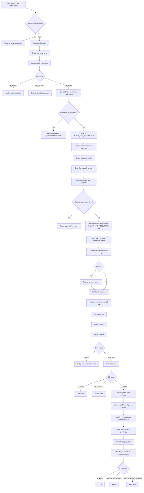
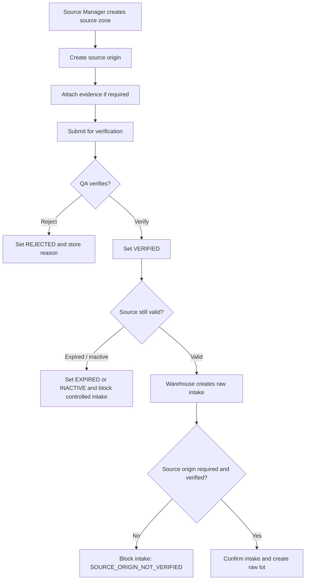
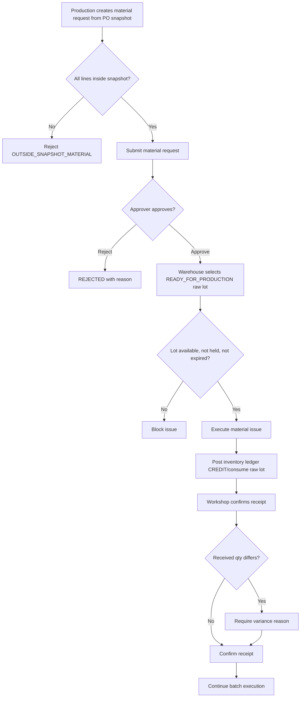
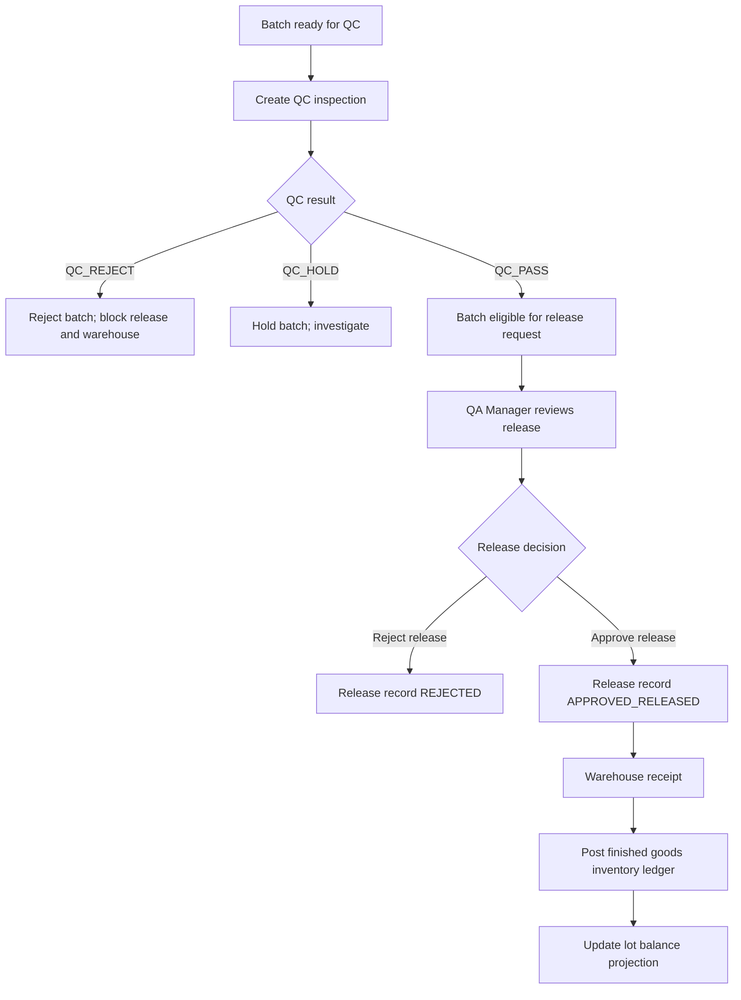
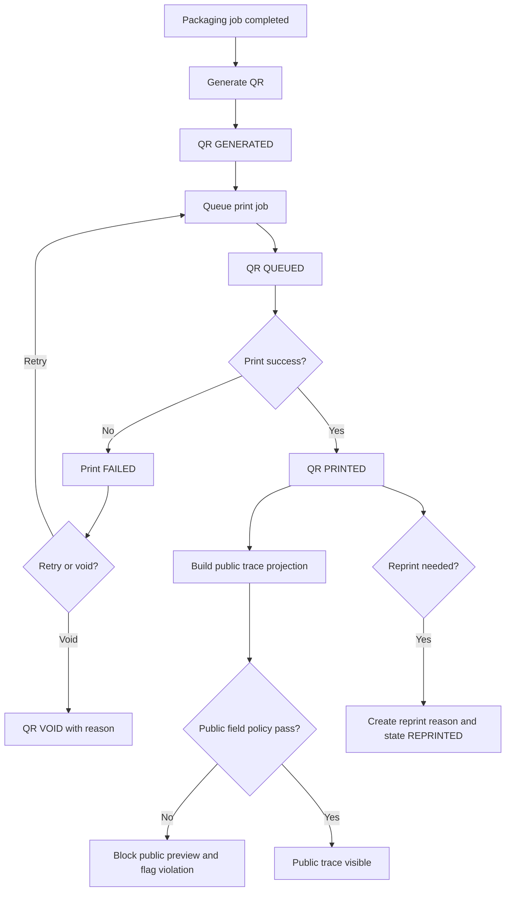
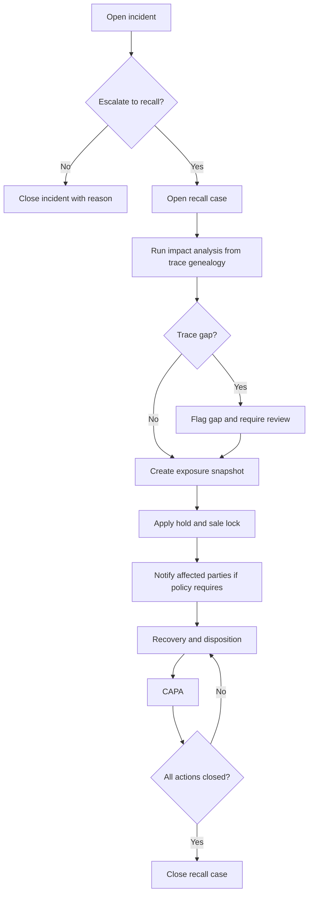
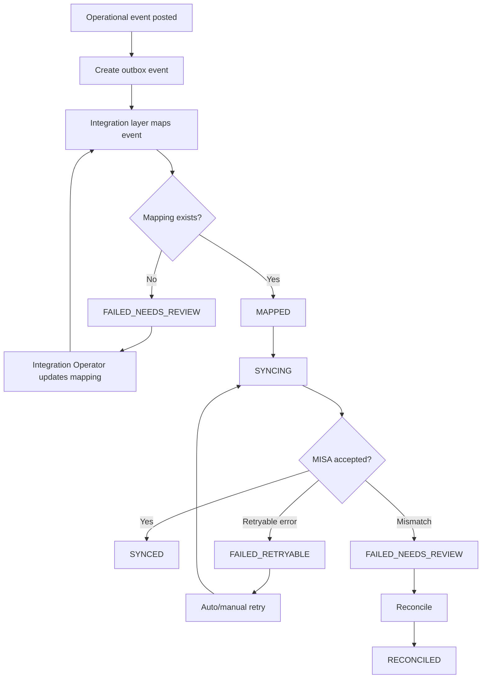

# 02 Activity Diagrams

## 1. Mục tiêu

Tài liệu này mô tả activity diagram bằng Mermaid cho các luồng vận hành chính, phụ và lỗi. Diagram là contract nghiệp vụ/triển khai, không thay thế validation ở API/database.

## 2. Full Operational Activity

## 3. Source Origin And Raw Intake Activity

## 4. Material Issue / Receipt Activity

## 5. QC, Release, Warehouse Activity

## 6. QR / Public Trace Activity

## 7. Recall Activity

## 8. MISA Integration Activity

