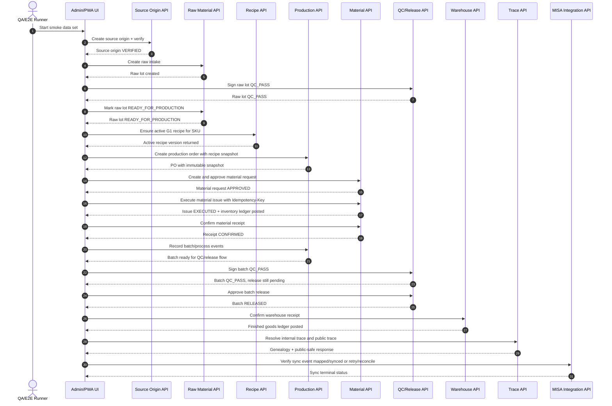
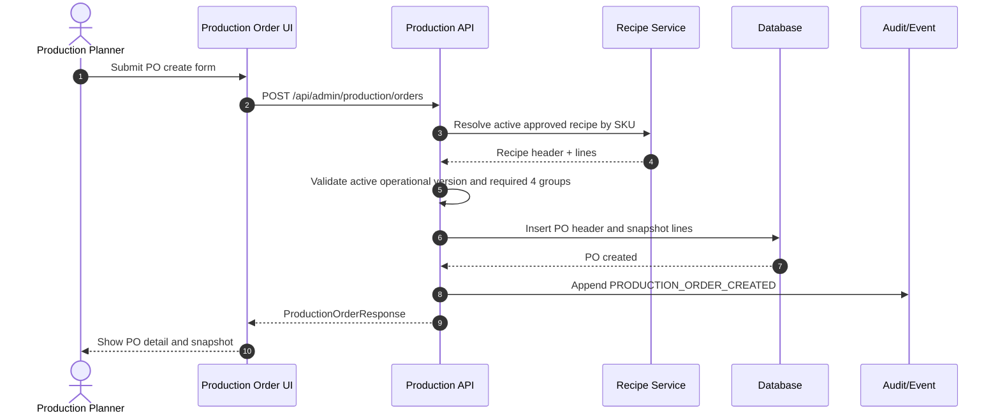
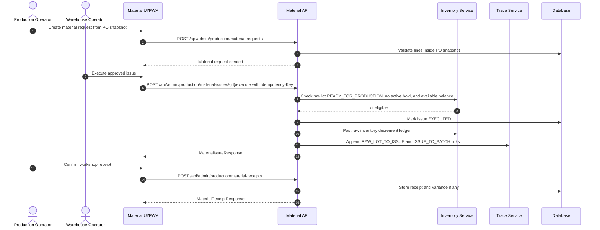
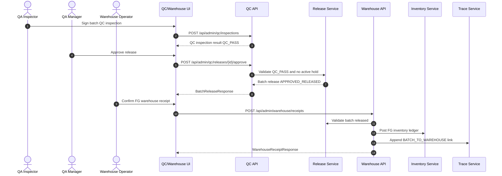
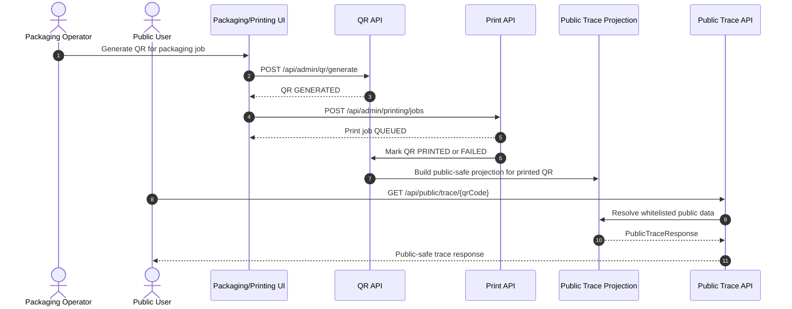
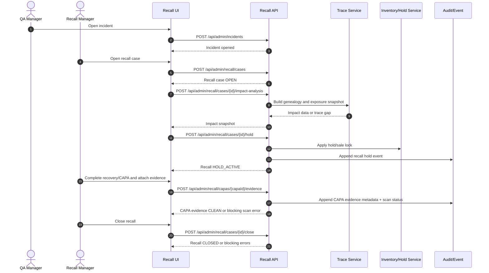
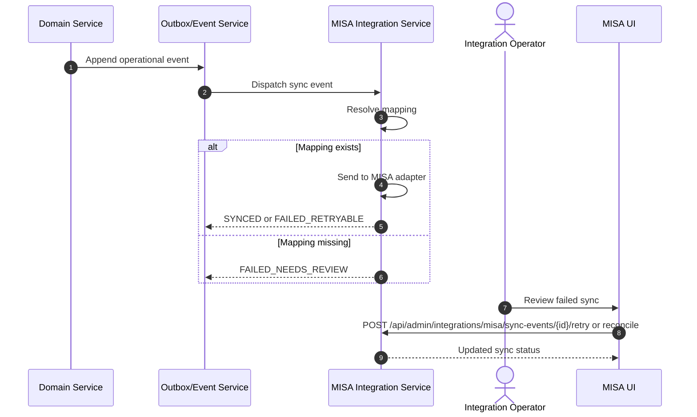

# 03 Sequence Diagrams

## Mục lục

- [1. Mục tiêu](#1-mục-tiêu)
- [2. Smoke E2E Sequence](#2-smoke-e2e-sequence)
- [3. Production Order Snapshot Sequence](#3-production-order-snapshot-sequence)
- [4. Material Issue And Receipt Sequence](#4-material-issue-and-receipt-sequence)
- [5. QC Release And Warehouse Sequence](#5-qc-release-and-warehouse-sequence)
- [6. QR And Public Trace Sequence](#6-qr-and-public-trace-sequence)
- [7. Recall Sequence](#7-recall-sequence)
- [8. MISA Sync Sequence](#8-misa-sync-sequence)

## 1. Mục tiêu

Tài liệu này mô tả sequence diagram cho các tương tác API/service chính. Các tên service là target architecture trong docs, không phải bằng chứng source code.

## 2. Smoke E2E Sequence

## 3. Production Order Snapshot Sequence

## 4. Material Issue And Receipt Sequence

## 5. QC Release And Warehouse Sequence

## 6. QR And Public Trace Sequence

## 7. Recall Sequence

## 8. MISA Sync Sequence

