# 04 State Machines

## Mục lục

- [1. Mục tiêu](#1-mục-tiêu)
- [2. Production Order](#2-production-order)
- [3. Material Issue](#3-material-issue)
- [4. Material Receipt](#4-material-receipt)
- [5. Raw Material Lot](#5-raw-material-lot)
- [6. QC Inspection](#6-qc-inspection)
- [7. Batch](#7-batch)
- [8. Batch Release](#8-batch-release)
- [9. Warehouse Receipt](#9-warehouse-receipt)
- [10. Inventory Ledger](#10-inventory-ledger)
- [11. Print Job](#11-print-job)
- [12. QR Lifecycle](#12-qr-lifecycle)
- [13. Trace](#13-trace)
- [14. Recall](#14-recall)
- [15. MISA Sync](#15-misa-sync)
- [16. State Machine Done Gate](#16-state-machine-done-gate)
- [17. Enum/Table Anchor Map](#17-enumtable-anchor-map)

## 1. Mục tiêu

Tài liệu này là contract state machine cho các entity vận hành chính. Mọi API/UI/test phải dùng các state và transition này, trừ khi owner phê duyệt thay đổi.

## 2. Production Order

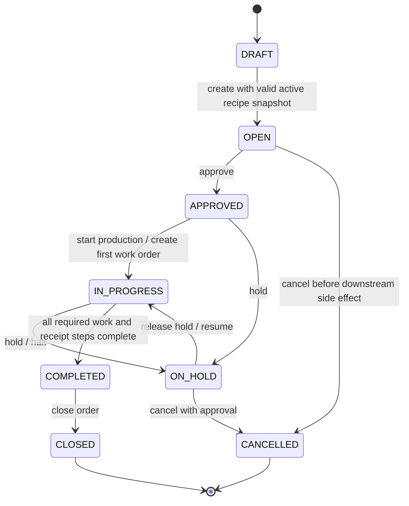
```mermaid
stateDiagram-v2
    [*] --> DRAFT
    DRAFT --> OPEN: create with valid active recipe snapshot
    OPEN --> APPROVED: approve
    OPEN --> CANCELLED: cancel before downstream side effect
    APPROVED --> IN_PROGRESS: start production / create first work order
    APPROVED --> ON_HOLD: hold
    IN_PROGRESS --> ON_HOLD: hold / halt
    ON_HOLD --> IN_PROGRESS: release hold / resume
    ON_HOLD --> CANCELLED: cancel with approval
    IN_PROGRESS --> COMPLETED: all required work and receipt steps complete
    COMPLETED --> CLOSED: close order
    CLOSED --> [*]
    CANCELLED --> [*]
```

| Transition | Guard | Side effect |
|---|---|---|
| `DRAFT -> OPEN` | SKU active; approved active recipe version; snapshot complete | Create immutable PO snapshot lines. |
| `APPROVED -> IN_PROGRESS` | PO approved; no active hold | Create work/batch execution context. |
| `IN_PROGRESS -> COMPLETED` | Material receipt and required process events complete | Batch ready for downstream QC/packaging. |
| `ANY -> ON_HOLD` | Authorized hold with reason | Append hold/audit event. |
| `OPEN/ON_HOLD -> CANCELLED` | No irreversible downstream ledger/release/public QR side effect, or correction approval exists | Audit cancel reason. |

## 3. Material Issue

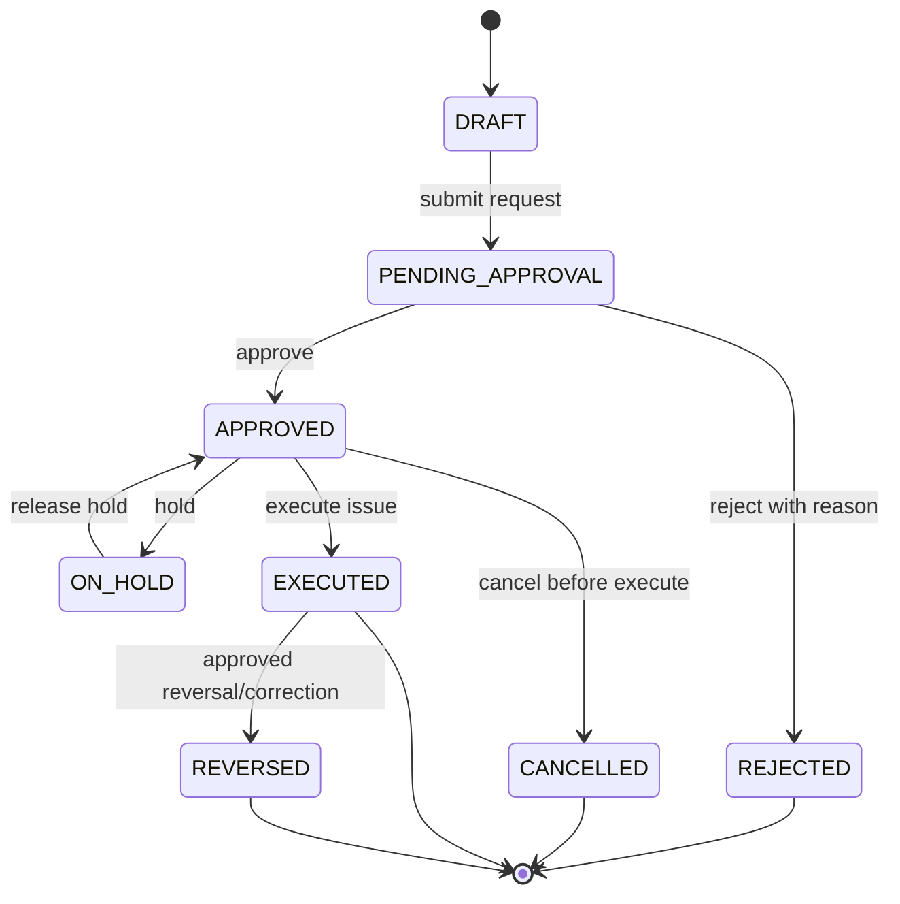
```mermaid
stateDiagram-v2
    [*] --> DRAFT
    DRAFT --> PENDING_APPROVAL: submit request
    PENDING_APPROVAL --> APPROVED: approve
    PENDING_APPROVAL --> REJECTED: reject with reason
    APPROVED --> ON_HOLD: hold
    ON_HOLD --> APPROVED: release hold
    APPROVED --> EXECUTED: execute issue
    APPROVED --> CANCELLED: cancel before execute
    EXECUTED --> REVERSED: approved reversal/correction
    REJECTED --> [*]
    CANCELLED --> [*]
    EXECUTED --> [*]
    REVERSED --> [*]
```

| Transition | Guard | Side effect |
|---|---|---|
| `DRAFT -> PENDING_APPROVAL` | Lines come from PO snapshot | Approval request. |
| `APPROVED -> EXECUTED` | Raw lot `READY_FOR_PRODUCTION`, available balance, no active hold, idempotency key | Post raw inventory decrement ledger; trace raw lot to batch. |
| `EXECUTED -> REVERSED` | Owner-approved correction/reversal | Append reversal ledger, do not update original ledger. |

## 4. Material Receipt

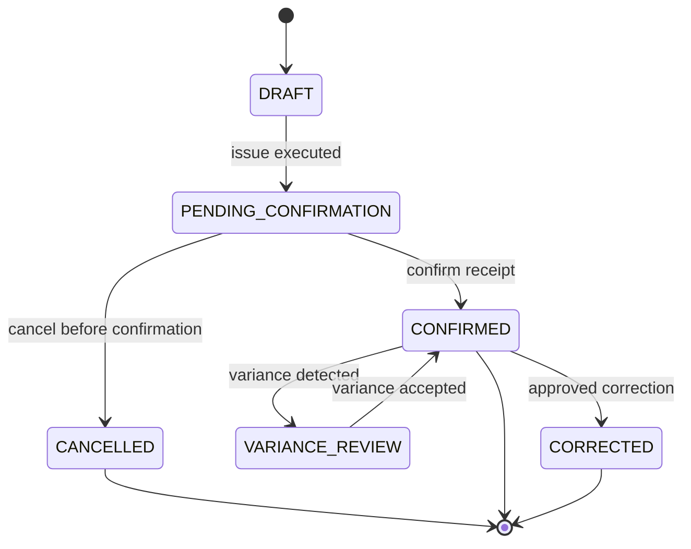
```mermaid
stateDiagram-v2
    [*] --> DRAFT
    DRAFT --> PENDING_CONFIRMATION: issue executed
    PENDING_CONFIRMATION --> CONFIRMED: confirm receipt
    PENDING_CONFIRMATION --> CANCELLED: cancel before confirmation
    CONFIRMED --> VARIANCE_REVIEW: variance detected
    VARIANCE_REVIEW --> CONFIRMED: variance accepted
    CONFIRMED --> CORRECTED: approved correction
    CANCELLED --> [*]
    CONFIRMED --> [*]
    CORRECTED --> [*]
```

| Transition | Guard | Side effect |
|---|---|---|
| `PENDING_CONFIRMATION -> CONFIRMED` | Received quantity valid | Store workshop receipt; no inventory decrement. |
| `CONFIRMED -> VARIANCE_REVIEW` | Received qty differs from issued qty | Require variance reason. |
| `CONFIRMED -> CORRECTED` | Correction approved | Append correction record; preserve original receipt. |

## 5. Raw Material Lot

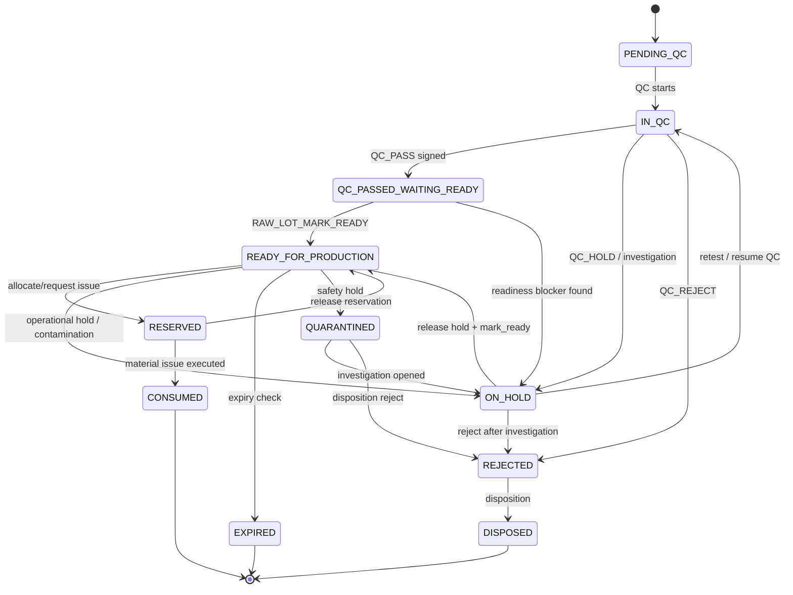
```mermaid
stateDiagram-v2
    [*] --> PENDING_QC
    PENDING_QC --> IN_QC: QC starts
    IN_QC --> QC_PASSED_WAITING_READY: QC_PASS signed
    IN_QC --> ON_HOLD: QC_HOLD / investigation
    IN_QC --> REJECTED: QC_REJECT
    QC_PASSED_WAITING_READY --> READY_FOR_PRODUCTION: RAW_LOT_MARK_READY
    QC_PASSED_WAITING_READY --> ON_HOLD: readiness blocker found
    ON_HOLD --> IN_QC: retest / resume QC
    ON_HOLD --> READY_FOR_PRODUCTION: release hold + mark_ready
    ON_HOLD --> REJECTED: reject after investigation
    READY_FOR_PRODUCTION --> RESERVED: allocate/request issue
    RESERVED --> READY_FOR_PRODUCTION: release reservation
    RESERVED --> CONSUMED: material issue executed
    READY_FOR_PRODUCTION --> ON_HOLD: operational hold / contamination
    READY_FOR_PRODUCTION --> EXPIRED: expiry check
    READY_FOR_PRODUCTION --> QUARANTINED: safety hold
    QUARANTINED --> ON_HOLD: investigation opened
    QUARANTINED --> REJECTED: disposition reject
    REJECTED --> DISPOSED: disposition
    CONSUMED --> [*]
    EXPIRED --> [*]
    DISPOSED --> [*]
```

| Transition | Guard | Side effect |
|---|---|---|
| `IN_QC -> QC_PASSED_WAITING_READY` | QC inspection signed with result `QC_PASS` | Lot becomes a candidate for readiness review, not issue-ready yet. |
| `QC_PASSED_WAITING_READY -> READY_FOR_PRODUCTION` | `RAW_LOT_MARK_READY` permission, no hold/reject/quarantine/expiry, source/readiness checks pass | Append state transition/audit and emit `RAW_LOT_READY_FOR_PRODUCTION`. |
| `READY_FOR_PRODUCTION -> RESERVED/CONSUMED` | Material request/issue uses approved PO snapshot and available balance | Ledger and balance update only at issue execution. |
| `ON_HOLD/QUARANTINED/EXPIRED/REJECTED` | Reason/evidence required | Blocks material issue. |

## 6. QC Inspection

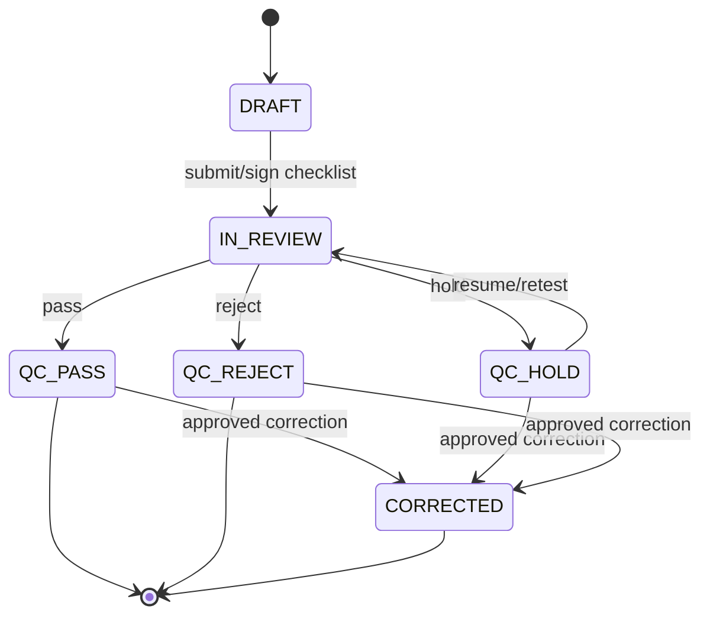
```mermaid
stateDiagram-v2
    [*] --> DRAFT
    DRAFT --> IN_REVIEW: submit/sign checklist
    IN_REVIEW --> QC_PASS: pass
    IN_REVIEW --> QC_HOLD: hold
    IN_REVIEW --> QC_REJECT: reject
    QC_HOLD --> IN_REVIEW: resume/retest
    QC_PASS --> CORRECTED: approved correction
    QC_HOLD --> CORRECTED: approved correction
    QC_REJECT --> CORRECTED: approved correction
    QC_PASS --> [*]
    QC_REJECT --> [*]
    CORRECTED --> [*]
```

| Transition | Guard | Side effect |
|---|---|---|
| `IN_REVIEW -> QC_PASS` | Checklist complete | Entity may proceed to next gate if no hold. |
| `IN_REVIEW -> QC_HOLD/QC_REJECT` | Reason/note required | Block downstream gate. |
| `ANY_SIGNED -> CORRECTED` | Correction approval | New correction record, original remains append-only. |

## 7. Batch

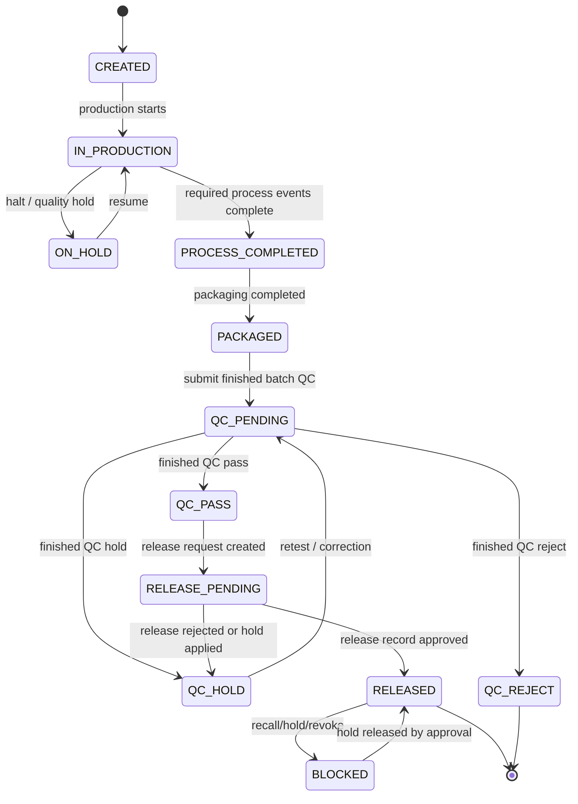
```mermaid
stateDiagram-v2
    [*] --> CREATED
    CREATED --> IN_PRODUCTION: production starts
    IN_PRODUCTION --> ON_HOLD: halt / quality hold
    ON_HOLD --> IN_PRODUCTION: resume
    IN_PRODUCTION --> PROCESS_COMPLETED: required process events complete
    PROCESS_COMPLETED --> PACKAGED: packaging completed
    PACKAGED --> QC_PENDING: submit finished batch QC
    QC_PENDING --> QC_PASS: finished QC pass
    QC_PENDING --> QC_HOLD: finished QC hold
    QC_PENDING --> QC_REJECT: finished QC reject
    QC_HOLD --> QC_PENDING: retest / correction
    QC_PASS --> RELEASE_PENDING: release request created
    RELEASE_PENDING --> RELEASED: release record approved
    RELEASE_PENDING --> QC_HOLD: release rejected or hold applied
    RELEASED --> BLOCKED: recall/hold/revoke
    BLOCKED --> RELEASED: hold released by approval
    RELEASED --> [*]
    QC_REJECT --> [*]
```

| Transition | Guard | Side effect |
|---|---|---|
| `IN_PRODUCTION -> PROCESS_COMPLETED` | Required process events complete and audited | Batch can enter packaging/QC downstream. |
| `PACKAGED -> QC_PENDING` | Packaging/printing prerequisites complete | Batch is ready for finished-goods QC. |
| `QC_PENDING -> QC_PASS` | Finished QC inspection signed | Batch is eligible to request release, not warehouse-ready yet. |
| `RELEASE_PENDING -> RELEASED` | Separate batch release record approved | Batch becomes eligible for finished-goods warehouse receipt. |
| `RELEASED -> BLOCKED` | Recall/quality/hold decision with reason | Blocks further warehouse/shipment actions according scope. |

## 8. Batch Release

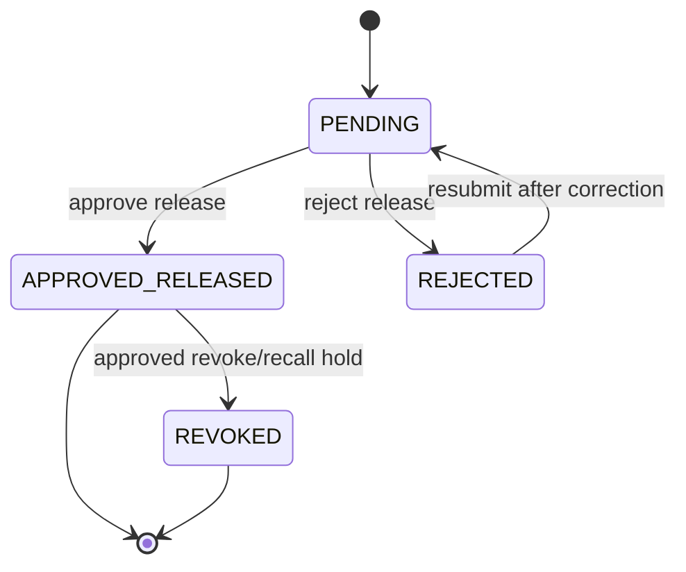
```mermaid
stateDiagram-v2
    [*] --> PENDING
    PENDING --> APPROVED_RELEASED: approve release
    PENDING --> REJECTED: reject release
    APPROVED_RELEASED --> REVOKED: approved revoke/recall hold
    REJECTED --> PENDING: resubmit after correction
    APPROVED_RELEASED --> [*]
    REVOKED --> [*]
```

| Transition | Guard | Side effect |
|---|---|---|
| `PENDING -> APPROVED_RELEASED` | Batch QC result is `QC_PASS`; no active hold | Batch eligible for warehouse receipt. |
| `APPROVED_RELEASED -> REVOKED` | Recall/quality decision with approval | Blocks future warehouse/shipment; audit. |

## 9. Warehouse Receipt

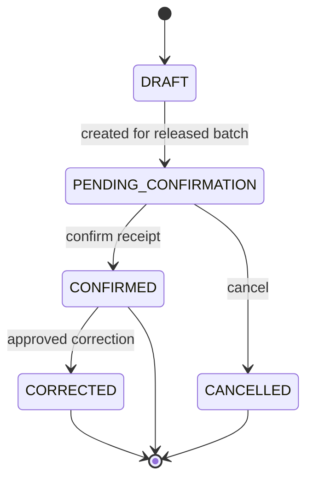
```mermaid
stateDiagram-v2
    [*] --> DRAFT
    DRAFT --> PENDING_CONFIRMATION: created for released batch
    PENDING_CONFIRMATION --> CONFIRMED: confirm receipt
    PENDING_CONFIRMATION --> CANCELLED: cancel
    CONFIRMED --> CORRECTED: approved correction
    CONFIRMED --> [*]
    CANCELLED --> [*]
    CORRECTED --> [*]
```

| Transition | Guard | Side effect |
|---|---|---|
| `DRAFT -> PENDING_CONFIRMATION` | Batch release status `APPROVED_RELEASED` | Create receipt document. |
| `PENDING_CONFIRMATION -> CONFIRMED` | Quantity > 0; warehouse valid; no active hold | Post finished-goods ledger and lot balance. |
| `CONFIRMED -> CORRECTED` | Correction approval | Append correction/reversal; original ledger remains. |

## 10. Inventory Ledger

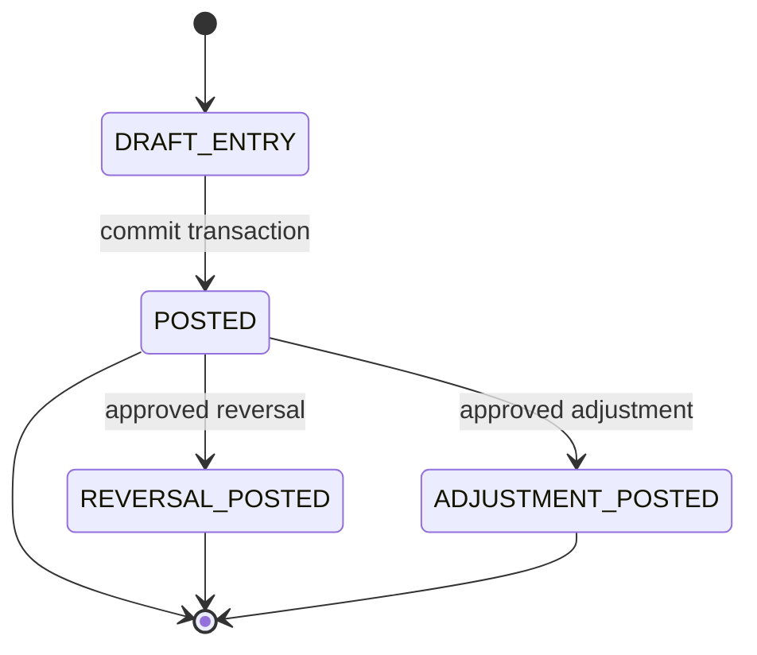
```mermaid
stateDiagram-v2
    [*] --> DRAFT_ENTRY
    DRAFT_ENTRY --> POSTED: commit transaction
    POSTED --> REVERSAL_POSTED: approved reversal
    POSTED --> ADJUSTMENT_POSTED: approved adjustment
    POSTED --> [*]
    REVERSAL_POSTED --> [*]
    ADJUSTMENT_POSTED --> [*]
```

| Transition | Guard | Side effect |
|---|---|---|
| `DRAFT_ENTRY -> POSTED` | Transaction succeeds atomically | Ledger becomes append-only. |
| `POSTED -> REVERSAL_POSTED` | Reversal command approved | Add reversal entry; never mutate posted entry. |
| `POSTED -> ADJUSTMENT_POSTED` | Adjustment approved | Add adjustment entry with reason. |

## 11. Print Job

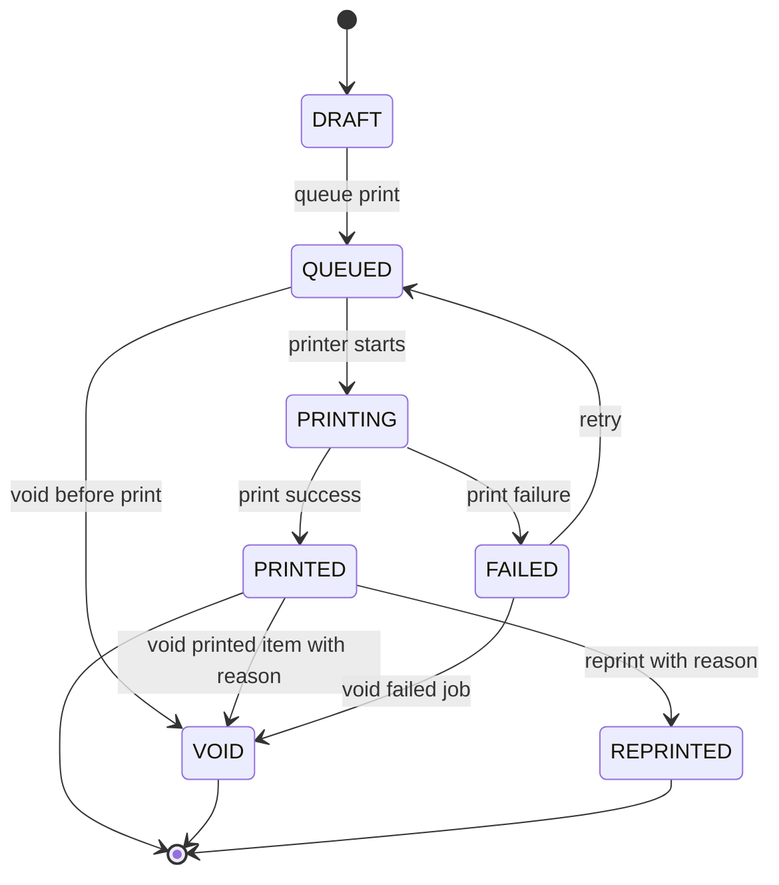
```mermaid
stateDiagram-v2
    [*] --> DRAFT
    DRAFT --> QUEUED: queue print
    QUEUED --> PRINTING: printer starts
    PRINTING --> PRINTED: print success
    PRINTING --> FAILED: print failure
    QUEUED --> VOID: void before print
    FAILED --> QUEUED: retry
    PRINTED --> REPRINTED: reprint with reason
    PRINTED --> VOID: void printed item with reason
    FAILED --> VOID: void failed job
    PRINTED --> [*]
    VOID --> [*]
    REPRINTED --> [*]
```

| Transition | Guard | Side effect |
|---|---|---|
| `DRAFT -> QUEUED` | QR is generated/eligible; GTIN if required | Print queue entry. |
| `PRINTING -> PRINTED` | Printer confirms success | QR can become public trace eligible if policy passes. |
| `PRINTED -> REPRINTED` | Reason required | Append reprint history. |

## 12. QR Lifecycle

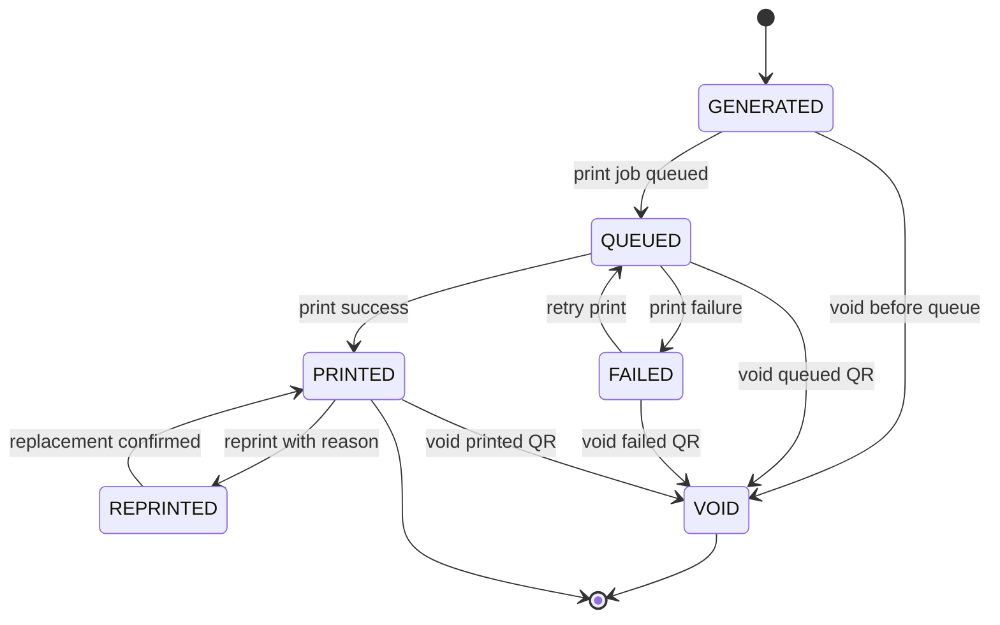
```mermaid
stateDiagram-v2
    [*] --> GENERATED
    GENERATED --> QUEUED: print job queued
    QUEUED --> PRINTED: print success
    QUEUED --> FAILED: print failure
    FAILED --> QUEUED: retry print
    PRINTED --> REPRINTED: reprint with reason
    REPRINTED --> PRINTED: replacement confirmed
    GENERATED --> VOID: void before queue
    QUEUED --> VOID: void queued QR
    FAILED --> VOID: void failed QR
    PRINTED --> VOID: void printed QR
    VOID --> [*]
    PRINTED --> [*]
```

| Transition | Guard | Side effect |
|---|---|---|
| `GENERATED -> QUEUED` | Print job exists | Append QR state history. |
| `QUEUED -> PRINTED` | Print success | Build public trace projection. |
| `PRINTED -> REPRINTED` | Reason required | Original QR history preserved. |
| `ANY -> VOID` | Reason required | Public trace must return safe invalid/void status. |

## 13. Trace

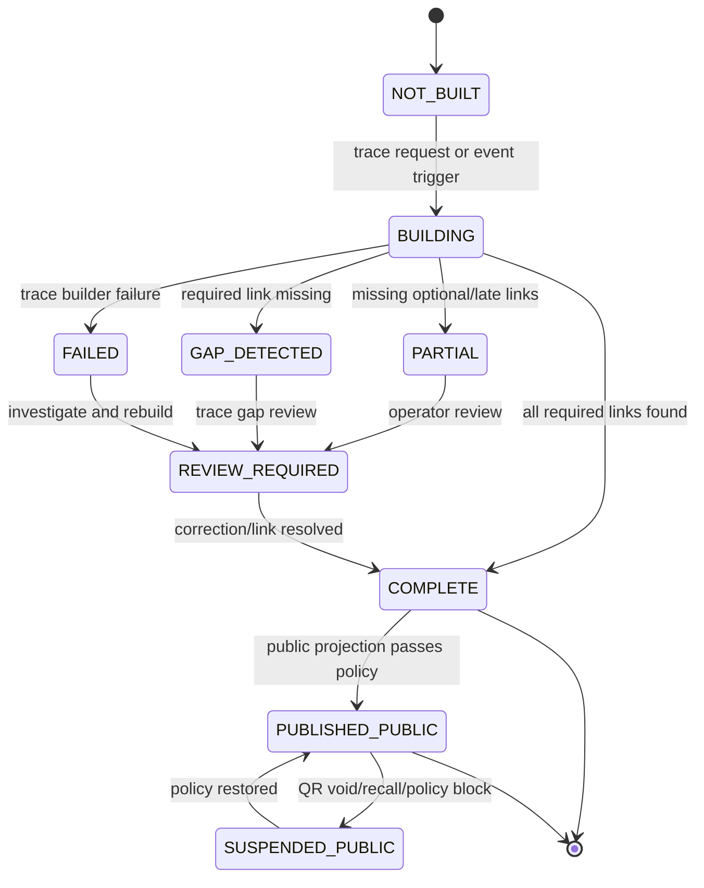
```mermaid
stateDiagram-v2
    [*] --> NOT_BUILT
    NOT_BUILT --> BUILDING: trace request or event trigger
    BUILDING --> COMPLETE: all required links found
    BUILDING --> PARTIAL: missing optional/late links
    BUILDING --> GAP_DETECTED: required link missing
    BUILDING --> FAILED: trace builder failure
    COMPLETE --> PUBLISHED_PUBLIC: public projection passes policy
    PARTIAL --> REVIEW_REQUIRED: operator review
    GAP_DETECTED --> REVIEW_REQUIRED: trace gap review
    FAILED --> REVIEW_REQUIRED: investigate and rebuild
    REVIEW_REQUIRED --> COMPLETE: correction/link resolved
    PUBLISHED_PUBLIC --> SUSPENDED_PUBLIC: QR void/recall/policy block
    SUSPENDED_PUBLIC --> PUBLISHED_PUBLIC: policy restored
    COMPLETE --> [*]
    PUBLISHED_PUBLIC --> [*]
```

| Transition | Guard | Side effect |
|---|---|---|
| `BUILDING -> COMPLETE` | Source/raw/issue/batch/QR/warehouse links are enough | Internal genealogy available. |
| `COMPLETE -> PUBLISHED_PUBLIC` | Public whitelist policy passes | Public trace response available. |
| `ANY -> GAP_DETECTED` | Required chain link missing | Alert/audit; may block recall close. |
| `BUILDING -> FAILED` | Builder error, stale index, or unreadable source data | Trace is not considered complete or recall-ready until reviewed/rebuilt. |

## 14. Recall

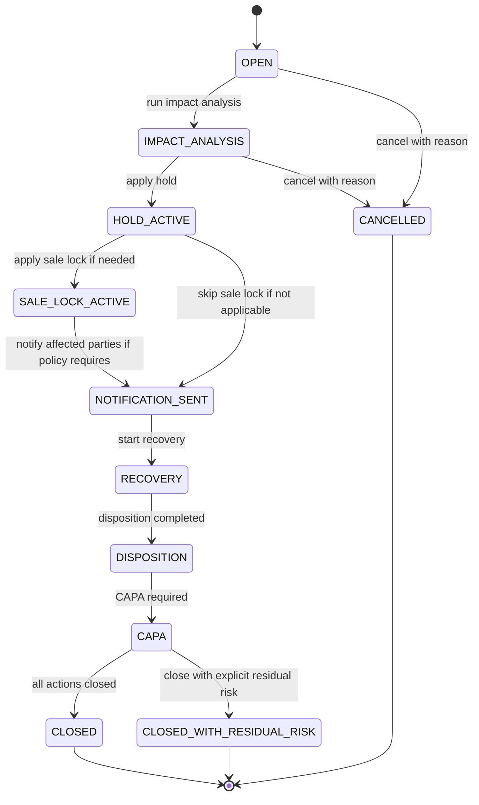
```mermaid
stateDiagram-v2
    [*] --> OPEN
    OPEN --> IMPACT_ANALYSIS: run impact analysis
    IMPACT_ANALYSIS --> HOLD_ACTIVE: apply hold
    HOLD_ACTIVE --> SALE_LOCK_ACTIVE: apply sale lock if needed
    SALE_LOCK_ACTIVE --> NOTIFICATION_SENT: notify affected parties if policy requires
    HOLD_ACTIVE --> NOTIFICATION_SENT: skip sale lock if not applicable
    NOTIFICATION_SENT --> RECOVERY: start recovery
    RECOVERY --> DISPOSITION: disposition completed
    DISPOSITION --> CAPA: CAPA required
    CAPA --> CLOSED: all actions closed
    CAPA --> CLOSED_WITH_RESIDUAL_RISK: close with explicit residual risk
    OPEN --> CANCELLED: cancel with reason
    IMPACT_ANALYSIS --> CANCELLED: cancel with reason
    CLOSED --> [*]
    CLOSED_WITH_RESIDUAL_RISK --> [*]
    CANCELLED --> [*]
```

| Transition | Guard | Side effect |
|---|---|---|
| `OPEN -> IMPACT_ANALYSIS` | Recall case created | Create impact snapshot version. |
| `IMPACT_ANALYSIS -> HOLD_ACTIVE` | Exposure snapshot exists or trace gap reviewed | Hold affected inventory/batches. |
| `CAPA -> CLOSED` | Recovery, disposition and CAPA complete | Close recall with audit. |
| `CAPA -> CLOSED_WITH_RESIDUAL_RISK` | Recovery/CAPA cannot fully eliminate accepted residual risk; residual risk note and approver required | Close recall with explicit residual risk audit. |

## 15. MISA Sync

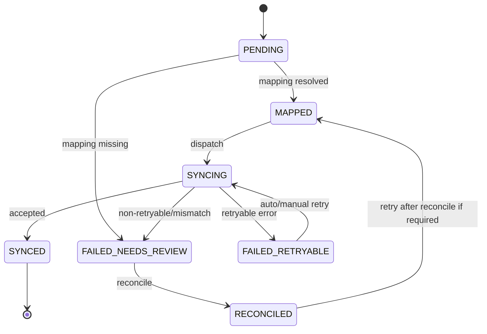
```mermaid
stateDiagram-v2
    [*] --> PENDING
    PENDING --> MAPPED: mapping resolved
    PENDING --> FAILED_NEEDS_REVIEW: mapping missing
    MAPPED --> SYNCING: dispatch
    SYNCING --> SYNCED: accepted
    SYNCING --> FAILED_RETRYABLE: retryable error
    SYNCING --> FAILED_NEEDS_REVIEW: non-retryable/mismatch
    FAILED_RETRYABLE --> SYNCING: auto/manual retry
    FAILED_NEEDS_REVIEW --> RECONCILED: reconcile
    RECONCILED --> MAPPED: retry after reconcile if required
    SYNCED --> [*]
```

| Transition | Guard | Side effect |
|---|---|---|
| `PENDING -> MAPPED` | Mapping exists | Ready for integration dispatch. |
| `SYNCING -> FAILED_RETRYABLE` | Retryable upstream/network error | Retry counter/log. |
| `FAILED_NEEDS_REVIEW -> RECONCILED` | Operator reconciliation with reason | Reconcile record and audit. |

## 16. State Machine Done Gate

- Required state machines are present for production order, material issue, material receipt, raw material lot/readiness, QC inspection, batch, batch release, warehouse receipt, inventory ledger, print job, QR lifecycle, trace, recall and MISA sync.
- Every irreversible transition has audit/idempotency/correction expectation.
- Every gate referenced by smoke workflow has a blocking state and error path.

## 17. Enum/Table Anchor Map

| lifecycle | enum/cột anchor | module spec | database/table anchor | test anchor |
|---|---|---|---|---|
| Production Order | `production_order_status` | `modules/07_PRODUCTION.md` | `op_production_order.production_order_status` | TC-M07-PO-001 |
| Material Issue | `material_issue_status` | `modules/08_MATERIAL_ISSUE_RECEIPT.md` | `op_material_issue.issue_status` | TC-M08-MI-001 |
| Material Receipt | `material_receipt_status` | `modules/08_MATERIAL_ISSUE_RECEIPT.md` | `op_material_receipt.receipt_status` | TC-M08-MR-002 |
| Raw Material Lot | `lot_status`, `readiness_status`, `lot_qc_status` | `modules/06_RAW_MATERIAL.md` | `op_raw_material_lot.lot_status`, `op_raw_material_lot.readiness_status`, `op_raw_material_lot.lot_qc_status`, `op_raw_material_lot.hold_status` | TC-M06-RM-004, TC-M06-RM-005 |
| QC Inspection | `qc_status` | `modules/09_QC_RELEASE.md` | `op_qc_inspection.qc_result`, `op_raw_material_qc_inspection.qc_status` | TC-M09-QC-001 |
| Batch | `batch_status` | `modules/07_PRODUCTION.md`, `modules/09_QC_RELEASE.md` | `op_batch.batch_status`, `op_batch_state_transition_log` | TC-M07-BATCH-001 |
| Batch Release | `batch_release_status` | `modules/09_QC_RELEASE.md` | `op_batch_release.release_status` | TC-M09-REL-002 |
| Warehouse Receipt | `warehouse_receipt_status` | `modules/11_WAREHOUSE_INVENTORY.md` | `op_warehouse_receipt.receipt_status` | TC-M11-WH-001 |
| Inventory Ledger | `inventory_ledger_status` | `modules/11_WAREHOUSE_INVENTORY.md` | `op_inventory_ledger.ledger_direction`, append-only post status | TC-M11-INV-002 |
| Print Job | `print_status` | `modules/10_PACKAGING_PRINTING.md` | `op_print_job.print_status` | TC-M10-PRINT-004 |
| QR Lifecycle | `qr_status` | `modules/10_PACKAGING_PRINTING.md`, `modules/12_TRACEABILITY.md` | `op_qr_registry.qr_status` | TC-M10-QR-003 |
| Trace | `trace_status` | `modules/12_TRACEABILITY.md` | `op_trace_link.trace_link_type`, trace projection readiness | TC-M12-TRACE-001 |
| Recall | `recall_status` | `modules/13_RECALL.md` | `op_recall_case.recall_status` | TC-M13-RECALL-001 |
| MISA Sync | `misa_sync_status` | `modules/14_MISA_INTEGRATION.md` | `misa_sync_event.sync_status` | TC-M14-MISA-002 |
