# 04 State Machines

## Mục lục

- [1. Mục tiêu](#1-mục-tiêu)
- [2. Production Order](#2-production-order)
- [2A. Recipe / Formula Version Governance](#2a-recipe--formula-version-governance)
- [3. Material Issue](#3-material-issue)
- [4. Material Receipt](#4-material-receipt)
- [5. Raw Material Lot](#5-raw-material-lot)
- [6. QC Inspection](#6-qc-inspection)
- [7. Batch](#7-batch)
- [7A. Production Process Step](#7a-production-process-step)
- [8. Batch Release](#8-batch-release)
- [9. Warehouse Receipt](#9-warehouse-receipt)
- [10. Inventory Ledger](#10-inventory-ledger)
- [11. Print Job](#11-print-job)
- [12. QR Lifecycle](#12-qr-lifecycle)
- [13. Trace](#13-trace)
- [14. Recall](#14-recall)
- [15. MISA Sync](#15-misa-sync)
- [16. State Machine Done Gate](#16-state-machine-done-gate)
- [17. Enum/Table Anchor Map](#17-enumtable-anchor-map)

## 1. Mục tiêu

Tài liệu này là contract state machine cho các entity vận hành chính. Mọi API/UI/test phải dùng các state và transition này, trừ khi owner phê duyệt thay đổi.

## 2. Production Order

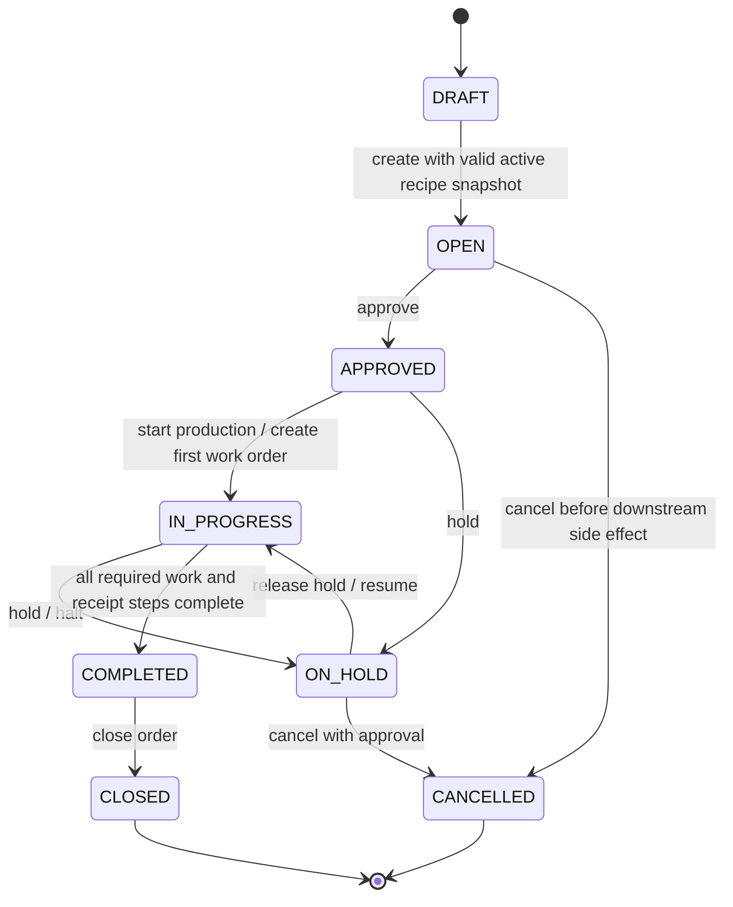
```mermaid
stateDiagram-v2
    [*] --> DRAFT
    DRAFT --> OPEN: create with valid active recipe snapshot
    OPEN --> APPROVED: approve
    OPEN --> CANCELLED: cancel before downstream side effect
    APPROVED --> IN_PROGRESS: start production / create first work order
    APPROVED --> ON_HOLD: hold
    IN_PROGRESS --> ON_HOLD: hold / halt
    ON_HOLD --> IN_PROGRESS: release hold / resume
    ON_HOLD --> CANCELLED: cancel with approval
    IN_PROGRESS --> COMPLETED: all required work and receipt steps complete
    COMPLETED --> CLOSED: close order
    CLOSED --> [*]
    CANCELLED --> [*]
```

| Transition                  | Guard                                                                                          | Side effect                              |
| --------------------------- | ---------------------------------------------------------------------------------------------- | ---------------------------------------- |
| `DRAFT -> OPEN`             | SKU active; approved active recipe version; snapshot complete                                  | Create immutable PO snapshot lines.      |
| `APPROVED -> IN_PROGRESS`   | PO approved; no active hold                                                                    | Create work/batch execution context.     |
| `IN_PROGRESS -> COMPLETED`  | Material receipt and required process events complete                                          | Batch ready for downstream QC/packaging. |
| `ANY -> ON_HOLD`            | Authorized hold with reason                                                                    | Append hold/audit event.                 |
| `OPEN/ON_HOLD -> CANCELLED` | No irreversible downstream ledger/release/public QR side effect, or correction approval exists | Audit cancel reason.                     |

## 2A. Recipe / Formula Version Governance

Canonical enum: `formula_status = DRAFT, PENDING_APPROVAL, APPROVED, APPROVED_SEED_BASELINE, ACTIVE_OPERATIONAL, RETIRED, REJECTED`.

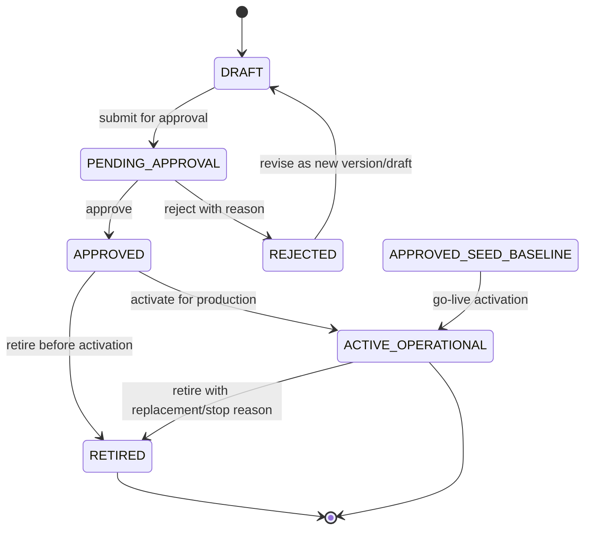
```mermaid
stateDiagram-v2
    [*] --> DRAFT
    DRAFT --> PENDING_APPROVAL: submit for approval
    PENDING_APPROVAL --> APPROVED: approve
    PENDING_APPROVAL --> REJECTED: reject with reason
    APPROVED --> ACTIVE_OPERATIONAL: activate for production
    APPROVED --> RETIRED: retire before activation
    APPROVED_SEED_BASELINE --> ACTIVE_OPERATIONAL: go-live activation
    ACTIVE_OPERATIONAL --> RETIRED: retire with replacement/stop reason
    REJECTED --> DRAFT: revise as new version/draft
    RETIRED --> [*]
    ACTIVE_OPERATIONAL --> [*]
```

| Transition | Guard | Side effect |
| --- | --- | --- |
| `DRAFT -> PENDING_APPROVAL` | Recipe lines complete for `formula_kind`; G0/research token not allowed for operational approval | Append approval request. |
| `PENDING_APPROVAL -> APPROVED` | Approver authorized; PILOT ratio or FIXED quantity rules pass | Set `approved_by`, `approved_at`. |
| `APPROVED_SEED_BASELINE -> ACTIVE_OPERATIONAL` | Seed baseline accepted for go-live | Set `activated_at`; enforce active uniqueness below. |
| `APPROVED -> ACTIVE_OPERATIONAL` | Version/kind allowed; no conflicting active recipe for same `(sku_id, formula_kind)` | Planner can select exact `formula_version` + `formula_kind` for PO snapshot. |
| `ACTIVE_OPERATIONAL -> RETIRED` | No open PO requires this version, or retirement has approved transition plan | Set `retired_at`; historical PO snapshots remain immutable. |

Coexistence rule: `ACTIVE_OPERATIONAL` is unique per `(sku_id, formula_kind)`, not per SKU. G1 `PILOT_PERCENT_BASED` and G2 `FIXED_QUANTITY_BATCH` may coexist for the same SKU during pilot-to-production transition. Production Order creation must record the selected `formula_version` and `formula_kind`; it must not infer from the old per-SKU active-recipe assumption.

## 3. Material Issue

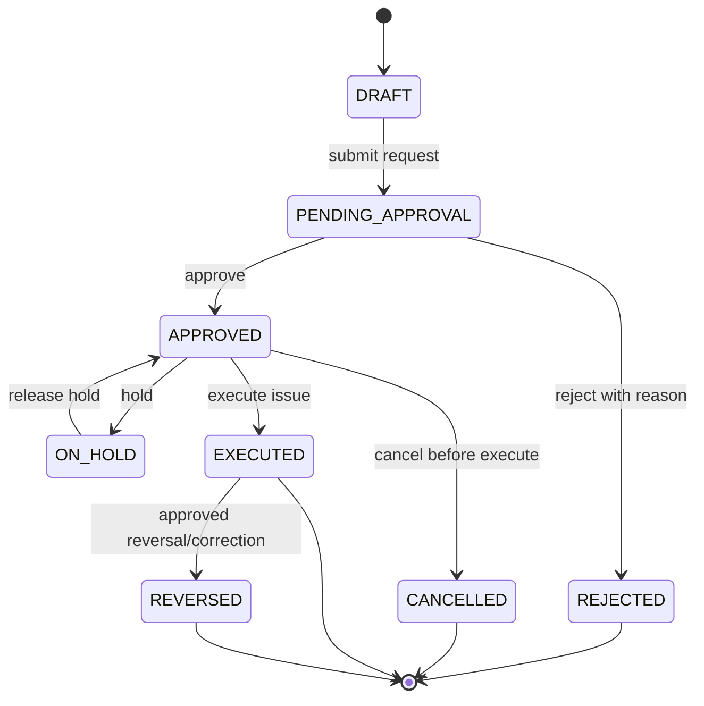
```mermaid
stateDiagram-v2
    [*] --> DRAFT
    DRAFT --> PENDING_APPROVAL: submit request
    PENDING_APPROVAL --> APPROVED: approve
    PENDING_APPROVAL --> REJECTED: reject with reason
    APPROVED --> ON_HOLD: hold
    ON_HOLD --> APPROVED: release hold
    APPROVED --> EXECUTED: execute issue
    APPROVED --> CANCELLED: cancel before execute
    EXECUTED --> REVERSED: approved reversal/correction
    REJECTED --> [*]
    CANCELLED --> [*]
    EXECUTED --> [*]
    REVERSED --> [*]
```

| Transition                  | Guard                                                                              | Side effect                                                  |
| --------------------------- | ---------------------------------------------------------------------------------- | ------------------------------------------------------------ |
| `DRAFT -> PENDING_APPROVAL` | Lines come from PO snapshot                                                        | Approval request.                                            |
| `APPROVED -> EXECUTED`      | Raw lot `READY_FOR_PRODUCTION`, available balance, no active hold, idempotency key | Post raw inventory decrement ledger; trace raw lot to batch. |
| `EXECUTED -> REVERSED`      | Owner-approved correction/reversal                                                 | Append reversal ledger, do not update original ledger.       |

## 4. Material Receipt

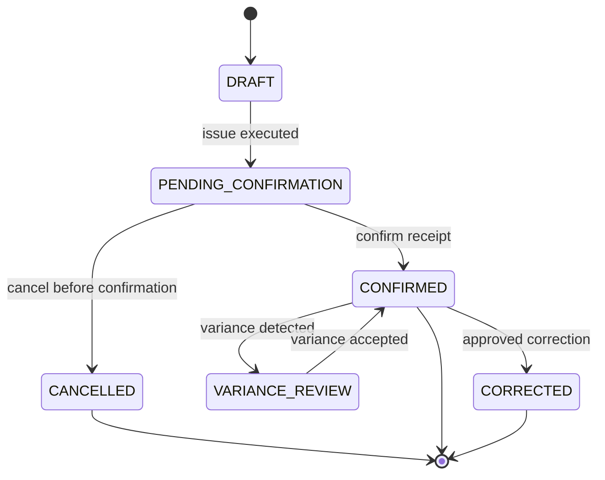
```mermaid
stateDiagram-v2
    [*] --> DRAFT
    DRAFT --> PENDING_CONFIRMATION: issue executed
    PENDING_CONFIRMATION --> CONFIRMED: confirm receipt
    PENDING_CONFIRMATION --> CANCELLED: cancel before confirmation
    CONFIRMED --> VARIANCE_REVIEW: variance detected
    VARIANCE_REVIEW --> CONFIRMED: variance accepted
    CONFIRMED --> CORRECTED: approved correction
    CANCELLED --> [*]
    CONFIRMED --> [*]
    CORRECTED --> [*]
```

| Transition                          | Guard                                | Side effect                                          |
| ----------------------------------- | ------------------------------------ | ---------------------------------------------------- |
| `PENDING_CONFIRMATION -> CONFIRMED` | Received quantity valid              | Store workshop receipt; no inventory decrement.      |
| `CONFIRMED -> VARIANCE_REVIEW`      | Received qty differs from issued qty | Require variance reason.                             |
| `CONFIRMED -> CORRECTED`            | Correction approved                  | Append correction record; preserve original receipt. |

## 4A. Raw Material Receipt (Supplier Collaboration 2-axis)

Receipt M06 dùng đồng thời 2 trục trạng thái: axis A `supplier_collaboration_status` (giữa NCC và company) và axis B `raw_receipt_status` (vận hành kho/QC). Chi tiết bảng kết hợp hợp lệ và mô tả đầy đủ ở `modules/06_RAW_MATERIAL.md` mục 11.2.

### Axis A — `supplier_collaboration_status`

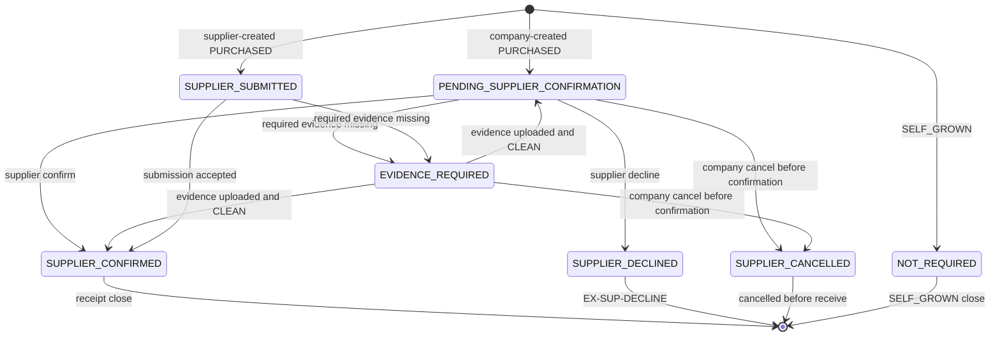
```mermaid
stateDiagram-v2
    [*] --> NOT_REQUIRED: SELF_GROWN
    [*] --> PENDING_SUPPLIER_CONFIRMATION: company-created PURCHASED
    [*] --> SUPPLIER_SUBMITTED: supplier-created PURCHASED
    PENDING_SUPPLIER_CONFIRMATION --> EVIDENCE_REQUIRED: required evidence missing
    EVIDENCE_REQUIRED --> PENDING_SUPPLIER_CONFIRMATION: evidence uploaded and CLEAN
    PENDING_SUPPLIER_CONFIRMATION --> SUPPLIER_CONFIRMED: supplier confirm
    PENDING_SUPPLIER_CONFIRMATION --> SUPPLIER_DECLINED: supplier decline
    PENDING_SUPPLIER_CONFIRMATION --> SUPPLIER_CANCELLED: company cancel before confirmation
    EVIDENCE_REQUIRED --> SUPPLIER_CANCELLED: company cancel before confirmation
    SUPPLIER_SUBMITTED --> EVIDENCE_REQUIRED: required evidence missing
    EVIDENCE_REQUIRED --> SUPPLIER_CONFIRMED: evidence uploaded and CLEAN
    SUPPLIER_SUBMITTED --> SUPPLIER_CONFIRMED: submission accepted
    SUPPLIER_CONFIRMED --> [*]: receipt close
    SUPPLIER_DECLINED --> [*]: EX-SUP-DECLINE
    SUPPLIER_CANCELLED --> [*]: cancelled before receive
    NOT_REQUIRED --> [*]: SELF_GROWN close
```

### Axis B — `raw_receipt_status`

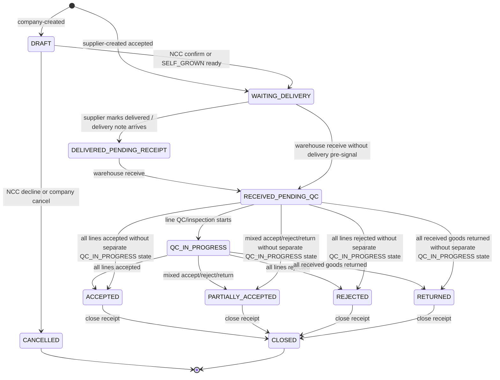
```mermaid
stateDiagram-v2
    [*] --> DRAFT: company-created
    [*] --> WAITING_DELIVERY: supplier-created accepted
    DRAFT --> WAITING_DELIVERY: NCC confirm or SELF_GROWN ready
    DRAFT --> CANCELLED: NCC decline or company cancel
    WAITING_DELIVERY --> DELIVERED_PENDING_RECEIPT: supplier marks delivered / delivery note arrives
    DELIVERED_PENDING_RECEIPT --> RECEIVED_PENDING_QC: warehouse receive
    WAITING_DELIVERY --> RECEIVED_PENDING_QC: warehouse receive without delivery pre-signal
    RECEIVED_PENDING_QC --> QC_IN_PROGRESS: line QC/inspection starts
    QC_IN_PROGRESS --> ACCEPTED: all lines accepted
    QC_IN_PROGRESS --> PARTIALLY_ACCEPTED: mixed accept/reject/return
    QC_IN_PROGRESS --> REJECTED: all lines rejected
    QC_IN_PROGRESS --> RETURNED: all received goods returned
    RECEIVED_PENDING_QC --> ACCEPTED: all lines accepted without separate QC_IN_PROGRESS state
    RECEIVED_PENDING_QC --> PARTIALLY_ACCEPTED: mixed accept/reject/return without separate QC_IN_PROGRESS state
    RECEIVED_PENDING_QC --> REJECTED: all lines rejected without separate QC_IN_PROGRESS state
    RECEIVED_PENDING_QC --> RETURNED: all received goods returned without separate QC_IN_PROGRESS state
    ACCEPTED --> CLOSED: close receipt
    PARTIALLY_ACCEPTED --> CLOSED: close receipt
    REJECTED --> CLOSED: close receipt
    RETURNED --> CLOSED: close receipt
    CANCELLED --> [*]
    CLOSED --> [*]
```

| Transition                                         | Guard                                                                                         | Side effect                                                                       |
| -------------------------------------------------- | --------------------------------------------------------------------------------------------- | --------------------------------------------------------------------------------- |
| Axis A `PENDING_SUPPLIER_CONFIRMATION -> EVIDENCE_REQUIRED` | Policy requires evidence before confirmation/receive and no CLEAN evidence exists | Block confirm/receive until evidence gate passes. |
| Axis A `PENDING_SUPPLIER_CONFIRMATION -> SUPPLIER_CONFIRMED` | Receipt PURCHASED, supplier ACTIVE, required evidence CLEAN if policy applies | Raw status can move `DRAFT -> WAITING_DELIVERY`. |
| Axis A `PENDING_SUPPLIER_CONFIRMATION -> SUPPLIER_DECLINED` | Supplier decline + close reason | Raw status moves `CANCELLED`; EX-SUP-DECLINE; no ledger/lot side effect. |
| Axis A `PENDING_SUPPLIER_CONFIRMATION/EVIDENCE_REQUIRED -> SUPPLIER_CANCELLED` | Company cancel before warehouse receive; reason required | Raw status moves `CANCELLED`; no ledger/lot side effect. |
| `WAITING_DELIVERY -> DELIVERED_PENDING_RECEIPT` | Supplier/delivery signal received before warehouse confirmation | Capture delivery timestamp/reference; still editable only within pre-receive rules. |
| `WAITING_DELIVERY/DELIVERED_PENDING_RECEIPT -> RECEIVED_PENDING_QC` | `received_at`, receiver and received quantities present; evidence CLEAN if required | Lock receive form; create lot candidates; no raw inventory debit. |
| `RECEIVED_PENDING_QC -> QC_IN_PROGRESS` | QC/line review started | Lock quantity/ingredient metadata; line decisions pending. |
| `RECEIVED_PENDING_QC/QC_IN_PROGRESS -> ACCEPTED/PARTIALLY_ACCEPTED/REJECTED/RETURNED` | Every line has accept/reject/return decision; quantity invariants pass | Create `op_raw_material_lot` only for accepted quantities; reject/return does not create usable lot. |
| `* -> CLOSED` | Only from ACCEPTED/PARTIALLY_ACCEPTED/REJECTED/RETURNED | Emit `RAW_RECEIPT_CLOSED`; axis A remains `SUPPLIER_CONFIRMED` or `NOT_REQUIRED`; lock all fields. |

Bảng kết hợp hợp lệ giữa axis A và axis B, cùng các invariant (`SUPPLIER_DECLINED ⇒ raw_receipt_status ∈ {CANCELLED}`; `RECEIVED_PENDING_QC+ ⇒ axis A ∈ {SUPPLIER_CONFIRMED, NOT_REQUIRED}`) ở `modules/06_RAW_MATERIAL.md` mục 11.2.

## 5. Raw Material Lot

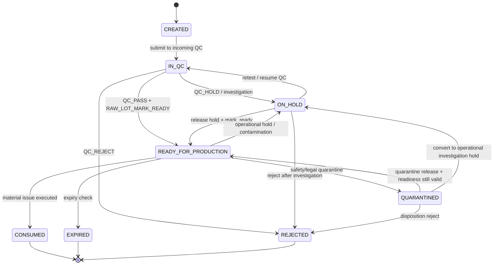
```mermaid
stateDiagram-v2
    [*] --> CREATED
    CREATED --> IN_QC: submit to incoming QC
    IN_QC --> ON_HOLD: QC_HOLD / investigation
    IN_QC --> REJECTED: QC_REJECT
    IN_QC --> READY_FOR_PRODUCTION: QC_PASS + RAW_LOT_MARK_READY
    ON_HOLD --> IN_QC: retest / resume QC
    ON_HOLD --> READY_FOR_PRODUCTION: release hold + mark_ready
    ON_HOLD --> REJECTED: reject after investigation
    READY_FOR_PRODUCTION --> CONSUMED: material issue executed
    READY_FOR_PRODUCTION --> ON_HOLD: operational hold / contamination
    READY_FOR_PRODUCTION --> EXPIRED: expiry check
    READY_FOR_PRODUCTION --> QUARANTINED: safety/legal quarantine
    QUARANTINED --> READY_FOR_PRODUCTION: quarantine release + readiness still valid
    QUARANTINED --> ON_HOLD: convert to operational investigation hold
    QUARANTINED --> REJECTED: disposition reject
    CONSUMED --> [*]
    EXPIRED --> [*]
    REJECTED --> [*]
```

| Transition                                        | Guard                                                                                           | Side effect                                                            |
| ------------------------------------------------- | ----------------------------------------------------------------------------------------------- | ---------------------------------------------------------------------- |
| `IN_QC -> READY_FOR_PRODUCTION`                   | `lot_qc_status = QC_PASS`, `RAW_LOT_MARK_READY` permission, no hold/reject/quarantine/expiry, source/readiness checks pass | Append state transition/audit and emit `RAW_LOT_READY_FOR_PRODUCTION`. |
| `READY_FOR_PRODUCTION -> CONSUMED`                | Material issue uses approved PO snapshot and available balance                                  | Ledger and balance update only at issue execution.                     |
| `ON_HOLD/QUARANTINED/EXPIRED/REJECTED`            | Reason/evidence required                                                                        | Blocks material issue.                                                 |

`QC_PASSED_WAITING_READY` and `RESERVED` are not persisted `lot_status` values in V2. UI/API may derive "waiting ready" from `lot_status = IN_QC` + `lot_qc_status = QC_PASS`; reservation belongs to `op_inventory_allocation`/`op_inventory_lot_balance`, not `op_raw_material_lot.lot_status`.

## 6. QC Inspection

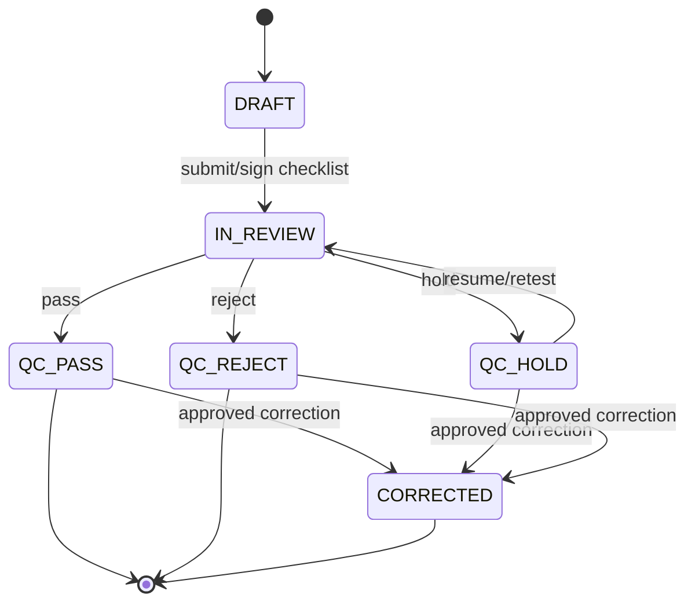
```mermaid
stateDiagram-v2
    [*] --> DRAFT
    DRAFT --> IN_REVIEW: submit/sign checklist
    IN_REVIEW --> QC_PASS: pass
    IN_REVIEW --> QC_HOLD: hold
    IN_REVIEW --> QC_REJECT: reject
    QC_HOLD --> IN_REVIEW: resume/retest
    QC_PASS --> CORRECTED: approved correction
    QC_HOLD --> CORRECTED: approved correction
    QC_REJECT --> CORRECTED: approved correction
    QC_PASS --> [*]
    QC_REJECT --> [*]
    CORRECTED --> [*]
```

| Transition                       | Guard                | Side effect                                          |
| -------------------------------- | -------------------- | ---------------------------------------------------- |
| `IN_REVIEW -> QC_PASS`           | Checklist complete   | Entity may proceed to next gate if no hold.          |
| `IN_REVIEW -> QC_HOLD/QC_REJECT` | Reason/note required | Block downstream gate.                               |
| `ANY_SIGNED -> CORRECTED`        | Correction approval  | New correction record, original remains append-only. |

## 7. Batch

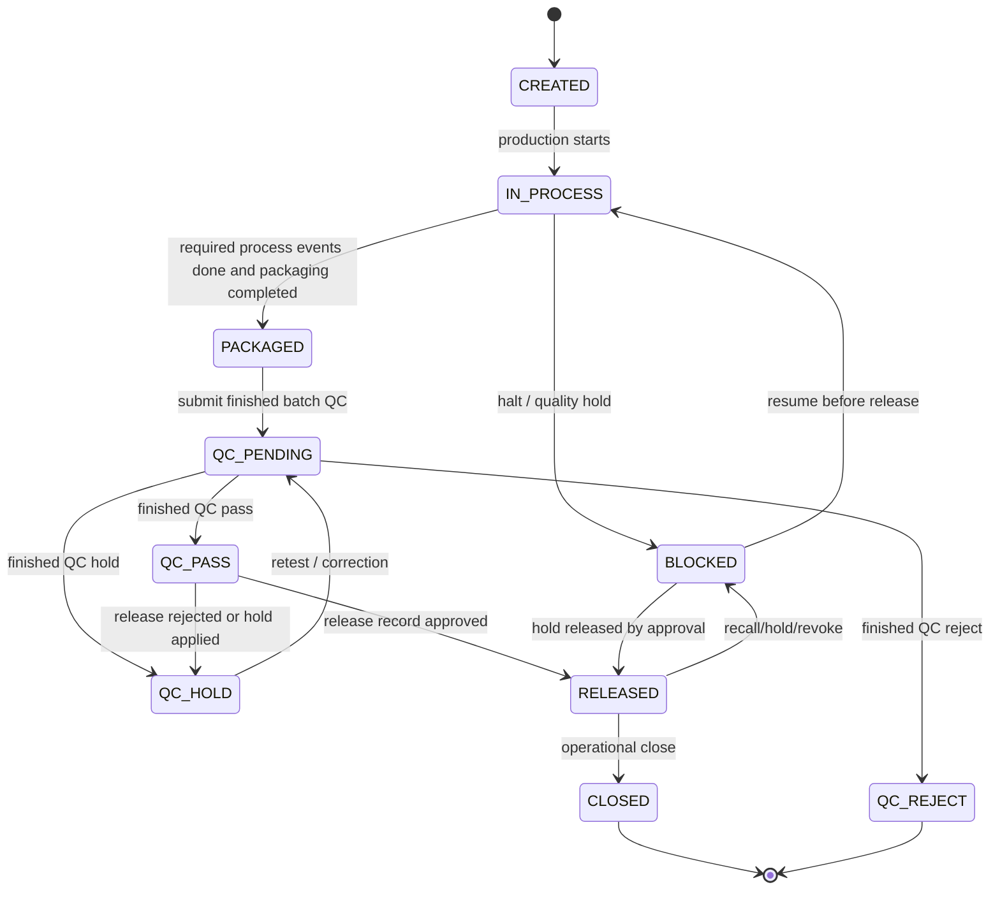
```mermaid
stateDiagram-v2
    [*] --> CREATED
    CREATED --> IN_PROCESS: production starts
    IN_PROCESS --> BLOCKED: halt / quality hold
    BLOCKED --> IN_PROCESS: resume before release
    IN_PROCESS --> PACKAGED: required process events done and packaging completed
    PACKAGED --> QC_PENDING: submit finished batch QC
    QC_PENDING --> QC_PASS: finished QC pass
    QC_PENDING --> QC_HOLD: finished QC hold
    QC_PENDING --> QC_REJECT: finished QC reject
    QC_HOLD --> QC_PENDING: retest / correction
    QC_PASS --> RELEASED: release record approved
    QC_PASS --> QC_HOLD: release rejected or hold applied
    RELEASED --> BLOCKED: recall/hold/revoke
    BLOCKED --> RELEASED: hold released by approval
    RELEASED --> CLOSED: operational close
    CLOSED --> [*]
    QC_REJECT --> [*]
```

| Transition                           | Guard                                        | Side effect                                                    |
| ------------------------------------ | -------------------------------------------- | -------------------------------------------------------------- |
| `CREATED -> IN_PROCESS`              | PO/work order approved and material prerequisites met | Batch execution context starts.                                |
| `IN_PROCESS -> PACKAGED`             | All required `process_step` events are `DONE`; packaging completed | Batch can enter finished-goods QC queue.                       |
| `PACKAGED -> QC_PENDING`             | Packaging/printing prerequisites complete    | Batch is ready for finished-goods QC.                          |
| `QC_PENDING -> QC_PASS`              | Finished QC inspection signed                | Batch is eligible to request release, not warehouse-ready yet. |
| `QC_PASS -> RELEASED`                | Separate `op_batch_release.release_status = APPROVED_RELEASED` exists | Batch becomes eligible for finished-goods warehouse receipt.   |
| `RELEASED -> BLOCKED`                | Recall/quality/hold decision with reason     | Blocks further warehouse/shipment actions according scope.     |

`PROCESS_COMPLETED` and `RELEASE_PENDING` are event/queue concepts, not persisted `batch_status` values. Use `BATCH_PROCESS_COMPLETED` event from process-step completion and `op_batch_release.release_status = PENDING` for release queue state.

## 7A. Production Process Step

Canonical enums: `process_step = PREPROCESSING, FREEZING, FREEZE_DRYING`; `process_status = NOT_STARTED, IN_PROGRESS, DONE, HALTED, REJECTED, CORRECTED`.

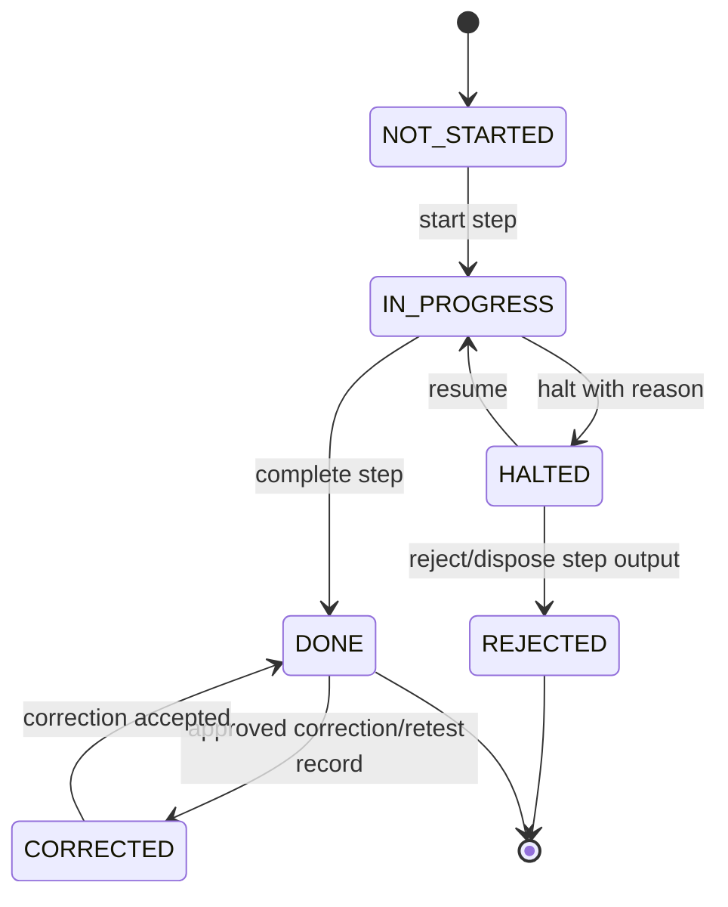
```mermaid
stateDiagram-v2
    [*] --> NOT_STARTED
    NOT_STARTED --> IN_PROGRESS: start step
    IN_PROGRESS --> DONE: complete step
    IN_PROGRESS --> HALTED: halt with reason
    HALTED --> IN_PROGRESS: resume
    HALTED --> REJECTED: reject/dispose step output
    DONE --> CORRECTED: approved correction/retest record
    CORRECTED --> DONE: correction accepted
    REJECTED --> [*]
    DONE --> [*]
```

| Transition | Guard | Side effect |
| --- | --- | --- |
| `NOT_STARTED -> IN_PROGRESS` | Previous required step is `DONE` unless step is `PREPROCESSING`; batch is `IN_PROCESS` | Append process event/state log. |
| `IN_PROGRESS -> DONE` | Required measurements/evidence captured | Append completion event. |
| `IN_PROGRESS -> HALTED` | Reason and actor required | Blocks next process step and packaging. |
| `HALTED -> IN_PROGRESS` | Resume reason approved | Append resume event; preserve halt history. |
| `DONE -> CORRECTED -> DONE` | Correction approval and new evidence/check result | Original event remains append-only; correction linked to original. |

Ordering invariant: `PREPROCESSING DONE -> FREEZING IN_PROGRESS -> FREEZING DONE -> FREEZE_DRYING IN_PROGRESS -> FREEZE_DRYING DONE`. Batch may emit `BATCH_PROCESS_COMPLETED` only after all three required process steps are `DONE`; batch status remains within `batch_status` enum and does not store `PROCESS_COMPLETED`.

## 8. Batch Release

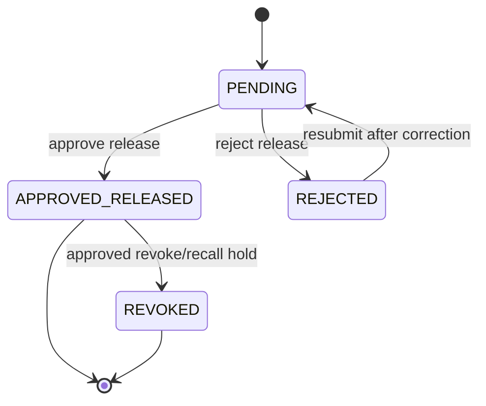
```mermaid
stateDiagram-v2
    [*] --> PENDING
    PENDING --> APPROVED_RELEASED: approve release
    PENDING --> REJECTED: reject release
    APPROVED_RELEASED --> REVOKED: approved revoke/recall hold
    REJECTED --> PENDING: resubmit after correction
    APPROVED_RELEASED --> [*]
    REVOKED --> [*]
```

| Transition                     | Guard                                        | Side effect                              |
| ------------------------------ | -------------------------------------------- | ---------------------------------------- |
| `PENDING -> APPROVED_RELEASED` | Batch QC result is `QC_PASS`; no active hold | Batch eligible for warehouse receipt.    |
| `APPROVED_RELEASED -> REVOKED` | Recall/quality decision with approval        | Blocks future warehouse/shipment; audit. |

## 9. Warehouse Receipt

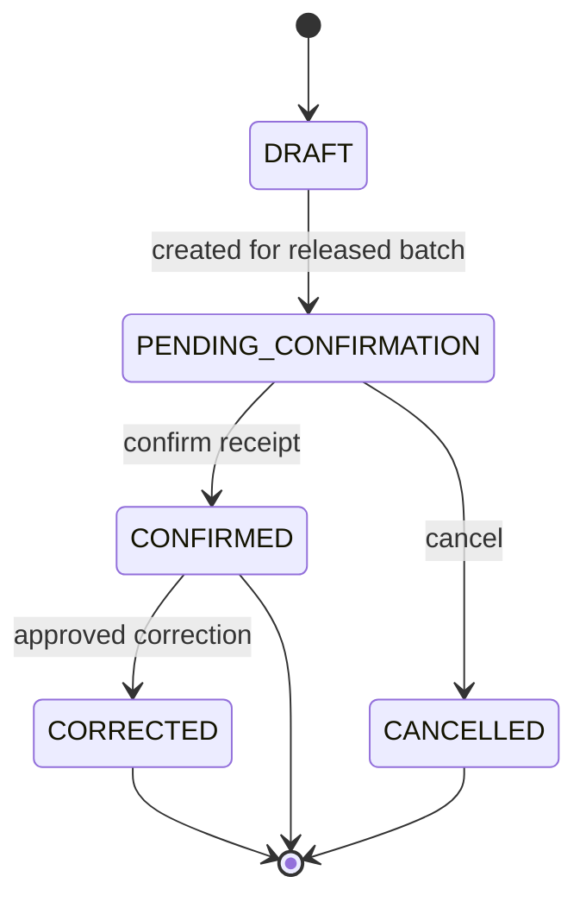
```mermaid
stateDiagram-v2
    [*] --> DRAFT
    DRAFT --> PENDING_CONFIRMATION: created for released batch
    PENDING_CONFIRMATION --> CONFIRMED: confirm receipt
    PENDING_CONFIRMATION --> CANCELLED: cancel
    CONFIRMED --> CORRECTED: approved correction
    CONFIRMED --> [*]
    CANCELLED --> [*]
    CORRECTED --> [*]
```

| Transition                          | Guard                                         | Side effect                                          |
| ----------------------------------- | --------------------------------------------- | ---------------------------------------------------- |
| `DRAFT -> PENDING_CONFIRMATION`     | Batch release status `APPROVED_RELEASED`      | Create receipt document.                             |
| `PENDING_CONFIRMATION -> CONFIRMED` | Quantity > 0; warehouse valid; no active hold | Post finished-goods ledger and lot balance.          |
| `CONFIRMED -> CORRECTED`            | Correction approval                           | Append correction/reversal; original ledger remains. |

## 10. Inventory Ledger

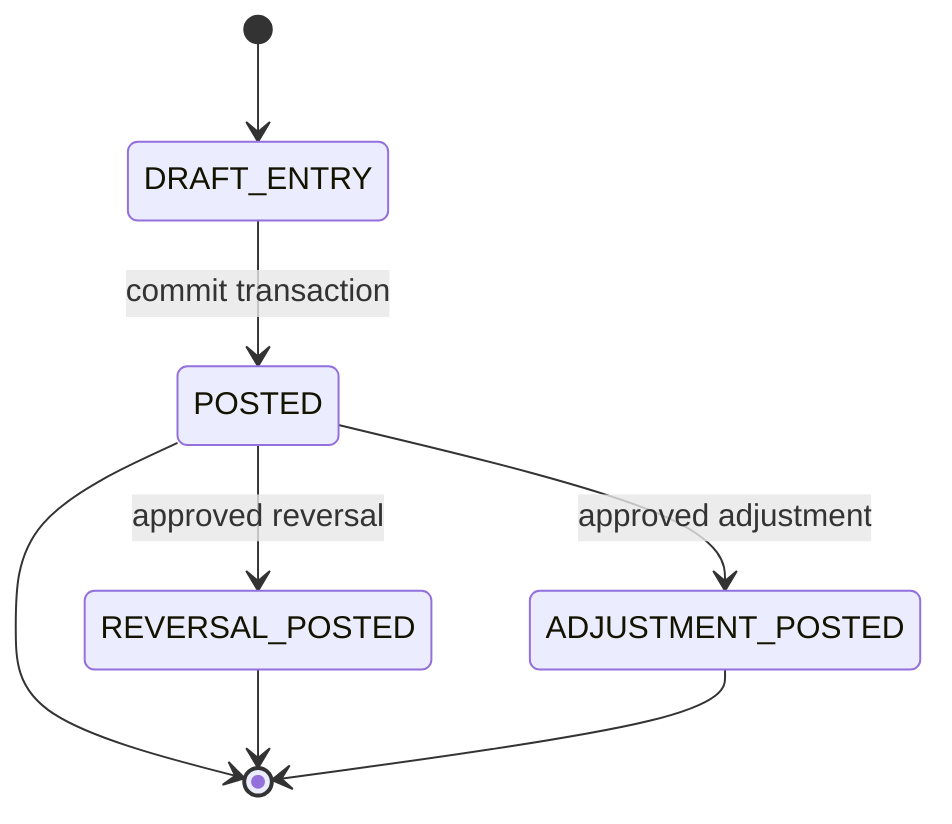
```mermaid
stateDiagram-v2
    [*] --> DRAFT_ENTRY
    DRAFT_ENTRY --> POSTED: commit transaction
    POSTED --> REVERSAL_POSTED: approved reversal
    POSTED --> ADJUSTMENT_POSTED: approved adjustment
    POSTED --> [*]
    REVERSAL_POSTED --> [*]
    ADJUSTMENT_POSTED --> [*]
```

| Transition                    | Guard                           | Side effect                                    |
| ----------------------------- | ------------------------------- | ---------------------------------------------- |
| `DRAFT_ENTRY -> POSTED`       | Transaction succeeds atomically | Ledger becomes append-only.                    |
| `POSTED -> REVERSAL_POSTED`   | Reversal command approved       | Add reversal entry; never mutate posted entry. |
| `POSTED -> ADJUSTMENT_POSTED` | Adjustment approved             | Add adjustment entry with reason.              |

## 11. Print Job

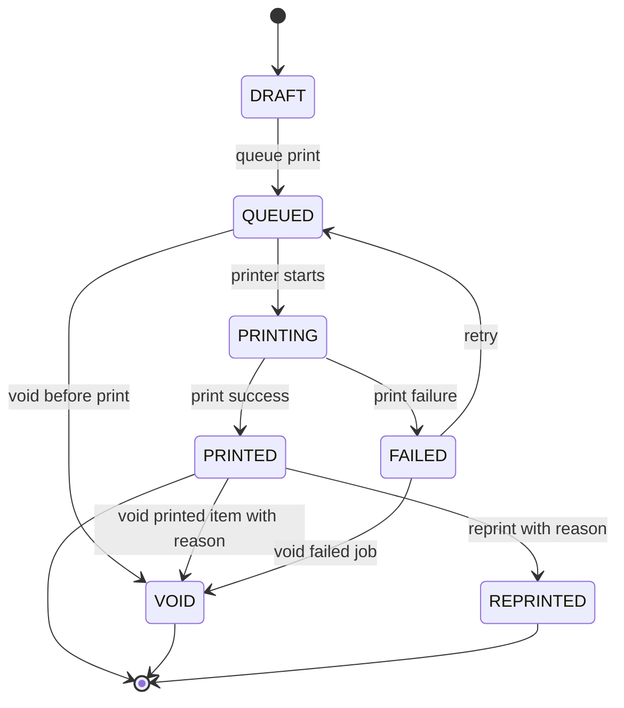
```mermaid
stateDiagram-v2
    [*] --> DRAFT
    DRAFT --> QUEUED: queue print
    QUEUED --> PRINTING: printer starts
    PRINTING --> PRINTED: print success
    PRINTING --> FAILED: print failure
    QUEUED --> VOID: void before print
    FAILED --> QUEUED: retry
    PRINTED --> REPRINTED: reprint with reason
    PRINTED --> VOID: void printed item with reason
    FAILED --> VOID: void failed job
    PRINTED --> [*]
    VOID --> [*]
    REPRINTED --> [*]
```

| Transition             | Guard                                      | Side effect                                           |
| ---------------------- | ------------------------------------------ | ----------------------------------------------------- |
| `DRAFT -> QUEUED`      | QR is generated/eligible; GTIN if required | Print queue entry.                                    |
| `PRINTING -> PRINTED`  | Printer confirms success                   | QR can become public trace eligible if policy passes. |
| `PRINTED -> REPRINTED` | Reason required                            | Append reprint history.                               |

## 12. QR Lifecycle

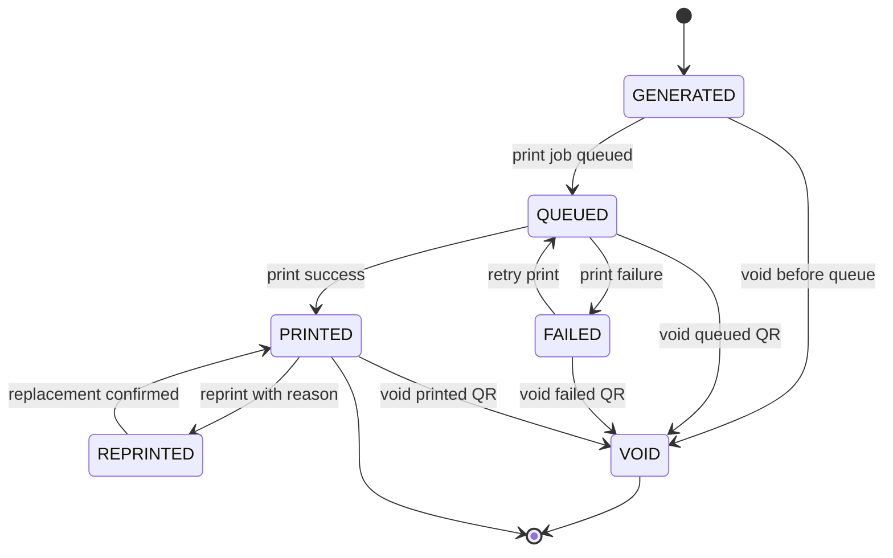
```mermaid
stateDiagram-v2
    [*] --> GENERATED
    GENERATED --> QUEUED: print job queued
    QUEUED --> PRINTED: print success
    QUEUED --> FAILED: print failure
    FAILED --> QUEUED: retry print
    PRINTED --> REPRINTED: reprint with reason
    REPRINTED --> PRINTED: replacement confirmed
    GENERATED --> VOID: void before queue
    QUEUED --> VOID: void queued QR
    FAILED --> VOID: void failed QR
    PRINTED --> VOID: void printed QR
    VOID --> [*]
    PRINTED --> [*]
```

| Transition             | Guard            | Side effect                                        |
| ---------------------- | ---------------- | -------------------------------------------------- |
| `GENERATED -> QUEUED`  | Print job exists | Append QR state history.                           |
| `QUEUED -> PRINTED`    | Print success    | Build public trace projection.                     |
| `PRINTED -> REPRINTED` | Reason required  | Original QR history preserved.                     |
| `ANY -> VOID`          | Reason required  | Public trace must return safe invalid/void status. |

Enum coverage: this state machine covers all 6 `qr_status` values from `database/04_ENUM_REFERENCE.md`: `GENERATED`, `QUEUED`, `PRINTED`, `FAILED`, `VOID`, `REPRINTED`. Only current `PRINTED` QR is public-trace eligible by default; `FAILED`/`VOID` must fail safe, and superseded original QR after reprint must not expose stale public trace.

## 13. Trace

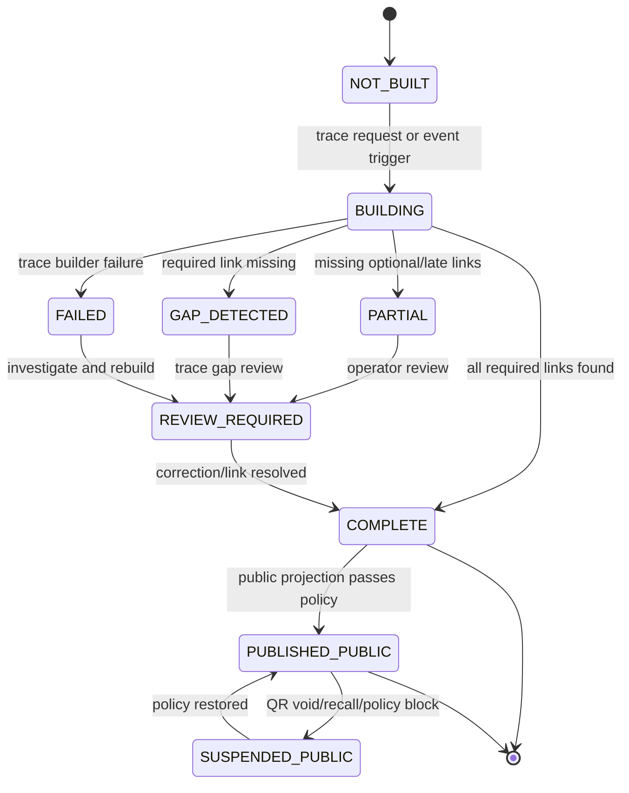
```mermaid
stateDiagram-v2
    [*] --> NOT_BUILT
    NOT_BUILT --> BUILDING: trace request or event trigger
    BUILDING --> COMPLETE: all required links found
    BUILDING --> PARTIAL: missing optional/late links
    BUILDING --> GAP_DETECTED: required link missing
    BUILDING --> FAILED: trace builder failure
    COMPLETE --> PUBLISHED_PUBLIC: public projection passes policy
    PARTIAL --> REVIEW_REQUIRED: operator review
    GAP_DETECTED --> REVIEW_REQUIRED: trace gap review
    FAILED --> REVIEW_REQUIRED: investigate and rebuild
    REVIEW_REQUIRED --> COMPLETE: correction/link resolved
    PUBLISHED_PUBLIC --> SUSPENDED_PUBLIC: QR void/recall/policy block
    SUSPENDED_PUBLIC --> PUBLISHED_PUBLIC: policy restored
    COMPLETE --> [*]
    PUBLISHED_PUBLIC --> [*]
```

| Transition                     | Guard                                                 | Side effect                                                              |
| ------------------------------ | ----------------------------------------------------- | ------------------------------------------------------------------------ |
| `BUILDING -> COMPLETE`         | Source/raw/issue/batch/QR/warehouse links are enough  | Internal genealogy available.                                            |
| `COMPLETE -> PUBLISHED_PUBLIC` | Public whitelist policy passes                        | Public trace response available.                                         |
| `ANY -> GAP_DETECTED`          | Required chain link missing                           | Alert/audit; may block recall close.                                     |
| `BUILDING -> FAILED`           | Builder error, stale index, or unreadable source data | Trace is not considered complete or recall-ready until reviewed/rebuilt. |

## 14. Recall

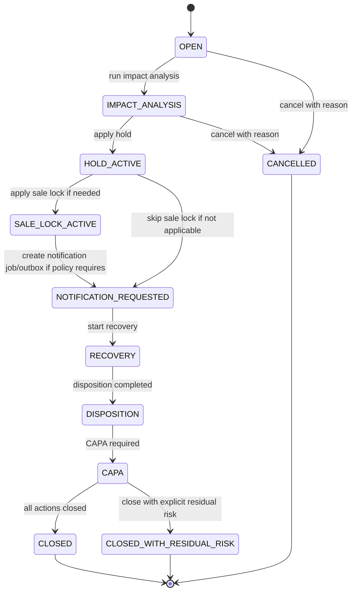
```mermaid
stateDiagram-v2
    [*] --> OPEN
    OPEN --> IMPACT_ANALYSIS: run impact analysis
    IMPACT_ANALYSIS --> HOLD_ACTIVE: apply hold
    HOLD_ACTIVE --> SALE_LOCK_ACTIVE: apply sale lock if needed
    SALE_LOCK_ACTIVE --> NOTIFICATION_REQUESTED: create notification job/outbox if policy requires
    HOLD_ACTIVE --> NOTIFICATION_REQUESTED: skip sale lock if not applicable
    NOTIFICATION_REQUESTED --> RECOVERY: start recovery
    RECOVERY --> DISPOSITION: disposition completed
    DISPOSITION --> CAPA: CAPA required
    CAPA --> CLOSED: all actions closed
    CAPA --> CLOSED_WITH_RESIDUAL_RISK: close with explicit residual risk
    OPEN --> CANCELLED: cancel with reason
    IMPACT_ANALYSIS --> CANCELLED: cancel with reason
    CLOSED --> [*]
    CLOSED_WITH_RESIDUAL_RISK --> [*]
    CANCELLED --> [*]
```

| Transition                          | Guard                                                                                                 | Side effect                                     |
| ----------------------------------- | ----------------------------------------------------------------------------------------------------- | ----------------------------------------------- |
| `OPEN -> IMPACT_ANALYSIS`           | Recall case created                                                                                   | Create impact snapshot version.                 |
| `IMPACT_ANALYSIS -> HOLD_ACTIVE`    | Exposure snapshot exists or trace gap reviewed                                                        | Hold affected inventory/batches.                |
| `CAPA -> CLOSED`                    | Recovery, disposition and CAPA complete                                                               | Close recall with audit.                        |
| `CAPA -> CLOSED_WITH_RESIDUAL_RISK` | Recovery/CAPA cannot fully eliminate accepted residual risk; residual risk note and approver required | Close recall with explicit residual risk audit. |

## 15. MISA Sync

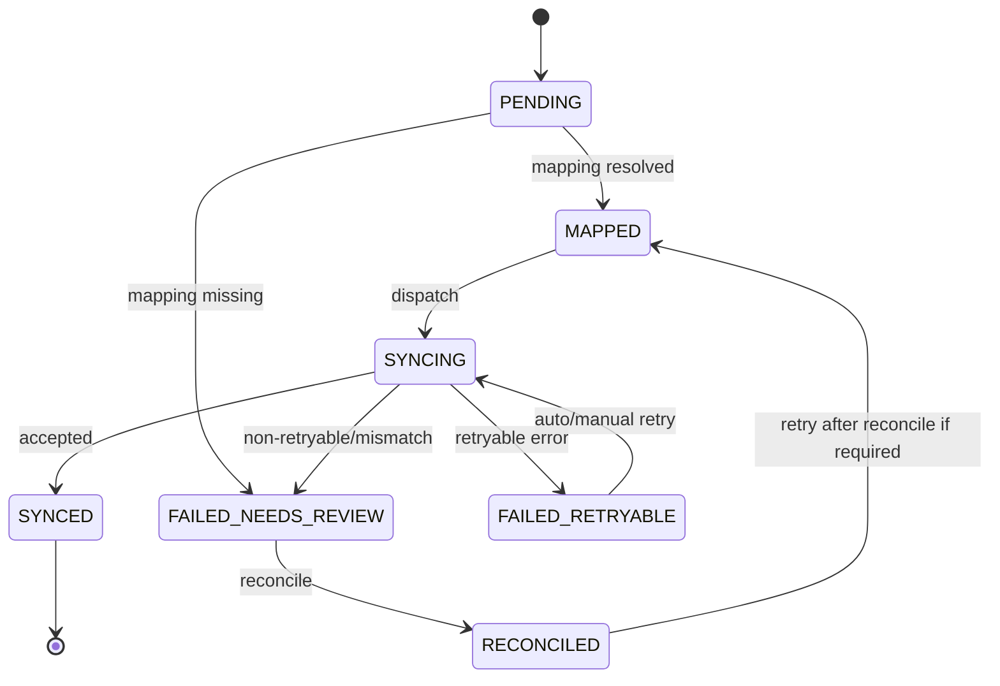
```mermaid
stateDiagram-v2
    [*] --> PENDING
    PENDING --> MAPPED: mapping resolved
    PENDING --> FAILED_NEEDS_REVIEW: mapping missing
    MAPPED --> SYNCING: dispatch
    SYNCING --> SYNCED: accepted
    SYNCING --> FAILED_RETRYABLE: retryable error
    SYNCING --> FAILED_NEEDS_REVIEW: non-retryable/mismatch
    FAILED_RETRYABLE --> SYNCING: auto/manual retry
    FAILED_NEEDS_REVIEW --> RECONCILED: reconcile
    RECONCILED --> MAPPED: retry after reconcile if required
    SYNCED --> [*]
```

| Transition                          | Guard                               | Side effect                     |
| ----------------------------------- | ----------------------------------- | ------------------------------- |
| `PENDING -> MAPPED`                 | Mapping exists                      | Ready for integration dispatch. |
| `SYNCING -> FAILED_RETRYABLE`       | Retryable upstream/network error    | Retry counter/log.              |
| `FAILED_NEEDS_REVIEW -> RECONCILED` | Operator reconciliation with reason | Reconcile record and audit.     |

## 16. State Machine Done Gate

- Required state machines are present for recipe/formula governance, production order, material issue, material receipt, raw material receipt 2-axis, raw material lot/readiness, QC inspection, batch, production process step, batch release, warehouse receipt, inventory ledger, print job, QR lifecycle, trace, recall and MISA sync.
- Every irreversible transition has audit/idempotency/correction expectation.
- Every gate referenced by smoke workflow has a blocking state and error path.

## 17. Enum/Table Anchor Map

| lifecycle         | enum/cột anchor                                   | module spec                                                      | database/table anchor                                                                                                                            | test anchor                  |
| ----------------- | ------------------------------------------------- | ---------------------------------------------------------------- | ------------------------------------------------------------------------------------------------------------------------------------------------ | ---------------------------- |
| Formula Governance | `formula_status`, `formula_version`, `formula_kind` | `modules/04_SKU_INGREDIENT_RECIPE.md`, `business/02_BUSINESS_RULES.md` | `op_production_recipe.formula_status`, `op_production_recipe.formula_version`, `op_production_recipe.formula_kind`                               | TC-M04-REC-004               |
| Production Order  | `production_order_status`                         | `modules/07_PRODUCTION.md`                                       | `op_production_order.production_order_status`                                                                                                    | TC-M07-PO-001                |
| Material Issue    | `material_issue_status`                           | `modules/08_MATERIAL_ISSUE_RECEIPT.md`                           | `op_material_issue.issue_status`                                                                                                                 | TC-M08-MI-001                |
| Material Receipt  | `material_receipt_status`                         | `modules/08_MATERIAL_ISSUE_RECEIPT.md`                           | `op_material_receipt.receipt_status`                                                                                                             | TC-M08-MR-002                |
| Raw Material Lot  | `lot_status`, `readiness_status`, `lot_qc_status` | `modules/06_RAW_MATERIAL.md`                                     | `op_raw_material_lot.lot_status`, `op_raw_material_lot.readiness_status`, `op_raw_material_lot.lot_qc_status`, `op_raw_material_lot.hold_status` | TC-M06-RM-004, TC-M06-RM-005 |
| QC Inspection     | `qc_status`                                       | `modules/09_QC_RELEASE.md`                                       | `op_qc_inspection.qc_result`, `op_raw_material_qc_inspection.qc_status`                                                                          | TC-M09-QC-001                |
| Batch             | `batch_status`                                    | `modules/07_PRODUCTION.md`, `modules/09_QC_RELEASE.md`           | `op_batch.batch_status`, `op_batch_state_transition_log`                                                                                         | TC-M07-BATCH-001             |
| Production Process Step | `process_step`, `process_status`                  | `modules/07_PRODUCTION.md`                                       | `op_production_process_event.process_step`, `op_production_process_event.process_status`                                                          | TC-M07-PROC-003              |
| Batch Release     | `batch_release_status`                            | `modules/09_QC_RELEASE.md`                                       | `op_batch_release.release_status`                                                                                                                | TC-M09-REL-002               |
| Warehouse Receipt | `warehouse_receipt_status`                        | `modules/11_WAREHOUSE_INVENTORY.md`                              | `op_warehouse_receipt.receipt_status`                                                                                                            | TC-M11-WH-001                |
| Inventory Ledger  | `inventory_ledger_status`                         | `modules/11_WAREHOUSE_INVENTORY.md`                              | `op_inventory_ledger.ledger_direction`, append-only post status                                                                                  | TC-M11-INV-002               |
| Print Job         | `print_status`                                    | `modules/10_PACKAGING_PRINTING.md`                               | `op_print_job.print_status`                                                                                                                      | TC-M10-PRINT-004             |
| QR Lifecycle      | `qr_status`                                       | `modules/10_PACKAGING_PRINTING.md`, `modules/12_TRACEABILITY.md` | `op_qr_registry.qr_status`                                                                                                                       | TC-M10-QR-003                |
| Trace             | `trace_status`                                    | `modules/12_TRACEABILITY.md`                                     | `op_trace_link.trace_link_type`, trace projection readiness                                                                                      | TC-M12-TRACE-001             |
| Recall            | `recall_status`                                   | `modules/13_RECALL.md`                                           | `op_recall_case.recall_status`                                                                                                                   | TC-M13-RECALL-001            |
| MISA Sync         | `misa_sync_status`                                | `modules/14_MISA_INTEGRATION.md`                                 | `misa_sync_event.sync_status`                                                                                                                    | TC-M14-MISA-002              |
