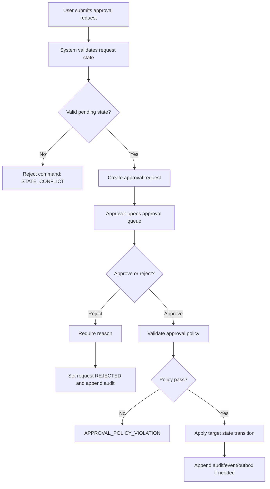
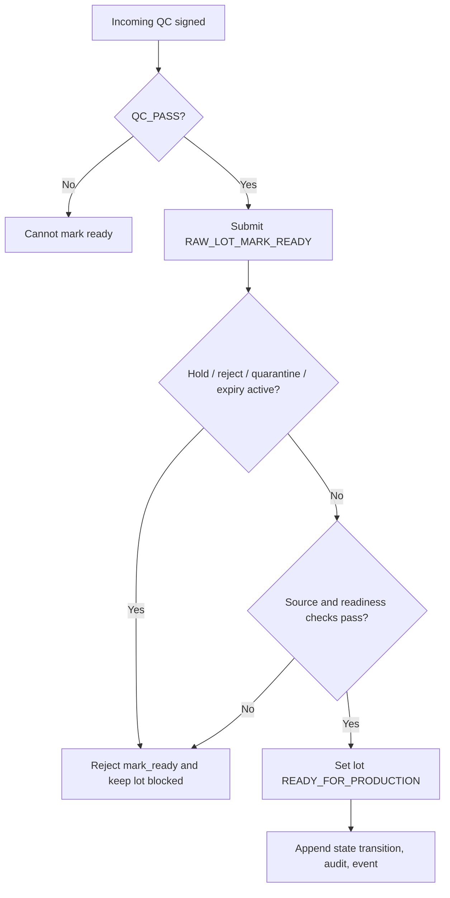
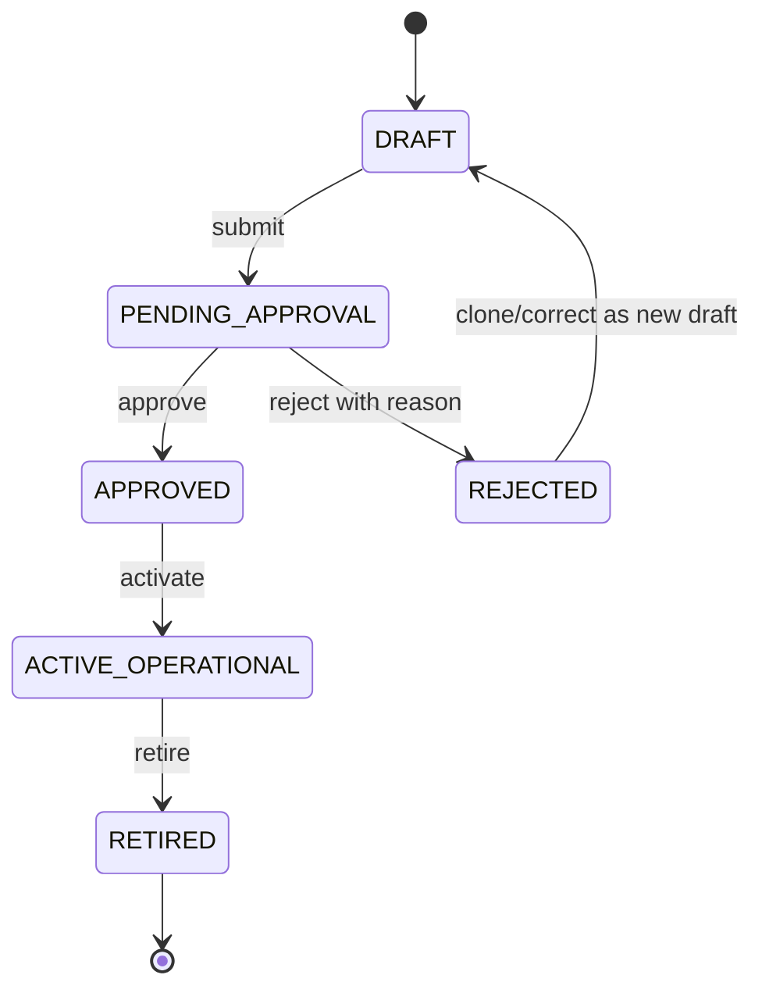
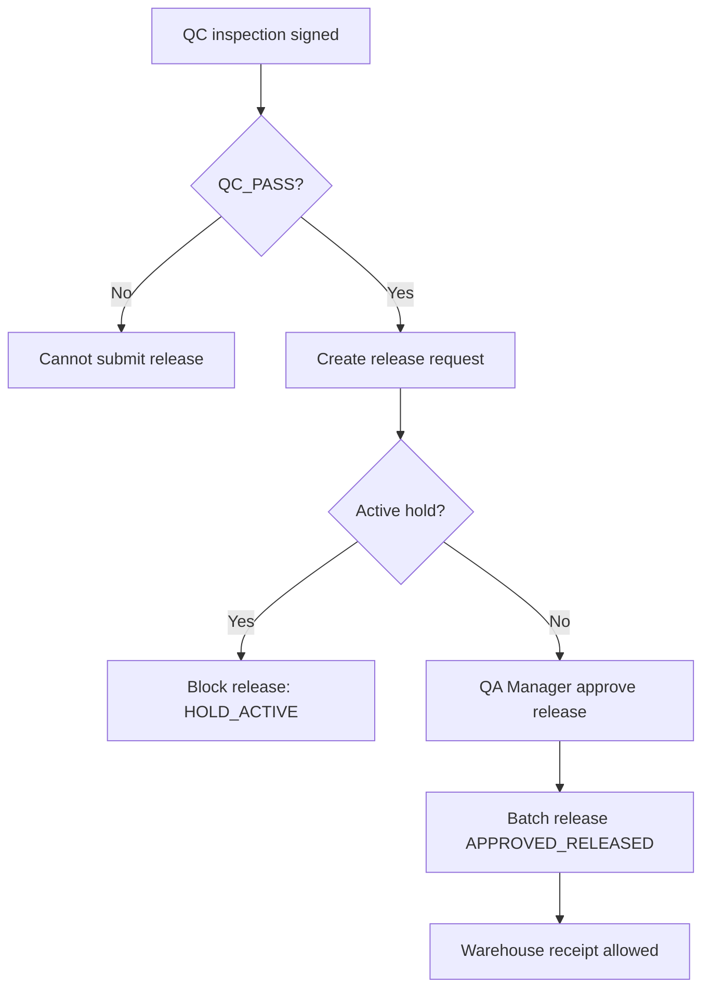
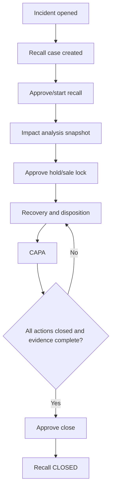

# 06 Approval Workflows

## 1. Mục tiêu

Tài liệu này chuẩn hóa các luồng duyệt, từ chối và audit cho những hành động có rủi ro nghiệp vụ. Mọi approval/reject phải có actor, permission, trạng thái nguồn, trạng thái đích, reason khi reject, audit log và idempotency key nếu là command.

## 2. Approval Principles

| Nguyên tắc                | Quy tắc                                                                                                                                                  |
| ------------------------- | -------------------------------------------------------------------------------------------------------------------------------------------------------- |
| Separation of duties      | Người tạo và người duyệt nên tách vai trò với các hành động rủi ro cao. Nếu hệ thống hiện hữu chưa hỗ trợ, đánh dấu OWNER DECISION NEEDED khi implement. |
| Reject reason             | Reject bắt buộc reason, không xóa submission gốc.                                                                                                        |
| Immutable approved record | Record đã approved/released/posted không sửa in-place; correction tạo record mới.                                                                        |
| Audit                     | Approval/reject/override lưu actor, timestamp, action, target, before/after state, reason, correlation id.                                               |
| Idempotency               | Approval command dùng `Idempotency-Key` để tránh duyệt lặp.                                                                                              |
| State check               | Approval chỉ hợp lệ khi record đang ở state pending tương ứng.                                                                                           |

## 3. Approval Catalog

| approval_id            | Object                                | Submitter                         | Approver                                                    | Pending state                     | Approve transition                                          | Reject transition                                                           | API                                                                                                           | UI                                             | Required checks                                                                                                                                                                                                                                                                                                                                         | Audit event                                                    | Test                   |
| ---------------------- | ------------------------------------- | --------------------------------- | ----------------------------------------------------------- | --------------------------------- | ----------------------------------------------------------- | --------------------------------------------------------------------------- | ------------------------------------------------------------------------------------------------------------- | ---------------------------------------------- | ------------------------------------------------------------------------------------------------------------------------------------------------------------------------------------------------------------------------------------------------------------------------------------------------------------------------------------------------------- | -------------------------------------------------------------- | ---------------------- |
| AP-SRC-001             | Source origin verification            | Source Manager                    | QA Manager                                                  | `SUBMITTED`                       | `SUBMITTED -> VERIFIED`                                     | `SUBMITTED -> REJECTED`                                                     | `POST /api/admin/source-origins/{id}/verify`                                                                  | SCR-SOURCE-ORIGINS                             | Evidence/source fields complete                                                                                                                                                                                                                                                                                                                         | `SOURCE_ORIGIN_VERIFIED` / `SOURCE_ORIGIN_REJECTED`            | TC-UI-SRC-002          |
| AP-REC-001             | Recipe approval                       | R&D                               | QA Manager / Production Manager                             | `PENDING_APPROVAL`                | `PENDING_APPROVAL -> APPROVED`                              | `PENDING_APPROVAL -> REJECTED`                                              | `POST /api/admin/recipes/{id}/submit-approval`; approval endpoints                                            | SCR-RECIPE                                     | 4 recipe groups, active ingredient, effective date; **PILOT_PERCENT_BASED**: exactly 1 `is_anchor = true` line + header anchor metadata (`anchor_ingredient_id`, `anchor_baseline_quantity > 0`, `anchor_uom_code`, `anchor_ratio_percent` ∈ (0, 100]); **FIXED_QUANTITY_BATCH**: every line `quantity_per_batch_400 > 0` and header anchor fields NULL | `RECIPE_APPROVED` / `RECIPE_REJECTED`                          | TC-UI-REC-001          |
| AP-REC-002             | Recipe activation                     | QA Manager / authorized role      | Authorized activator                                        | `APPROVED`                        | `APPROVED -> ACTIVE_OPERATIONAL`                            | N/A                                                                         | `POST /api/admin/recipes/{id}/activate`                                                                       | SCR-RECIPE                                     | No active overlap for SKU, effective date valid                                                                                                                                                                                                                                                                                                         | `RECIPE_ACTIVATED`                                             | TC-UI-REC-003          |
| AP-PO-001              | Production order approval             | Production Planner                | Production Manager                                          | `OPEN`                            | `OPEN -> APPROVED`                                          | `OPEN -> CANCELLED/REJECTED` [OWNER DECISION NEEDED]                        | `POST /api/admin/production/orders/{id}/approve`                                                              | SCR-PROD-ORDER-DETAIL                          | Snapshot complete, SKU active, recipe active, planned qty valid                                                                                                                                                                                                                                                                                         | `PRODUCTION_ORDER_APPROVED`                                    | TC-UI-PO-001           |
| AP-MREQ-001            | Material request approval             | Production Operator               | Production Manager                                          | `PENDING_APPROVAL`                | `PENDING_APPROVAL -> APPROVED`                              | `PENDING_APPROVAL -> REJECTED`                                              | `POST /api/admin/production/material-requests/{id}/approve`                                                   | SCR-MATERIAL-REQUESTS                          | All lines inside PO snapshot                                                                                                                                                                                                                                                                                                                            | `MATERIAL_REQUEST_APPROVED` / `MATERIAL_REQUEST_REJECTED`      | TC-UI-MR-001           |
| AP-LOT-001             | Raw lot mark-ready approval           | QA Inspector / Warehouse Operator | QA Manager / Warehouse Manager                              | `QC_PASSED_WAITING_READY`         | `QC_PASSED_WAITING_READY -> READY_FOR_PRODUCTION`           | `QC_PASSED_WAITING_READY -> ON_HOLD/QUARANTINED`                            | `POST /api/admin/raw-material/lots/{lotId}/mark-ready`                                                        | SCR-LOT-READINESS                              | QC result `QC_PASS`, source valid, balance available, no active hold/reject/quarantine/expiry, `RAW_LOT_MARK_READY` permission                                                                                                                                                                                                                          | `RAW_LOT_READY_FOR_PRODUCTION` / `RAW_LOT_MARK_READY_REJECTED` | TC-M06-RM-005          |
| AP-REL-001             | Batch release approval                | QA Inspector / QA Manager         | QA Manager or Release Approver                              | `PENDING`                         | `PENDING -> APPROVED_RELEASED`                              | `PENDING -> REJECTED`                                                       | `POST /api/admin/qc/releases/{id}/approve`                                                                    | SCR-BATCH-RELEASE                              | QC result `QC_PASS`, no active hold                                                                                                                                                                                                                                                                                                                     | `BATCH_RELEASE_APPROVED` / `BATCH_RELEASE_REJECTED`            | TC-UI-REL-001          |
| AP-ADJ-001             | Inventory adjustment approval         | Warehouse Manager                 | Admin / Finance / Warehouse Manager [OWNER DECISION NEEDED] | `PENDING_APPROVAL`                | `PENDING_APPROVAL -> APPROVED/APPLIED`                      | `PENDING_APPROVAL -> REJECTED`                                              | `POST /api/admin/inventory/adjustments` plus approval endpoint [OWNER DECISION NEEDED]                        | SCR-INVENTORY-ADJUSTMENTS                      | Reason, attachment/evidence if required, balance impact                                                                                                                                                                                                                                                                                                 | `INVENTORY_ADJUSTMENT_APPROVED`                                | TC-UI-ADJ-001          |
| AP-RECALL-001          | Recall case approval/start            | QA Manager                        | Recall Manager / Admin                                      | `OPEN`                            | `OPEN -> IMPACT_ANALYSIS` or active recall                  | `OPEN -> CANCELLED`                                                         | `POST /api/admin/recall/cases` and lifecycle endpoints                                                        | SCR-RECALL-CASES                               | Severity, scope, reason, seed entity                                                                                                                                                                                                                                                                                                                    | `RECALL_CASE_APPROVED`                                         | TC-UI-RCL-001          |
| AP-HOLD-001            | Recall hold/sale lock                 | Recall Manager                    | Recall Manager / Warehouse Manager                          | `IMPACT_ANALYSIS`                 | `-> HOLD_ACTIVE`, `-> SALE_LOCK_ACTIVE`                     | N/A                                                                         | `POST /api/admin/recall/cases/{id}/hold`, `/sale-lock`                                                        | SCR-RECALL-HOLD                                | Target from impact snapshot, reason required                                                                                                                                                                                                                                                                                                            | `RECALL_HOLD_APPLIED`, `SALE_LOCK_APPLIED`                     | TC-UI-HOLD-001         |
| AP-CAPA-001            | CAPA close                            | Recall Manager                    | QA Manager                                                  | `CAPA`                            | `CAPA -> CLOSED`                                            | Remain `CAPA`                                                               | `POST /api/admin/recall/cases/{id}/close`                                                                     | SCR-RECALL-RECOVERY-CAPA                       | All recovery/disposition/CAPA done, at least 1 CAPA evidence exists with `scan_status = CLEAN`                                                                                                                                                                                                                                                          | `RECALL_CLOSED`                                                | TC-UI-CAPA-001         |
| AP-MISA-001            | MISA mapping/reconcile approval       | Integration Operator              | Admin / Finance Viewer [OWNER DECISION NEEDED]              | `FAILED_NEEDS_REVIEW`             | `FAILED_NEEDS_REVIEW -> RECONCILED`                         | Remain failed                                                               | `POST /api/admin/integrations/misa/sync-events/{id}/reconcile`                                                | SCR-MISA-RECONCILE                             | Mapping or mismatch reason                                                                                                                                                                                                                                                                                                                              | `MISA_RECONCILED`                                              | TC-UI-RECNC-001        |
| AP-OVR-001             | Break-glass override                  | Authorized operator               | Admin / dual approver [OWNER DECISION NEEDED]               | Any blocked state                 | Controlled override transition                              | Reject override                                                             | Endpoint per object [OWNER DECISION NEEDED]                                                                   | Relevant screen                                | Reason, scope, dual approval, expiry timestamp <= 15 minutes, no public policy bypass                                                                                                                                                                                                                                                                   | `OVERRIDE_APPROVED` / `OVERRIDE_REJECTED` / `OVERRIDE_EXPIRED` | TC-EXC-OVR-001         |
| AP-SUP-CONFIRM         | Supplier confirm pre-receipt          | Supplier user (R-SUPPLIER)        | N/A (self-service confirm); company chỉ nhận event          | axis A `PENDING_SUPPLIER_CONFIRM` | `-> SUPPLIER_CONFIRMED` (axis A) + axis B `PENDING_RECEIVE` | `-> SUPPLIER_DECLINED` (axis A) + axis B `CANCELLED` (đường EX-SUP-DECLINE) | `POST /api/supplier/raw-material/intakes/{id}/confirm` / `.../decline`                                        | SCR-SUP-PORTAL-INTAKES                         | Supplier ACTIVE; ingredient nằm allowlist; reason bắt buộc khi decline; sau confirm lock chỉnh sửa supplier-side                                                                                                                                                                                                                                        | `SUPPLIER_INTAKE_CONFIRMED` / `SUPPLIER_INTAKE_DECLINED`       | AC-SUP-006, AC-SUP-007 |
| AP-SUP-EVIDENCE-REVIEW | Supplier evidence review (HL-SUP-009) | Supplier user (R-SUPPLIER)        | QA Inspector / Warehouse Operator                           | evidence `PENDING_SCAN`/`CLEAN`   | `evidence.scan_status = CLEAN` cho phép receive/close       | `evidence.scan_status ∈ {INFECTED, FAILED}` chặn receive/close              | `POST /api/admin/raw-material/intakes/{id}/evidence`; `POST /api/supplier/raw-material/intakes/{id}/evidence` | SCR-RAW-INTAKE-DETAIL, SCR-SUP-PORTAL-EVIDENCE | Mime/size theo allowlist; scan worker chạy async; chỉ evidence CLEAN mới satisfy `HL-SUP-009`; receive/close chặn nếu thiếu                                                                                                                                                                                                                             | `SUPPLIER_EVIDENCE_UPLOADED`, `SUPPLIER_EVIDENCE_SCAN_RESULT`  | AC-SUP-008             |

## 4. Generic Approval Activity

## 5. Raw Lot Readiness Approval Workflow

`READY_FOR_PRODUCTION` is a separate readiness state. A lot with `QC_PASS` but without this transition must still be rejected by material issue.

## 6. Recipe Approval Workflow

Required checks:

- SKU active.
- Ingredient active.
- Recipe has exactly 4 group categories: `SPECIAL_SKU_COMPONENT`, `NUTRITION_BASE`, `BROTH_EXTRACT`, `SEASONING_FLAVOR`.
- Quantities > 0 and UOM valid.
- Effective date exists before activation.
- Activation creates only one active operational version per SKU at a time.
- Production order created before later recipe change keeps its snapshot unchanged.

## 7. Batch Release Workflow

Release is distinct from QC. A batch with `QC_PASS` but no approved release must still be blocked from warehouse finished-goods receipt.

## 8. Recall Approval Workflow

## 9. Approval Error Rules

| Error                          | Applies to                                                              | UI behavior                          |
| ------------------------------ | ----------------------------------------------------------------------- | ------------------------------------ |
| `APPROVAL_POLICY_VIOLATION`    | Approver not allowed, self-approval blocked, dual approval missing      | Show policy message and keep pending |
| `STATE_CONFLICT`               | Target no longer pending                                                | Reload record                        |
| `REASON_REQUIRED`              | Reject/cancel/hold/reconcile without reason                             | Focus reason field                   |
| `RECIPE_INCOMPLETE`            | Recipe missing required line/group                                      | Show readiness checklist             |
| `QC_NOT_PASS`                  | Release attempted without QC pass                                       | Link to QC inspection                |
| `LOT_NOT_READY_FOR_PRODUCTION` | Material issue attempted with raw lot not marked `READY_FOR_PRODUCTION` | Link to lot readiness queue/detail   |
| `HOLD_ACTIVE`                  | Release/warehouse blocked by hold                                       | Link to hold registry                |

## 10. Done Gate

- Every approval has submitter, approver, state transition, API/UI/test anchor.
- Reject/cancel/hold/reconcile flows require reason.
- Approved/released/posted records are immutable; correction uses new record.
- Audit event is defined for every approval/reject.
