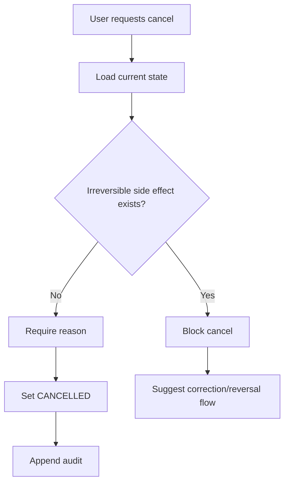
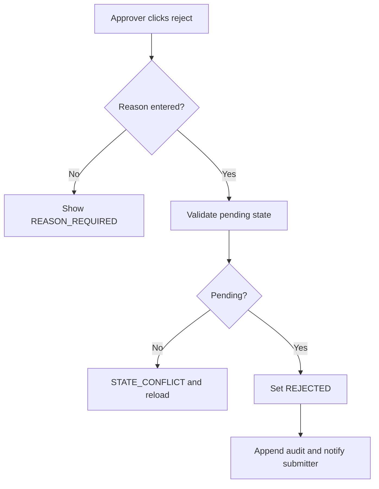
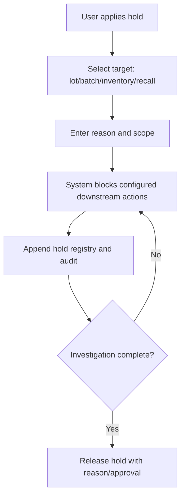
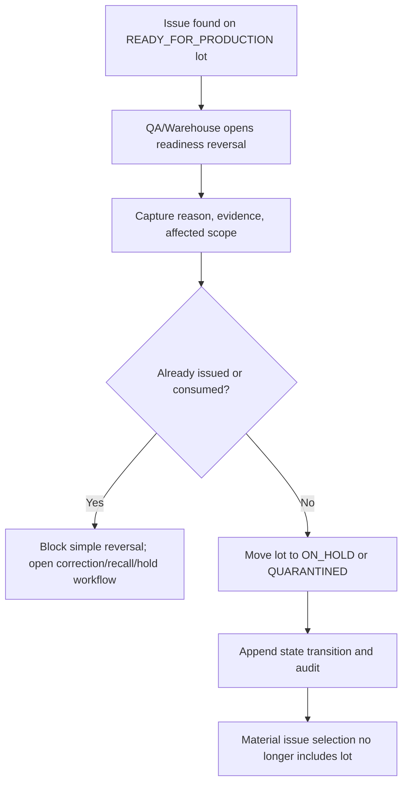
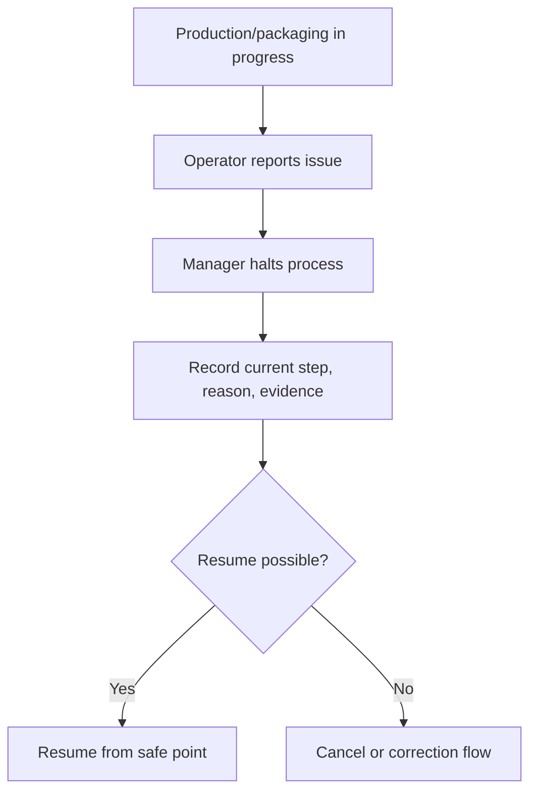
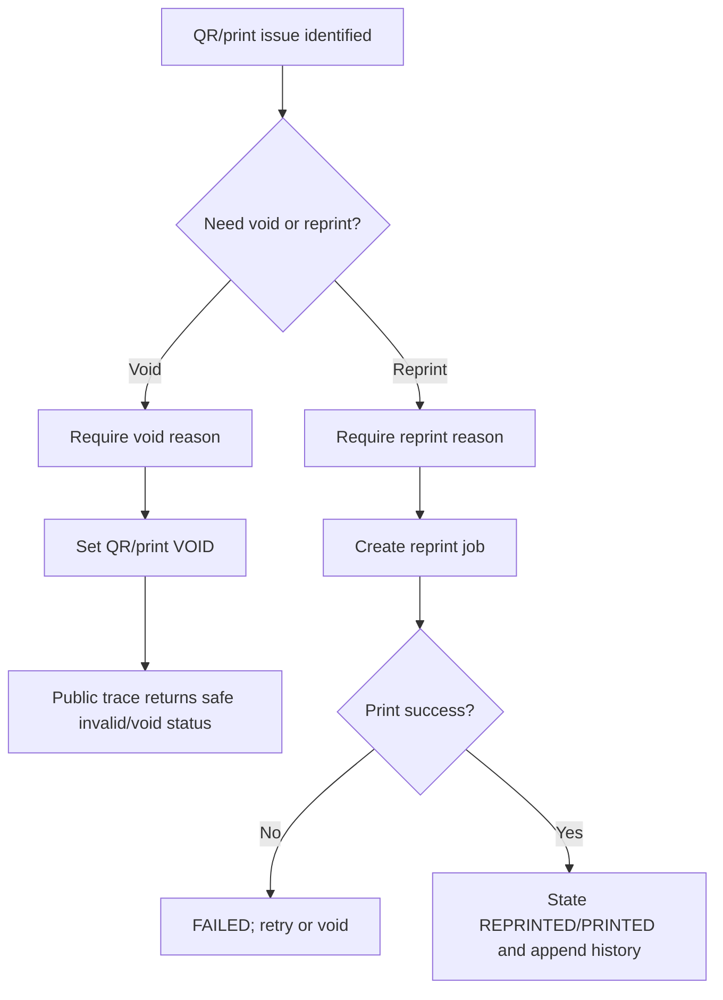
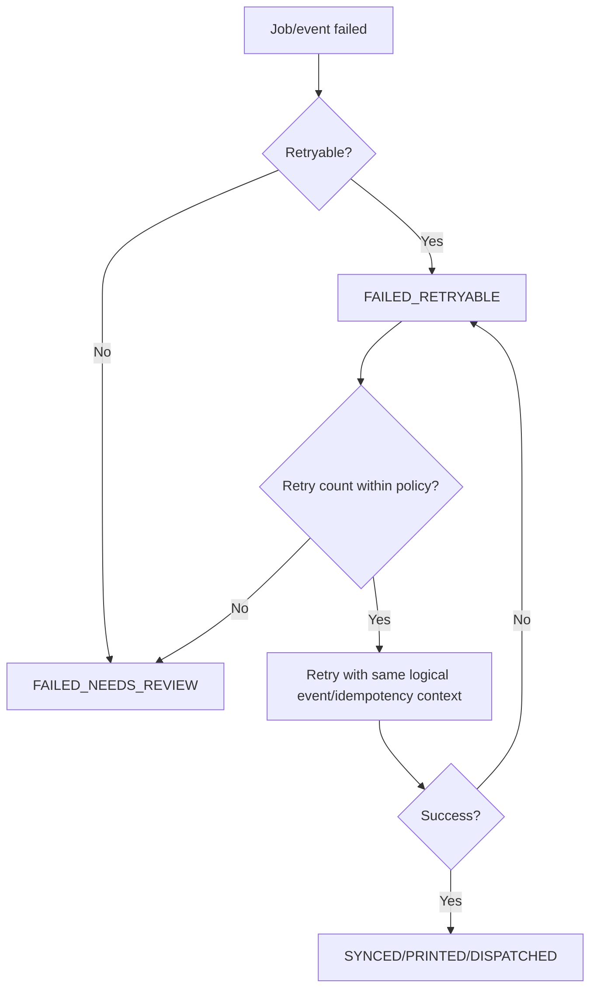
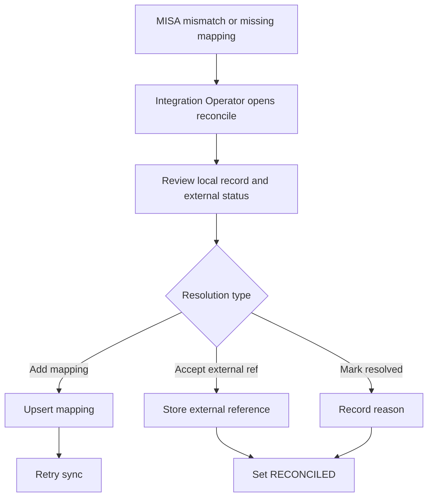
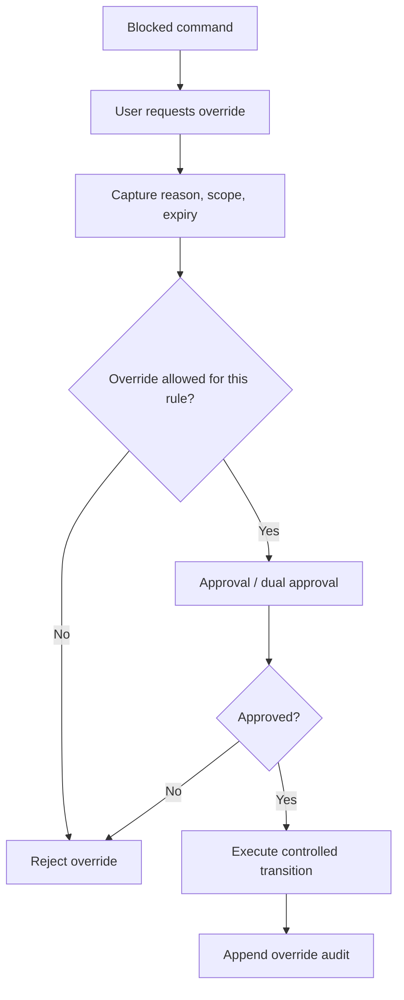
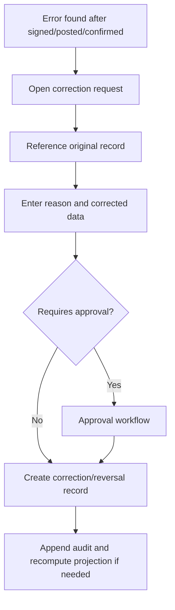

# 07 Exception Flows

## 1. Mục tiêu

Tài liệu này chuẩn hóa các luồng lỗi và ngoại lệ bắt buộc: cancel, reject, hold, halt, void, reprint, retry, reconcile, override, rollback và correction. Các luồng này không được cập nhật âm thầm vào record gốc nếu record đã signed/posted/released/printed/synced.

## 2. Exception Flow Catalog

| exception_id | Flow | Khi dùng | Actor | State impact | Required data | Forbidden behavior | API/UI anchor | Test |
|---|---|---|---|---|---|---|---|---|
| EX-CANCEL-001 | Cancel | Hủy object chưa có downstream irreversible side effect | Creator/Manager by permission | `-> CANCELLED` | reason, actor, timestamp | Không cancel ledger posted/released/public QR without correction | All relevant command APIs; UI action per screen | TC-EXC-CANCEL-001 |
| EX-REJECT-001 | Reject | Từ chối approval, source verification, QC/release, material request | Approver/QA | `PENDING -> REJECTED` | reason required | Không xóa submission gốc | Approval APIs; SCR-APPROVAL-QUEUE | TC-EXC-REJECT-001 |
| EX-HOLD-001 | Hold | Tạm giữ lot/batch/inventory/recall target | QA/Warehouse/Recall roles | `-> ON_HOLD`, `QC_HOLD`, `HOLD_ACTIVE` | reason, target, scope, expected review | Không cho issue/release/ship khi hold active | Recall hold, raw lot hold, release gate | TC-EXC-HOLD-001 |
| EX-LOT-READY-REV-001 | Lot readiness reversal | Lot đã `READY_FOR_PRODUCTION` nhưng phát hiện contamination, expiry, source issue hoặc QC correction | QA Manager / Warehouse Manager | `READY_FOR_PRODUCTION -> ON_HOLD/QUARANTINED/EXPIRED` | reason, evidence, scope, related QC/source finding | Không sửa/xóa QC pass record; không cho issue sau reversal | `POST /api/admin/raw-material/lots/{id}/hold` or readiness reversal command [OWNER DECISION NEEDED exact route] | TC-EXC-LOT-READY-REV-001 |
| EX-HALT-001 | Halt | Dừng tạm production/packaging/print đang chạy | Production/Packaging Manager | `IN_PROGRESS -> ON_HOLD/HALTED` | reason, current step, safe resume point | Không rollback ledger/print đã posted | Production/process/packaging screens | TC-EXC-HALT-001 |
| EX-VOID-001 | Void QR/print | Vô hiệu QR/print trước hoặc sau in | Packaging Operator/QA | QR/print `-> VOID` | reason, QR/print id | Không xóa QR history | `POST /api/admin/printing/jobs/*`, QR commands [OWNER DECISION NEEDED exact path] | TC-EXC-VOID-001 |
| EX-REPRINT-001 | Reprint | In lại QR/label vì lỗi vật lý hoặc sai tem | Packaging Operator/QA | `PRINTED -> REPRINTED` then replacement `PRINTED` | reason, original print ref, new print job | Không reuse history như lần in đầu | `POST /api/admin/printing/jobs/{id}/reprint` | TC-EXC-REPRINT-001 |
| EX-RETRY-001 | Retry | Retry outbox/MISA/print/offline sync lỗi retryable | Integration/Packaging/System | `FAILED_RETRYABLE -> SYNCING/QUEUED` | reason for manual retry if required, retry count | Không retry vô hạn | MISA retry, outbox retry, print retry | TC-EXC-RETRY-001 |
| EX-RECON-001 | Reconcile | Đối soát mismatch MISA hoặc external result | Integration Operator | `FAILED_NEEDS_REVIEW -> RECONCILED` | mismatch type, resolution, reason | Không sửa nghiệp vụ gốc để khớp external nếu không có correction | `POST /api/admin/integrations/misa/sync-events/{id}/reconcile` | TC-EXC-RECON-001 |
| EX-OVERRIDE-001 | Override | Break-glass khi gate cần bypass có kiểm soát | Admin/dual approver [OWNER DECISION NEEDED] | controlled transition | reason, scope, expiry, approval | Không override public field policy, append-only ledger/audit, release gate without trace | Endpoint per module [OWNER DECISION NEEDED] | TC-EXC-OVR-001 |
| EX-ROLLBACK-001 | Rollback | Hoàn tác command chưa externalized | System/Admin | `-> CANCELLED` or rollback pending state | original command, reason | Không rollback silently sau ledger posted, QR public, MISA synced | Idempotency registry/correction flow | TC-EXC-ROLLBACK-001 |
| EX-CORR-001 | Correction | Sửa sai record signed/posted/confirmed | Authorized role | `-> CORRECTED` plus new correction/reversal | reason, original ref, new value, approval if needed | Không update in-place ledger/audit/snapshot | Adjustment/correction APIs | TC-EXC-CORR-001 |

## 3. Cancel Flow

| Object | Cancellable before | Not cancellable after |
|---|---|---|
| Source origin | Before verification if no dependent intake | Verified and used by raw lot without correction |
| Raw intake | Before confirmed lot/QC | Lot QC signed or issued |
| Production order | Before material issue/irreversible batch execution | Material issue executed, ledger posted |
| Material request | Before issue executed | Issue executed |
| Material receipt | Before confirmation | Confirmed with downstream batch execution |
| Warehouse receipt | Before confirmation and before FG ledger posted | FG ledger posted; use correction/reversal |
| Print job | Before printed | Printed QR public unless void/reprint |

## 4. Reject Flow

Reject applies to source verification, recipe approval, production order approval if enabled, material request, batch release, inventory adjustment, recall approval and MISA reconcile review.

## 5. Hold Flow

| Hold target | Blocks |
|---|---|
| Raw material lot | Material issue |
| Batch | Release, warehouse receipt, public trace if policy requires |
| Inventory lot balance | Allocation/shipment/warehouse actions according scope |
| Recall exposure target | Sale/shipment and possibly public status |

## 6. Lot Readiness Reversal Flow

Reversal must not mutate the signed QC inspection. If the lot has already been issued, use correction/reversal, trace and recall impact workflows instead of silently changing history.

## 7. Halt Flow

Halt is temporary. It must not automatically reverse material issue, ledger, QR or release records.

## 8. Void And Reprint Flow

Forbidden:

- Không xóa QR gốc.
- Không tái sử dụng print history như lần in đầu.
- Không expose lý do lỗi nội bộ ra public trace.

## 9. Retry Flow

Retry applies to MISA sync, outbox event, print job and PWA offline submissions. Retry must preserve idempotency/correlation metadata.

## 10. Reconcile Flow

Reconcile must not mutate operational truth just to match external system. If local operational data is wrong, use correction workflow first.

## 11. Override Flow

Never override:

- Public/private field policy for public trace.
- Append-only ledger/audit/history behavior.
- Direct MISA sync from business modules.
- Recipe snapshot immutability for historical production orders.
- Raw lot readiness/issue gate after a lot is held, quarantined, expired or not `READY_FOR_PRODUCTION`.

## 12. Correction / Reversal Flow

| Original record | Correction pattern |
|---|---|
| Inventory ledger | Reversal/adjustment ledger entry |
| Material issue | Reversal issue/correction linked to original |
| Material receipt | Correction receipt/variance review |
| QC inspection | Corrected inspection record; original stays signed |
| Batch release | Revoke/re-release record |
| Warehouse receipt | Correction/reversal entry |
| Recall impact | New impact snapshot version |
| MISA sync | Reconcile record and optional retry |

## 13. Done Gate

- `cancel`, `reject`, `hold`, `lot readiness reversal`, `halt`, `void`, `reprint`, `retry`, `reconcile`, `override`, `rollback`, `correction` all have rules and diagrams.
- Every exception requires reason when changing business state.
- No exception flow mutates append-only records in place.
- Public trace and MISA boundary remain protected.
